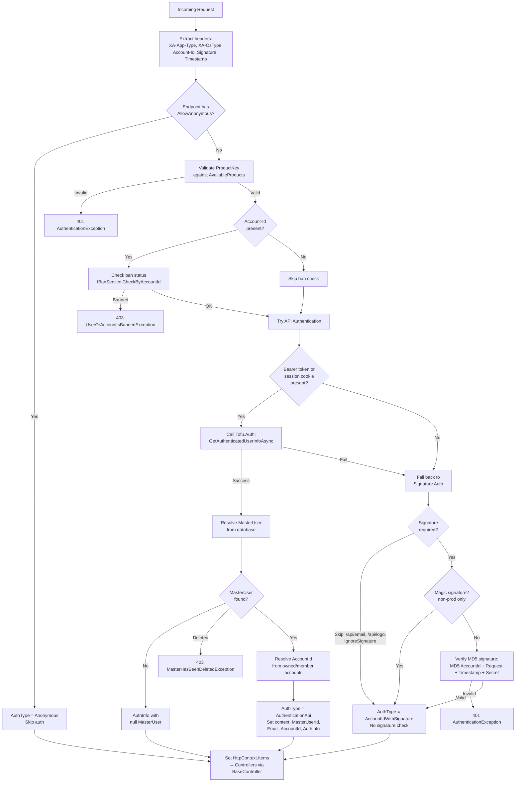
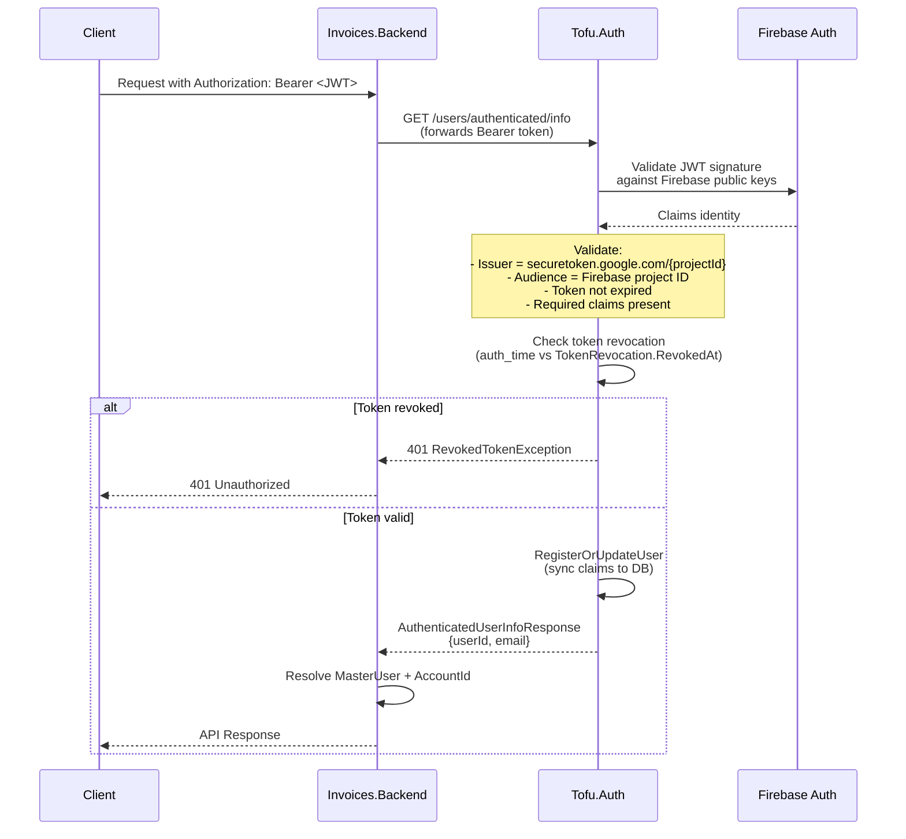
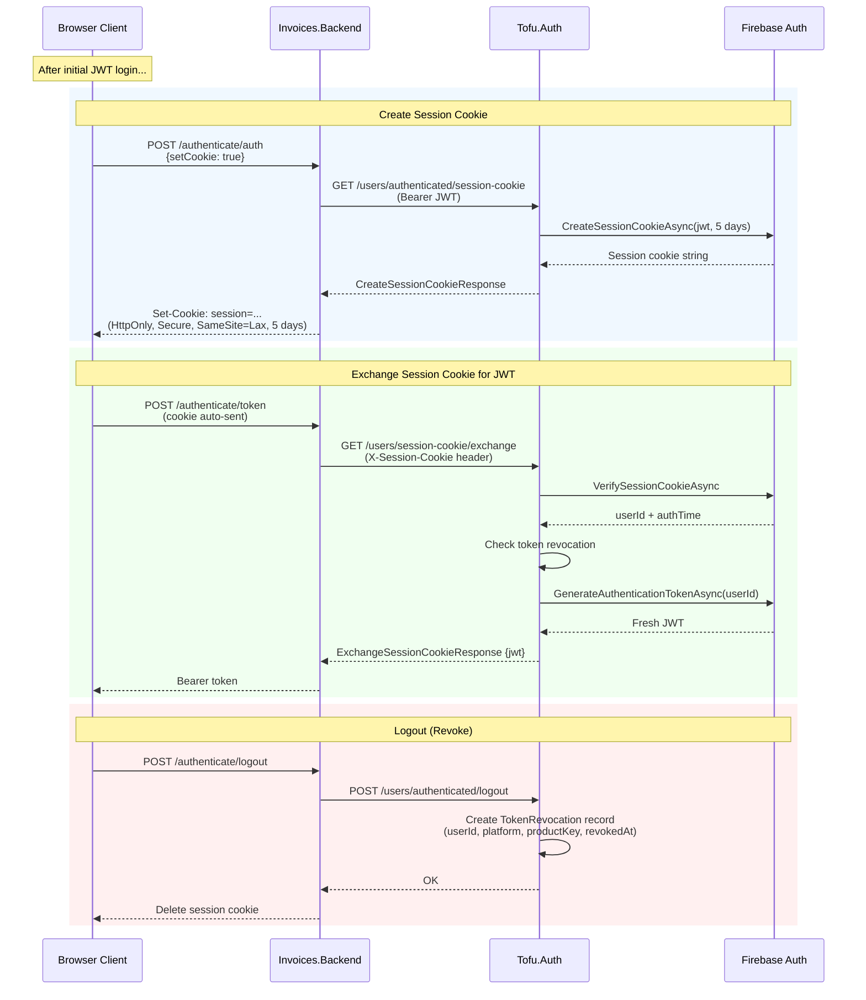
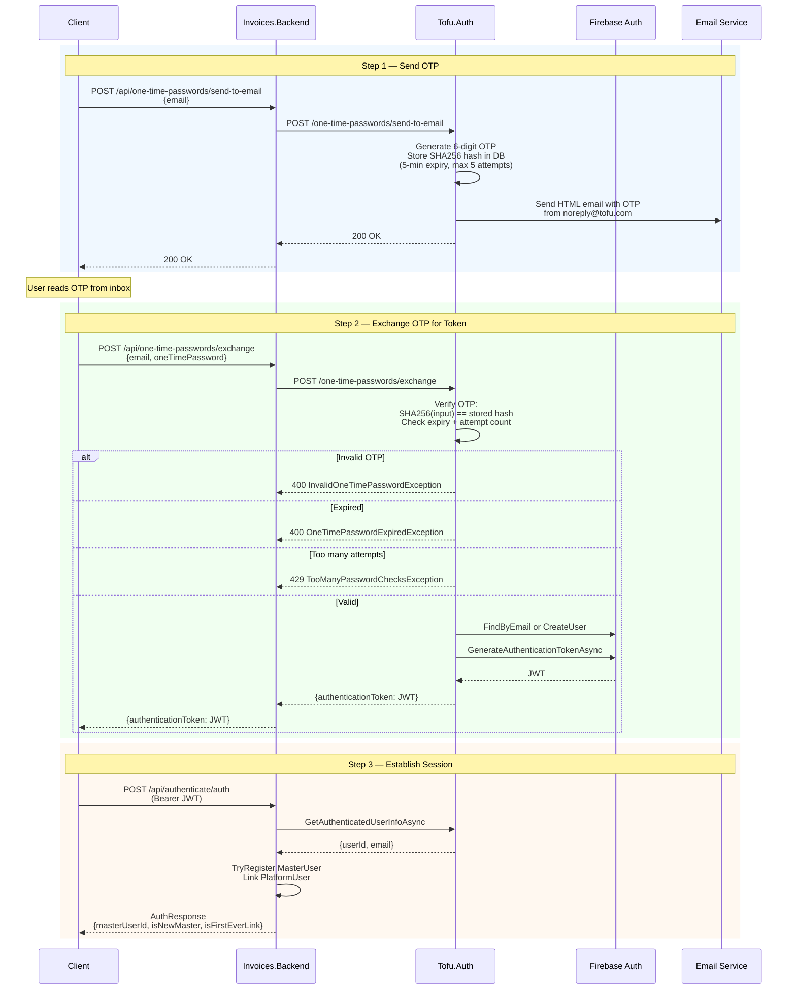
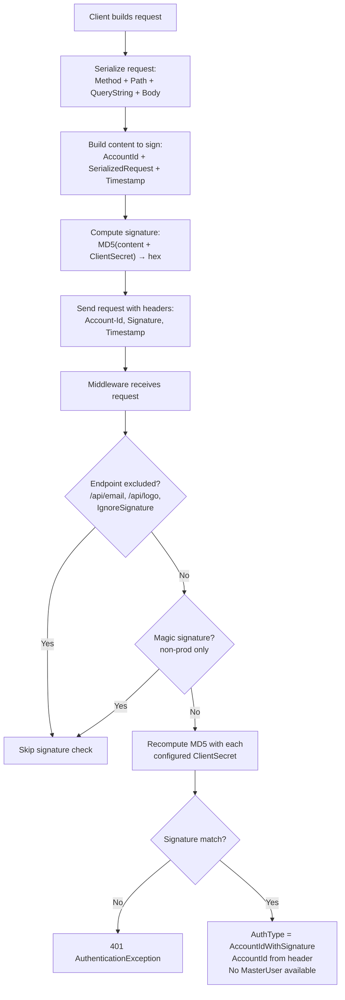
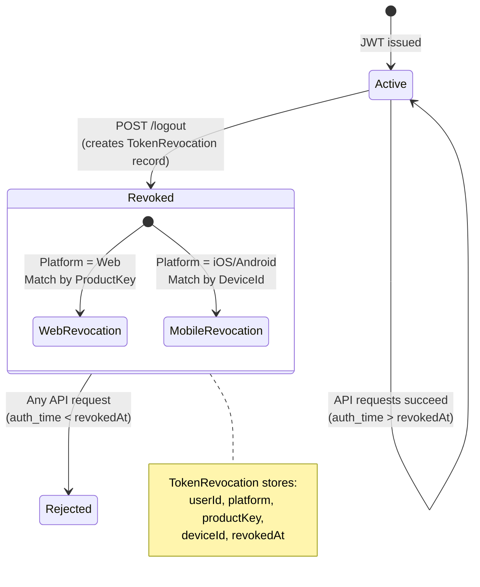
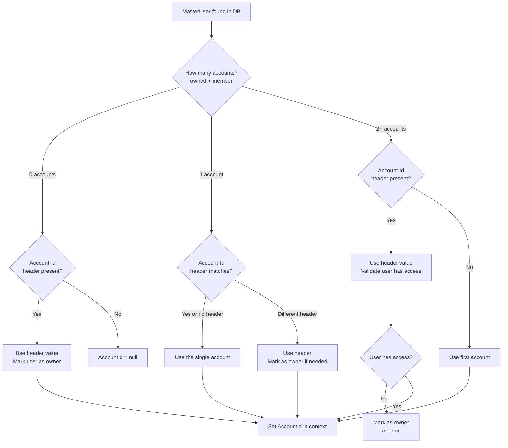
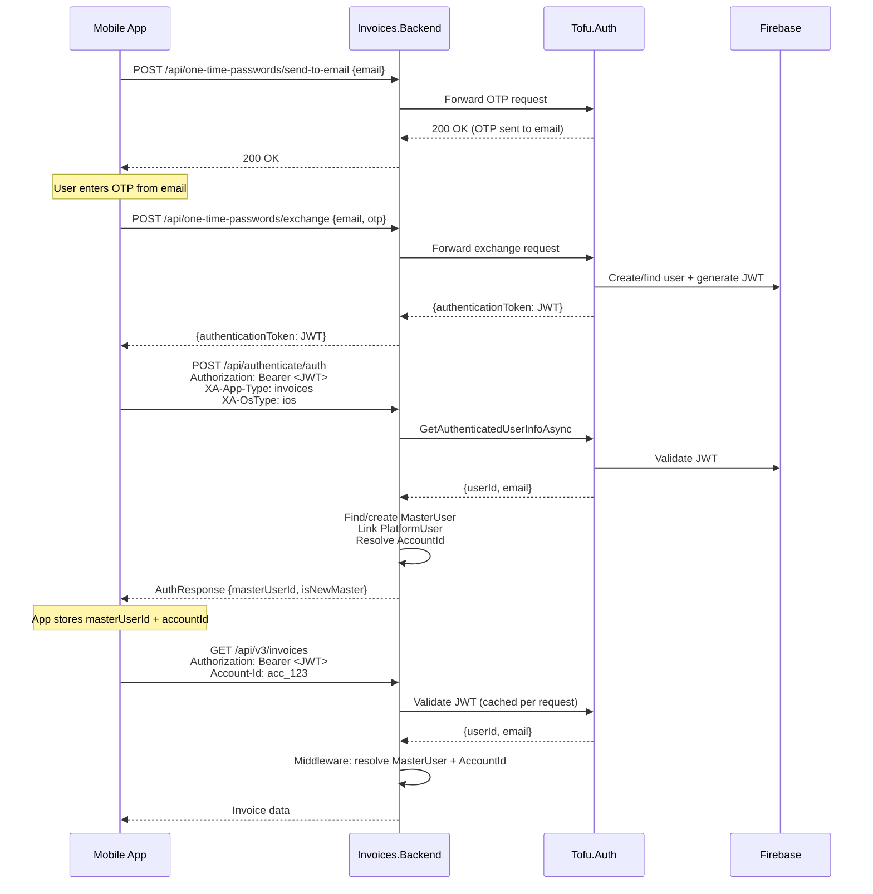

# Authentication Flow

Complete authentication flow across Invoices.Backend and Tofu.Auth.Backend.

## Overview

The system supports three authentication types:

| Type | Header | MasterUser | Use Case |
|------|--------|------------|----------|
| **AuthenticationApi** | Bearer JWT or Session Cookie | Yes | Mobile apps, web UI |
| **AccountIdWithSignature** | Account-Id + Signature + Timestamp | No | Legacy clients |
| **Anonymous** | None (endpoint allows) | No | Public endpoints (OTP, auth) |

---

## 1. Request Authentication (Middleware)

Every request to `/api/*` or `/web-links/*` passes through `AccountAuthenticationMiddleware`.

---

## 2. Bearer JWT Authentication (Tofu.Auth side)

When Invoices.Backend calls `GetAuthenticatedUserInfoAsync`, Tofu.Auth validates the JWT.

---

## 3. Session Cookie Flow

Browser clients use session cookies instead of short-lived JWTs.

---

## 4. Email OTP Login Flow

Passwordless authentication via one-time password.

---

## 5. Signature Authentication (Legacy)

HMAC-like scheme for legacy clients that don't use JWT.

---

## 6. Token Revocation

---

## 7. Account ID Resolution

How the middleware determines which account a user is accessing.

---

## 8. Full Login Sequence (Mobile App)

End-to-end flow for a mobile app user signing in with Email OTP.

