# Invitation System — Workflow Diagrams

> Complete reference for invitation operations: creation, magic login,
> acceptance, revocation, and listing. Shows the BFF layer
> (Invoices.Backend) proxying to Tofu.Auth.Backend.

## Architecture Overview

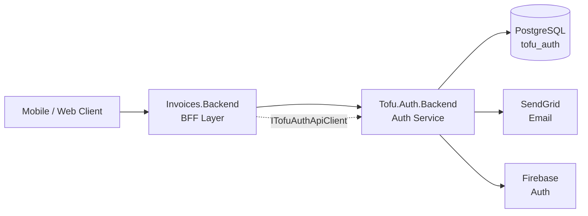

Invoices.Backend exposes simplified endpoints under `/api/invitations`,
`/api/team`, and `/api/worker`. These proxy to Tofu.Auth.Backend's
`/v1/` endpoints via `ITofuAuthApiClient` (NuGet package).

---

## 1. Create Invitation

**BFF:** `POST /api/invitations`
**Auth:** `POST /v1/tenants/{tenantId}/invitations`

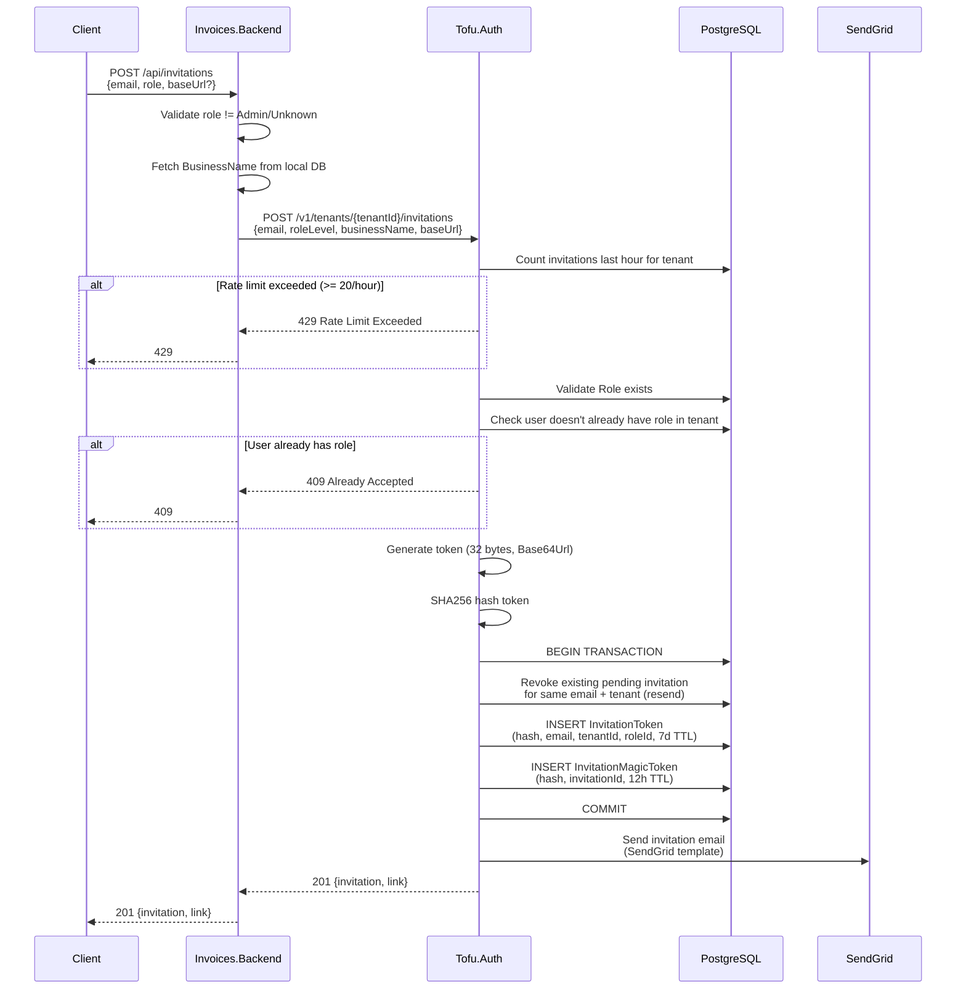

### Invitation Link Format

```
{baseUrl}?token={invitationToken}&ml={magicToken}
```

- `token` — invitation token (Base64Url, 32 bytes)
- `ml` — magic login token (Base64Url, 32 bytes, 12h TTL)

### Resend Semantics

Creating an invitation for the same email + tenant revokes the
previous pending invitation and issues a new one with fresh tokens.

---

## 2. Magic Login (Anonymous)

**BFF:** `POST /api/invitations/{token}/magic-login`
**Auth:** `POST /v1/invitations/{token}/magic-login`

Allows unauthenticated users to sign in directly from the invitation
email link.

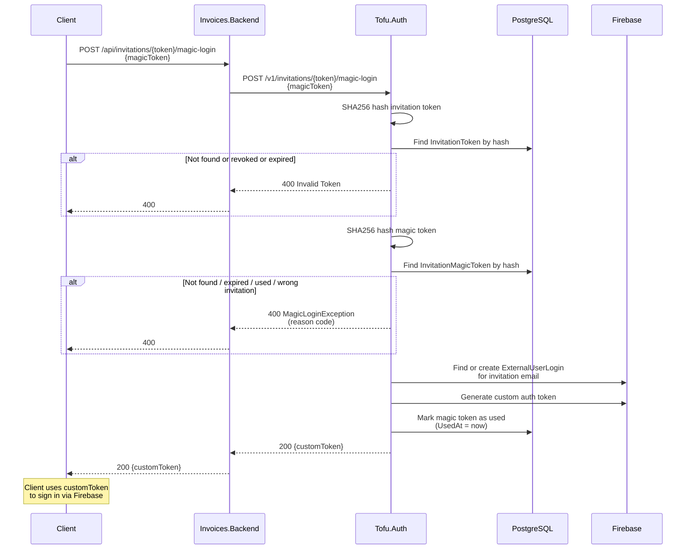

### Magic Login Error Reasons

| Reason | Description |
|--------|-------------|
| `TokenNotFound` | Magic token hash not in DB |
| `TokenExpired` | Magic token past 12h TTL |
| `TokenAlreadyUsed` | Magic token already exchanged |
| `TokenMismatch` | Magic token doesn't match invitation |

---

## 3. Accept Invitation (Single)

**BFF:** `POST /api/invitations/{token}/accept`
**Auth:** `POST /v1/invitations/{token}/accept`

Requires authentication. User must be signed in with the same email
as the invitation.

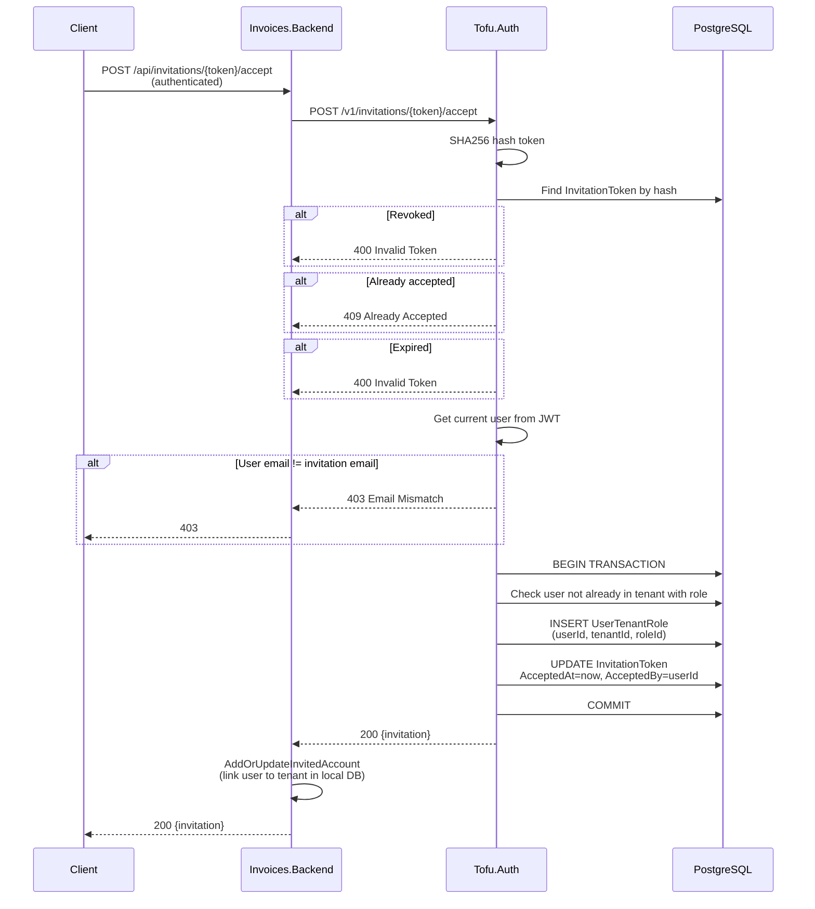

---

## 4. Accept All Invitations

**BFF:** `POST /api/invitations/accept-all`
**Auth:** `POST /v1/tenants/invitations/accept`

Accepts all pending invitations for the authenticated user's email.

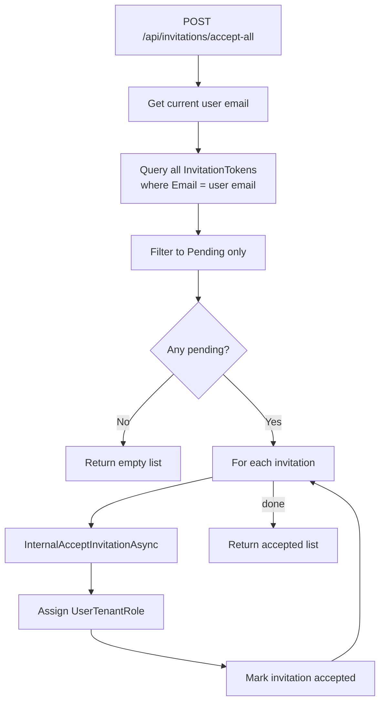

---

## 5. Revoke Invitation

**BFF:** `POST /api/invitations/{invitationId}/revoke`
**Auth:** `POST /v1/tenants/{tenantId}/invitations/{invitationId}/revoke`

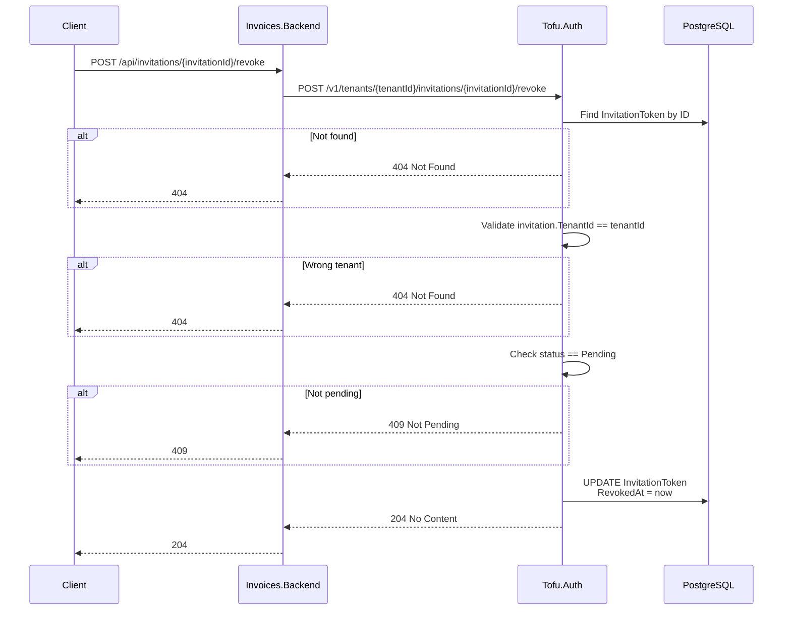

---

## 6. List Invitations (Tenant View)

**BFF:** `GET /api/invitations` or `POST /api/invitations/list`
**Auth:** `POST /v1/tenants/{tenantId}/invitations/list`

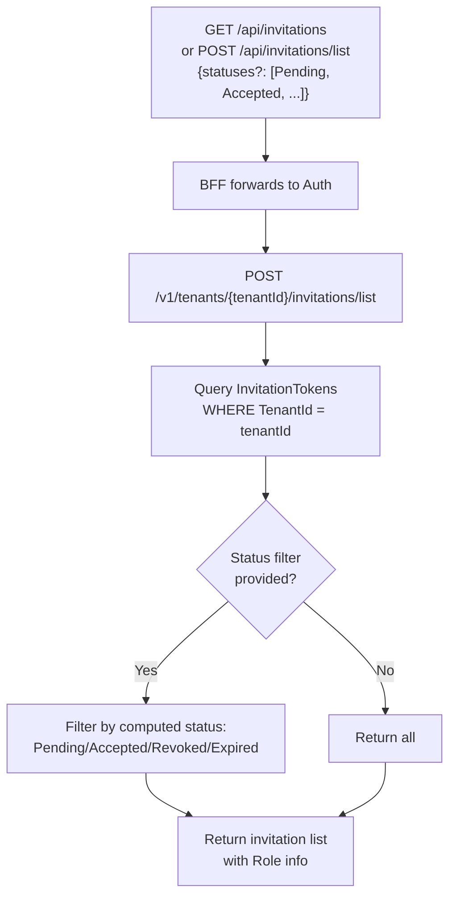

---

## 7. Worker Summary (Anonymous)

**BFF:** `GET /api/worker/summary?email={email}`
**Auth:** `GET /v1/workers/summary?email={email}`

Used by the mobile app to check if a worker has pending invitations
or existing tenant memberships before sign-in.

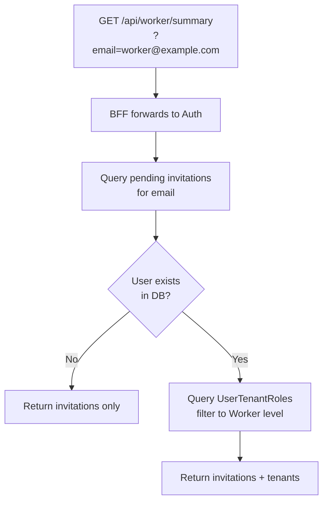

---

## 8. Remove Team Member

**BFF:** `DELETE /api/team/members/{userId}`
**Auth:** Calls `RemoveUserFromTenantAsync(tenantId, userId)`

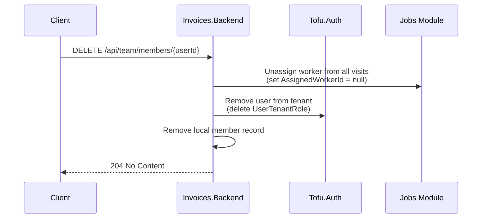

---

## Invitation Status State Machine

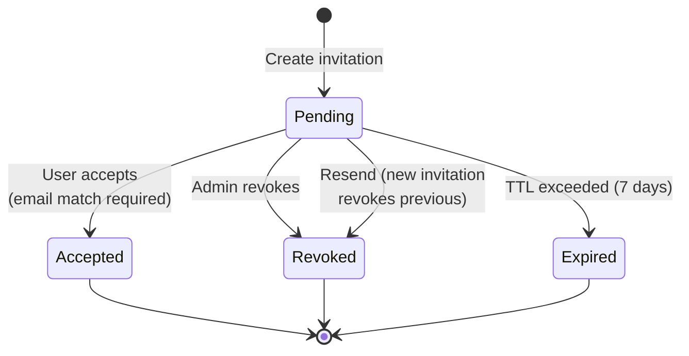

Status is computed at query time from `AcceptedAt`, `RevokedAt`, and
`ExpiresAt` fields — not stored as a column.

---

## Database Schema (ER Diagram)

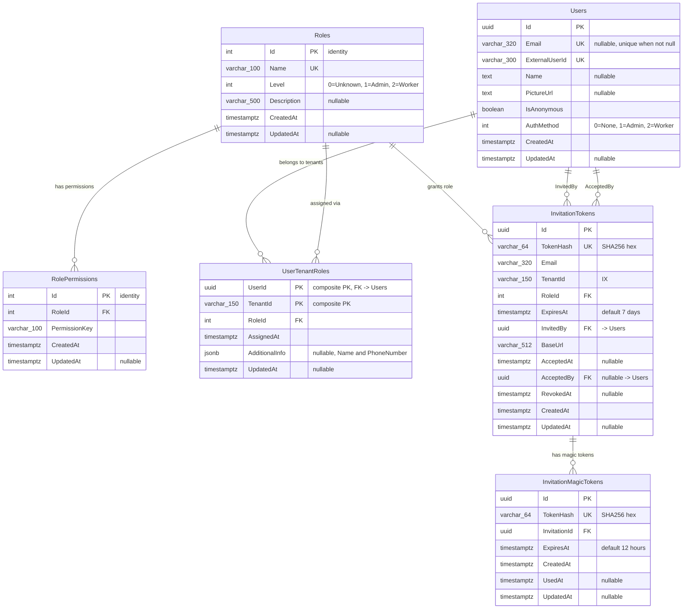

### Key Constraints

| Table | Constraint | Details |
|-------|-----------|---------|
| InvitationTokens | Unique filtered index | `(TenantId, Email)` WHERE `AcceptedAt IS NULL AND RevokedAt IS NULL` — one pending invitation per email per tenant |
| UserTenantRoles | Composite PK | `(UserId, TenantId)` — one role per user per tenant |
| InvitationTokens | FK delete behavior | `RoleId` RESTRICT, `InvitedBy` RESTRICT, `AcceptedBy` SET NULL |
| InvitationMagicTokens | FK delete behavior | `InvitationId` CASCADE — deleted with invitation |

### TenantId Note

`TenantId` is a string reference (varchar 150) with **no foreign key**
to a Tenants table. Tenants are managed externally; the auth service
only tracks role assignments and invitations per tenant ID.

---

## Endpoint Summary

### BFF (Invoices.Backend) → Client-Facing

| Method | Route | Auth | Description |
|--------|-------|------|-------------|
| POST | `/api/invitations` | Yes | Create invitation |
| GET | `/api/invitations` | Yes | List tenant invitations |
| POST | `/api/invitations/list` | Yes | List with status filter |
| POST | `/api/invitations/{token}/accept` | Yes | Accept single invitation |
| POST | `/api/invitations/accept-all` | Yes | Accept all pending |
| POST | `/api/invitations/{token}/magic-login` | No | Magic login exchange |
| POST | `/api/invitations/{id}/revoke` | Yes | Revoke invitation |
| GET | `/api/worker/summary` | No | Worker summary by email |
| GET | `/api/worker/invitations` | Yes | Worker's pending invitations |
| GET | `/api/worker/businesses` | Yes | Worker's tenant list |
| GET | `/api/team/members` | Yes | List team members |
| DELETE | `/api/team/members/{userId}` | Yes | Remove from team |

### Auth Service (Tofu.Auth.Backend) → Internal

| Method | Route | Auth | Description |
|--------|-------|------|-------------|
| POST | `/v1/tenants/{tenantId}/invitations` | Yes | Create invitation |
| POST | `/v1/tenants/{tenantId}/invitations/list` | Yes | List tenant invitations |
| GET | `/v1/users/invitations` | Yes | User's pending invitations |
| GET | `/v1/workers/summary` | No | Worker summary by email |
| GET | `/v1/users/tenants` | Yes | User's tenant list |
| POST | `/v1/invitations/{token}/magic-login` | No | Magic login exchange |
| POST | `/v1/invitations/{token}/accept` | Yes | Accept single |
| POST | `/v1/tenants/invitations/accept` | Yes | Accept all |
| POST | `/v1/tenants/{tenantId}/invitations/{id}/revoke` | Yes | Revoke invitation |

---

## Error Responses

| Error | HTTP | When |
|-------|------|------|
| Rate limit exceeded | 429 | > 20 invitations/hour per tenant |
| Invalid token | 400 | Token not found, expired, or revoked |
| Already accepted | 409 | Invitation already used |
| Email mismatch | 403 | Signed-in user email != invitation email |
| Not pending | 409 | Revoke attempted on non-pending invitation |
| User already in tenant | 409 | User already has this role in tenant |
| Magic token expired | 400 | Magic token past 12h TTL |
| Magic token used | 400 | Magic token already exchanged |
