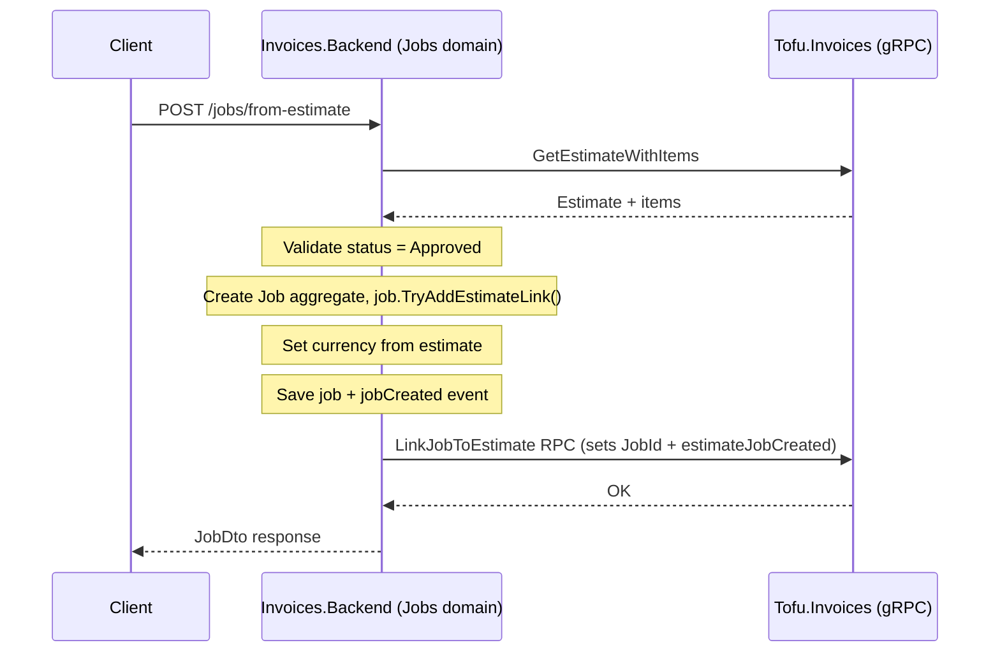
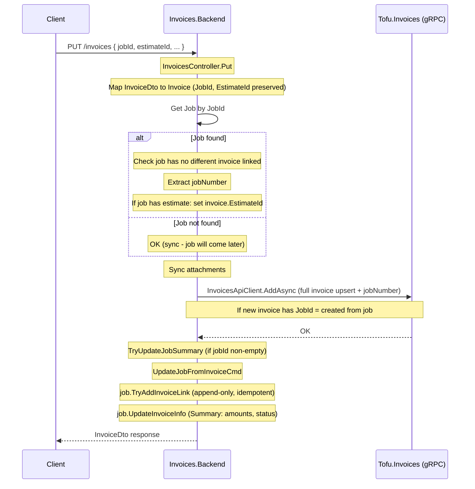
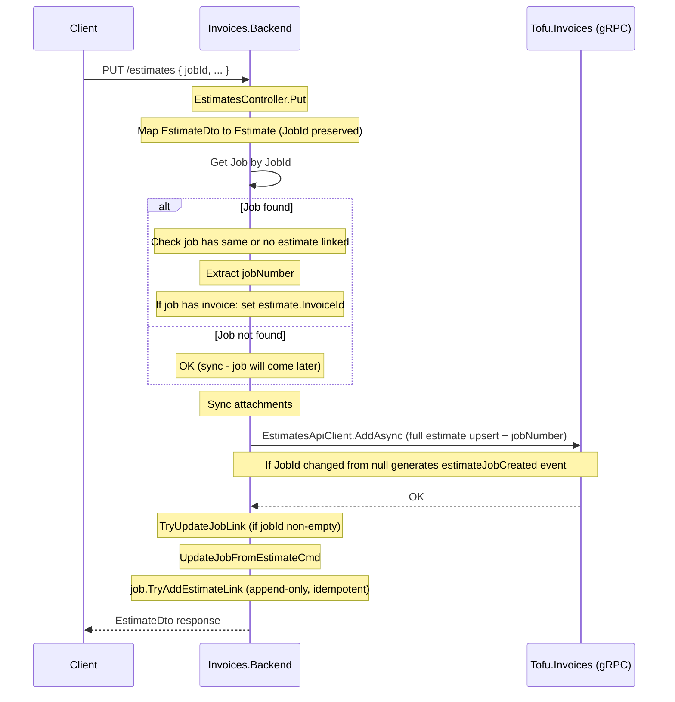
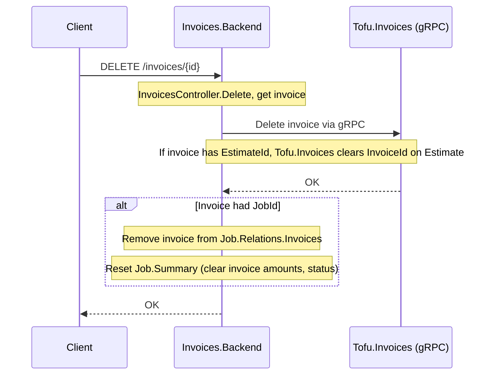
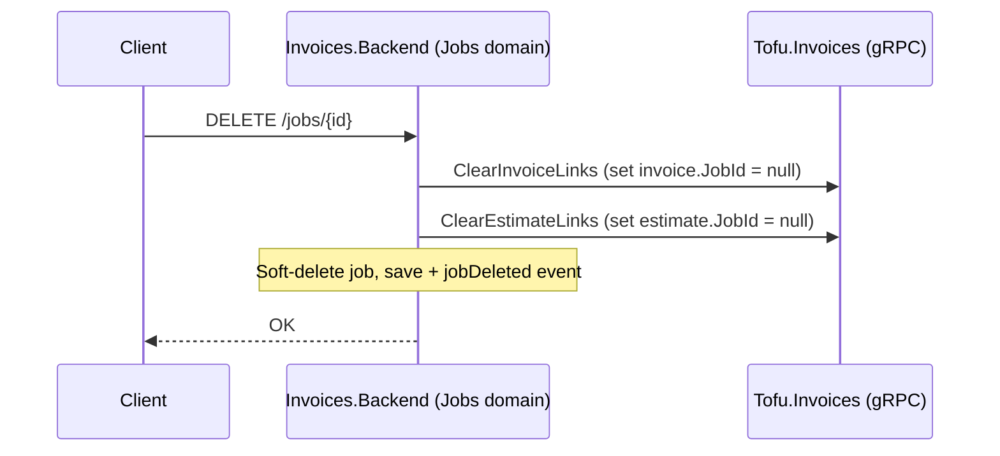

# Step 6: Job From Estimate — Workflow Flows

Mermaid versions of the workflow diagrams from [overview.md](overview.md).

## Create Job From Estimate

## Save Invoice with JobId

## Save Estimate with JobId

## Remove Invoice (cleanup)

## Delete Job (cleanup)

