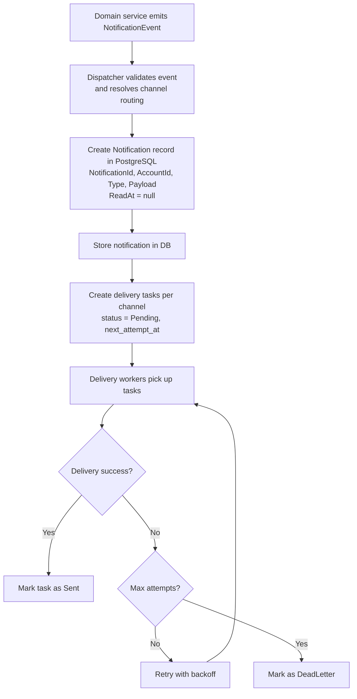
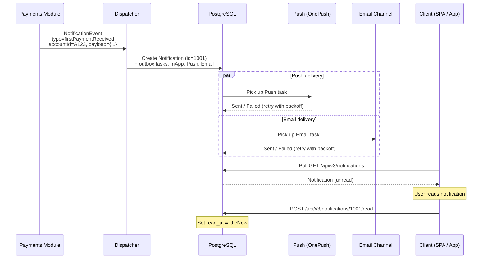
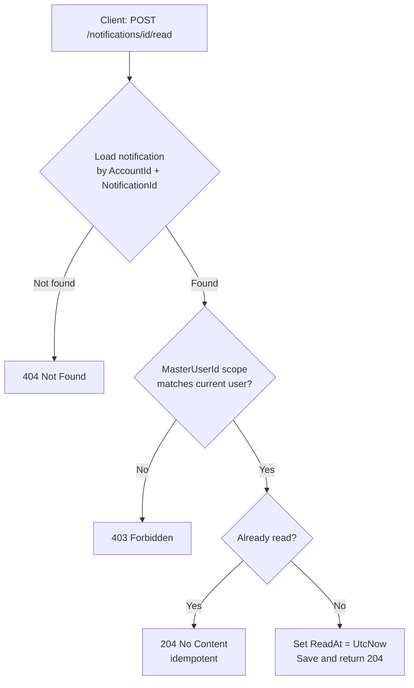
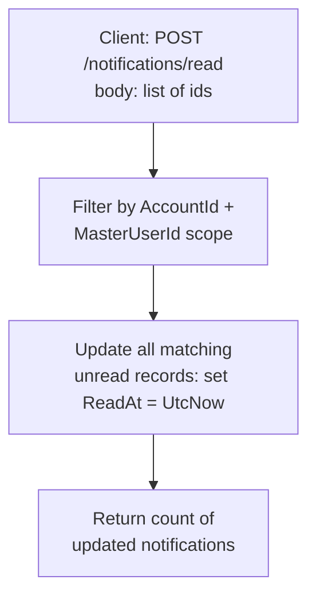
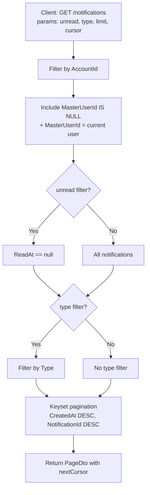
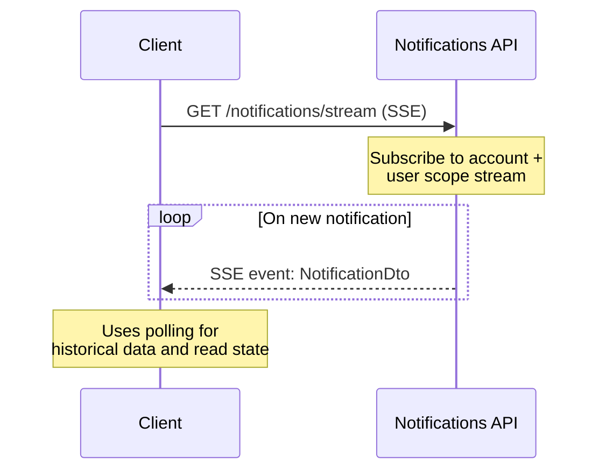

Notifications: Command and Query Processing Flows
=================================================

## Commands

### 1. CreateNotificationCommand (Internal)

**Triggered by:** domain events (e.g., Stripe connected, payment received, email opened).

**Flow:**

---

### Example: First Payment Notification (In-App + Push + Email)

**Trigger:** payment processing detects the first successful payment.

**Flow:**

---

### 2. MarkNotificationReadCommand

**Endpoint:** `POST /api/v3/notifications/{id}/read`

**Flow:**

---

### 3. MarkNotificationsReadBatchCommand

**Endpoint:** `POST /api/v3/notifications/read`

**Flow:**

---

## Queries

### 1. GetNotificationsQuery (Polling)

**Endpoint:** `GET /api/v3/notifications`

**Flow:**

---

### 2. StreamNotificationsQuery (SSE, Future)

**Endpoint:** `GET /api/v3/notifications/stream`

**Flow:**

