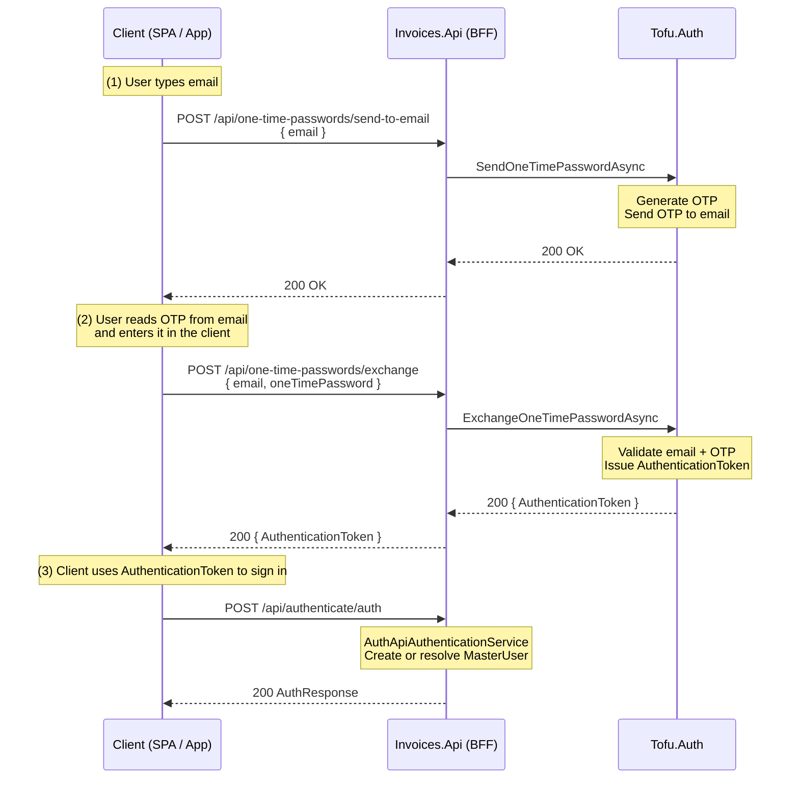

OTP Flow
=====================================

Scope
-----

This document describes the email one-time-password (OTP) flow implemented in `Invoices.Api`. The flow uses Tofu.Auth OTP
endpoints via `ITofuAuthApiClient` to send and exchange one-time passwords for
an authentication token.

High-Level Steps
----------------

1. The user enters their email address in the client (SPA / mobile app).
2. The client calls the BFF to send an OTP to that email.
3. Tofu.Auth generates and emails a one-time password to the user.
4. The user reads the OTP from their inbox and enters it into the client.
5. The client calls the BFF to exchange the email + OTP for an authentication
   token.
6. The client uses the returned authentication token to establish an authenticated
   session (for example by passing it to the auth provider or a dedicated
   backend authentication endpoint).

Public BFF Endpoints
--------------------

`OneTimePasswordsController` exposes two endpoints under
`/api/one-time-passwords`:

- `POST /api/one-time-passwords/send-to-email`
  - Body: `OneTimePasswordRequest`
    - `Email` – email address to send the OTP to.
  - Behaviour:
    - Forwards the request to Tofu.Auth via
      `ITofuAuthApiClient.SendOneTimePasswordAsync`.
    - Returns `200 OK` when the OTP has been queued/sent.

- `POST /api/one-time-passwords/exchange`
  - Body: `ExchangeOneTimePasswordRequest`
    - `Email` – email that received the OTP.
    - `OneTimePassword` – the one-time password entered by the user.
  - Behaviour:
    - Forwards the request to Tofu.Auth via
      `ITofuAuthApiClient.ExchangeOneTimePasswordAsync`.
    - Returns `ExchangeOneTimePasswordResponse` containing an
      `AuthenticationToken`.

Sequence Diagram (Overview)
---------------------------

Notes
-----

- All OTP generation and validation is handled by Tofu.Auth; Invoices.Api
  simply proxies requests and responses.
- The exact mechanism for using `AuthenticationToken` (for example, exchanging
  it for a session cookie or ID token) is handled by the client-side auth
  integration and is documented separately.
