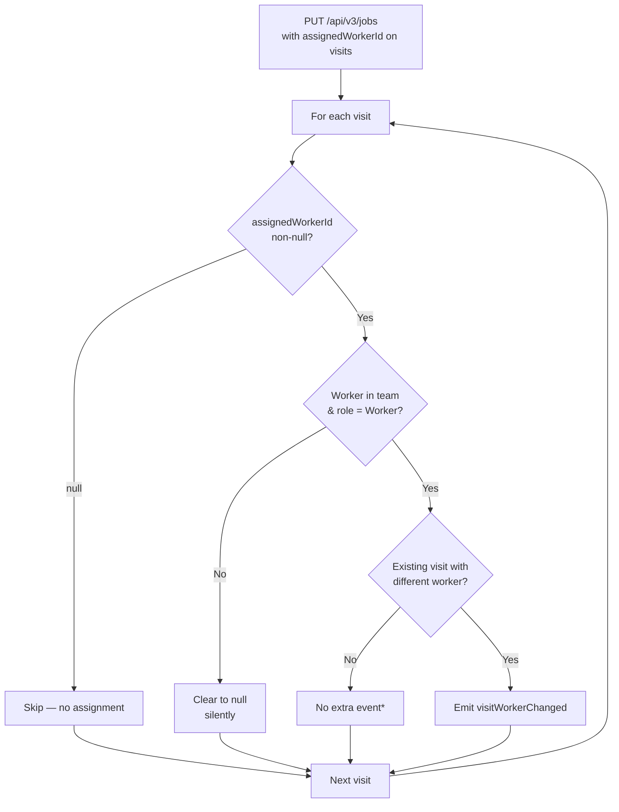
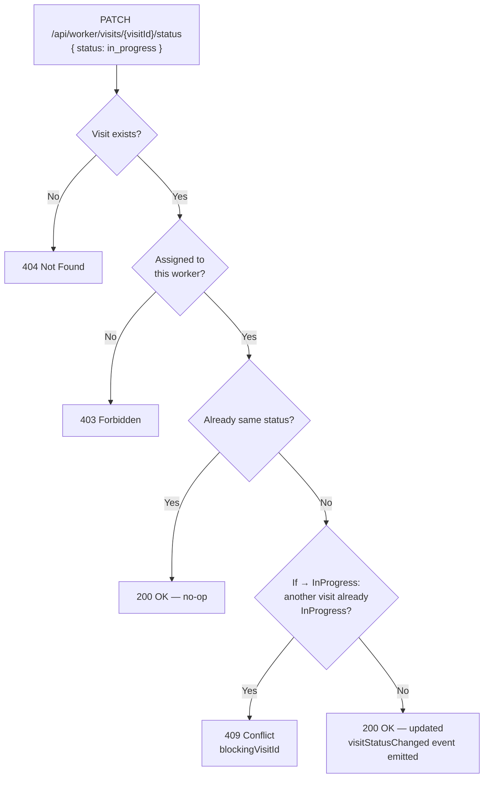
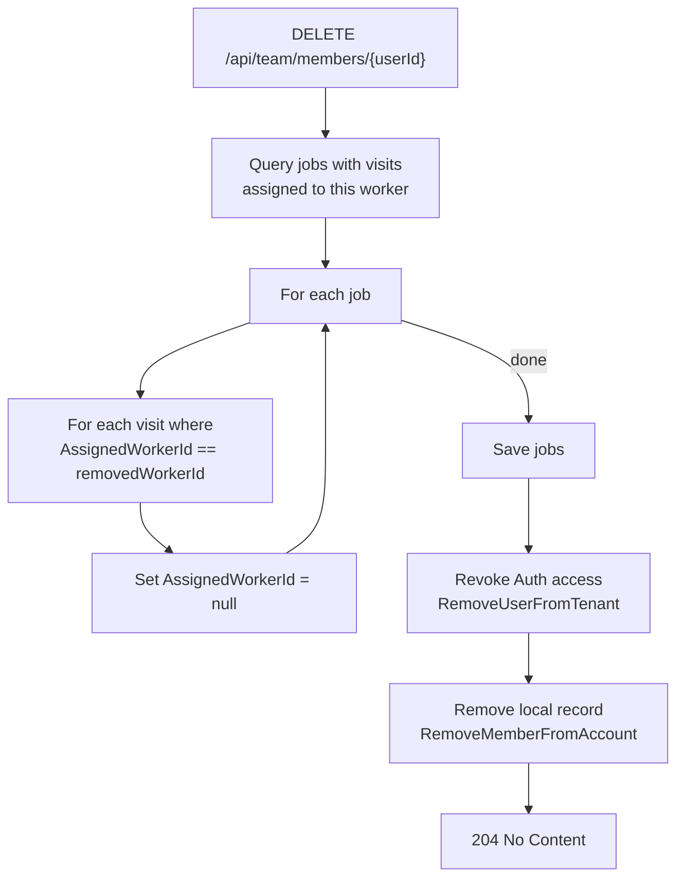

# Worker Users — Workflow Diagrams

> Client reference for worker assignment, status update, and team removal flows,
> showing validation checks, error responses, and timeline events.

## 1. Assign Worker (Admin — via Job Upsert)

Entry point: `PUT /api/v3/jobs` with `assignedWorkerId` on a visit.



\* New visits: worker is included in `visitCreated` event.
Existing visits with same worker: no event emitted.

### visitWorkerChanged Scenarios

| Before | After | previousWorker | newWorker |
|--------|-------|----------------|-----------|
| `null` | `"worker-1"` | `null` | `{ workerId, workerName }` |
| `"worker-1"` | `"worker-2"` | `{ worker-1, name }` | `{ worker-2, name }` |
| `"worker-1"` | `null` | `{ worker-1, name }` | `null` |

> `workerName` may be `null` if the previous worker was removed from
> the team since assignment.

---

## 2. Worker Updates Visit Status

Entry point: `PATCH /api/worker/visits/{visitId}/status`



### Client Handling

| Response | Error Code | Client Action |
|----------|------------|---------------|
| `200` Success | — | Update local state with returned visit + version |
| `404` Not Found | `not_found` | Visit not found — refetch visits |
| `403` Forbidden | `forbidden` | Worker not assigned to this visit — refetch visits |
| `409` Conflict | `visitStatusChangeBlocked` + `blockingVisitId` in body | Show "complete other visit first" |

---

## 3. Remove Worker From Team (Admin)

Entry point: `DELETE /api/team/members/{userId}`

Unassigns the worker from **all** visits (any status) before revoking access.



### Visit Status Handling

All visit statuses are unassigned — no blocking, no guard:

| Visit Status | Behavior |
|-------------|----------|
| Scheduled | Unassign worker, keep Scheduled |
| InProgress | Unassign worker, keep InProgress |
| Completed | Unassign worker, keep Completed |

### Edge Cases

| Case | Behavior |
|------|----------|
| Deleted job | Excluded from query — never processed |

---

## 4. Timeline Events

| Event Type | Trigger | Timeline Text |
|------------|---------|---------------|
| `visitWorkerChanged` | Existing visit's worker changes (assign/reassign/unassign) | "You assigned the visit to {Worker name}" |
| `visitStatusChanged` | Visit status transitions | "{Worker name} started the visit" / "{Worker name} completed the visit" |
| `visitCreated` | New visit added (may include initial worker — no separate assignment event) | "You scheduled a visit for {Worker name} on {date}" |

### Event Payloads

**visitWorkerChanged:**
```json
{
  "visitId": "guid",
  "previousWorker": { "workerId": "guid", "workerName": "Name" },
  "newWorker": { "workerId": "guid", "workerName": "Name" }
}
```
`previousWorker` or `newWorker` is `null` for assign / unassign.

**visitStatusChanged:**
```json
{
  "visitId": "guid",
  "previousStatus": "scheduled",
  "newStatus": "in_progress",
  "workerName": "Worker name"
}
```
`workerName` is `null` when admin changes status.

---

## 5. Error Responses Summary

| Check | Endpoint | Response |
|-------|----------|----------|
| Worker not in team or wrong role | `PUT /api/v3/jobs` | Silently cleared to `null` |
| Visit not found | `PATCH .../status` | `404 Not Found` |
| Worker not assigned to visit | `PATCH .../status` | `403 Forbidden` |
| Another visit already InProgress | `PATCH .../status` | `409 visitStatusChangeBlocked` with `blockingVisitId` in body |
