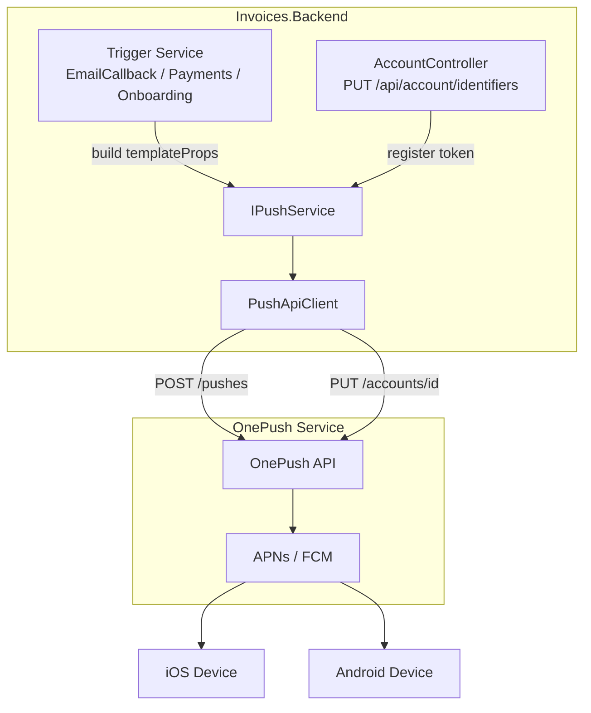
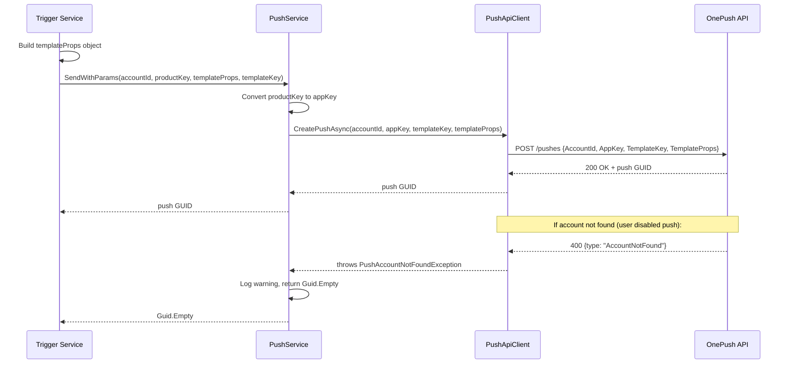

Push Notification System
========================

Invoices.Backend sends push notifications to iOS and Android devices
via **OnePush**, an external push delivery service. This document
describes the architecture, template system, and sending patterns.

Architecture
------------



### Key Components

| Component | Location | Role |
|-----------|----------|------|
| `IPushService` | `Invoices.Common/Services/Push/` | Main interface — register tokens, send pushes |
| `PushService` | `Invoices.Common/Services/Push/` | Implementation — platform conversion, error handling |
| `IPushApiClient` | `Invoices.Common/Clients/Push/` | HTTP client interface for OnePush |
| `PushApiClient` | `Invoices.Implementation.OnePush/Client/` | HTTP calls to OnePush API |
| `PushNotificationTemplate` | `Invoices.Common/Services/Push/` | Record: `ProductKey`, `TemplateProps`, `TemplateKey` |
| `PushNotificationTemplateService` | `Tofu.Email/Service/` | Builds platform-specific props for email pushes only |
| `PushServicesInstaller` | `Invoices.DIConfig/Installers/` | DI registration + HttpClient config |

Sending a Push
--------------



### IPushService Methods

```csharp
// Register or update a device push token
Task CreateOrUpdateAccountAsync(
    string accountId, string productKey,
    Platform osType, string? pushToken = null);

// Send push with explicit params
Task<Guid> SendWithParams(
    string accountId, string productKey,
    object templateProps, string templateKey);

// Send push using PushNotificationTemplate record
Task<Guid> SendWithParams(
    string accountId, PushNotificationTemplate template);
```

Template Keys
-------------

Template keys map to pre-configured templates in the OnePush system.
Each key defines the APNs/FCM payload structure.

| Template Key | Used By | Events |
|-------------|---------|--------|
| `InvoicesAlert` | `PushNotificationTemplateService` | Email opened, email delivery error |
| `InvoicesPayment` | `PaymentsNotificationService` | Payment received, payout, balance available, account status |
| `InvitationAccepted` | `WorkerOnboardingService` | Worker joins team after onboarding |

Template Props
--------------

Template props are anonymous objects passed to OnePush. Their shape
depends on the template key and sometimes the platform.

### Direct anonymous object (most common)

Most push senders build an anonymous object directly. This is the
preferred pattern for new pushes:

```csharp
var templateProps = new
{
    message = "...",
    type = "InvitationAccepted",
    push_id = Guid.NewGuid().ToString(),
    tenantId = accountId
};

await _pushService.SendWithParams(
    accountId, productKey, templateProps, "InvitationAccepted");
```

### Via PushNotificationTemplateService (email pushes only)

`PushNotificationTemplateService` generates platform-specific props
for email-related pushes. It handles Android vs iOS formatting
differences:

- **Android**: `{ title, body, type, push_id }` — flat string values
- **iOS**: `{ message: "{JSON}", type, push_id }` — `message` is a
  serialized JSON string with `title` and `body` fields

This service is only used by `EmailCallbackService`. Other push
senders build props directly.

### Payment pushes

`PaymentsNotificationService` builds props with additional metadata:

```csharp
var templateProps = new
{
    message = localizedMessage,   // JSON-serialized title+body
    type = "\"automatic\"",
    push_id = "\"get paid from Stripe\"",
    provider = "Stripe",
    amount = "$100.50",
    isFirstPayment = false,
    eventType = "payment"         // "payment" | "firstPayment" | "payoutAlert"
};
```

Product Keys and Platforms
--------------------------

Product keys identify which app the push targets. They come from
request headers (`ProductKey` on `BaseController`).

| Product Key | Platform | Notes |
|-------------|----------|-------|
| `invoices` | iOS | Main app |
| `invoices-android` | Android | Main app |
| `demo-invoices` | Both | Demo/sandbox app |
| `tofu-fieldservice` | iOS | Field Service app |
| `tofu` | iOS | Stripe/payment handling |

**Android normalization**: `PushApiClient` maps all Android product
keys to the `"Invoices"` app key when calling OnePush, since Android
uses a single FCM project.

Push Token Registration
-----------------------

Devices register their push token via `AccountController`:

```
PUT /api/account/identifiers
Body: { pushToken: "device-token-string", ... }
```

The controller calls `IPushService.CreateOrUpdateAccountAsync()` which
registers the token with OnePush via `PUT /accounts/{publicId}`.

The public ID is derived from the account ID (everything before the
last dash segment).

EventPushTypes Constants
------------------------

`Consts.EventPushTypes` defines string identifiers sent in the
`push_id` field. The mobile app uses these to route pushes to the
correct handler.

| Constant | Value |
|----------|-------|
| `PaymentReceived` | `"get paid from {provider}"` |
| `PaymentAccountChanged` | `"{provider} account was changed"` |
| `PaymentAccountUnfinished` | `"{provider} account was unfinished"` |
| `EmailOpened` | `"email_opened"` |
| `EmailError` | `"email_error"` |
| `PayoutReceived` | `"payout_paid"` |
| `BalanceAvailableUpdated` | `"instant_payout_available"` |

Not all pushes use these constants — some (like worker onboarding)
use `Guid.NewGuid()` for `push_id`.

Error Handling
--------------

1. **PushAccountNotFoundException** — thrown by `PushApiClient` when
   OnePush returns HTTP 400 with `type: "AccountNotFound"`. This
   means the user disabled push or never registered a token.
   `PushService` catches this, logs a warning, and returns
   `Guid.Empty`. Callers are not affected.

2. **General exceptions** — all push senders wrap calls in try-catch
   and log errors without interrupting the main flow. Push is
   always best-effort.

3. **Connection resilience** — `PushServicesInstaller` configures a
   Polly retry policy for socket exceptions on the HttpClient.

Adding a New Push Notification
------------------------------

To add a new push type:

1. **Build an anonymous templateProps object** with at minimum:
   `message`, `type`, `push_id`.

2. **Call `IPushService.SendWithParams()`** with `accountId`,
   `productKey`, `templateProps`, and a `templateKey`.

3. **Wrap in try-catch** — push must never break the main flow.

4. **Optionally** add an `EventPushTypes` constant if the mobile app
   needs to route the push to a specific handler.

No changes to `Notifications.Domain`, `PushNotificationTemplateService`,
or OnePush template configuration are needed for basic pushes. The
existing `InvoicesAlert` and `InvoicesPayment` template keys cover
most use cases, or you can use a new template key if one is already
configured in OnePush.
