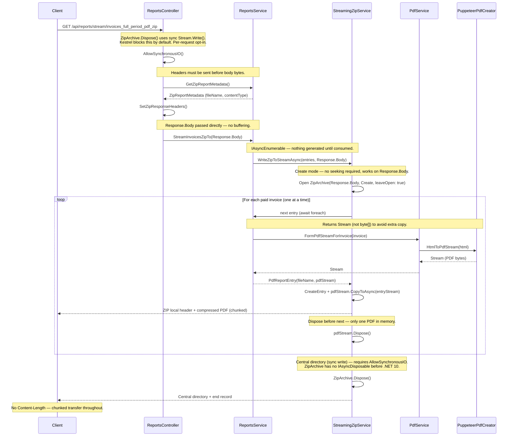
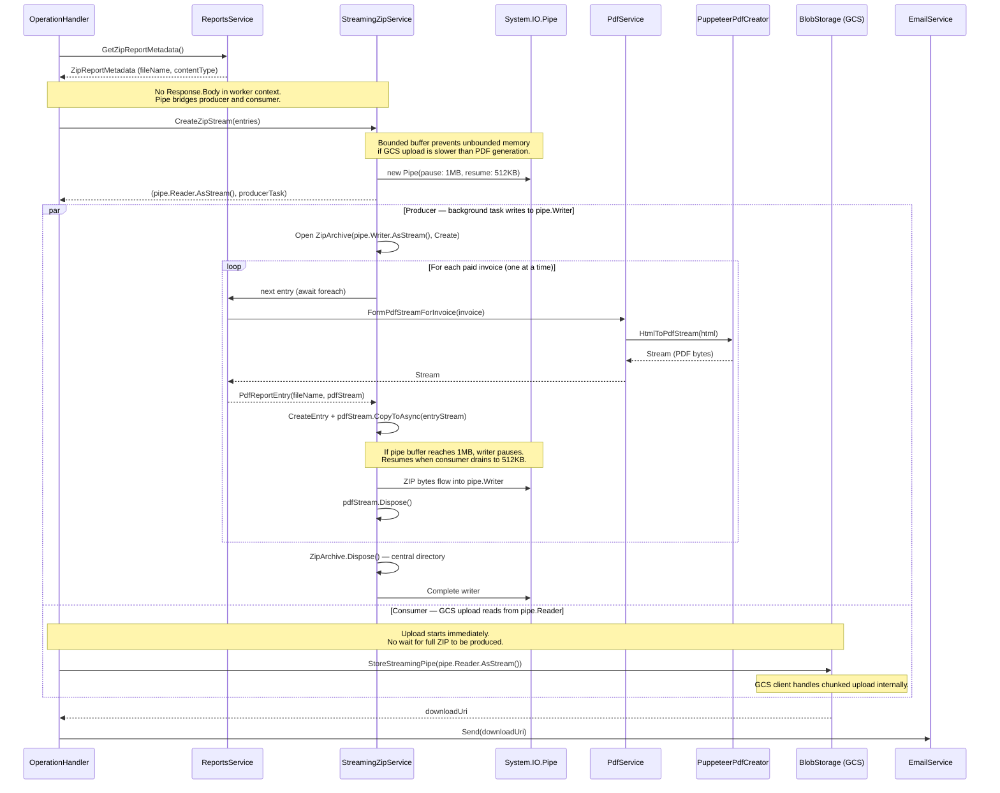

PDF ZIP Streaming Flow
======================

This document describes how the streaming PDF ZIP endpoints work. These endpoints generate invoice PDFs on-the-fly, zip them, and flush bytes directly to the HTTP response without buffering the full archive in memory.

## Endpoints

| Endpoint | Description |
|----------|-------------|
| `GET /api/reports/stream/invoices_full_period_pdf_zip` | All paid invoices for account |
| `GET /api/reports/stream/clients/{clientId}/invoices_full_period_pdf_zip` | Paid invoices for a specific client |

Both endpoints follow the same pipeline. The client-scoped variant simply filters invoices by `clientId`.

## API Streaming Flow

## Worker Path (Email Reports)

The worker uses a different streaming topology. Instead of writing to `Response.Body`, it pipes through `System.IO.Pipelines` with backpressure, uploading to GCS concurrently.

## Key Design Decisions

### One PDF at a time
Only one invoice PDF exists in memory at any point. The `IAsyncEnumerable` pattern ensures each PDF is generated, written into the ZIP entry, and disposed before the next one starts.

### AllowSynchronousIO
`ZipArchive.Dispose()` writes the central directory using synchronous `Stream.Write()` calls. Kestrel disallows synchronous I/O by default to prevent thread-pool starvation. The controller calls `AllowSynchronousIO()` to opt in for this specific request. This is a .NET BCL limitation -- `ZipArchive` does not implement `IAsyncDisposable` before .NET 10. Once upgraded to .NET 10, `AllowSynchronousIO` can be removed by switching to `await using`.

### Non-seekable stream support
`ZipArchive` in `ZipArchiveMode.Create` writes local file headers before each entry and the central directory at the end. This mode does not require seeking, so it works directly on `Response.Body`.

### No Content-Length header
Because the ZIP is built on-the-fly, the total size is unknown upfront. The response uses chunked transfer encoding (no `Content-Length`).

## Memory Profile Comparison

| Path | Buffering | Peak memory per invoice |
|------|-----------|------------------------|
| `GET /api/reports/{type}` (old) | Full ZIP in `MemoryStream`, then `byte[]` | Entire ZIP archive |
| `GET /api/reports/stream/...` (API) | Direct to `Response.Body` | One PDF stream |
| Worker (email) | `Pipe` with 1MB cap | One PDF stream + up to 1MB pipe buffer |

### Buffered endpoint improvements

The non-streaming `GET /api/reports/{type}` endpoint still buffers the full ZIP, but the streaming refactor reduced its peak memory too. For 100 invoices at ~200KB each:

| | Before | After |
|---|---|---|
| PDF generation | `byte[]` per invoice (`FormPdfForInvoice`) | `Stream` per invoice (`FormPdfStreamForInvoice`) |
| PDF accumulation | `List<(string, byte[])>` — all PDFs held in memory at once (~20MB) | One PDF at a time (~200KB), disposed after zipping |
| ZIP write | Sync `zipStream.Write()` from byte[] | Async `CopyToAsync()` from stream |
| ZIP output | `MemoryStream` → `.ToArray()` | `MemoryStream` → `.ToArray()` (unchanged) |
| **Peak memory** | **~55MB** (all PDFs + MemoryStream + ToArray) | **~30MB** (MemoryStream + ToArray + one PDF) |

The key win is eliminating the `List<byte[]>` that accumulated all PDFs before zipping. PDFs now flow through one at a time into the ZIP stream via `IAsyncEnumerable`, even when the destination is a `MemoryStream`.
