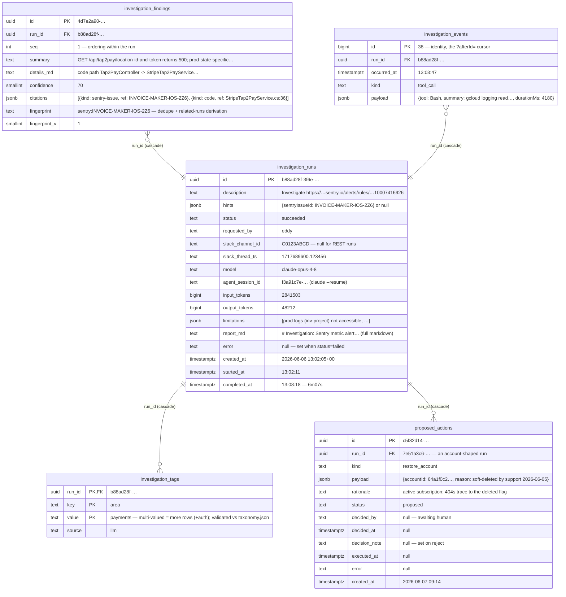

Tofu.AI — Investigations module
===============================

Reference for the `Investigations` module (FS-1111): domain structure, knowledge files, database schema, runtime flows, endpoints, and configuration. This describes the **module design** (including the 2026-06-07 agent-context-pull redesign — rationale in [`features/FS-1111/agent-context-pull.md`](../../../features/FS-1111/agent-context-pull.md)); implementation lives on `Tofu.AI.Backend@feature/FS-1111` and may lag individual sections.

**What it is.** AI-driven issue investigations: a REST API accepts a free-form ask ("checkout 500s spiked at 14:00 — why?"), a Hangfire job hands it to a headless `claude` CLI agent with read-only access to GCP logs, Sentry, source code, and (curated) MongoDB; findings, tags, a progress timeline, and proposed remediation actions are persisted to Postgres. The agent's accumulated knowledge — past investigations, human-verified known issues, the tag taxonomy — lives as **greppable text files** (git-versioned sources + DB-projected digests), never as DB queries by the agent. Contracts are shaped for a future Slack bot (async, compact summaries, incremental event polling).

**Division of labour:** Postgres = operational state + durable record · git text files = the agent's knowledge interface + human curation via PRs · local disk = the read path.

Project structure
-----------------

```
Tofu.AI.Backend/src/Investigations/
  Investigations.Domain/             entities, status machines, ports — no dependencies
  Investigations.Application/        InvestigationService, ProposedActionService, RunInvestigationJob,
                                     InvestigationPromptBuilder, StaleRunSweep, InvestigationReportRenderer
  Investigations.Infrastructure/     Npgsql repositories, M0001 migration, action executors, WireNames
  Investigations.Agent.ClaudeCli/    THE replaceable agent runtime — every claude-ism lives here
  Investigations.Mcp.Mongo/          curated Mongo MCP server (stdio console app) — the agent's only Mongo surface
```

Dependency rule: `Agent.ClaudeCli` and `Infrastructure` both reference only `Domain`; neither knows the other exists. `Mcp.Mongo` references nothing in the module — it is an agent-side tool spawned by the CLI, not service code. The API selects the agent adapter from `Investigations:Agent:Type` (`Tofu.AI.Api/Program.cs`), so a future runtime is a sibling project + one DI case.

### Domain model

| Type | Role |
|---|---|
| `InvestigationRun` | aggregate root; status machine `Pending → Running → Succeeded\|Failed\|TimedOut\|Canceled` with guarded `MarkX()` transitions |
| `InvestigationFinding` | summary (≤2900 chars, Slack-block-safe), details, confidence, citations, fingerprint |
| `Citation` + `CitationKind` | evidence anchor: `log-query \| sentry-issue \| code \| commit` |
| `InvestigationEvent` + kind | progress timeline row: `status_change \| tool_call \| agent_message \| error` |
| `TagAssignment` + `TagSource` | tag on the run (`llm \| human`), validated against the `taxonomy.json` source file |
| `ProposedAction` + `ProposedActionStatus` | agent-proposed write action: `proposed → approved → executed\|failed`, or `proposed → rejected` |
| `InvestigationHints`, `SlackContext` | optional steering + opaque Slack correlation |

Knowledge that is *not* a domain type on purpose: the tag taxonomy and known issues are **text files** (see Knowledge files below) — human-curated, git-reviewed, read by the agent and by persist-time validation; no entities, no repositories. Run-to-run relatedness is **derived** from `findings.fingerprint` at read time — no link entity.

### Ports (Domain) and their adapters

| Port | Adapter | Notes |
|---|---|---|
| `IInvestigationAgentPort` | `ClaudeCliAgentAdapter` (Agent.ClaudeCli) | `RunAsync(request, onEvent, ct)` — events stream into storage while the run is live |
| `IInvestigationRunRepository` | `NpgsqlInvestigationRunRepository` | raw SQL; `SaveResultAsync` persists findings+tags+limitations+proposed actions in one transaction |
| `IProposedActionRepository` | `NpgsqlProposedActionRepository` | decision-side; conditional `UPDATE … WHERE status='proposed'` is the double-approve guard |
| `IAgentContextWriter` | `AgentContextFilesWriter` | projects PG knowledge into `.tofu-ai/` (full rebuild at host start, incremental per run) and copies in the source files |
| `IErrorFingerprinter` | `ErrorFingerprinter` | pure; priority: Sentry citation verbatim → `sha256(type + top frame)` → normalized-message hash |
| `IProposedActionExecutor` | `RestoreAccountActionExecutor` | one executor per kind; **execution body is a TODO(FS-1111) stub** awaiting account domain logic |

Knowledge files — the agent's interface
---------------------------------------

The agent never queries the DB. Everything it knows beyond live evidence comes from a text tree it `Read`s/`Grep`s:

```
.tofu-ai/                                       ← local disk; rm -rf is always safe
  INDEX.md          ← one line per run: date | id | status | tags | fingerprints | 1-line summary
                       (capped ~25 KB — beyond that: recent + stats, agent greps runs/ for the tail)
  known-issues.md   ← SOURCE: human-verified verdicts; agent checks FIRST, returns early on match
  taxonomy.json     ← SOURCE: closed tag vocabulary
  runs/
    2026-06-06_b88ad28f_tap2pay-500s.md         ← PROJECTION: findings, citations, fingerprints, limitations
```

Two kinds of files, two protection mechanisms:

| Kind | Files | Owner | Protected by | Home |
|---|---|---|---|---|
| **Sources** (human knowledge) | `taxonomy.json`, `known-issues.md` | humans, via PR | git — versioned, reviewed, diffable | Phase 1: `Tofu.AI.Backend` repo · container: the knowledge repo |
| **Projections** (machine knowledge) | `runs/*.md`, `INDEX.md` | the service (`AgentContextFilesWriter`) | Postgres — regenerable | `.tofu-ai/` (sources copied in alongside) |

Recall is grep, not SQL: "was this investigated before?" = `grep -rl "sentry:<issue-id>" .tofu-ai/runs/` → one targeted read. Greppable naming (`YYYY-MM-DD_<id8>_<slug>.md`, fingerprints verbatim in files, consistent `## Findings` / `## Root cause` headings) carries the lookup.

**Container phase: git checkout + reconcile.** The knowledge tree lives in a **private** git repo; the service clones at startup, reconciles (projections regenerate from PG on drift; sources are read in place), and after each run commits + pushes **best-effort** — a failed push never fails an investigation; the next boot reconciles. Ownership split prevents conflicts: service writes only `runs/` + `INDEX.md`; humans own the source files. Single pusher (`MaxConcurrentRuns=1`; one designated pusher if replicas ever scale).

Database — `investigations` schema
----------------------------------

Postgres database `tofu_ai` (shared with Hangfire's `analyses` schema), connection key `ConnectionStrings:Investigations`. Migration: `M0001_CreateInvestigationsSchema` (`IModuleMigration`, idempotent "ensure schema" — additive changes are appended to its DDL, not chained). Store-level entry: [`Backend/Storage/postgres.md`](../../Storage/postgres.md).

**Five tables, deliberately boring** — state machines, append-only logs, and the durable record behind the projections. No FTS (recall = grep over `.tofu-ai/`), no taxonomy or known-issues tables (text sources, see Knowledge files), no links table (relatedness derived from `findings.fingerprint` at read time).



Closed value sets (CHECK constraints): `runs.status` `pending|running|succeeded|failed|timed_out|canceled` · `events.kind` `status_change|tool_call|agent_message|error` · `citations[].kind` `log-query|sentry-issue|code|commit` · `proposed_actions.status` `proposed|approved|rejected|executed|failed`, `kind` `restore_account` · `tags.source` `llm|human`. Tag values validate app-side against `taxonomy.json` — no FK; git review of the vocabulary file is the second net. Wire strings ↔ enums: `Infrastructure/WireNames.cs`.

Indexes worth knowing (beyond the PK/UNIQUE constraints above):

- `investigation_runs`: `(status, created_at)` — stale-run sweep + "anything in flight?"; `(created_at DESC)` — recent list.
- `investigation_findings`: `(fingerprint)` — same-error lookup + related-runs derivation; GIN `citations jsonb_path_ops` — exact-ref (`citationRef=`) lookup.
- `investigation_tags`: `(key, value)` — tag navigation / analytics.
- `proposed_actions`: `(status, created_at)` — the approval queue; `(run_id)`.

Example values in the diagram follow one coherent scenario — the real captured run `b88ad28f` (Sentry metric-alert investigation, 2026-06-06; full report: [`features/FS-1111/sample-report-b88ad28f.md`](../../../features/FS-1111/sample-report-b88ad28f.md)). The `proposed_actions` example comes from a second, account-shaped run — a restore proposal wouldn't plausibly arise from the tap2pay investigation.

Flows
-----

### 1. Investigation run (the main tick)

```mermaid
sequenceDiagram
    participant U as Client
    participant C as InvestigationsController
    participant S as InvestigationService
    participant HF as Hangfire
    participant J as RunInvestigationJob
    participant A as ClaudeCliAgentAdapter
    participant CLI as claude CLI (subprocess)
    participant FS as .tofu-ai/ (text tree)
    participant DB as Postgres

    U->>C: POST /api/investigations {description, hints?}
    C->>S: StartAsync
    S->>DB: insert run (pending)
    S->>HF: Enqueue(runId)
    C-->>U: 202 {id}

    HF->>J: ExecuteAsync(runId)
    Note over J: concurrency gate — at MaxConcurrentRuns the run<br/>stays pending, re-scheduled in 30s
    J->>FS: AgentContextFilesWriter — refresh projections,<br/>copy in sources (taxonomy.json, known-issues.md)
    J->>DB: status=running (+event)
    J->>A: RunAsync(prompt with .tofu-ai pointers, onEvent)
    A->>CLI: spawn claude -p … --output-format stream-json (read-only --allowed-tools)
    CLI->>FS: Read known-issues.md FIRST; grep INDEX.md / runs/ for prior work
    loop while agent investigates (logs, Sentry, code, mongo MCP)
        CLI-->>A: stream-json line
        A->>J: onEvent(AgentEvent)
        J->>DB: AppendEvent (live — bot polls /events?afterId=N)
    end
    CLI->>FS: Read taxonomy.json before tagging
    CLI-->>A: final message + fenced JSON report
    A->>A: FencedReportParser (one --resume retry on parse failure)
    A-->>J: AgentRunResult
    J->>J: validate tags (vs taxonomy.json) + proposed actions (vs executors), fingerprint findings
    J->>DB: SaveResultAsync (findings+tags+limitations+proposed actions, one tx) → succeeded
    J->>FS: append run file + INDEX line (container phase: commit + push best-effort)
```

Failure exits, all recorded as run state (never a 5xx): `RunTimeout` kills the subprocess → `timed_out`; cancel via `InvestigationCancellationRegistry` → `canceled`; non-zero exit / unparseable report after one retry → `failed`. Events already streamed are always retained. `StaleRunSweep` (IHostedService) marks orphaned `running` rows `failed` at host start. Hangfire retries are disabled (`[AutomaticRetry(Attempts = 0)]`) — a retry would re-run a half-done investigation.

### 2. Propose → approve → execute (writes)

The agent **never executes writes**. Its report may carry `proposedActions:[{kind, payload, rationale}]`; the job validates each against registered `IProposedActionExecutor`s (unknown kind / invalid payload → dropped + logged, like tags) and persists survivors as `proposed`. A human then:

- `GET /api/investigations/actions?status=proposed` — the approval queue
- `POST …/actions/{id}/approve` — conditional flip to `approved` (second caller gets `409`), then the executor runs **synchronously in the request**; success → `executed`, failure → `failed` with `error` in the returned dto
- `POST …/actions/{id}/reject` — flip to `rejected`, optional note

Phase-1 kind: `restore_account` (payload `{accountId, reason?}`). Payload validation is live; the execution body is a TODO(FS-1111) stub until the account-restore domain logic lands.

### 3. Known issues (verify-not-rediscover)

`known-issues.md` is a **git-versioned source file** humans curate via PRs. The prompt instructs the agent to Read it FIRST — on a match, verify cheaply, return early, tag `kind:known-issue` (unless verification contradicts the verdict, which it must say explicitly). History/audit = `git log` on the file. *Open (implementation-time): whether a promote-finding API survives as a file-appending convenience or curation is PR-only.*

### 4. Recall & fingerprinting (dedupe across runs)

Recall is **agent-driven grep**, not a prompt-time query: the INDEX carries dates/tags/fingerprints/one-liners; fingerprints appear verbatim in run files, so "seen before?" is `grep -rl "sentry:<id>" .tofu-ai/runs/`. At persist time each finding gets a fingerprint — (1) cited Sentry issue verbatim (`sentry:<id>`), (2) hash of error type + top frame, (3) hash of the Datadog-style normalized message — which lands in both PG (`findings.fingerprint`, indexed) and the run file. Related runs are **derived** from fingerprint equality at read time (report endpoint + the agent's grep) — nothing is stored about the relationship itself.

Agent runtime (ClaudeCli adapter)
---------------------------------

- Headless `claude -p … --output-format stream-json --verbose`, working dir = `WorkspaceRoot` (the repo checkouts the agent reads).
- **Pull-only context**: the system appendix carries no injected knowledge blocks — only pointer lines + two hard rules ("FIRST Read `.tofu-ai/known-issues.md`"; "Read `.tofu-ai/taxonomy.json` before tagging") and the report contract. The agent pulls everything else from the text tree on demand (just-in-time context; one cache miss on the first turn, cached within-run thereafter).
- **The `--allowed-tools` allowlist is the security boundary**: `Bash(gcloud logging read:*)`, read-only git (`fetch/log/show/diff`, `git -C:*` — no checkout), `Bash(curl -s:*)` (Sentry REST via the workspace skills; URLs can't be pinned in patterns — colons break them), `Skill`, `Read`, `Grep`, `Glob`; plus `mcp__sentry,mcp__mongo` when `McpConfigPath` is set.
- Sentry auth: token materialized to `WorkspaceRoot/.tofu-ai/sentry-header.txt` (the CLI refuses `$VAR` expansion in auto-approved commands).
- Report contract: final message = rich markdown report + one fenced ```json block (`findings` / `limitations` / `tags` / `proposedActions`); one `--resume` retry if unparseable.
- Mongo source: the in-house `Investigations.Mcp.Mongo` stdio server (must be named `mongo` in the MCP config) exposes only curated read tools — `find_account`, `get_account_deletion_state` (bodies TODO(FS-1111)). Connects with a dedicated read-only Mongo user via env `INVESTIGATIONS_MONGO_CONNECTION` + `INVESTIGATIONS_MONGO_DATABASE`; sample MCP config in its `Program.cs`.

Endpoints
---------

All under `api/investigations`; every endpoint returns `503` while `Investigations:Enabled=false`.

| Endpoint | Purpose |
|---|---|
| `POST /` | start a run → `202 {id}` (always accepted; excess runs queue as `pending`) |
| `GET /{id}` | run + findings + tags + limitations + proposed actions |
| `GET /{id}/events?afterId=&limit=` | progress timeline, incremental (identity `id` is the cursor) |
| `GET /{id}/report?format=slack` | rendered report (full markdown default; compact Slack mrkdwn); related runs derived from fingerprints |
| `GET /?limit=&citationRef=&tag=k:v` | recent runs; exact citation / tag filters (free-text search = grep the knowledge tree) |
| `POST /{id}/cancel?requestedBy=` | cancel pending/running (kills the agent mid-flight) |
| `GET /actions?status=&limit=` | proposed-actions approval queue |
| `POST /actions/{id}/approve` / `…/reject` | decide; approve executes synchronously; `409` if already decided |

Known-issues management has **no endpoints** — `known-issues.md` is curated via PRs (a file-appending promote convenience is an open implementation-time question).

Configuration
-------------

| Key | Meaning |
|---|---|
| `Investigations:Enabled` | master switch (default `false` — endpoints 503, no agent spawning) |
| `Investigations:WorkspaceRoot` | folder with the source-repo checkouts (required when enabled) |
| `Investigations:RunTimeout` / `MaxConcurrentRuns` / `GcpProject` | 10 min / 1 / `invoicesapp-project-test` defaults |
| `Investigations:Agent:Type` | `ClaudeCli` (only implemented adapter) |
| `Investigations:Agent:ClaudeCli:{CliPath, McpConfigPath, Model, MaxTurns}` | CLI knobs; `McpConfigPath` optional — enables Sentry/Mongo MCP tools |
| `ConnectionStrings:Investigations` | Postgres (the `investigations` schema) |
| `ConnectionStrings:InvestigationsMongoActions` | write-capable Mongo user (update-on-accounts only) for `RestoreAccountActionExecutor` — never given to the agent |
| env `SENTRY_ACCESS_TOKEN` | Sentry REST auth for the agent |
| env `INVESTIGATIONS_MONGO_CONNECTION` / `_DATABASE` | read-only Mongo user for the MCP server (set in the MCP config file, not the API) |
| *(container phase)* knowledge-repo URL + deploy key | the private git repo holding the knowledge tree; key naming TBD at implementation |

Local-run specifics (keys location, user-secrets, CLI permission gotchas) are workspace-local — see the FS-1111 feature folder.
