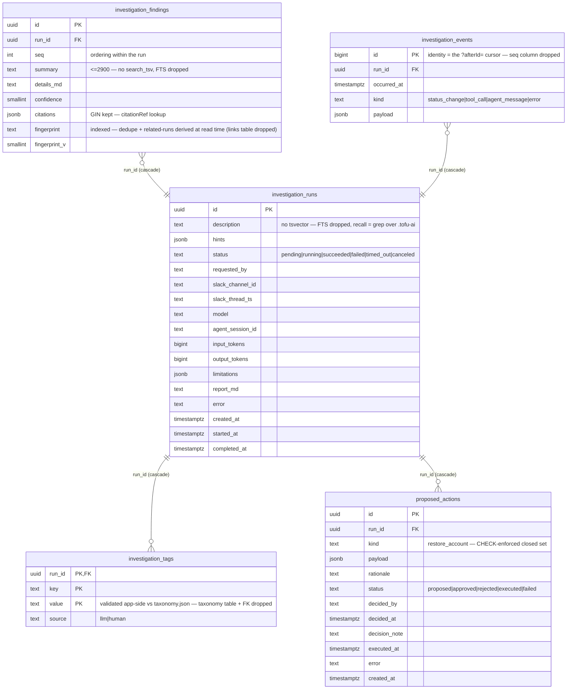

# FS-1111 — Agent-pulled context (pull-only recall + file cache)

Design addendum, decided 2026-06-07. **Not yet implemented** — supersedes the push-based recall described in `overview.md` (§ RunInvestigationJob prompt-time recall) once built. Premise: the primary reason this data exists in Postgres is to be *read back into the agent's context*; the DB stays the system of record + API backing store, but the **agent's interface is files, not queries**.

## Decisions

1. **Pull-only context.** Drop all prompt-injected blocks (recall, taxonomy, known issues). The system appendix shrinks to pointer lines + two mandatory rules ("FIRST check known-issues; read taxonomy before tagging"). `InvestigationPromptBuilder` loses its repository dependencies.
2. **The agent's memory = a greppable file tree in `WorkspaceRoot/.tofu-ai/`** (same mechanism as `sentry-header.txt`; agent already has `Read`/`Grep`/`Glob` — zero new tools). Per Anthropic's agentic-search guidance (2026-06-07, code.claude.com docs + Agent SDK guidance): INDEX + per-topic files beats one monolithic digest — targeted greps instead of reading everything.

   ```
   .tofu-ai/
     INDEX.md          ← one line per run: date | id | status | tags | fingerprints | 1-line summary
     known-issues.md   ← active human verdicts, return-early instruction inline — read FIRST
     taxonomy.json     ← closed tag vocabulary
     runs/
       2026-06-06_b88ad28f_tap2pay-500s.md   ← per-run: findings, citations, fingerprints, limitations
   ```

   - Greppable naming carries recall: `YYYY-MM-DD_<id8>_<slug>.md`; fingerprints verbatim in files → "seen before?" = `grep -rl "sentry:<id>" .tofu-ai/runs/` → one targeted Read.
   - Consistent headings (`## Findings`, `## Root cause`) so section-targeted grep works.
   - **Incremental generation**: after each `SaveResultAsync` write one run file + append one INDEX line; full regeneration at host start as repair. The tree is a rebuildable projection; Postgres stays the system of record.
   - NOT nested `CLAUDE.md` files — those are for instructions (lazy-loaded when the agent enters a directory; verified to work in `-p` mode); data lives in plain markdown the agent greps on demand.
3. **History search mechanism = read-only psql, deferred.** Chosen over REST-via-skill and history-MCP-tools, but only activated when the digest outgrows ~200 KB (then the digest becomes "recent 30 + stats" and deep search moves to SQL):
   - dedicated read-only PG user (SELECT on `investigations.*` only), connection string key `ConnectionStrings:InvestigationsAgentRead`;
   - the job materializes `.tofu-ai/pg_service.conf`; the adapter sets `PGSERVICEFILE` on the spawned process env — sidesteps both claude-CLI allowlist gotchas (no `$VAR` expansion; colons in connection strings make patterns unparseable);
   - allowlist addition: `Bash(psql:*)`; agent invokes `psql service=investigations -c "<SQL>"`;
   - `.tofu-ai/investigations-schema.md` (static cheat-sheet: tables + FTS/citation/fingerprint query recipes) ships alongside.
4. **One new DB object now: view `investigations.agent_recall`** — run ⋈ findings ⋈ tags flattened (id, created_at, status, description, finding summaries, fingerprints, tags). It is both the digest-export query and the future psql one-liner surface.

## What the agent consumes — three buckets

| Bucket | Examples | How it gets there |
|---|---|---|
| Knowledge from our DB → **projected to text** | `.tofu-ai/INDEX.md`, `runs/*.md`, `known-issues.md`, `taxonomy.json` | Phase 1: full rebuild at host start + per-run append. Container phase: **git clone + reconcile** (see Division of labour) |
| Knowledge already **file-native** | source checkouts, workspace `CLAUDE.md` (auto-loads in `-p`), `.claude/skills/*` | git pull / deploy artifact — nothing to recreate |
| **Live evidence** — never cached | GCP logs, Sentry, Mongo (curated MCP) | queried fresh per investigation (it's the thing being investigated) |

Credentials sidecar (`sentry-header.txt`, future `pg_service.conf`) regenerates with bucket 1. Invariant: **the agent never reads the DB, and the tree never holds anything the DB can't regenerate** — `rm -rf .tofu-ai/` is always safe.

## Human-owned knowledge moves out of the DB (2026-06-07, follow-up)

There are **two kinds of files**, and only one of them is a cache:

| Kind | Files | Owner | Protected by | Home |
|---|---|---|---|---|
| **Sources** (human knowledge) | `taxonomy.json`, `known-issues.md` | humans, via PR | git — versioned, reviewed, diffable | Phase 1: the `Tofu.AI.Backend` repo; container phase: the knowledge repo |
| **Projections** (machine knowledge) | `runs/*.md`, `INDEX.md` | the service | PG — regenerable | `.tofu-ai/` cache (context writer copies sources in alongside) |

Consequences — supersedes the "unchanged on purpose" status of these tables:

- **Drop `taxonomy`** (+ the FK on `investigation_tags`): the job validates tags against `taxonomy.json` app-side; git review of the vocabulary file replaces the FK as the second net. `investigation_tags` itself stays (machine output; backs the `tag=` filter).
- **Drop `known_issues`**: `known-issues.md` is the only copy; the agent reads it directly. The known-issues API endpoints either go away (PR-only curation) or become file-editing operations — pragmatic candidate: promote-finding appends to the file and a human reviews the diff. *Open: decided at implementation time.*
- **Drop `investigation_links`** entirely (settles the earlier judgment call): auto-links were already cut; human links have no feature; "related runs" derives from `findings.fingerprint` at read time.
- The repo→PG reconcile flow for human-owned files is **unnecessary** — there is no PG copy to sync; reconcile remains PG→files for projections only.
- Invariant restated: **projections are regenerable from PG; sources are protected by git; `rm -rf .tofu-ai/` stays safe.**

**Final schema: 5 tables** (as-built 8-table schema with example values: [`Backend/Services/Tofu.AI/Investigations.md`](../../Backend/Services/Tofu.AI/Investigations.md)):



Gone vs as-built: `taxonomy` (+ tags FK), `known_issues`, `investigation_links`, both FTS `tsvector` columns + their GIN indexes, `investigation_events.seq` (+ its `MAX(seq)+1` insert subquery).

## Division of labour: files vs DB (settled 2026-06-07)

Files are the **primary read path for the agent**; Postgres is the **system of record + operational state**. The tree is derived and disposable — rebuilt from the DB at host start / after deploy (mandatory in the container phase: the workspace is ephemeral), appended incrementally per run.

| Layer | Home | Why |
|---|---|---|
| Knowledge (findings, reports, known-issues, taxonomy, INDEX) | **files-first**; runs/INDEX have a durable PG copy, taxonomy/known-issues are git-versioned sources with **no PG copy** (follow-up section) | read-mostly, agent-facing, greppable |
| Run lifecycle (`pending→running→…`) | PG | concurrent conditional updates; live API polling |
| Approval queue (`proposed_actions`) | PG | the double-approve guard is a conditional UPDATE — files can't compare-and-set |
| Events stream | PG | high-frequency appends + incremental polling |
| Hangfire | PG by design | so Postgres never leaves the stack — "dropping the DB" buys nothing operationally |

**Container-phase deployment (decided 2026-06-07): git checkout + reconcile.** The knowledge tree lives in a **private** git repo the service clones at startup — same pattern as the source-repo checkouts the agent already reads. Not git-as-database: PG stays the system of record, git is the *distribution + history channel*, local disk is the read path.

```
startup:   clone/pull knowledge repo → local disk
           reconcile — machine-owned files (runs/, INDEX.md) regenerate from PG on drift;
                       human-owned files (known-issues.md, taxonomy.json) are SOURCES,
                       read in place — no PG copy (see follow-up section below)
per run:   agent greps the local checkout; job writes run file + INDEX line,
           commits, pushes BEST-EFFORT (a failed push never fails the run — next boot reconciles)
humans:    curate known-issues.md / taxonomy.json via normal PR flow  ← the deciding advantage
```

- Ownership split prevents merge conflicts: service writes only `runs/` + `INDEX.md`; humans own `known-issues.md` + `taxonomy.json`; `pull --rebase` before each run.
- Single pusher: safe under `MaxConcurrentRuns=1`; if replicas ever scale, exactly one instance pushes.
- PII: findings now reach a git host — private/self-hosted repo required, plus the existing no-PII-in-findings prompt rule.
- Phase 1 (local dev) needs no repo — plain rebuild-from-PG into `.tofu-ai/` as specified above.
- Open: once known-issues are PR-curated, does the `POST /known-issues` API path stay (dual write) or become read-only over the reconciled PG copy?

Also adopted from the storage web-spike: **cap `INDEX.md` at ~25 KB** (Claude Code caps its own `MEMORY.md` index at 25 KB / 200 lines) — beyond that, INDEX keeps recent + stats and the agent greps `runs/` for the tail.

Extra simplification candidate once files carry recall: drop the PG **FTS machinery** (generated `tsvector` columns + their GIN indexes + the `q=` path) — nothing critical queries it anymore. The citations GIN + fingerprint index stay (back `citationRef=` and auto-dedupe).

## Simplifications this unlocks

- **Stop auto-inserting `investigation_links`.** "Related runs" = same fingerprint, derivable at read time from the existing index; the report endpoint computes it live. The table remains for *human-curated* edges only (`created_by` human). Removes a write path + a job responsibility.
- **Drop `investigation_events.seq`** — `id bigint identity` is already a monotonic per-run cursor; `GET /{id}/events?afterId=` replaces `?afterSeq=` and removes the `MAX(seq)+1` subquery on every streamed line (the hottest write). Events are bot/human UX + audit — they never feed the agent.
- **Remove prompt-time `FindRelatedAsync`** from the job/prompt-builder path (the digest covers it; deep search via psql later).

## Unchanged on purpose (safety nets that must not depend on agent diligence)

- Persist-time tag/proposal validation (tags app-side against `taxonomy.json` per the follow-up section; proposal kinds still DB CHECK-enforced).
- Persist-time fingerprint derivation — fingerprints are the dedupe backbone the digest is built on.
- Known issues as the curated memory (file-form per the follow-up section); `report_md` as the human artifact.
- Events stream + approval flow — non-agent consumers.

## Trade-off accepted

Push *guaranteed* the agent saw known-issues; pull risks it skipping the check. Mitigation: tiny files, a hard "FIRST check" rule in the appendix, and one validation run comparing behaviour before/after. If the agent demonstrably skips the check, `known-issues.md` content gets re-promoted into the appendix (it is the one block small and valuable enough to push).

## Efficiency notes (verified against code.claude.com docs, 2026-06-07)

- **Root `CLAUDE.md` in cwd auto-loads in `-p` mode** — the dev workspace's `CLAUDE.md` already enters every run's context (useful repo maps + some noise). Container phase: give the service-owned workspace a purpose-built `CLAUDE.md` carrying the static investigation rules (rides the cached system-prompt layer; shrinks the appendix to per-run bits).
- **Caching reality**: per-run-varying `--append-system-prompt` costs exactly one cache miss on the first turn; within-run turns cache automatically. Cross-run caching is moot (sporadic runs vs 5-min TTL).
- **Model/effort per run is the biggest wall-clock lever**: Sonnet ≈ 1.5–2× Opus throughput, Haiku ≈ 2–3×; lookup-shaped asks don't need Opus. `ClaudeCliOptions.Model` already exists — consider exposing `model` on the POST request or routing by ask shape. `--effort low` exists for latency-sensitive runs.
- **Turn discipline**: appendix nudge "run independent lookups in parallel within one turn"; push log filtering into LQL (`--limit`, `--format=json(...)`) — Bash output beyond ~100 KB is truncated anyway.
- **MCP context**: every server in `--mcp-config` loads schemas regardless of `--allowed-tools` (permission filter, not context filter); tool-search deferral (default on Sonnet/Opus 4+) cuts ~85%. Current surface is deliberately tiny (2 Mongo tools; Sentry via curl) — keep it that way.

## Implementation sketch (when picked up — on `feature/FS-1111`)

- `Investigations.Domain`: `IAgentContextWriter` port (`WriteAsync(ct)`).
- `Investigations.Infrastructure`: `AgentContextFilesWriter` (queries via `agent_recall`; incremental per-run file + INDEX append after `SaveResultAsync`, full tree rebuild at host start; plus schema cheat-sheet + optional pg_service.conf); view added to `M0001` DDL; events `seq` removal (additive: keep column, stop writing, switch cursor to `id`).
- `Investigations.Application`: job calls the writer before `BuildAsync`; `InvestigationPromptBuilder` drops `ITaxonomyRepository`/`IKnownIssuesRepository`/recall, keeps executors + options.
- `Investigations.Agent.ClaudeCli`: `Bash(psql:*)` in the allowlist; `PGSERVICEFILE` on `ProcessStartInfo.Environment`.
- API: `?afterId=` alongside (then instead of) `?afterSeq=`.
