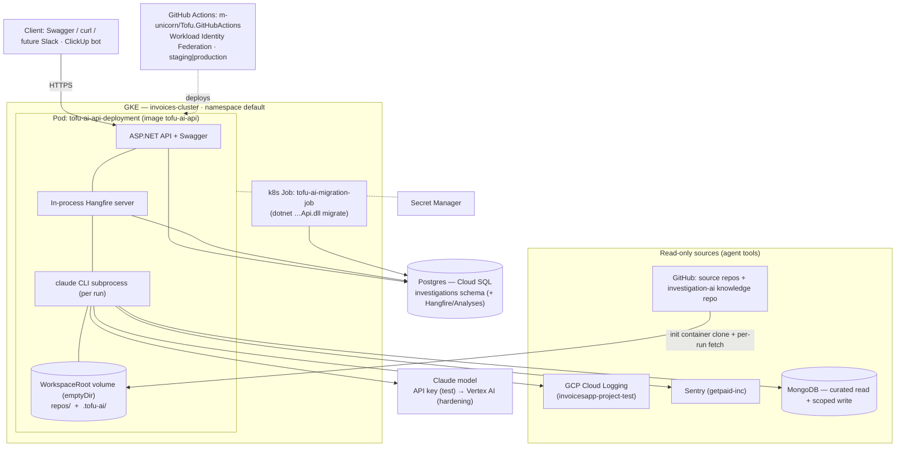
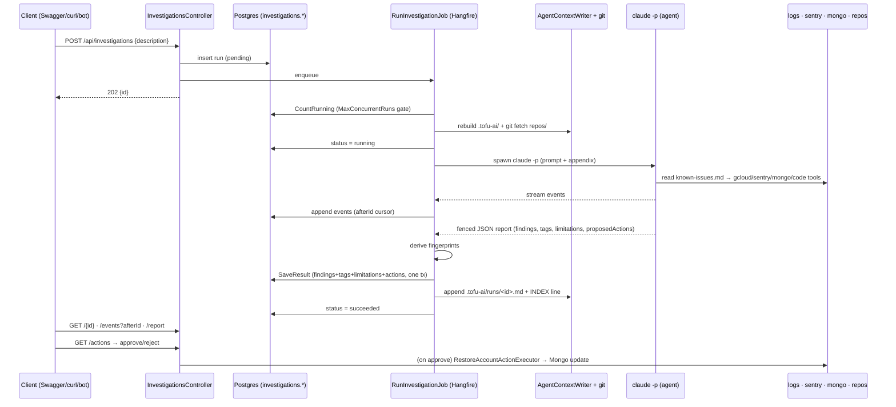

# FS-1111 — Deployed architecture & runtime workflow (Investigations service)

How the `Investigations` module is structured and runs **as deployed on GKE/stage** — the topology, the container, secrets, the Claude agent runtime, the source/knowledge mounts, and the end-to-end request→investigation→report flow.

> **Status framing:** this describes the **target deployed shape**. The HTTP/persistence/lifecycle layer is built and deployable; the **real agent runtime is not yet on stage** (Phase 3 of [`stage-rollout-plan.md`](./stage-rollout-plan.md)). The "live vs pending" table at the end says exactly what is real today. Design source of truth: [`overview.md`](./overview.md); code-level sequence: [`impl-interaction.md`](./impl-interaction.md); knowledge tree: [`agent-context.md`](./agent-context.md).

## 1. Deployment topology (GKE)



- **Single pod** `tofu-ai-api-deployment` (image `tofu-ai-api`) hosts **both the HTTP API and the in-process Hangfire server** — investigations run as Hangfire jobs in the same process. The Claude agent is a **subprocess** that job spawns.
- **Cluster `invoices-cluster`, namespace `default`** (the Tofu.AI service runs on its own cluster, distinct from the BFF's `tofu-cluster`).
- **Migrations** run as a separate one-shot **k8s Job** (`dotnet …Tofu.AI.Api.dll migrate`) — the same image, different entry arg.
- **Deploy** = the shared `m-unicorn/Tofu.GitHubActions` reusable workflow via **Workload Identity Federation** (OIDC, no static GCP keys), `workflow_dispatch` to `staging` or `production`.
- **Postgres** is **Cloud SQL** (the project carries `roles/cloudsql.client` + `instanceUser`) shared with Hangfire/Analyses; the `investigations` schema can live in the same database (separate `ConnectionStrings:Investigations` key keeps the module extractable). *Confirm the exact instance.*

## 2. The container image

Base `mcr.microsoft.com/dotnet/aspnet:8.0`, plus the agent runtime added in Phase 3:

| Layer | Purpose |
|---|---|
| .NET publish (`/app/api`) | the API + Hangfire host (built from `mcr.microsoft.com/dotnet/sdk:8.0`) |
| **Node + `@anthropic-ai/claude-code`** | the agent CLI (`claude -p`) |
| **`gcloud`** | the agent's read-only log tool (`gcloud logging read`) |
| **`git`** | read-only history (`git fetch`/`log`/`show`/`diff`) over the source checkouts |

Entry points selected by container args: `…Api.dll` (API) · `…Api.dll migrate` (migration Job). The agent needs **≥4 GB** headroom and a **Debian (glibc)** base — see [`stage-rollout-plan.md`](./stage-rollout-plan.md) §1.3.

## 3. Configuration & secrets

| Key | Source | Notes |
|---|---|---|
| `Investigations:Enabled` | env | `true` on stage (default off — kill-switch, not auth) |
| `Investigations:WorkspaceRoot` | env | the mounted volume root (`repos/` + `.tofu-ai/`) |
| `Investigations:KnowledgeRepoPath` | env | local checkout of `github.com/sergei-tofu-fedorov/investigation-ai` |
| `Investigations:GcpProject` | env | **`invoicesapp-project-test`** — what the agent's `gcloud logging read` targets |
| `ConnectionStrings:Investigations` | Secret | Cloud SQL Postgres |
| `ConnectionStrings:InvestigationsMongoRead` / `…MongoActions` | Secret Manager | two least-privilege Mongo users |
| **Agent model auth** | env / Secret | **API key** (`ANTHROPIC_API_KEY`) for test, **or** Vertex (`CLAUDE_CODE_USE_VERTEX=1` + `CLOUD_ML_REGION` + `ANTHROPIC_VERTEX_PROJECT_ID`) via Workload Identity |
| `SENTRY_AUTH_TOKEN`, knowledge-repo deploy key, GitHub read creds | Secret Manager | read scopes only |

**Model auth, two postures** (env-var-only swap, no code change):
- **Test (fast path):** `ANTHROPIC_API_KEY` → the Anthropic API. Unblocks the agent on stage immediately (no Model Garden wait). Acceptable here because **stage has no real data** — provided the agent's *sources* (`GcpProject`, Mongo, Sentry) also point at test.
- **Hardening:** **Vertex AI** via the pod's Workload Identity SA (`roles/aiplatform.user`) — inference stays in-GCP, no key to leak, GCP billing. Requires Claude enabled in Vertex **Model Garden** (24–48h). Vertex API + billing are already on in `invoicesapp-project-test`.

## 4. The agent runtime

One investigation = one headless `claude -p` invocation (a fresh session; nothing carried between runs — cross-run memory is the `.tofu-ai/` tree, not sessions):

```
claude -p "<task>" --bare --output-format stream-json \
  --max-turns 50 --mcp-config <path> --append-system-prompt "<appendix>" \
  --permission-mode dontAsk \
  --allowedTools "Bash(gcloud logging read:*),Bash(git fetch:*),Bash(git log:*),Bash(git show:*),Bash(git diff:*),Read,Grep,Glob,mcp__sentry__*,mcp__mongo__*"
```

- **cwd = `WorkspaceRoot`**; the prompt appendix + an optional workspace `CLAUDE.md` tell the agent the layout (read `.tofu-ai/known-issues.md` first, source under `repos/`).
- **The allowlist is the security boundary** — read-only `gcloud`/`git`, `Read/Grep/Glob`, the two MCP servers; no `Edit/Write`, no `git checkout`, no general `Bash`. Optional OS sandboxing (`bubblewrap` / `sandbox-runtime`).
- **Tools:** GCP logs (`gcloud`, Workload-Identity-authed), Sentry (`sentry-mcp`), Mongo (curated `Investigations.Mcp.Mongo`, read-only user), source code (`repos/` via `Read/Grep/Glob` + read-only git), and the `.tofu-ai/` knowledge tree.
- Events stream out as `stream-json` lines → normalized to `AgentEvent`s → persisted live (the `afterId` cursor backs incremental polling).

## 5. Source checkouts & knowledge base (the `WorkspaceRoot` volume)

```
WorkspaceRoot/                 ← agent cwd (emptyDir; rebuildable, not durable)
├── repos/                     ← working-tree checkouts at the deployed ref (read-only)
│   ├── Invoices.Backend/ … Tofu.Auth.Backend/
└── .tofu-ai/
    ├── INDEX.md  runs/*.md    ← PROJECTIONS rebuilt from Postgres
    ├── taxonomy.json  known-issues.md   ← SOURCES from the investigation-ai repo
```

- **The service populates; the agent only reads.** An **init container** clones `repos/` + the knowledge repo into the volume (read creds from Secret Manager); the job `git fetch`es per run; `IAgentContextWriter.RebuildAsync` (host start) regenerates `INDEX.md`/`runs/*.md` from Postgres and copies the source files in.
- Working-tree checkout (not bare) so the agent's native `Grep`/`Glob` work; `git checkout --detach origin/<default>` keeps it at the deployed ref, never dirty.
- `emptyDir` is ephemeral → re-cloned/rebuilt each pod start. Postgres + git are the durable record; `rm -rf .tofu-ai/` is always safe.

## 6. End-to-end runtime workflow



**Lifecycle states:** `pending → running → succeeded | failed | timed_out | canceled`. Failure modes never surface as 5xx — agent crash/parse-fail → `failed` with `error`; timeout → `timed_out` (partial events kept); `POST /{id}/cancel` kills mid-flight → `canceled`; orphaned `running` rows are swept to `failed` at host start.

**Access points:** `start`/`cancel`/`get`/`events`/`report`(`?format=slack`)/`list`(`citationRef`,`tag`) + the `actions` approval queue. Detail in [`overview.md`](./overview.md) § Endpoints.

## 7. Data stores & flow

| Store | Role | Durability |
|---|---|---|
| **Postgres (5 tables)** | system of record + operational state (runs, findings, tags, events, proposed_actions) | durable (Cloud SQL) |
| **`.tofu-ai/` files** | the agent's read interface — projections of PG + git-versioned sources | rebuildable projection (ephemeral disk) |
| **MongoDB** | curated read tools (`find_account`, `get_account_deletion_state`) + `restore_account` write | external |
| **GCP logs, Sentry** | live evidence, queried fresh per run, never cached | external read-only |
| **Knowledge repo** (`investigation-ai`) | human-curated `taxonomy.json` / `known-issues.md`; container-phase distribution + per-run push | git |

## 8. Security & network posture

- **API auth:** the design is "localhost-only, no auth" → **invalid on stage** (Swagger is reachable). Gate with ingress/IAP, an API key, or network policy before P0 is externally reachable (`stage-rollout-plan.md` §3). `Enabled` is a kill-switch, not auth.
- **Read-only everywhere:** Sentry read token, `gcloud` via WI with `roles/logging.viewer`, read-only Mongo user, read-only GitHub creds, read-only git allowlist. The **only** write path is propose → human-approve → **service**-executed `restore_account` (scoped Mongo user).
- **Egress:** agent → Anthropic API (test posture; **no real data on stage**) or Vertex (in-tenant). Source pulls target the **test** project/cluster.
- **Secrets:** Secret Manager / k8s Secrets, never image layers; rotatable.

## 9. Live vs pending (what's real today)

| Capability | State |
|---|---|
| Module, 5-table schema + migration | ✅ built |
| HTTP surface + lifecycle + approval queue | ✅ built |
| Pull-context `.tofu-ai/` (writer + prompt pointers) | ✅ built |
| Deployed on stage with `Enabled=true` | ⛔ pending (config + DB wiring — P0) |
| Echo adapter (full API testable, no LLM) | ⛔ pending (P1) |
| `restore_account` executor + Mongo read tools + Mongo users | ⛔ stubbed (`TODO(FS-1111)`, P2) |
| Real agent in the pod (image + auth + mounts) | ⛔ pending (P3) |
| Stage API auth gate | ⛔ open decision (§8) |
| FTS/`events.seq` cleanup, integration tests, runbook | ⛔ pending (P4) |

See [`stage-rollout-plan.md`](./stage-rollout-plan.md) for the phase-by-phase, Swagger-testable path from here to "deployed and working."
