# FS-1111 — Investigations module (implementation design)

A new `Investigations` module in `Tofu.AI.Backend`: REST API → `pending` run in Postgres → Hangfire job → Claude-CLI agent subprocess (read-only tools) → findings/tags/limitations/fingerprints persisted, events streamed live. Contracts are Slack-bot-shaped (async, compact summary, progress timeline). This doc is the abstraction surface only — no bodies.

> **Scope guardrail.** Schema (tables/columns/indexes), endpoint shapes, taxonomy seed, and fingerprint rules are locked in [`overview.md`](overview.md); the research backing is in [`web-spike.md`](web-spike.md). On conflict, `overview.md` wins. No tests here — `/tests` later.
>
> **2026-06-07:** this doc was updated to incorporate [`agent-context-pull.md`](agent-context-pull.md) — pull-only file-tree context, 5-table schema, text-file sources for taxonomy/known-issues. It now describes the **target design**; code on `feature/FS-1111` predates the redesign and catches up at implementation time.

Source of plan: [`overview.md`](overview.md) (consumed in full).

## Decision

- **Five new projects under `src/Investigations/`** mirroring `src/Analyses` (`Domain` / `Application` / `Infrastructure` + the swappable `Agent.ClaudeCli` + the standalone `Mcp.Mongo`). `Agent.ClaudeCli` references only `Investigations.Domain` — the replaceability boundary is a project edge, not a folder.
- **Mongo reads = curated MCP server, zero write tools.** `Investigations.Mcp.Mongo` is a stdio console app (official `ModelContextProtocol` C# SDK) exposing exactly `find_account` / `get_account_deletion_state` with projection allowlists; it references **no module project** (it's an agent-side tool the CLI spawns via `investigations-mcp.json`, not service code) and connects with a dedicated read-only Mongo user (`ConnectionStrings:InvestigationsMongoRead` → passed as env var in the MCP config).
- **Writes = propose → approve → execute, agent never writes.** The fenced report gains `proposedActions:[{kind, payload, rationale}]`; the job persists them as `proposed` rows (validated against registered executors, drop+log unknowns — the taxonomy rule). `IProposedActionExecutor` (Domain port: `Kind` + `ExecuteAsync(payload)`) is implemented per kind in Infrastructure — Phase 1 only `RestoreAccountActionExecutor` (Mongo driver, separate `InvestigationsMongoActions` connection string, user scoped to update-on-accounts). Approve executes synchronously in the API request; double-approve is guarded by conditional `UPDATE … WHERE status='proposed'` → `409`.
- **The agent port is the only seam Application sees:** `IInvestigationAgentPort.RunAsync(AgentRunRequest, onEvent, ct) → AgentRunResult`. Stream-json parsing, fenced-report parsing, `--allowed-tools`, MCP config are all internal to `Investigations.Agent.ClaudeCli`. Adapter selection by `Investigations:Agent:Type` switch in DI (only `ClaudeCli` in Phase 1).
- **`RunInvestigationJob` is enqueue-based Hangfire** (`IBackgroundJobClient.Enqueue`), not recurring — reuses the existing Hangfire host (`src/Tofu.AI.Api/Hangfire/HangfireConfiguration.cs`); no new infrastructure. `[DisableConcurrentExecution]`-style serialization is *not* used — concurrency is governed by `MaxConcurrentRuns` checked in the job (queued runs stay `pending`).
- **Repositories are raw Npgsql** (this repo has no EF) behind `IInvestigationRunRepository` / `IProposedActionRepository` in Domain. One `NpgsqlDataSource` singleton built from `ConnectionStrings:Investigations`. No taxonomy/known-issues repositories — those are **text source files** (see `agent-context-pull.md`); no links — relatedness derives from `findings.fingerprint`.
- **Migrations reuse the existing `IModuleMigration` runner** (`src/Analyses/Analyses.Infrastructure/Migrations/IModuleMigration.cs`) — `Investigations.Infrastructure` takes a project reference to `Analyses.Infrastructure` for the migration interfaces only. Accepted coupling; extracting the runner to a shared project is deliberately deferred (open question #1).
- **Fingerprinting is a pure Domain service** (`IErrorFingerprinter`, no IO): sentry-ref verbatim → typed-error hash → normalized-message hash (Datadog rules), returning `(value, version)`. The **job** computes fingerprints at persist time; the agent's `error` block is input, never trusted as the hash.
- **Code sources: dev workspace + read-only git in Phase 1; bare-clone cache in the container phase.** The agent reads `WorkspaceRoot` checkouts directly (disk-fast) and gets `Bash(git fetch/log/show/diff:*)` — history for change↔spike correlation, `git show origin/<default>:<path>` for deployed-ref reads; `git checkout` is excluded so the dev's working tree is never mutated. The container phase replaces `WorkspaceRoot` with a service-owned bare-clone cache (clone once, fetch per run) — an adapter-workspace concern, no new port.
- **Prompt assembly is one class** (`InvestigationPromptBuilder` in Application): task verbatim + system appendix (source inventory, read-only + no-PII rules, report-JSON instruction, **`.tofu-ai/` pointer lines** — "FIRST Read known-issues.md", "Read taxonomy.json before tagging"). No injected knowledge blocks, no recall queries — the agent pulls from the text tree (`agent-context-pull.md`). Before the prompt, the job calls `IAgentContextWriter` to refresh the tree.
- **Controller maps domain → DTOs inline** in `Tofu.AI.Api` (matches `ChatController.cs` — this API has no separate mapper layer).
- Runtime order, in prose (sequence diagram in [`impl-interaction.md`](impl-interaction.md)): controller persists `pending` + enqueues → job: refresh `.tofu-ai/` (context writer) → prompt → `running` → agent port (events appended as they stream; agent greps the tree for recall) → parse result → fingerprints → persist findings/tags/limitations/proposed-actions (one tx) → append run file + INDEX line → final status. `StaleRunSweep` runs once at host start (and rebuilds the tree).

Everything below this section is supporting detail.

## Code layout

```
Tofu.AI.Backend/
├── docker-compose.yml                                    # NEW — postgres:16-alpine, named volume tofu-ai-pgdata, port 55433
├── Tofu.AI.Backend.sln                                   # MODIFIED — add 4 projects
└── src/
    ├── Tofu.AI.Api/
    │   ├── Program.cs                                    # MODIFIED — AddInvestigationsModule(...), sweep hosted service picked up via module DI
    │   ├── Controllers/
    │   │   └── InvestigationsController.cs               # NEW — POST /api/investigations, GET /{id}, GET /{id}/events, GET list; inline DTO mapping
    │   └── Requests/Investigations/
    │       ├── StartInvestigationRequest.cs              # NEW — + InvestigationHintsDto, SlackContextDto (records per overview.md)
    │       ├── InvestigationRunDto.cs                    # NEW — + InvestigationFindingDto, CitationDto (incl. Limitations, Tags, ProposedActions)
    │       ├── InvestigationEventDto.cs                  # NEW
    │       ├── ProposedActionDto.cs                      # NEW
    │       └── DecideActionRequest.cs                    # NEW — {decidedBy, reason?} for approve/reject
    │
    └── Investigations/
        ├── Investigations.Domain/
        │   ├── Models/
        │   │   ├── InvestigationRun.cs                   # NEW — aggregate: status machine (pending→running→succeeded|failed|timed_out)
        │   │   ├── InvestigationStatus.cs                # NEW — enum
        │   │   ├── InvestigationFinding.cs               # NEW — summary, details, confidence, citations, fingerprint
        │   │   ├── Citation.cs                           # NEW — + CitationKind enum (LogQuery|SentryIssue|Code|Commit)
        │   │   ├── InvestigationEvent.cs                 # NEW — seq, kind (+InvestigationEventKind enum), payload
        │   │   ├── InvestigationHints.cs                 # NEW — sentryIssueId, requestPath, accountId, time range
        │   │   ├── SlackContext.cs                       # NEW — channelId, threadTs (opaque)
        │   │   ├── TagAssignment.cs                      # NEW — key, value, source (llm|human); validated vs taxonomy.json
        │   │   └── ProposedAction.cs                     # NEW — + ProposedActionStatus enum; status transitions guarded on the record
        │   ├── Agent/
        │   │   ├── IInvestigationAgentPort.cs            # NEW — THE runtime seam
        │   │   ├── AgentRunRequest.cs                    # NEW — prompt + system appendix
        │   │   ├── AgentEvent.cs                         # NEW — kind, timestamp, payload (normalized, adapter-agnostic)
        │   │   ├── AgentRunResult.cs                     # NEW — findings, limitations, tags, session id, model, tokens
        │   │   ├── AgentFinding.cs                       # NEW — + ErrorSignature record (type, message, topFrame)
        │   │   └── AgentRunException.cs                  # NEW — adapter failure → run 'failed'
        │   ├── Fingerprinting/
        │   │   ├── IErrorFingerprinter.cs                # NEW — Derive(AgentFinding) → Fingerprint?
        │   │   └── Fingerprint.cs                        # NEW — (Value, Version)
        │   ├── Actions/
        │   │   ├── IProposedActionExecutor.cs            # NEW — Kind + ValidatePayload + ExecuteAsync; one impl per kind
        │   │   └── ActionExecutionResult.cs              # NEW — success | failure(error)
        │   ├── Context/
        │   │   └── IAgentContextWriter.cs                # NEW — projects PG knowledge into .tofu-ai/ + copies source files in
        │   └── Repositories/
        │       ├── IInvestigationRunRepository.cs        # NEW — persistence port (runs, findings, events)
        │       ├── IProposedActionRepository.cs          # NEW — decision-side port (queue, conditional flips)
        │       └── InvestigationQuery.cs                 # NEW — list filter: citationRef, tags, limit (free-text search = grep the tree)
        │
        ├── Investigations.Application/
        │   ├── InvestigationService.cs                   # NEW — StartAsync (persist pending + enqueue), GetAsync, GetEventsAsync, ListAsync
        │   ├── ProposedActionService.cs                  # NEW — ListAsync(status), ApproveAsync (conditional flip + execute), RejectAsync
        │   ├── Jobs/
        │   │   └── RunInvestigationJob.cs                # NEW — the tick: recall → prompt → agent → fingerprint → link → persist
        │   ├── InvestigationPromptBuilder.cs             # NEW — task verbatim + system appendix (taxonomy, recall block, rules)
        │   ├── StaleRunSweep.cs                          # NEW — IHostedService; marks orphaned 'running' rows failed at start
        │   └── DependencyInjection.cs                    # NEW — AddInvestigationsApplication()
        │
        ├── Investigations.Infrastructure/
        │   ├── Repositories/
        │   │   ├── NpgsqlInvestigationRunRepository.cs   # NEW — raw SQL over NpgsqlDataSource; fingerprint + citation queries
        │   │   └── NpgsqlProposedActionRepository.cs     # NEW — queue reads + conditional status flips
        │   ├── AgentContext/
        │   │   └── AgentContextFilesWriter.cs            # NEW — IAgentContextWriter: INDEX.md + runs/*.md from PG; copies taxonomy.json/known-issues.md in
        │   ├── Migrations/
        │   │   └── M0001_CreateInvestigationsSchema.cs   # NEW — IModuleMigration; 5 tables + indexes (no taxonomy — that's a file)
        │   ├── ErrorFingerprinter.cs                     # NEW — IErrorFingerprinter impl: sentry-ref | type+frame hash | Datadog-normalized message hash
        │   ├── Actions/
        │   │   └── RestoreAccountActionExecutor.cs       # NEW — IProposedActionExecutor("restore_account"): validate soft-deleted → flip → audit
        │   ├── InvestigationsOptions.cs                  # NEW — "Investigations": WorkspaceRoot, RunTimeout, MaxConcurrentRuns, GcpProject
        │   └── DependencyInjection.cs                    # NEW — AddInvestigationsModule(): data source, repos, options, executors, agent-adapter switch
        │
        ├── Investigations.Agent.ClaudeCli/
        │   ├── ClaudeCliAgentAdapter.cs                  # NEW — IInvestigationAgentPort: spawn claude -p, stream events, parse final report
        │   ├── ClaudeCliOptions.cs                       # NEW — "Investigations:Agent:ClaudeCli": CliPath, McpConfigPath, Model, MaxTurns
        │   ├── StreamJsonEventMapper.cs                  # NEW — CLI stream-json line → AgentEvent (claude-isms die here)
        │   ├── FencedReportParser.cs                     # NEW — final fenced JSON → AgentRunResult parts (incl. proposedActions); one retry on parse failure
        │   └── DependencyInjection.cs                    # NEW — AddClaudeCliAgent()
        │
        └── Investigations.Mcp.Mongo/
            ├── Program.cs                                # NEW — stdio MCP host (ModelContextProtocol SDK), tool registration
            └── AccountReadTools.cs                       # NEW — find_account, get_account_deletion_state; projection allowlists; read-only conn string
```

The key seam: `RunInvestigationJob` (Application) talks to `IInvestigationAgentPort` + `IInvestigationRunRepository` + `IAgentContextWriter` + `IErrorFingerprinter` + `InvestigationPromptBuilder` and nothing else. `Investigations.Agent.ClaudeCli` and `Investigations.Infrastructure` both depend on `Investigations.Domain`; neither knows the other exists.

Runtime flow: see [`impl-interaction.md`](impl-interaction.md) — the broad-ask sequence ("investigate latest Sentry alerts"), including the discovery loop and fingerprint auto-linking.

## Contracts

```csharp
// ── Investigations.Domain/Agent ──────────────────────────────────────────────
public interface IInvestigationAgentPort
{
    // onEvent fires as the agent emits — events must land in storage while the run is live (Slack streaming).
    Task<AgentRunResult> RunAsync(AgentRunRequest request, Func<AgentEvent, Task> onEvent, CancellationToken ct);
}

public sealed record AgentRunRequest
{
    public required Guid RunId { get; init; }
    public required string TaskPrompt { get; init; }        // user description, verbatim
    public required string SystemAppendix { get; init; }    // sources, rules, taxonomy, recall block, report-JSON instruction
}

public sealed record AgentEvent
{
    public required InvestigationEventKind Kind { get; init; }   // ToolCall | AgentMessage | Error
    public required DateTimeOffset OccurredAt { get; init; }
    public required JsonElement Payload { get; init; }           // adapter-normalized; no claude-isms
}

public sealed record AgentRunResult
{
    public required IReadOnlyList<AgentFinding> Findings { get; init; }
    public required IReadOnlyList<string> Limitations { get; init; }
    public required IReadOnlyDictionary<string, IReadOnlyList<string>> Tags { get; init; } // validated downstream vs taxonomy
    public IReadOnlyList<AgentProposedAction> ProposedActions { get; init; } = [];         // validated downstream vs registered executors
    public string? SessionId { get; init; }
    public string? Model { get; init; }
    public long? InputTokens { get; init; }
    public long? OutputTokens { get; init; }
}

public sealed record AgentProposedAction(string Kind, JsonElement Payload, string? Rationale);

public sealed record AgentFinding
{
    public required string Summary { get; init; }
    public string? DetailsMd { get; init; }
    public int? Confidence { get; init; }
    public required IReadOnlyList<Citation> Citations { get; init; }
    public ErrorSignature? Error { get; init; }              // fingerprint input — optional structured signal
}

public sealed record ErrorSignature(string? Type, string? Message, string? TopFrame);

// ── Investigations.Domain/Fingerprinting ─────────────────────────────────────
public interface IErrorFingerprinter
{
    Fingerprint? Derive(AgentFinding finding);               // null when no fingerprintable signal
}
public sealed record Fingerprint(string Value, short Version);

// ── Investigations.Domain/Actions ────────────────────────────────────────────
public interface IProposedActionExecutor
{
    string Kind { get; }                                     // "restore_account" — DI resolves by kind
    bool ValidatePayload(JsonElement payload, out string? error);   // persist-time gate (drop+log on failure)
    Task<ActionExecutionResult> ExecuteAsync(JsonElement payload, CancellationToken ct);  // approval-time, service-side
}
public sealed record ActionExecutionResult(bool Succeeded, string? Error);

// ── Investigations.Domain/Repositories ───────────────────────────────────────
public interface IInvestigationRunRepository
{
    Task CreateAsync(InvestigationRun run, CancellationToken ct);
    Task<InvestigationRun?> GetAsync(Guid id, CancellationToken ct);                       // run + findings + tags + limitations
    Task<IReadOnlyList<InvestigationRun>> ListAsync(InvestigationQuery query, CancellationToken ct);
    Task<int> CountRunningAsync(CancellationToken ct);                                     // MaxConcurrentRuns gate
    Task UpdateStatusAsync(Guid id, InvestigationStatus status, string? error, CancellationToken ct);
    Task AppendEventAsync(Guid runId, InvestigationEvent evt, CancellationToken ct);
    Task<IReadOnlyList<InvestigationEvent>> GetEventsAsync(Guid runId, long afterId, int limit, CancellationToken ct);
    Task SaveResultAsync(Guid runId, IReadOnlyList<InvestigationFinding> findings,
        IReadOnlyList<string> limitations, IReadOnlyList<TagAssignment> tags,
        IReadOnlyList<ProposedAction> proposedActions,
        AgentRunResult stats, CancellationToken ct);                                       // one transaction
    Task<IReadOnlyList<Guid>> FindRunIdsByFingerprintAsync(string fingerprint, Guid excludeRunId, CancellationToken ct);  // related-runs derivation (report endpoint)
    Task<int> MarkStaleRunningAsFailedAsync(TimeSpan olderThan, string error, CancellationToken ct);
}

// ── Investigations.Domain/Context ────────────────────────────────────────────
public interface IAgentContextWriter
{
    /// <summary> Full rebuild of .tofu-ai/ projections from PG + copy-in of the source files (taxonomy.json, known-issues.md). Host start / reconcile. </summary>
    Task RebuildAsync(CancellationToken ct);
    /// <summary> Incremental: write the run's file + append its INDEX line after SaveResultAsync. Container phase also commits + pushes best-effort. </summary>
    Task AppendRunAsync(Guid runId, CancellationToken ct);
}

public interface IProposedActionRepository
{
    Task<ProposedAction?> GetAsync(Guid id, CancellationToken ct);
    Task<IReadOnlyList<ProposedAction>> ListAsync(ProposedActionStatus? status, int limit, CancellationToken ct);
    Task<bool> TryMarkApprovedAsync(Guid id, string decidedBy, CancellationToken ct);   // UPDATE … WHERE status='proposed'; false → 409
    Task<bool> TryMarkRejectedAsync(Guid id, string decidedBy, string? reason, CancellationToken ct);
    Task MarkExecutedAsync(Guid id, CancellationToken ct);
    Task MarkFailedAsync(Guid id, string error, CancellationToken ct);
    // creation happens inside IInvestigationRunRepository.SaveResultAsync — same transaction as findings/tags
}

// No ITaxonomyRepository / IKnownIssuesRepository — taxonomy.json and known-issues.md are git-versioned
// text sources: the agent Reads them; persist-time tag validation parses taxonomy.json directly.
```

Domain model records/enums (`Models/`) carry the schema from `overview.md` 1:1 — `InvestigationRun` (aggregate root with `MarkRunning()` / `MarkSucceeded()` / `MarkFailed(error)` / `MarkTimedOut()` transition guards), `InvestigationFinding`, `Citation` + `CitationKind`, `InvestigationEvent` + `InvestigationEventKind`, `InvestigationHints`, `SlackContext`, `TagAssignment(Key, Value, TagSource)`, `InvestigationLink` + `LinkRelationKind`, `RelatedInvestigation`. API DTOs are as specified in `overview.md` § DTOs.

## Class skeletons

```csharp
// Application — orchestration; knows ports, never adapters.
public sealed class InvestigationService(
    IInvestigationRunRepository repository,
    IBackgroundJobClient backgroundJobs)
{
    public Task<Guid> StartAsync(StartInvestigationCommand command, CancellationToken ct);  // persist pending + Enqueue<RunInvestigationJob>
    public Task<InvestigationRun?> GetAsync(Guid id, CancellationToken ct);
    public Task<IReadOnlyList<InvestigationEvent>> GetEventsAsync(Guid id, int afterSeq, int limit, CancellationToken ct);
    public Task<IReadOnlyList<InvestigationRun>> ListAsync(InvestigationQuery query, CancellationToken ct);
}

public sealed class RunInvestigationJob(
    IInvestigationRunRepository repository,
    IAgentContextWriter contextWriter,                            // refresh .tofu-ai before the agent; append run file after persist
    IInvestigationAgentPort agent,
    IErrorFingerprinter fingerprinter,
    IEnumerable<IProposedActionExecutor> executors,               // validation registry for proposedActions at persist time
    InvestigationPromptBuilder promptBuilder,
    IOptions<InvestigationsOptions> options,
    ILogger<RunInvestigationJob> logger)
{
    public Task ExecuteAsync(Guid runId, CancellationToken ct);   // Hangfire entry — full tick per Decision prose
    // tag validation parses taxonomy.json (no repository) — drop+log unknowns, mirroring proposal validation
}

public sealed class ProposedActionService(
    IProposedActionRepository actions,
    IEnumerable<IProposedActionExecutor> executors,
    ILogger<ProposedActionService> logger)
{
    public Task<IReadOnlyList<ProposedAction>> ListAsync(ProposedActionStatus? status, int limit, CancellationToken ct);
    public Task<ProposedAction> ApproveAsync(Guid id, string decidedBy, CancellationToken ct);  // TryMarkApproved → executor → executed|failed; ConflictException when not 'proposed'
    public Task RejectAsync(Guid id, string decidedBy, string? reason, CancellationToken ct);
}

public sealed class InvestigationPromptBuilder(
    IEnumerable<IProposedActionExecutor> actionExecutors,         // payload shapes for the report contract
    IOptions<InvestigationsOptions> options)
{
    public AgentRunRequest Build(InvestigationRun run);           // task verbatim + appendix: sources, rules, .tofu-ai pointers, report contract — no DB reads
}

public sealed class StaleRunSweep(IServiceScopeFactory scopes, IOptions<InvestigationsOptions> options) : IHostedService
{
    public Task StartAsync(CancellationToken ct);                 // MarkStaleRunningAsFailedAsync("orphaned by service restart")
    public Task StopAsync(CancellationToken ct);
}

// Agent.ClaudeCli — everything claude-specific.
public sealed class ClaudeCliAgentAdapter(
    IOptions<ClaudeCliOptions> options,
    IOptions<InvestigationsOptions> moduleOptions,
    ILogger<ClaudeCliAgentAdapter> logger) : IInvestigationAgentPort
{
    public Task<AgentRunResult> RunAsync(AgentRunRequest request, Func<AgentEvent, Task> onEvent, CancellationToken ct);
}

internal static class StreamJsonEventMapper
{
    public static bool TryMap(string streamJsonLine, out AgentEvent evt);   // claude stream-json → adapter-agnostic AgentEvent
}

internal static class FencedReportParser
{
    public static bool TryParse(string finalMessage, out AgentRunResult result);  // fenced JSON contract from overview.md
}

// Infrastructure.
public sealed class NpgsqlInvestigationRunRepository(NpgsqlDataSource dataSource) : IInvestigationRunRepository { /* signatures per port */ }
public sealed class NpgsqlProposedActionRepository(NpgsqlDataSource dataSource) : IProposedActionRepository { /* 〃 */ }
public sealed class AgentContextFilesWriter(
    NpgsqlDataSource dataSource,                                  // reads runs+findings+tags directly — projection query, no port needed
    IOptions<InvestigationsOptions> options) : IAgentContextWriter
{
    public Task RebuildAsync(CancellationToken ct);               // INDEX.md (capped ~25 KB) + runs/*.md + copy-in sources
    public Task AppendRunAsync(Guid runId, CancellationToken ct); // one run file + one INDEX line; container phase: commit+push best-effort
}
public sealed class ErrorFingerprinter : IErrorFingerprinter
{
    public Fingerprint? Derive(AgentFinding finding);             // priority: sentry citation → type+frame → normalized message
}
public sealed class RestoreAccountActionExecutor(IMongoClient mongo /* InvestigationsMongoActions */) : IProposedActionExecutor
{
    public string Kind => "restore_account";
    public bool ValidatePayload(JsonElement payload, out string? error);   // requires accountId (+ optional reason)
    public Task<ActionExecutionResult> ExecuteAsync(JsonElement payload, CancellationToken ct);
    // validate account exists & is soft-deleted → flip the soft-delete fields → audit (event row on the run)
}
```

## Class diagram

```mermaid
classDiagram
    class IInvestigationAgentPort {
        <<interface>>
        +RunAsync(AgentRunRequest, onEvent, ct) Task~AgentRunResult~
    }
    class IInvestigationRunRepository {
        <<interface>>
        +CreateAsync() +GetAsync() +SaveResultAsync()
        +AppendEventAsync() +FindRunIdsByFingerprintAsync()
        +MarkStaleRunningAsFailedAsync()
    }
    class IProposedActionRepository {
        <<interface>>
        +ListAsync() +TryMarkApprovedAsync() +TryMarkRejectedAsync()
        +MarkExecutedAsync() +MarkFailedAsync()
    }
    class IAgentContextWriter {
        <<interface>>
        +RebuildAsync(ct)
        +AppendRunAsync(runId, ct)
    }
    class IErrorFingerprinter {
        <<interface>>
        +Derive(AgentFinding) Fingerprint?
    }
    class IProposedActionExecutor {
        <<interface>>
        +Kind +ValidatePayload() +ExecuteAsync()
    }
    class InvestigationsController {
        +Start() +Get() +GetEvents() +List() +Actions()
    }
    class InvestigationService {
        +StartAsync() +GetAsync() +GetEventsAsync() +ListAsync()
    }
    class ProposedActionService {
        +ListAsync() +ApproveAsync() +RejectAsync()
    }
    class RunInvestigationJob {
        +ExecuteAsync(runId, ct)
    }
    class InvestigationPromptBuilder {
        +Build(run) AgentRunRequest
    }
    class StaleRunSweep
    class ClaudeCliAgentAdapter {
        +RunAsync(AgentRunRequest, onEvent, ct)
    }
    class NpgsqlInvestigationRunRepository
    class NpgsqlProposedActionRepository
    class AgentContextFilesWriter
    class ErrorFingerprinter
    class RestoreAccountActionExecutor

    InvestigationsController --> InvestigationService : calls
    InvestigationsController --> ProposedActionService : approve/reject
    InvestigationService --> IInvestigationRunRepository : persists
    InvestigationService --> RunInvestigationJob : enqueues (Hangfire)
    ProposedActionService --> IProposedActionRepository : decides
    ProposedActionService --> IProposedActionExecutor : executes on approve
    RunInvestigationJob --> IAgentContextWriter : refresh tree / append run
    RunInvestigationJob --> IInvestigationRunRepository : reads/writes
    RunInvestigationJob --> IInvestigationAgentPort : runs agent
    RunInvestigationJob --> IErrorFingerprinter : fingerprints
    RunInvestigationJob --> InvestigationPromptBuilder : builds prompt (no DB)
    StaleRunSweep --> IInvestigationRunRepository : sweeps
    StaleRunSweep --> IAgentContextWriter : rebuild at host start
    ClaudeCliAgentAdapter ..|> IInvestigationAgentPort
    NpgsqlInvestigationRunRepository ..|> IInvestigationRunRepository
    NpgsqlProposedActionRepository ..|> IProposedActionRepository
    AgentContextFilesWriter ..|> IAgentContextWriter
    ErrorFingerprinter ..|> IErrorFingerprinter
    RestoreAccountActionExecutor ..|> IProposedActionExecutor
```



## Dependency injection

Registration file: `src/Investigations/Investigations.Infrastructure/DependencyInjection.cs`, called from `src/Tofu.AI.Api/Program.cs` (MODIFIED):

```csharp
services.AddInvestigationsModule(configuration);
// which does:
//   NpgsqlDataSource (Singleton, from ConnectionStrings:Investigations)
//   IInvestigationRunRepository → NpgsqlInvestigationRunRepository   (Scoped)
//   IProposedActionRepository  → NpgsqlProposedActionRepository      (Scoped)
//   IAgentContextWriter        → AgentContextFilesWriter             (Singleton — single writer of .tofu-ai)
//   IErrorFingerprinter        → ErrorFingerprinter                  (Singleton — pure)
//   InvestigationPromptBuilder                                       (Singleton — no DB deps anymore)
//   InvestigationService                                             (Scoped)
//   ProposedActionService                                            (Scoped)
//   IProposedActionExecutor    → RestoreAccountActionExecutor        (Singleton — owns its IMongoClient from ConnectionStrings:InvestigationsMongoActions)
//   RunInvestigationJob                                              (Scoped — Hangfire activates per execution)
//   AddHostedService<StaleRunSweep>()  // also triggers IAgentContextWriter.RebuildAsync at host start
//   OptionsWithValidateOnStart<InvestigationsOptions>
//   switch (Investigations:Agent:Type): "ClaudeCli" → AddClaudeCliAgent(configuration)
//       → IInvestigationAgentPort → ClaudeCliAgentAdapter (Singleton — stateless process spawner)
//       → OptionsWithValidateOnStart<ClaudeCliOptions> (CliPath exists, ANTHROPIC_API_KEY present)
//   M0001_CreateInvestigationsSchema registered with the existing module-migrations runner
```

## Open questions

- [ ] `IModuleMigration` lives in `Analyses.Infrastructure` — Phase 1 references it from `Investigations.Infrastructure` (migration interfaces only). Extract the runner to a shared `Tofu.AI.Migrations` project when a third module appears, or sooner if the reference grates.
- [ ] `StartInvestigationCommand` vs reusing the API request record in Application — decided at build time by what `ChatController` does for its requests (`TBD — confirm placement` of command record).
- [ ] **What does "restore account" mean concretely?** The soft-delete shape of the accounts collection (which DB/collection, which fields flip, any cascades) must be confirmed against `Invoices.Backend/Docs/persistence.md` + the accounts repository before `RestoreAccountActionExecutor` is written — net-new logic here must mirror the domain's own semantics exactly.
- [ ] **Mongo users**: provision the two least-privilege users (read-only for `Investigations.Mcp.Mongo`; update-on-accounts-only for the executor) — Atlas custom role for prod, plain users for local dev. Which cluster does Phase 1 point at (local dev vs prod Atlas read replica)?
- [ ] `Investigations.Mcp.Mongo` packaging: the CLI's MCP config needs a stable command — `dotnet run --project … --no-build` (current sample in `Program.cs`; requires a prior build) vs a published exe path. Revisit when the tool logic lands.
- [x] MCP server env contract (implemented): server name `mongo` (adapter allowlists `mcp__mongo`), env `INVESTIGATIONS_MONGO_CONNECTION` (read-only user) + `INVESTIGATIONS_MONGO_DATABASE`; executor side uses `ConnectionStrings:InvestigationsMongoActions`. Tool bodies + `RestoreAccountActionExecutor.ExecuteAsync` are TODO(FS-1111) stubs awaiting the account domain logic.
