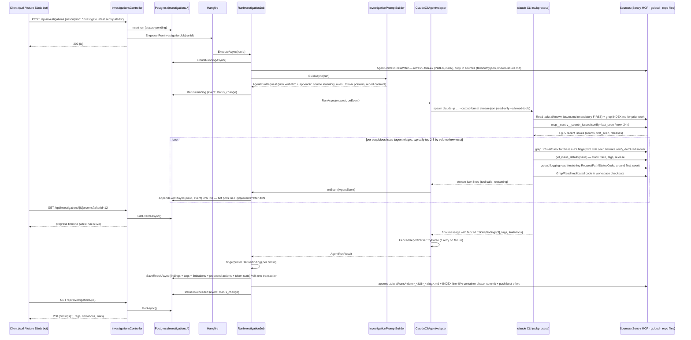

# FS-1111 — Runtime flow: broad ask ("investigate the latest Sentry alerts")

Traces one run end-to-end for a **broad, no-hints request** — the agent discovers its own targets (recent Sentry issues), triages them, investigates each, and the run yields *multiple* findings, some of which fingerprint-match prior investigations. The narrow case ("investigate issue PROD-API-1234") is the same flow minus the discovery loop.

What the diagram can't carry:

- **Triage is the agent's judgment, not code** — "latest alerts" → it decides how many issues are worth chasing within `MaxTurns`; typically one finding per root cause, several issues may collapse into one finding when they share a cause.
- **Already-investigated alerts surface two ways:** the agent's own grep over `.tofu-ai/` (known-issues first, then INDEX/runs by fingerprint) lets it *verify-not-rediscover*; and fingerprints persisted per finding make relatedness derivable at read time regardless of what the agent noticed.
- **Timeout/failure exits:** `RunTimeout` kills the subprocess → `timed_out` with partial events retained; parse failure after one retry or non-zero exit → `failed` with `error` populated. Both leave the events trail intact — never a 5xx to the caller.
- **`onEvent` ordering:** events are plain INSERTs; the identity `id` is the monotonic cursor backing the bot's incremental poll (`afterId`).
