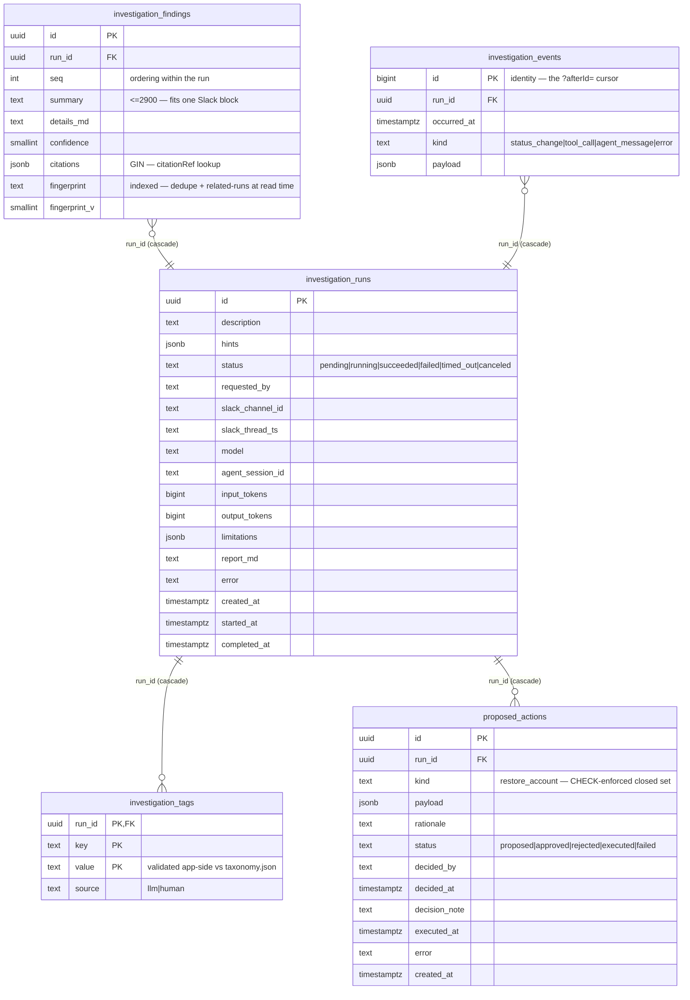

# FS-1111 — AI Investigation Service (design)

The **`Investigations` module inside `Tofu.AI.Backend`**: a REST API accepts a free-form natural-language ask ("checkout 500s spiked at 14:00 — why?"), a Hangfire job hands it to a **local Claude agent** (claude CLI, headless) with read-only access to **GCP Cloud Logging** (via `gcloud`), **Sentry** (via `sentry-mcp`), **source code** (local workspace checkouts + read-only git), and **MongoDB** (curated read tools via the in-house `Investigations.Mcp.Mongo` server — never raw queries). The run, its findings, and a tool-call timeline persist to **PostgreSQL** (Docker, named volume — survives restarts). Contracts are shaped for the real future consumer — a **Slack bot** — even though the API is the only Phase-1 entry point: async lifecycle, compact Slack-sized summary + expandable details, Slack correlation fields carried on the run.

This is the design source of truth. Companion docs:

| Doc | What |
|---|---|
| [`README.md`](./README.md) | feature plan + status + plan checklist |
| [`agent-context.md`](./agent-context.md) | the agent's `.tofu-ai/` knowledge tree + the files-vs-DB read path |
| [`impl-design.md`](./impl-design.md) / [`impl-interaction.md`](./impl-interaction.md) | abstraction surface (ports, class skeletons, DI) + runtime sequence |
| [`web-spike.md`](./web-spike.md) | the research backing every architecture choice below |
| [`sample-report-b88ad28f.md`](./sample-report-b88ad28f.md) | a real captured run |

Current-state service reference (kept in sync with the code): [`Backend/Services/Tofu.AI/Investigations.md`](../../Backend/Services/Tofu.AI/Investigations.md).

Related ClickUp: [FS-1111](https://app.clickup.com/t/FS-1111).

## Scope

**In scope (Phase 1):**

- New `Investigations` module in `Tofu.AI.Backend` (`src/Investigations/…`), mirroring the `Analyses` module layout.
- REST API: start, cancel, poll status/result, read the progress timeline, render a report, list/search runs, approve/reject proposed actions.
- **Free-form NL tasks, not only error RCA** — `description` is the instruction verbatim ("search logs for user X and tell me what failed", "what's account Y's subscription plan?"). The agent answers from whatever connected sources support the ask and reports parts that needed unconnected sources as `limitations`.
- Agent execution via the local `claude` CLI in headless mode (`-p` + `--output-format stream-json`), spawned per run by a Hangfire job.
- Four read-only sources: GCP Cloud Logging, Sentry, source code (workspace checkouts + read-only git), MongoDB (curated named tools).
- **Proposed actions (propose → approve → execute):** the agent can *propose* a closed set of write actions in its report (Phase 1: `restore_account`); a human approves via API and the **service** executes — the agent never holds write capability.
- Postgres persistence via the repo's module-migrations pattern; local DB in Docker with a persistent named volume.
- Slack-bot-ready contract shape (summary length budget, markdown details, channel/thread correlation fields).

**Out of scope (later phases):**

- The Slack bot itself (Phase 1 only keeps the contracts compatible).
- ClickUp / support tickets (P2), Stripe (P3), Amplitude (P4 — access not yet available; see web-spike).
- Containerized agent + production deploy (Phase 1 runs on the developer machine; the design keeps the seam — see [`agent-context.md`](./agent-context.md) for the container-phase plan).
- Write actions *executed by the agent* — it can only propose; execution happens in the service after human approval. Auth/permissions on the API (local-only — the API binds to localhost).
- Embeddings / similarity search over past investigations (web-spike: vector search is an enhancement, not a foundation).

## High-level approach

- **Module in `Tofu.AI.Backend`, not a new repo** — reuses the existing Hangfire-on-Postgres host (`src/Tofu.AI.Api/Hangfire/HangfireConfiguration.cs`), CI, telemetry, and the module conventions of `src/Analyses` (per-layer `DependencyInjection.cs`, options classes with `SectionName` consts, `ValidateOnStart`). Trade-off: couples deploy to FSM-fit — acceptable while the feature is experimental; the module boundary keeps a later repo-extraction cheap.
- **Agent runtime = a physically replaceable module.** `IInvestigationAgentPort` lives in Domain; the claude CLI adapter lives in its **own project** `Investigations.Agent.ClaudeCli`, selected by config (`Investigations:Agent:Type`, default `ClaudeCli`). The CLI already provides the tool loop, MCP client, Bash/Read/Grep tools, and parallel tool use — we write zero agent-loop code. Swapping runtimes later (Agent SDK, containerized CLI, MS Agent Framework) = a sibling `Investigations.Agent.<X>` project + one DI case; Application, Domain, API, and the DB schema don't change. The rule that makes this real: **no claude-specific type, format, or convention leaks past the adapter boundary** — stream-json parsing, `--allowed-tools` syntax, MCP config files, and session ids are all internal to `Investigations.Agent.ClaudeCli`; the port speaks only `AgentRunRequest` / `AgentEvent` / `AgentRunResult`.
- **Sources are the agent's tools, not pre-ingested** (web-spike Q2: live tool-calling for telemetry). Logs via `Bash(gcloud logging read …)` on the developer's gcloud auth; code via `Read`/`Grep`/`Glob` over the `C:\Git\Work\Backend` checkouts plus read-only git (`fetch`/`log`/`show`/`diff` — history for change↔spike correlation, `git show origin/<default>:<path>` for deployed-ref reads regardless of the dev's current branch; never `checkout`); Sentry via `sentry-mcp` stdio with a user auth token. The **container phase** swaps the dev workspace for a service-owned bare-clone cache (`git clone --bare` once per repo, incremental `git fetch` at run start) — never clone-per-run.
- **Mongo is curated, not free-form — the tool surface is the permission model.** Mongo access goes through a bespoke stdio MCP server (`Investigations.Mcp.Mongo`, official `ModelContextProtocol` C# SDK) exposing named, parameterized, projection-allowlisted read tools (`find_account`, `get_account_deletion_state`) — the agent physically cannot express any other operation, and PII-dense raw documents never reach the model. Second net: the server connects with a dedicated **read-only Mongo user**. Write capability stays out of the agent entirely (see Proposed actions); the executor uses a separate write-capable connection string whose Mongo user is scoped to `update` on the accounts collection only.
- **Knowledge the agent reads back = files, not queries.** Past runs, the INDEX, the closed tag vocabulary, and human-curated known-issues live as a greppable text tree in `WorkspaceRoot/.tofu-ai/`. The agent reads them with the `Read`/`Grep`/`Glob` tools it already has — Postgres stays the system of record, but the agent's *interface* to that knowledge is files. Full design in [`agent-context.md`](./agent-context.md).
- **Async-first contract because Slack is the real consumer**: investigations take ~1–2 min, far beyond Slack's 3-second ack window — so `POST` returns `202` immediately, the bot polls (or Phase 2 adds a callback), progress events let the bot stream "investigating… (checked logs, reading EstimatesController)" updates, and the finding's `summary` is budgeted to fit one Slack block.
- **No authorization in Phase 1** — the API binds to localhost. A simple API key lands with containerization; the permission-key story is deliberately deferred.
- **PII trade-off, recorded explicitly:** because the agent pulls tool results itself, the existing Presidio redaction port cannot intercept between source and model — log/Sentry payloads reach the Anthropic API unredacted. Accepted for Phase 1 (same class of data already flows to OpenAI in FSM-fit, and runs are developer-triggered); the Phase 2 fix is a thin MCP proxy applying field allowlists + Presidio per source. Until then the system prompt instructs the agent to never quote emails/PII into findings, and findings are the only artifact shown to Slack.

## Data model

Five tables in a new **`investigations` schema** in the same local Postgres database Hangfire uses, applied via the repo's module-migrations runner (`src/Analyses/Analyses.Infrastructure/Migrations/IModuleMigration.cs` pattern — raw SQL, ordered, idempotent; this repo deliberately has no EF). Relatedness between runs derives from `findings.fingerprint` at read time — there is no links table; the tag vocabulary and known-issues live as git-versioned text files, not tables (see [`agent-context.md`](./agent-context.md)).



### `investigation_runs`

The run aggregate. `status` is `text` (not `smallint`) — raw-SQL repo with no enum mapper, tiny row volume, human-debuggable; `CHECK (status IN ('pending','running','succeeded','failed','timed_out','canceled'))`. `hints` is optional steering (`sentryIssueId`, `requestPath`, `accountId`, time range) whose schema is owned by the prompt builder. `slack_channel_id` / `slack_thread_ts` are carried opaque for the future bot — the API never interprets them. `limitations` (`jsonb NOT NULL DEFAULT '[]'`) is the agent-reported list of ask-parts that needed unconnected sources ("subscription plan needs Stripe — Phase 3"); the bot renders these as ⚠️ so partial answers are never mistaken for complete ones. `report_md` is the rendered human artifact returned by the report endpoint. `input_tokens` / `output_tokens` give per-run cost accounting from day one. `agent_session_id` is the opaque session/trace id reported by whichever adapter ran (claude CLI session id in Phase 1) — lets a dev resume/inspect the transcript locally.

Indexes: `(status, created_at)` — the stale-run sweep and the bot's "anything in flight?" check; `(created_at DESC)` — the recent-runs list.

### `investigation_findings`

`summary` is the Slack-ready compact statement, `CHECK (length(summary) <= 2900)` — fits one Slack section block (3001-char limit) without bot-side truncation. `details_md` is the full markdown narrative. `confidence` is the agent-reported 0–100. `citations` (`jsonb`) are machine-readable evidence anchors `{kind: 'log-query'|'sentry-issue'|'code'|'commit', ref: …}` — what makes findings verifiable instead of vibes. `fingerprint` is the cross-run dedupe key (derivation below); `fingerprint_v` is the normalization-algorithm version, so a recipe change can re-fingerprint old rows instead of silently mismatching.

Indexes: `(run_id)`; `(fingerprint)` — the "same error, different investigation" lookup and the basis for derived related-runs; `GIN (citations jsonb_path_ops)` — exact-ref recall ("which past runs cite Sentry issue X / request path Y?").

### `investigation_tags`

Closed-vocabulary, multi-valued tags on the **run** (a run can carry `area:payments` *and* `area:invoices` — "arrays" are just multiple rows per key). `UNIQUE (run_id, key, value)`; `source` is `CHECK (source IN ('llm','human'))` so human corrections are distinguishable from agent guesses. The vocabulary itself lives in the git-versioned `taxonomy.json` source file, **not** a table — the job validates tags against it app-side at persist time and drops (and logs) anything outside it. Index: `(key, value)` for tag navigation and `GROUP BY` analytics.

Vocabulary seed (`taxonomy.json`, extend via PR): `area: payments|invoices|estimates|auth|notifications|pdf`, `kind: regression|config|data|infra|client-bug|question`, `source: gcp-logs|sentry|code|mixed`, `service: invoices-api|invoices-worker|tofu-invoices|tofu-auth|tofu-ai`.

### `investigation_events`

The progress timeline — what the Slack bot streams into the thread, and the local audit trail of every tool call (web-spike Q6: persist tool name/args/duration; modeled loosely on the OTel GenAI span vocabulary, which is still experimental, so the vocabulary lives in `kind` + `payload` rather than dedicated columns). `id` is a `bigint GENERATED ALWAYS AS IDENTITY` and doubles as the **monotonic per-run cursor** backing incremental polling — `GET /{id}/events?afterId=` — so there is no separate `seq` column or `MAX(seq)+1` subquery on the hot insert path. `kind` is `CHECK (kind IN ('status_change','tool_call','agent_message','error'))`. Index: `(run_id, id)`.

### `proposed_actions`

The propose → approve → execute write path. The agent proposes in its report; rows land as `proposed`; a human decides via API; the **service** executes. `kind` is a closed set — `CHECK (kind IN ('restore_account'))`; a new kind ships only together with its executor and a migration extending the CHECK. `payload` is kind-specific args (`{accountId, reason}`), schema owned by the executor and validated at persist time — a proposal with no registered executor or an invalid payload is dropped and logged, mirroring the tag rule. `status` is `CHECK (status IN ('proposed','approved','rejected','executed','failed'))`. `decision_note` records the approver's reason on reject.

Indexes: `(status, created_at)` — the pending-approval queue; `(run_id)`.

**Double-approval guard:** approve flips status via conditional `UPDATE … SET status='approved' WHERE id=@id AND status='proposed'` — a second concurrent approve sees 0 rows affected and the API returns `409`.

### Fingerprint derivation

Computed at persist time by the job (not trusted from the agent verbatim); priority order mirrors Sentry/Datadog — see web-spike fingerprinting section:

1. Finding cites a Sentry issue → fingerprint = `sentry:<issue-id>` verbatim — Sentry already did the grouping; never re-derive what it solved.
2. Agent reported a structured error (`error: {type, topFrame}` in the report JSON) → `sha256(error_type + top_in_app_frame)`.
3. Raw log message only → `sha256(normalized message)` using Datadog's published normalization: strip numbers, ids, dates, versions, and anything inside quotes or parentheses — only word-like tokens contribute.

### Migration

New SQL migration class `src/Investigations/Investigations.Infrastructure/Migrations/M0001_CreateInvestigationsSchema.cs` implementing `IModuleMigration`, registered with the module-migrations runner the same way the Analyses module registers its own. No `dotnet ef` — this repo runs migrations through `ModuleMigrationsRunner` at startup / via the `DatabaseUpdate` entry point (`src/Tofu.AI.Api/DatabaseUpdate.cs`).

### Local Postgres — persistent Docker container

`Tofu.AI.Backend` adds a `docker-compose.yml` at the repo root:

```yaml
services:
  postgres:
    image: postgres:16-alpine
    restart: unless-stopped
    ports:
      - "55433:5432"   # 55433 to avoid clashing with Tofu.Auth's local Postgres on 55432
    environment:
      POSTGRES_PASSWORD: postgres
      POSTGRES_DB: tofu_ai
    volumes:
      - tofu-ai-pgdata:/var/lib/postgresql/data

volumes:
  tofu-ai-pgdata:    # named volume — survives `docker compose down`, container recreation, and image upgrades
```

The named volume is the durability guarantee: `docker compose up -d postgres` after any restart reattaches the same data; **only `docker compose down -v` (never run it) or `docker volume rm` destroys it.** Connection strings via user-secrets in `src/Tofu.AI.Api`:

```powershell
dotnet user-secrets set "ConnectionStrings:Investigations" "Host=localhost;Port=55433;Username=postgres;Password=postgres;Database=tofu_ai"
# Hangfire (existing key) can point at the same server/database:
dotnet user-secrets set "ConnectionStrings:Analyses" "Host=localhost;Port=55433;Username=postgres;Password=postgres;Database=tofu_ai"
# Mongo, two separate users (least privilege):
#   read-only user → consumed by Investigations.Mcp.Mongo (the agent's read tools)
dotnet user-secrets set "ConnectionStrings:InvestigationsMongoRead" "<read-only-user connection string>"
#   write user scoped to update on the accounts collection only → consumed by RestoreAccountActionExecutor
dotnet user-secrets set "ConnectionStrings:InvestigationsMongoActions" "<restricted-write-user connection string>"
```

The separate `Investigations` connection-string key (even though it targets the same database) keeps the module extractable and lets the container phase split databases without code changes.

## Module layout

New module mirroring `src/Analyses` (the three Analyses-style layers plus the swappable agent-adapter project and the standalone MCP server; no Persistence project — repositories live in Infrastructure):

```
src/Investigations/
  Investigations.Domain/             ← entities, status machine, ports (incl. IInvestigationAgentPort, IProposedActionExecutor, IAgentContextWriter)
  Investigations.Application/        ← InvestigationService, ProposedActionService, RunInvestigationJob, InvestigationPromptBuilder, StaleRunSweep
  Investigations.Infrastructure/     ← Npgsql repositories, SQL migrations, options, action executors (Mongo), .tofu-ai context writer
  Investigations.Agent.ClaudeCli/    ← THE replaceable runtime module — everything claude-specific lives here
  Investigations.Mcp.Mongo/          ← curated Mongo MCP server (stdio console app) — the agent's only Mongo surface
```

Layer contracts, class skeletons, and DI wiring are in [`impl-design.md`](./impl-design.md); the runtime sequence is in [`impl-interaction.md`](./impl-interaction.md). The agent's read-time context (`.tofu-ai/`) is in [`agent-context.md`](./agent-context.md).

**Run lifecycle in brief:** the controller persists a `pending` run and enqueues the Hangfire job; the job refreshes `.tofu-ai/`, builds the prompt (task verbatim + a system appendix carrying the source inventory, read-only/no-PII rules, the report-JSON contract, and pointer lines into `.tofu-ai/`), transitions to `running`, invokes the agent port (events persisted as they stream), parses the fenced report, computes fingerprints, persists findings + tags + limitations + proposed actions in one transaction, appends the run's `.tofu-ai/` file + INDEX line, and sets the final status. `StaleRunSweep` runs once at host start to mark orphaned `running` rows `failed` and rebuild the tree. Concurrency is governed by `MaxConcurrentRuns` (default 1) checked in the job — queued runs simply wait as `pending`.

## Endpoints

```
POST /api/investigations                              → 202 {id, status}            # StartInvestigationRequest
POST /api/investigations/{id}/cancel?requestedBy=     → 200 {id, status}            # kills a pending/running agent; 404 unknown; no-op if terminal
GET  /api/investigations/{id}                         → 200 run + findings + proposed actions
GET  /api/investigations/{id}/events?afterId=&limit=  → 200 progress timeline (paged by the id cursor)
GET  /api/investigations/{id}/report?format=slack     → 200 text/plain              # default = rich markdown; ?format=slack = compact mrkdwn
GET  /api/investigations?limit=&citationRef=&tag=     → 200 recent runs             # tag repeatable, ANDed; free-text search = grep the .tofu-ai tree

GET  /api/investigations/actions?status=&limit=       → 200 approval queue          # status default 'proposed'; 'all' for everything
POST /api/investigations/actions/{actionId}/approve   → 200 dto; body {decidedBy};        409 if already decided
POST /api/investigations/actions/{actionId}/reject    → 200 dto; body {decidedBy, note?}; 409 if already decided
```

- **Approve executes synchronously in the request** (a restore is one Mongo update — no job needed); executor failure → action `failed` with `error`, returned in the response body, never a 5xx.
- **`citationRef` is the "have we seen this before?" surface** — the Slack bot checks here before starting a new run, and answers repeat questions from history for free. There is no full-text `q=` param: free-text recall is the agent grepping the `.tofu-ai/` tree, not a SQL query.
- **No known-issues endpoints.** `known-issues.md` is a git-versioned source file curated via PRs in the knowledge repo, not an API resource.
- **Module disabled** (`Investigations:Enabled = false`) → every endpoint returns `503` — the routes exist but the machinery (workspace, claude CLI) isn't configured.

### DTOs

```csharp
public sealed record StartInvestigationRequest
{
    public required string Description { get; init; }
    public InvestigationHintsDto? Hints { get; init; }
    public string? RequestedBy { get; init; }
    public SlackContextDto? Slack { get; init; }      // opaque passthrough for the future bot
}

public sealed record InvestigationHintsDto
{
    public string? SentryIssueId { get; init; }
    public string? RequestPath { get; init; }         // e.g. "/api/data/typed/bookCall"
    public string? AccountId { get; init; }
    public DateTimeOffset? FromUtc { get; init; }
    public DateTimeOffset? ToUtc { get; init; }
}

public sealed record SlackContextDto
{
    public required string ChannelId { get; init; }
    public string? ThreadTs { get; init; }
}

public sealed record InvestigationStartedDto             // POST + cancel responses
{
    public required Guid Id { get; init; }
    public required string Status { get; init; }
}

public sealed record InvestigationRunDto
{
    public required Guid Id { get; init; }
    public required string Status { get; init; }      // pending|running|succeeded|failed|timed_out|canceled
    public required string Description { get; init; }
    public string? RequestedBy { get; init; }
    public string? Error { get; init; }
    public required DateTimeOffset CreatedAt { get; init; }
    public DateTimeOffset? CompletedAt { get; init; }
    public IReadOnlyList<InvestigationFindingDto> Findings { get; init; } = [];
    public IReadOnlyList<string> Limitations { get; init; } = [];  // parts of the ask that needed unconnected sources
    public IReadOnlyDictionary<string, IReadOnlyList<string>> Tags { get; init; } =
        new Dictionary<string, IReadOnlyList<string>>();           // multi-valued: {"area":["payments","invoices"]}
    public IReadOnlyList<ProposedActionDto> ProposedActions { get; init; } = [];  // loaded only on single-run GET, like findings
}

public sealed record ProposedActionDto
{
    public required Guid Id { get; init; }
    public required Guid RunId { get; init; }
    public required string Kind { get; init; }        // restore_account (closed set)
    public required JsonElement Payload { get; init; }
    public string? Rationale { get; init; }
    public required string Status { get; init; }      // proposed|approved|rejected|executed|failed
    public string? DecidedBy { get; init; }
    public DateTimeOffset? DecidedAt { get; init; }
    public string? DecisionNote { get; init; }
    public DateTimeOffset? ExecutedAt { get; init; }
    public string? Error { get; init; }
    public required DateTimeOffset CreatedAt { get; init; }
}

public sealed record DecideActionRequest              // approve / reject body
{
    public string? DecidedBy { get; init; }           // defaults to "api"
    public string? Note { get; init; }                // reject reason → decision_note
}

public sealed record InvestigationFindingDto
{
    public required string Summary { get; init; }     // ≤2900 chars, Slack-block-safe
    public string? DetailsMd { get; init; }
    public int? Confidence { get; init; }
    public required IReadOnlyList<CitationDto> Citations { get; init; }
}

public sealed record CitationDto
{
    public required string Kind { get; init; }        // log-query | sentry-issue | code | commit
    public required string Ref { get; init; }         // LQL filter, SENTRY-123, File.cs:42, sha
}

public sealed record InvestigationEventDto
{
    public required long Id { get; init; }            // the ?afterId= cursor
    public required DateTimeOffset OccurredAt { get; init; }
    public required string Kind { get; init; }        // status_change | tool_call | agent_message | error
    public required JsonElement Payload { get; init; }
}
```

### Validation and errors

- `Description` required, non-whitespace after trim, ≤ 4000 chars → `400` ProblemDetails.
- `Hints.FromUtc > ToUtc` → `400`.
- Unknown id on `GET` / `cancel` → `404`.
- `POST` while `MaxConcurrentRuns` are already `running` → still `202` — the run queues as `pending`; the bot reads queue position from the list endpoint. Rejecting would push retry logic into every client.
- Agent process exit ≠ 0, unparseable final report after one retry, or timeout → run `failed`/`timed_out` with `error` populated; never a 5xx at the API (the failure is the run's state, not the request's).

## Lifecycle

| Trigger | Behaviour |
|---|---|
| Service restarts while runs are `running` | `StaleRunSweep` marks them `failed` (`"orphaned by service restart"`) at host start — no zombie runs |
| Run exceeds `RunTimeout` | agent process killed, run → `timed_out`, partial events retained (already persisted) |
| Run canceled (`POST /{id}/cancel`) | agent killed mid-flight, run → `canceled`; terminal runs are a no-op |
| Run deleted (manual SQL only — no DELETE endpoint) | findings + events + tags + actions cascade via FK |
| Postgres container restarted / recreated / upgraded | data intact via the `tofu-ai-pgdata` named volume; only `down -v` / `volume rm` destroys it |
| `claude` CLI missing or `ANTHROPIC_API_KEY` unset | fail fast at startup via options validation + a startup probe |
| Agent proposes an action with unknown `kind` / invalid payload | dropped + logged at persist time (mirrors the tag rule) — run still succeeds |
| Approve called twice / on a decided action | conditional `UPDATE … WHERE status='proposed'` → second caller gets `409` |
| Executor fails (account not found / not soft-deleted / Mongo error) | action → `failed` with `error`; run untouched; re-propose requires a new investigation (no retry endpoint in Phase 1) |

## Docs to update

- [x] `Local.Docs/Backend/Storage/` — `investigations.*` tables added to [`postgres.md`](../../Backend/Storage/postgres.md) + index row.
- [x] `Local.Docs/Backend/Services/Tofu.AI/Investigations.md` — current-state service reference.
- [ ] `Tofu.AI.Backend/README.md` — local-run section: `docker compose up -d postgres`, user-secrets (incl. the two Mongo connection strings), `claude` CLI prerequisites, Mongo user provisioning (read-only + accounts-update-only).
