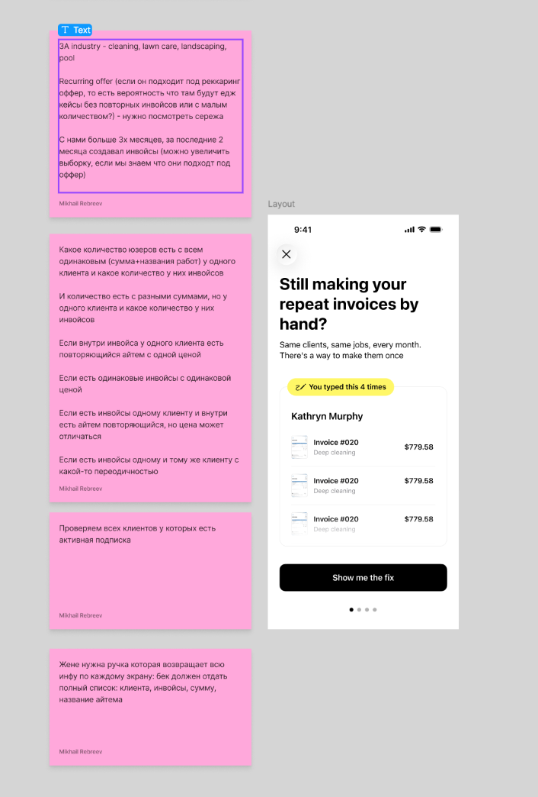

# FS-1241 — Backend для рекуррентного оффера

**Status:** planning
**Started:** 2026-06-23
**ClickUp:** https://app.clickup.com/t/FS-1241
**Affected repos:** _<list once known>_

## Goal

Нужно подготовить бекенд часть для фронта. Жене нужна ручка которая возвращает всю инфу по каждому экрану: бек должен отдать полный список: клиента, инвойсы, сумму, название айтема и список кому показываем экраны.

Что нужно сделать:
- Выборка пользователей по которым будет показываться реккурентный оффер:
  - 3A industry - cleaning, lawn care, landscaping, pool
  - Проверить по всем активным подпискам доступность реккаринг оффера
  - Проверить адекватность определения реккаринг оффера от llm
  - Если пользователь подходит под реккаринг оффер, то какая доля будет иметь жесткие едж кейсы, например всего 1 клиент с реккарингом или всего 2 инвойса.
- Исходя из этого нужно сделать выборку с сильным фитом по реккурентам. У пользователя есть клиент как минимум с 3-4 реккурентными инвойсами (чем больше тем лучше фит), у пользователя есть как минимум 2 клиента, которые имеют реккурентные инвойсы (чем больше тем лучше фит)
- Нужно дать доступ на 2 месяца по текущей подписке пользователя - выдаем Team тариф
- Понять как трекать этих пользователей в амплитуде

Проверим рекуррентность в разных комбинациях:
- Какое количество юзеров есть с всем одинаковым (сумма+названия работ) у одного клиента и какое количество у них инвойсов
- Какое количество юзеров есть с разными суммами, но у одного клиента и какое количество у них инвойсов
- Если внутри инвойса у одного клиента есть повторяющийся айтем с одной ценой
- Если есть одинаковые инвойсы с одинаковой ценой
- Если есть инвойсы одному клиенту и внутри есть айтем повторяющийся, но цена может отличаться
- Если есть инвойсы одному и тому же клиенту с какой-то периодичностью

Идеальный фит: одинаковая цена инвойса + одинаковый айтем + один клиент + повторяется N раз.

## Design



### Макет экрана (carousel, 4 экрана)

Экран оффера (из борда, секция «Layout»):

- Заголовок: **«Still making your repeat invoices by hand?»**
- Подзаголовок: «Same clients, same jobs, every month. There's a way to make them once»
- Бейдж: «✍ You typed this 4 times» (счётчик повторов)
- Клиент: **Kathryn Murphy**
- Список инвойсов (повторяющиеся): `Invoice #020` · `Deep cleaning` · `$779.58` ×3
- CTA: **«Show me the fix»**
- 4 точки пагинации → ручка должна отдать данные **по каждому экрану** карусели.

То есть на одном экране бек отдаёт: клиента, список его повторяющихся инвойсов, сумму каждого, название айтема (work), и счётчик повторов.

### Критерии выборки (стикеры с борда, дословно)

- 3A industry - cleaning, lawn care, landscaping, pool
- Recurring offer (если он подходит под реккаринг оффер, то есть вероятность что там будут едж кейсы без повторных инвойсов или с малым количеством?) - нужно посмотреть сережа
- С нами больше 3х месяцев, за последние 2 месяца создавал инвойсы (можно увеличить выборку, если мы знаем что они подходят под оффер)
- Проверяем всех клиентов у которых есть активная подписка
- Жене нужна ручка которая возвращает всю инфу по каждому экрану: бек должен отдать полный список: клиента, инвойсы, сумму, название айтема

## Scope

- In scope:
- Out of scope:

## Affected repos

For each repo touched, list the area and (if multi-repo) its role.

- `Tofu.Invoices.Backend` (producer) — _e.g., new gRPC method, repository, domain change_
- `Invoices.Backend` (consumer / BFF) — _e.g., new controller endpoint that calls the new gRPC method_
- (others as needed)

**Cross-repo notes:**
- Producer / consumer order: _producer ships first; consumer references new contract after producer is deployed._
- Contract changes: _list any .proto or shared DTO changes; mark additive vs breaking._
- Mapper updates: _which `Mapping/Mapper.cs` arms need new entries._

## Plan

Numbered, repo-scoped steps that can be ticked off during implementation.

1. [ ] …
2. [ ] …

## API / DTO changes

### `RecurringPatternDto.monthlyAmount` — расчётное ежемесячное значение

Поле добавлено во все слои цепочки:

```
build_recurring_offer_cohort.sql  →  proto RecurringGroup.monthly_amount (field 8)
  →  RecurringOfferGroup.MonthlyAmount  (Tofu.AI.Backend domain)
  →  RecurringPattern.MonthlyAmount     (Invoices.Backend domain)
  →  RecurringPatternDto.monthlyAmount  (BFF REST response, camelCase)
```

**Формула:**

```
monthlyAmount = invoiceAmount × multiplier
```

| Cadence bucket | avg_gap_days | Multiplier |
|----------------|-------------|------------|
| `week`         | < 11 дней   | × 4        |
| `2weeks`       | < 22 дней   | × 2        |
| `month`        | ≥ 22 дней   | × 1        |

Используется тот же `cadence`-бакет, что уже вычислен в `recurring_offer_groups`, поэтому `monthlyAmount` и `cadence` всегда согласованы. Значение не округляется — тип `double` в proto / `decimal` в C#.

## Breaking changes

<list anything that could break consumers (other repos, mobile clients, third-party API users) — proto field renumbering, removed/renamed REST endpoints, narrowed types, new required fields, dropped DB columns, changed event payloads, etc. If purely additive, write `None — additive only` so the explicit check is recorded. The `/feature review` op will re-audit this against the actual diff.>

## Data / migration

<only if applicable — new collections, indexes, migrations>

## Open questions

- [ ] …

## Test plan

- Unit tests:
- Integration tests:
- Manual verification:
