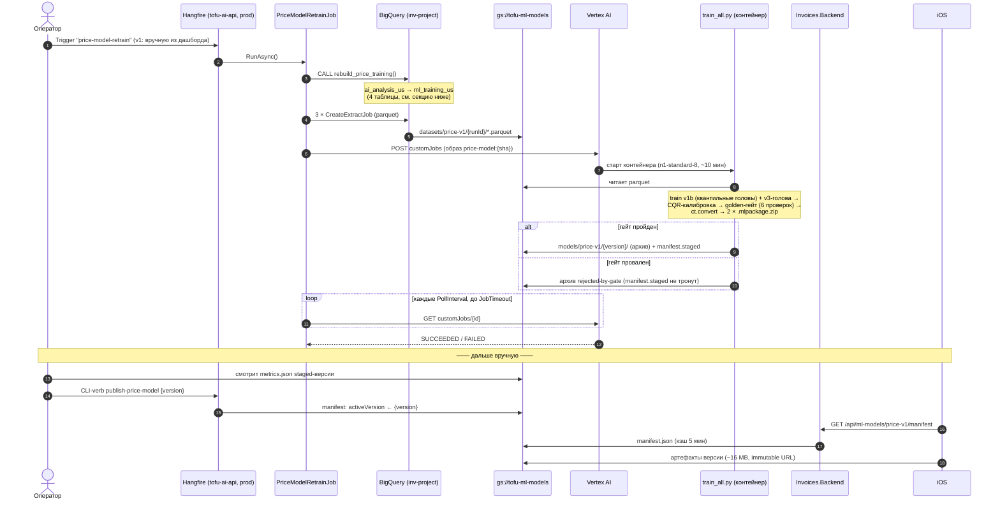

# FS-1335 — Подсказка цены позиции по названию + гео (on-device ML)

**Status:** implementation (Python-пайплайн готов; .NET-часть — дизайн одобряется)
**Started:** 2026-07-01 · **ClickUp:** https://app.clickup.com/t/FS-1335
**Repos:** `Tofu.AI.Backend` (данные + обучение + дистрибуция, ветка `feature/FS-1335`), `Invoices.Backend` (BFF manifest-endpoint), iOS (инференс — отдельный тикет)

Малая ML-модель: свободнотекстовое название позиции + штат клиента (US-only) → примерная цена за единицу (p25/p50/p75). Учится на наших инвойсах, конвертируется в Core ML, инференс on-device в iOS; дистрибуция — версионированные артефакты в GCS + manifest. Первая из трёх ценовых моделей — пайплайн переиспользуемый.

**Документы:** [`explainer-for-newbies.md`](explainer-for-newbies.md) — модель для читателя без ML-бэкграунда; [`explainer-pipeline.md`](explainer-pipeline.md) — система вокруг неё: каждая таблица и каждый шаг пайплайна, тоже для новичка; [`research/`](research/) — исследовательский след (аудит данных, итерации модели, внешняя валидация, Core ML, Vertex-автоматизация, детальный дизайн .NET-части). Реорганизация 2026-07-06: бывшие `overview.md` и полный план свёрнуты в этот README; упоминания `overview.md` в research-доках читать как «этот README».

## Ключевые решения (актуальное состояние)

- **Модель — каскад** (`research/research-prototype.md`): словарная ветка v1b → OOV-гибрид (kNN по potion-эмбеддингам при sim ≥ 0.7, иначе v3-голова) → suppress-имена молчат. Рецепт v1b (раунд 4, 2026-07-06): точечная модель best-of-5 рестартов + **замороженная база с offset-головами p25/p75** (p50 не может деградировать по построению; лечит сид-шум ±0.03, вскрытый пайплайном). Интервалы калибруются CQR. Замеры на prod-данных: shown p50 MdAPE **0.473** (lookup 0.500), внешняя валидация **93.0%** из 143 имён, гео 4/4, kNN-пробы 91.4%.
- **Данные**: prod `ai_analysis_us` → рутины материализуют `inv-project:ml_training_us` (`src_price_line_items` / `dim_price_names` с suppress-флагами / `mart_price_rows_*`); фильтры и state-регэксп — `research/research-data-audit.md`. Один датасет на все ML-задачи, задача = префикс таблиц.
- **Всё в prod** (ревизия 2026-07-06): материализация, parquet-extract и Vertex CustomJob живут в `inv-project` под `tofu-ai-backend@inv-project` — ноль кросс-проектных грантов; ~10 мин CPU за эпизод ≠ benchmark-workload. IAM закрыт полностью (project-level `serviceAccountUser` выдан админом).
- **Дистрибуция**: `gs://tofu-ml-models/models/price-v1/` — иммутабельные версии + единственный мутируемый `manifest.json`; publish/rollback = ручной флип указателя. iOS качает ~16 MB (v1b.mlpackage 0.6 MB + oov_head 35 KB + potion-таблица 15 MB + контракты `vocab.json`/`feature_spec.json`).
- **Словари и препроцессинг вне графа**: int-входы (StringLookup ломает Core ML-конверт); нормализация имени, potion-токенизация, kNN и роутинг каскада — в Swift по контрактам из архива. Пин конверта: `tensorflow-cpu==2.21.0` + `coremltools==9.0` (`research/research-coreml.md`).
- **Retraining v1 — ручной** (триггер из Hangfire-дашборда), golden-гейт (6 проверок) отклоняет регрессию автоматически; публикация всегда отдельным ручным шагом после просмотра метрик.

## Поток целиком: данные → джобы → обучение → публикация → iOS

Повторный запуск безопасен: версии иммутабельны (новый runId/version), `DisableConcurrentExecution` держит один тик; откат = тот же verb с прошлой версией; rejected-архивы остаются для форензики.

## Таблицы BigQuery (`inv-project:ml_training_us`)

Один датасет на все ML-training-задачи; задача = префикс таблиц (`price_*`), слой-префикс — как в warehouse (`src_/dim_/mart_`). Строятся SQL-рутинами `build_price_*` (папка Routines в `Analyses.Infrastructure`, деплой существующим `bigquery-routines`-модулем), оркестратор `rebuild_price_training()` вызывается **только** retraining-джобом — в ежедневный `rebuild_warehouse` эти таблицы не входят. Все — `CREATE OR REPLACE` (снапшот-семантика, история не хранится: provenance активной модели = parquet-выгрузка под её `runId`).

| Таблица | Как строится | Кем используется |
|---|---|---|
| `src_price_line_items` (~5.5M) | из `ai_analysis_us.mart_invoice_line_items` ⋈ `src_clients` (нормализованные ключи); фильтры: имя+цена>0, 2018+, USD, у клиента есть адрес; state извлекается регэксп-каскадом из адреса | вход для двух таблиц ниже; напрямую в обучение не идёт |
| `dim_price_names` (~6k) | агрегат по `src_…`: имена с n≥30 и порогом по аккаунтам; медиана, p25/p75, `suppress = rel_iqr > 2.0` | → `vocab.json` артефакта (словарь + suppress-флаги); словарная ветка v1b; пул kNN |
| `mart_price_rows_vocab` (~0.9M) | строки `src_…` со словарными именами + извлечённым штатом | обучение словарной ветки v1b + CQR-калибровка |
| `mart_price_rows_text` (~3.7M) | все строки `src_…` с извлечённым штатом (включая OOV-имена) | обучение v3 OOV-головы |

Дальше таблицы уезжают parquet-выгрузкой в `gs://tofu-ml-models/datasets/price-v1/{runId}/` — контейнер обучения читает файлы, не BQ (почему так — `research/impl-design.md`, секция про parquet). Test-двойник датасета в `invoicesapp-project-test` — песочница прототипа с v0-снапшотом от 2026-07-03.

## План имплементации

1. [x] **Python-пайплайн** — `Tofu.AI.Backend/ml/price_model/`: `train_all.py` (load parquet → v1b-квантили → v3 → CQR → гейт → ct.convert → архив + staged-manifest), Dockerfile с пинами, golden-сеты как данные пакета. Дважды прогнан end-to-end (2026-07-06), GATE PASS, архив с обоими mlpackage.
2. [x] **.NET в Tofu.AI.Backend** — **реализовано 2026-07-06** по дизайну [`research/impl-design.md`](research/impl-design.md), `dotnet build` зелёный:
   - 4 SQL-рутины `build_price_*` + `rebuild_price_training` (порты в Domain, токен `{ml_dataset}` в деплоере; в `rebuild_warehouse` НЕ входят). **Задеплоены на prod и отработали** — `ml_training_us` материализован (5.50M/6,095/914K/3.72M; T3-ярус state-регэкспа отклонён гейтом, оставлен T1→T2).
   - Порты + адаптеры: `IPriceTrainingDataExporter`, `IVertexCustomJobClient` (raw REST), `IPriceModelManifestStore`; `PriceModelRetrainJob` (в дашборде всегда, при `Enabled=false` — с never-кроном для ручного триггера); CLI-verb `publish-price-model <version>`.
   - **Prod-смоук без Vertex-ноги пройден**: materialize → extract (`datasets/price-v1/20260706_smoke2/`) → обучение (WSL, тот же код, что поедет в контейнер) → **GATE PASS** → staged-версия `2026-07-06_smoke2b` в бакете. Гейт по пути дважды отработал боевым образом (T3-шум, сид-нестабильность).
3. [ ] **Vertex-нога смоука**: ждёт образ в registry. Решение — workflow **`publish-price-model.yaml`** (добавлен 2026-07-06): `workflow_dispatch` → WIF-auth (те же секреты, что deploy) → build `ml/price_model` → пуш `gcr.io/<project>/price-model:{latest,sha}` под CI-SA (`createOnPushWriter` — личный AR-грант не нужен). Nuance: dispatch доступен после попадания файла в default-ветку (develop). После пуша: `Analyses:PriceModel:ContainerImage` (+`VertexServiceAccount`) в prod-секрет → сабмит CustomJob.
4. [ ] **BFF manifest-endpoint** (`Invoices.Backend`): `GET /api/ml-models/{modelName}/manifest` (api-version 3.0, `MlModelsController : BaseController`), `IMlModelManifestService` читает manifest из GCS через существующий `GoogleBlobStorage`, `IMemoryCache` TTL 5 мин + stale-while-error; DTO: modelName/version/urls/sha256/sizeBytes/minAppVersion. Артефакты — публичные immutable URL (signed URLs отвергнуты: TTL ≤ 7 дней ломает кэшируемость; в модели нет PII).
5. [x] **CI образа**, два workflow (общий composite-экшен не подошёл — зашит на корневой Dockerfile и multi-stage `--target production`):
   - `publish-price-model.yaml` — основной, `workflow_dispatch` (доступен после мержа в develop), тег `{latest, sha}`;
   - `publish-price-model-dev.yaml` — **пре-мерж тест**: триггер git-тегом `price-model-dev-*` (паттерн `publish-client.yaml` из Tofu.Invoices — работает с любого коммита, включая feature-ветки: `git tag price-model-dev-1 && git push origin price-model-dev-1`) + `workflow_dispatch` (кнопка появится после мержа). Пушит в prod-registry теги `{dev-N, dev-shortsha}`, без latest.
6. [ ] **macOS-парити** predictions mlpackage vs Python (iOS-разработчик; критерий < 0.5% на ценах) + Swift-препроцессинг парити по контрактам.
7. [ ] **iOS-тикет** по контракту `feature_spec.json`/`vocab.json` (загрузка, компиляция MLModel, роутер каскада, bundled baseline).

## Lifecycle (сжатая)

| Событие | Поведение |
|---|---|
| Retrain (ручной триггер) | materialize → extract → Vertex-джоб: train+CQR+гейт+convert → staged-версия в GCS; `activeVersion` не тронут |
| Гейт провален | архив уезжает как `rejected-by-gate` (форензика), manifest.staged не меняется, джоб failed |
| Publish / rollback | CLI-verb флипает `activeVersion` (прошлая — в `history[]`); iOS подхватывает через BFF (кэш ≤ 5 мин) |
| Смена контракта входов | новый version + bump `minAppVersion`; старые клиенты остаются на bundled/последней совместимой |

## Open questions

- [ ] State-регэксп из ad-hoc SQL аудита переезжает в `build_price_line_items.sql` как единственный источник правды; та же спека нужна Swift (уедет в `feature_spec.json`).
- [ ] iOS/QA-сабтиски в ClickUp — уточнить у команды.
