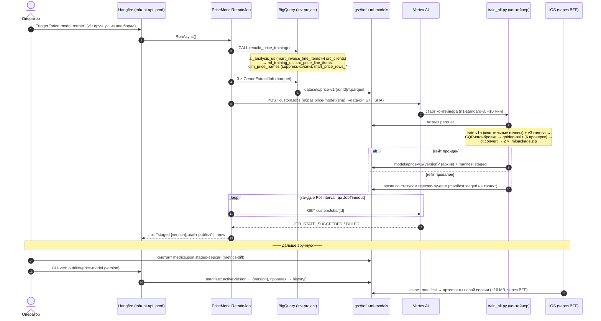

# FS-1335 — Retraining pipeline, .NET-часть (implementation design)

Дизайн шагов 2–4 плана [`research-vertex-automation.md`](research-vertex-automation.md) в `Tofu.AI.Backend` (ветка `feature/FS-1335`): SQL-рутины материализации training-датасета, BQ→GCS parquet-extract, Hangfire-джоб сабмита Vertex CustomJob с мониторингом, ручная публикация staged-манифеста. Python-контейнер (`ml/price_model/`, шаг 1) уже в ветке — этот док его не трогает. **Scope guardrail:** фильтры/пороги датасета (USD, 2018+, n≥30, suppress rel-IQR≥2.0) зафиксированы в `research-data-audit.md`; роутинг/гейт модели — в `research-prototype.md`. Здесь — только .NET-обвязка.

**Source of plan:** `research-vertex-automation.md` (пайплайн + пререквизиты, все закрыты) + промпт.

## Decision

- **Всё в prod по ревизии 2026-07-06**: рутины читают `{project}.{dataset}` (= `ai_analysis_us`) и пишут в `{project}.{ml_dataset}` (= `ml_training_us`), Vertex CustomJob сабмитится в тот же проект. Один SA (`tofu-ai-backend@inv-project`), гранты закрыты.
- **4 новые SQL-рутины** кладутся в существующую папку `Analyses.Infrastructure/Warehouse/Sql/Routines/` — подхватываются существующим glob'ом csproj и деплоятся существующим модулем `bigquery-routines` без нового кода деплоя. Порядок ordinal-сортировки корректен из коробки: `build_price_*` < `rebuild_price_training`.
- **`BigQueryRoutineDeployer.Render` получает третий токен `{ml_dataset}`** (BigQueryRoutineDeployer.cs:92-94) — первый настоящий кросс-датасетный таргет; альтернатива (второй экземпляр деплоера на датасет) отвергнута как дублирование механизма ради одной строки.
- **`rebuild_price_training()` НЕ включается в `rebuild_warehouse`** — другая каденция: warehouse ребилдится на каждый снапшот, training-датасет материализуется только при retraining (вызов `CALL` из Hangfire-джоба). Это осознанное отличие от паттерна «две строки в rebuild_warehouse.sql» из ранней версии overview.md.
- **Vertex CustomJob — raw REST через `HttpClient` + `ITokenAccess`**, зеркалит `VertexFsmFitClient.cs:28,64,77` (bearer per request от `BuildVertexCredential`). NuGet `Google.Cloud.AIPlatform.V1` НЕ добавляем: у нас 2 вызова (POST customJobs, GET status) — SDK ради них не окупается, а паттерн raw-REST-Vertex в репо уже есть.
- **`PriceModelRetrainJob` — sealed POCO по форме `AnalyzeFsmFitJob`** (`[AutomaticRetry(Attempts = 0)]`, `[DisableConcurrentExecution]`), `Enabled=false` по умолчанию → регистрируется через `RegisterAnalysesRecurringJobs`-паттерн (AddOrUpdate/RemoveIfExists), запуск в v1 — ручной триггер из Hangfire-дашборда. Последовательность внутри одного `RunAsync`: `CALL rebuild_price_training()` → extract 3 таблиц в `gs://tofu-ml-models/datasets/price-v1/{runId}/` → submit CustomJob → поллинг статуса до терминального (джоб живёт ~10 мин, отдельный монитор-джоб не нужен).
- **Extract — `BigQueryClient.CreateExtractJob`** (клиент уже singleton в DI) в parquet, по одному префиксу на таблицу; `runId = {yyyyMMdd_HHmmss}_{gitSha}`, `GIT_SHA` берётся из тега образа контейнера (передаётся в env CustomJob'а).
- **Публикация — новый CLI-verb `publish-price-model <version>`** в диспетчере `DatabaseUpdate.cs` (прецедент «ручного действия» = `migrate`); контроллер/endpoint отвергнут — у API нет auth-слоя, а публикация должна остаться оператором. Verb читает manifest из GCS, проверяет `staged.version == <version>` и `status == "staged"`, переносит в `activeVersion`, прошлую активную версию складывает в `history[]`.
- **Порты в Application, реализации в Infrastructure** (направление ссылок уже такое: `VertexFsmFitClient : IFsmFitLlmClient`). Единый options-класс `PriceModelOptions` в Application, секция `Analyses:PriceModel`, `Enabled=false` по умолчанию.

Всё ниже — поддерживающая детализация.

## Code layout

```
src/Analyses/Analyses.Infrastructure/
  Warehouse/Sql/Routines/
    build_price_line_items.sql        # NEW  src_price_line_items: mart_invoice_line_items ⋈ src_clients (норм. ключи), фильтры USD/2018+/адрес, state-регэксп
    build_price_name_vocab.sql        # NEW  dim_price_names: имена n≥30 & accounts≥порог, median_price, suppress (rel IQR ≥ 2.0)
    build_price_training_rows.sql     # NEW  mart_price_rows_vocab (словарные) + mart_price_rows_text (все с извлечённым штатом)
    rebuild_price_training.sql        # NEW  оркестратор: CALL трёх build_price_* по порядку зависимостей
  Warehouse/BigQueryRoutineDeployer.cs  # MODIFIED  Render(): + .Replace("{ml_dataset}", options.MlDatasetId)
  PriceModel/
    PriceTrainingDataExporter.cs      # NEW  IPriceTrainingDataExporter: CALL rebuild + CreateExtractJob×3 → gs://…/datasets/price-v1/{runId}/
    VertexCustomJobClient.cs          # NEW  IVertexCustomJobClient: POST customJobs / GET status (raw REST, ITokenAccess)
    PriceModelManifestStore.cs        # NEW  IPriceModelManifestStore: чтение/публикация manifest.json (StorageClient)
  BigQuery/BigQueryOptions.cs         # MODIFIED  + MlDatasetId (default "ml_training_us") — токен рендера живёт рядом с {project}/{dataset}
  DependencyInjection.cs              # MODIFIED  AddPriceModelServices(): exporter, vertex client (typed HttpClient), manifest store

src/Analyses/Analyses.Application/
  PriceModel/
    IPriceTrainingDataExporter.cs     # NEW  порт: MaterializeAndExportAsync(runId) → PriceTrainingExtract
    IVertexCustomJobClient.cs         # NEW  порт: SubmitAsync(spec) → jobName; GetStateAsync(jobName)
    IPriceModelManifestStore.cs       # NEW  порт: GetAsync(); PublishAsync(version)
    PriceModelOptions.cs              # NEW  секция Analyses:PriceModel: Enabled, Cadence, Bucket, префиксы, образ, machine type, SA, поллинг
  Jobs/PriceModelRetrainJob.cs        # NEW  оркестрация RunAsync: materialize+extract → submit → poll → лог вердикта гейта
  DependencyInjection.cs              # MODIFIED  Configure<PriceModelOptions>, AddScoped<PriceModelRetrainJob>, регистрация recurring job (Enabled-gate)

Tofu.AI.Api/
  DatabaseUpdate.cs                   # MODIFIED  + verb "publish-price-model <version>" → IPriceModelManifestStore.PublishAsync
  appsettings.json                    # MODIFIED  + секция Analyses:PriceModel (Enabled=false)
```

Ключевой шов: `PriceModelRetrainJob` (Application) оркестрирует три порта; вся GCP-специфика (BQ extract, Vertex REST, GCS manifest) — за портами в Infrastructure. SQL-рутины — данные для существующего деплоера, нового механизма деплоя нет.

## Contracts

```csharp
// Analyses.Application/PriceModel/IPriceTrainingDataExporter.cs
public interface IPriceTrainingDataExporter
{
    /// CALL rebuild_price_training() + extract 3 таблиц в parquet под {runId}
    Task<PriceTrainingExtract> MaterializeAndExportAsync(string runId, CancellationToken ct);
}

public sealed record PriceTrainingExtract(string DataDirGsUri, string SnapshotDate);

// Analyses.Application/PriceModel/IVertexCustomJobClient.cs
public interface IVertexCustomJobClient
{
    Task<string> SubmitAsync(VertexCustomJobSpec spec, CancellationToken ct); // → полное имя job'а
    Task<VertexJobState> GetStateAsync(string jobName, CancellationToken ct);
}

public sealed record VertexCustomJobSpec(
    string DisplayName,
    IReadOnlyList<string> Args,                 // --data-dir …, --trained-on …
    IReadOnlyDictionary<string, string> Env);   // GIT_SHA

public enum VertexJobState { Pending, Running, Succeeded, Failed, Cancelled }

// Analyses.Application/PriceModel/IPriceModelManifestStore.cs
public interface IPriceModelManifestStore
{
    Task<PriceModelManifest?> GetAsync(CancellationToken ct);
    /// Проверяет staged.version == version && status == "staged", переносит в activeVersion
    Task PublishAsync(string version, CancellationToken ct);
}

public sealed record PriceModelManifest(string? ActiveVersion, PriceModelStagedVersion? Staged);
public sealed record PriceModelStagedVersion(string Version, string Status, string TrainedOn);

// Analyses.Application/PriceModel/PriceModelOptions.cs
public sealed class PriceModelOptions
{
    public const string SectionName = "Analyses:PriceModel";
    public bool Enabled { get; init; }                       // false: v1 = ручной триггер
    public string Cadence { get; init; } = "0 4 1 * *";      // заглушка; включается флагом
    public string Bucket { get; init; } = "tofu-ml-models";
    public string DatasetPrefix { get; init; } = "datasets/price-v1";
    public string ModelPrefix { get; init; } = "models/price-v1";
    public string ContainerImage { get; init; } = "";        // gcr.io/…/price-model:{sha}
    public string VertexLocation { get; init; } = "us-central1";
    public string MachineType { get; init; } = "n1-standard-8";
    public string VertexServiceAccount { get; init; } = "";  // tofu-ai-backend@inv-project…
    public TimeSpan PollInterval { get; init; } = TimeSpan.FromSeconds(30);
    public TimeSpan JobTimeout { get; init; } = TimeSpan.FromMinutes(45);
}
```

## Class skeletons

```csharp
// Analyses.Infrastructure/PriceModel/PriceTrainingDataExporter.cs
// CALL rebuild_price_training() через BigQueryClient, затем CreateExtractJob
// (DestinationFormat.Parquet) на dim_price_names / mart_price_rows_vocab / mart_price_rows_text
internal sealed class PriceTrainingDataExporter(
    BigQueryClient bigQuery,
    IOptions<BigQueryOptions> bqOptions,
    IOptions<PriceModelOptions> options,
    ILogger<PriceTrainingDataExporter> log) : IPriceTrainingDataExporter
{
    public Task<PriceTrainingExtract> MaterializeAndExportAsync(string runId, CancellationToken ct)
        => throw new NotImplementedException(); // build phase
}

// Analyses.Infrastructure/PriceModel/VertexCustomJobClient.cs
// POST https://{loc}-aiplatform.googleapis.com/v1/projects/{p}/locations/{loc}/customJobs
// GET  …/customJobs/{id};  bearer от ITokenAccess (BuildVertexCredential, cloud-platform scope)
internal sealed class VertexCustomJobClient(
    HttpClient http,
    ITokenAccess tokenAccess,
    IOptions<BigQueryOptions> bqOptions,       // ProjectId
    IOptions<PriceModelOptions> options,
    ILogger<VertexCustomJobClient> log) : IVertexCustomJobClient
{
    public Task<string> SubmitAsync(VertexCustomJobSpec spec, CancellationToken ct)
        => throw new NotImplementedException();
    public Task<VertexJobState> GetStateAsync(string jobName, CancellationToken ct)
        => throw new NotImplementedException();
}

// Analyses.Infrastructure/PriceModel/PriceModelManifestStore.cs
// StorageClient: download/upload models/price-v1/manifest.json; Publish двигает
// activeVersion, прошлую активную дописывает в history[]
internal sealed class PriceModelManifestStore(
    StorageClient storage,
    IOptions<PriceModelOptions> options,
    ILogger<PriceModelManifestStore> log) : IPriceModelManifestStore
{
    public Task<PriceModelManifest?> GetAsync(CancellationToken ct)
        => throw new NotImplementedException();
    public Task PublishAsync(string version, CancellationToken ct)
        => throw new NotImplementedException();
}

// Analyses.Application/Jobs/PriceModelRetrainJob.cs
public sealed class PriceModelRetrainJob(
    IPriceTrainingDataExporter exporter,
    IVertexCustomJobClient vertex,
    IOptions<PriceModelOptions> options,
    ILogger<PriceModelRetrainJob> log)
{
    [AutomaticRetry(Attempts = 0)]
    [DisableConcurrentExecution(timeoutInSeconds: 3600)]
    public Task RunAsync(CancellationToken ct)
        => throw new NotImplementedException(); // build phase
}
```

Тик джоба (структурная псевдокод-схема):

```text
RunAsync(ct):
    runId ← now:yyyyMMdd_HHmmss + "_" + sha(ContainerImage tag)
    extract ← exporter.MaterializeAndExportAsync(runId)     # CALL rebuild + 3×extract
    jobName ← vertex.SubmitAsync(spec: image, args=[--data-dir extract.uri,
                                 --trained-on extract.snapshotDate], env GIT_SHA)
    WHILE state ∉ {Succeeded, Failed, Cancelled} AND elapsed < JobTimeout:
        sleep PollInterval; state ← vertex.GetStateAsync(jobName)
    IF Succeeded: log "staged, ждёт publish"                # exit 3 контейнера = Failed
    ELSE: THROW  → джоб виден failed в дашборде
```

## Поток: данные → джобы → обучение → публикация

Один retraining-эпизод от сырых данных до модели на устройстве. Всё до штриховой линии «publish» — автоматика одного Hangfire-тика; после — ручные шаги.



Что диаграмма не несёт: `rejected-by-gate`-архив остаётся в бакете для форензики; повторный запуск джоба безопасен (`DisableConcurrentExecution` + иммутабельные версии — новый runId, старые не перезаписываются); откат = тот же verb с прошлой версией.

## Почему на стыке BQ → контейнер именно parquet-extract

Решение из `## Decision` («контейнер читает parquet из GCS, не BQ напрямую»), развёрнуто — обсуждение 2026-07-06.

**Зачем parquet:** колоночный и типизированный (схема внутри файла, pandas читает без спеки сбоку), жмёт наши повторяющиеся имена/штаты в разы против текстовых форматов, нативен для обеих сторон стыка (BQ extract пишет, pyarrow читает) и — главное — фиксирует вход обучения как **иммутабельный артефакт**: каждая версия модели знает не только дату снапшота, но и байты, на которых училась (`datasets/price-v1/{runId}/`); перезапуск бит-в-бит и дифф двух входов при регрессии гейта возможны.

**Отвергнутые альтернативы:**

| Вариант | Почему нет |
|---|---|
| Прямое чтение BQ из контейнера (Storage Read API / `list_rows`) | +1 грант (`bigquery.readsessions.create` нет в dataEditor/jobUser); вход обучения = живая таблица, которую следующий `CREATE OR REPLACE` уничтожает — форензика невозможна; контейнер обрастает BQ-клиентом и знанием project/dataset, локальный dry-run без облака теряется. Меньше шагов на диаграмме, но сложность переезжает в самый хрупкий компонент. Оправдано только на терабайтных датасетах, где extract-копия дорога — у нас ~2 GB |
| CSV / NDJSON | типы теряются, эскейпинг свободного текста item-имён (запятые/кавычки/переводы строк), размер в разы больше |
| Avro | второй «взрослый» формат BQ extract, но строчный: потребитель — pandas, которому колоночный родной; pyarrow-parquet первосортен, fastavro — лишняя зависимость |
| TFRecord | стриминговый формат для датасетов, не влезающих в память; наши влезают целиком, а читаемость вне TF нулевая |

**Стоимость** — центы против центов, не аргумент: extract-джоб бесплатен (не биллится как query), хранение ~$0.04/мес за run (старые runId чистятся lifecycle-правилом), чтение из GCS в регионе бесплатно; Storage Read API стоил бы ~$0.002/прогон, но платится заново на каждом перезапуске/дебаге.

**Нюанс для билда:** BQ пишет большие таблицы шардированно (wildcard-URI `file-*.parquet`) — loader `data.py` читает директорию, контракт `--data-dir` это уже учитывает.

## Open questions

1. **SQL state-регэкспа**: правила извлечения штата из `client_address` были в ad-hoc SQL аудита (2026-07-03), не в git. При билде переносится в `build_price_line_items.sql` как единственный источник правды (Swift-инференс должен использовать ту же спеку — она уедет в `feature_spec.json` при следующей сборке архива).
2. **`GIT_SHA`/тег образа**: договорённость, что образ пушится как `…/price-model:{git-sha}` существующим CI (шаблон workflow есть в `.github/`); до настройки CI образ собирается/пушится руками — verb/джобу это не блокирует.
