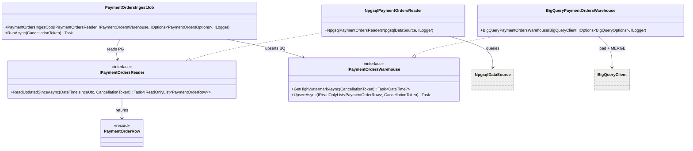

# FS-1352 — PaymentOrders → BigQuery pull (implementation design)

Land Tofu Payments `PaymentOrders` (payment method + amount + **surcharge `ClientFeeAmount`**) into the `ai_analysis_us` warehouse via a **.NET pull step** in `Tofu.AI.Backend`: an incremental Npgsql read from the Cloud SQL `subz-db` `tofu_payments` DB, upserted into `src_payment_orders`, with a decoded `mart_payment_orders` view over it. This is the DB-first alternative to routing payments through Amplitude (Amplitude is lossy, iOS-only, and carries no manual payments and no surcharge dollar amount). Ingest runs as its **own Hangfire recurring job**, independent of the Mongo-snapshot `metrics-refresh` cycle.

> **Scope guardrail:** this doc designs the *transport* (PG → BQ) and the raw/decoded table surface only. Which analytics/marts consume `mart_payment_orders`, and the FS-1352 event-side work in the BFF, are out of scope here.
>
> **Coverage note:** `PaymentOrders` is **PSP-only** (`PaymentProviderType` = {Unknown, Stripe}) — it holds Stripe orders + the surcharge `ClientFeeAmount`, **not** manual Cash/Check/Venmo payments. Manual-payment *methods* stay on the Mongo invoice (`src_invoices`, needs `PaidByProvider` projected — separate work). So `mart_payment_orders` answers "PSP payments + surcharge", and the full "how paid" picture is `mart_payment_orders` ∪ the invoice side.

**Source of plan:** designed from prompt + conversation; background in memory `project_payment_orders_to_bq.md`. No `overview.md` for FS-1352's warehouse angle (the existing `README.md` covers the Amplitude/BFF angle, now superseded for payments/surcharge).

## Decision

- **The Hangfire job is the orchestrator** — no separate `IPaymentOrdersIngestor`. `PaymentOrdersIngestJob.RunAsync` mirrors `MetricsRefreshJob` exactly (a job that drives Domain ports), at `Analyses.Application/Jobs/PaymentOrdersIngestJob.cs`. Flow, in prose: read BQ high-watermark → `since = watermark − LookbackDays` (or `InitialSinceUtc` when never run) → read PG rows updated `>= since` → upsert into `src_payment_orders`. Linear; no interaction diagram warranted.
- **Two ports, split by store** (mirrors the `locator`/`state`/`builder` triad): `IPaymentOrdersReader` (PG source) + `IPaymentOrdersWarehouse` (BQ sink: watermark read + upsert). Both in `Analyses.Domain/Services/`, impls in `Analyses.Infrastructure/PaymentOrders/`. Splitting the PG read from the BQ write is the meaningful seam and keeps each side unit-testable.
- **Write path = load-to-staging + `MERGE ON id`**, *not* the Storage Write API. The warehouse vertical's idiom is "SQL routines do the transform"; `StorageWriteApiHelper` is the *analyze* tick's CDC tool (needs a proto message + CDC-table setup). A JSON load into `src_payment_orders_staging` (WriteTruncate) then `MERGE … ON id` stays in the SQL idiom, needs no proto codegen, and gives exact idempotent upsert — which is what the "watermark − lookback re-pull" strategy requires.
- **`src_payment_orders` is a persistent, migration-created table** (`V006`), not job-`CREATE OR REPLACE`d — it is the durable MERGE target (partition/cluster), like `sys_warehouse_state` was seeded by `V004`. Schema keeps **raw int enums** (`status`, `payment_provider`, `currency_code`, `entity_type`); no decoding at this layer.
- **`mart_payment_orders` is a VIEW, not a materialized table.** Decode is pure projection + a `LEFT JOIN dim_account`; a view is always-fresh and needs no extra `CALL` in the job. Deployed once by the existing routine deployer (`build_payment_orders.sql`, `CREATE OR REPLACE VIEW`, `strict_mode = FALSE` like the other routines). *Trade-off:* if consumer scan cost ever matters, promote it to a `build_payment_orders()` procedure that materialises a clustered table and `CALL` it at the end of the job — deliberately deferred.
- **Enum decode is fully resolved from the owning service `Tofu.Payments.Backend`** (`src/Tofu.Payments.Domain/PaymentOrder/`), all stored as int ordinals (EF default, no `HasConversion` — confirmed in `PaymentOrderConfiguration.cs`). `status`/`payment_provider`/`entity_type` decode as small inline `CASE`s in the view; `currency_code` (166 values) decodes via a **`dim_currency` lookup** seeded from the `CurrencyCodeType` ordinal list (generated at build time; a 166-row seed beats a 166-arm `CASE`). Maps in Open questions → resolved below.
- **Not wired into `rebuild_warehouse`.** Payments change independently of the Mongo snapshot; coupling to the snapshot-change gate would stall payment refreshes. Own cron (`Analyses:PaymentOrders:Cadence`, default daily), **`Enabled = false` by default** (like `Analyses:Metrics`), enabled first in `invoicesapp-project-test`.
- **PG access:** a pooled `NpgsqlDataSource` singleton built from `ConnectionStrings:TofuPayments` (empty in committed appsettings; supplied per-env like the existing `ConnectionStrings:Analyses`). Npgsql becomes a direct dependency of `Analyses.Infrastructure` (already in the image transitively via `Hangfire.PostgreSql`). **The connection + a read-only DB user are provided by the team** (external prerequisite).

_Everything below this section is supporting detail._

## Code layout

```
Tofu.AI.Backend/src/Analyses/
├── Analyses.Domain/
│   ├── Models/
│   │   └── PaymentOrderRow.cs                      # NEW  record: one raw PG PaymentOrders row (int enums, decimals) crossing PG→BQ
│   └── Services/
│       ├── IPaymentOrdersReader.cs                 # NEW  port: read PaymentOrders updated since a watermark (Postgres source)
│       └── IPaymentOrdersWarehouse.cs              # NEW  port: BQ sink — high-watermark read + upsert of a row batch
├── Analyses.Application/
│   ├── PaymentOrdersOptions.cs                     # NEW  Analyses:PaymentOrders — Enabled/Cadence/LookbackDays/InitialSinceUtc
│   ├── Jobs/
│   │   └── PaymentOrdersIngestJob.cs               # NEW  Hangfire job = orchestrator (watermark→read→upsert); mirrors MetricsRefreshJob
│   └── DependencyInjection.cs                      # MOD  Configure<PaymentOrdersOptions>; AddScoped<PaymentOrdersIngestJob>; gate "payment-orders-ingest" in RegisterAnalysesRecurringJobs
├── Analyses.Infrastructure/
│   ├── PaymentOrders/
│   │   ├── NpgsqlPaymentOrdersReader.cs            # NEW  IPaymentOrdersReader impl — Npgsql query over public."PaymentOrders"
│   │   └── BigQueryPaymentOrdersWarehouse.cs       # NEW  IPaymentOrdersWarehouse impl — MAX(updated_at) read + JSON load→staging + MERGE ON id
│   ├── Warehouse/Sql/Routines/
│   │   └── build_payment_orders.sql               # NEW  seeds dim_currency (166 rows) + CREATE OR REPLACE VIEW mart_payment_orders (decode enums + LEFT JOIN dim_account, dim_currency)
│   ├── Migrations/Modules/BigQuery/
│   │   └── V006_CreatePaymentOrdersSource.cs       # NEW  CREATE TABLE IF NOT EXISTS src_payment_orders (PARTITION DATE(updated_at) CLUSTER account_id)
│   ├── DependencyInjection.cs                      # MOD  NpgsqlDataSource singleton; register both ports (Singleton); AddTransient<IBigQueryMigration,V006_…>
│   └── Analyses.Infrastructure.csproj              # MOD  add <PackageReference Include="Npgsql" />; verify Routines\*.sql embed-glob picks up build_payment_orders.sql
└── Tofu.AI.Api/
    ├── Program.cs                                  # MOD  resolve PaymentOrdersOptions; pass to RegisterAnalysesRecurringJobs; startup log line
    └── appsettings.json                            # MOD  ConnectionStrings:TofuPayments = ""; Analyses:PaymentOrders { Enabled:false, Cadence, LookbackDays }
```

Key seam: `PaymentOrdersIngestJob` (Application) depends only on the two Domain ports + options + logger. `NpgsqlPaymentOrdersReader` owns Postgres; `BigQueryPaymentOrdersWarehouse` owns every BigQuery touch (watermark, staging load, MERGE). The job never sees `NpgsqlDataSource` or `BigQueryClient`.

## Contracts

```csharp
// Analyses.Domain/Models/PaymentOrderRow.cs
// One raw row of public."PaymentOrders" — int enums kept undecoded; decode happens in mart_payment_orders.
public sealed record PaymentOrderRow(
    long Id,
    string? ExternalId,
    int Status,                 // PaymentOrderStatusType: 0 Unknown,1 NotStarted,2 IsProcessing,3 Succeeded(=paid),4 Failed
    string AccountId,
    int PaymentProvider,        // PaymentProviderType: 0 Unknown, 1 Stripe — PSP-only; no manual payments in this table
    string? PspAccountId,
    string? PspId,
    int EntityType,             // PaymentOrderEntityType: 0 Unknown, 1 Invoice, 2 PaymentRequest
    string? EntityId,
    decimal Amount,
    int CurrencyCode,           // CurrencyCodeType ordinal: USD=0 … ZWG=165 (166 values)
    decimal? FeeAmount,         // platform take
    decimal? ClientFeeAmount,   // surcharge passed to the client
    string? ProductName,
    string? ProductDescription,
    DateTime CreatedAt,
    DateTime UpdatedAt);        // incremental cursor

// Analyses.Domain/Services/IPaymentOrdersReader.cs
public interface IPaymentOrdersReader
{
    // All PaymentOrders with UpdatedAt >= sinceUtc (the 2-day lookback window is bounded; no paging).
    Task<IReadOnlyList<PaymentOrderRow>> ReadUpdatedSinceAsync(DateTime sinceUtc, CancellationToken ct);
}

// Analyses.Domain/Services/IPaymentOrdersWarehouse.cs
public interface IPaymentOrdersWarehouse
{
    // MAX(updated_at) from src_payment_orders; null = table empty / never ingested.
    Task<DateTime?> GetHighWatermarkAsync(CancellationToken ct);

    // Idempotent upsert of the batch into src_payment_orders (load→staging, MERGE ON id). No-op on empty.
    Task UpsertAsync(IReadOnlyList<PaymentOrderRow> rows, CancellationToken ct);
}
```

## Class skeletons

```csharp
// Analyses.Application/PaymentOrdersOptions.cs
public sealed class PaymentOrdersOptions
{
    public const string SectionName = "Analyses:PaymentOrders";
    public bool Enabled { get; set; } = false;          // off by default; enable in test first
    public string Cadence { get; set; } = "0 1 * * *";  // daily 01:00; independent of metrics-refresh
    public int LookbackDays { get; set; } = 2;          // re-pull window to catch late UpdatedAt (Playfair parity)
    public DateTime InitialSinceUtc { get; set; } = new(2024, 4, 10, 0, 0, 0, DateTimeKind.Utc); // floor when watermark null
}

// Analyses.Application/Jobs/PaymentOrdersIngestJob.cs
public sealed class PaymentOrdersIngestJob(
    IPaymentOrdersReader reader,
    IPaymentOrdersWarehouse warehouse,
    IOptions<PaymentOrdersOptions> options,
    ILogger<PaymentOrdersIngestJob> log)
{
    [AutomaticRetry(Attempts = 3)]
    [DisableConcurrentExecution(timeoutInSeconds: 1800)]
    public async Task RunAsync(CancellationToken ct);
    // watermark ← warehouse.GetHighWatermarkAsync ?? InitialSinceUtc
    // since ← watermark − LookbackDays; rows ← reader.ReadUpdatedSinceAsync(since); warehouse.UpsertAsync(rows); log count
}

// Analyses.Infrastructure/PaymentOrders/NpgsqlPaymentOrdersReader.cs
internal sealed class NpgsqlPaymentOrdersReader(NpgsqlDataSource dataSource, ILogger<NpgsqlPaymentOrdersReader> log)
    : IPaymentOrdersReader
{
    public async Task<IReadOnlyList<PaymentOrderRow>> ReadUpdatedSinceAsync(DateTime sinceUtc, CancellationToken ct);
    // SELECT "Id","ExternalId","Status","AccountId","PaymentProvider","PspAccountId","PspId","EntityType",
    //        "EntityId","Amount","CurrencyCode","FeeAmount","ClientFeeAmount","ProductName","ProductDescription",
    //        "CreatedAt","UpdatedAt"
    //   FROM public."PaymentOrders" WHERE "UpdatedAt" >= @since ORDER BY "UpdatedAt"
}

// Analyses.Infrastructure/PaymentOrders/BigQueryPaymentOrdersWarehouse.cs
internal sealed class BigQueryPaymentOrdersWarehouse(
    BigQueryClient bq, IOptions<BigQueryOptions> options, ILogger<BigQueryPaymentOrdersWarehouse> log)
    : IPaymentOrdersWarehouse
{
    internal const string TableId = "src_payment_orders";
    internal const string StagingTableId = "src_payment_orders_staging";

    public async Task<DateTime?> GetHighWatermarkAsync(CancellationToken ct);
    // SELECT MAX(updated_at) FROM `proj.ds.src_payment_orders`  (catch table-not-found → null, per BigQueryWarehouseStateStore)

    public async Task UpsertAsync(IReadOnlyList<PaymentOrderRow> rows, CancellationToken ct);
    // 1. UploadJson(rows → staging, WriteTruncate, explicit schema)   2. MERGE `src_payment_orders` T USING staging S ON T.id=S.id …
}
```

Pseudocode — the job tick:

```text
RunAsync(ct):
  IF NOT options.Enabled: RETURN            # belt-and-braces; the recurring job is also de-registered when disabled
  watermark ← warehouse.GetHighWatermark() ?? options.InitialSinceUtc
  since     ← watermark − options.LookbackDays
  rows      ← reader.ReadUpdatedSince(since)        # bounded PG window
  warehouse.Upsert(rows)                            # load→staging + MERGE ON id  (no-op if empty)
  log rows.Count, since, watermark
```

## Class diagram



## Dependency injection

`Analyses.Application/DependencyInjection.cs` (`AddAnalysesApplication`):
```csharp
services.Configure<PaymentOrdersOptions>(configuration.GetSection(PaymentOrdersOptions.SectionName));
services.AddScoped<PaymentOrdersIngestJob>();
```
Extend `RegisterAnalysesRecurringJobs(jobs, metrics, fsmFit, paymentOrders)` — gate mirrors the fsm-fit block:
```csharp
if (paymentOrders.Enabled)
    jobs.AddOrUpdate<PaymentOrdersIngestJob>("payment-orders-ingest", j => j.RunAsync(CancellationToken.None), paymentOrders.Cadence);
else
    jobs.RemoveIfExists("payment-orders-ingest");
```

`Analyses.Infrastructure/DependencyInjection.cs` (`AddBigQueryStore` region + migrations):
```csharp
services.AddSingleton(_ => NpgsqlDataSource.Create(configuration.GetConnectionString("TofuPayments")!));
services.AddSingleton<IPaymentOrdersReader, NpgsqlPaymentOrdersReader>();
services.AddSingleton<IPaymentOrdersWarehouse, BigQueryPaymentOrdersWarehouse>();
services.AddTransient<IBigQueryMigration, V006_CreatePaymentOrdersSource>();  // in AddBigQueryMigrations
```
`Program.cs` — resolve `IOptions<PaymentOrdersOptions>` alongside metrics/fsmFit (`Program.cs:137-145`) and pass it to `RegisterAnalysesRecurringJobs`. `build_payment_orders.sql` is picked up automatically by `BigQueryRoutineDeployer` (embedded `Warehouse.Sql.Routines.*.sql`); it is standalone (not `CALL`ed by `rebuild_warehouse`), so deploy order is irrelevant.

## Enum decode maps (resolved)

Authoritative source: `Tofu.Payments.Backend/src/Tofu.Payments.Domain/PaymentOrder/`. All persist as **int ordinals** (EF Core default — `PaymentOrderConfiguration.cs` applies no `HasConversion` to these; only `PspAdditionalInfos` → jsonb).

| Column | Enum | Map |
|---|---|---|
| `status` | `PaymentOrderStatusType` | 0 Unknown · 1 NotStarted · 2 IsProcessing · **3 Succeeded (=paid)** · 4 Failed |
| `payment_provider` | `PaymentProviderType` | 0 Unknown · 1 Stripe *(only two — PSP-only table)* |
| `entity_type` | `PaymentOrderEntityType` | 0 Unknown · 1 Invoice · 2 PaymentRequest |
| `currency_code` | `CurrencyCodeType` | ordinal, `USD=0 … ZWG=165` (166 values) → seeded into `dim_currency` |

`is_paid := status = 3`. Belt-and-braces: once the connection lands, a one-off `SELECT DISTINCT status, payment_provider, entity_type, currency_code` confirms no out-of-range ordinals before enabling in prod (append-only enums make this low-risk).

## Open questions

- **Networking + DB user** (external, being provided): private IP `10.61.32.4` / Cloud SQL connector if `Tofu.AI.Backend` runs in `inv-project`, else public `34.74.122.167` + authorized networks; a dedicated **read-only** user on `tofu_payments` (not `playfair_integrations`).
- **`_ingested_at` column** on `src_payment_orders` — include for observability (audit of last load) or omit? Leaning include (cheap).
```
