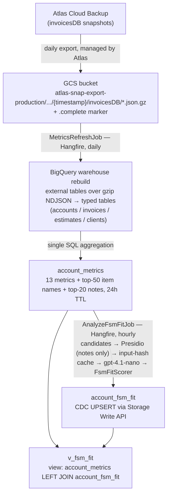

# FSM-Fit Analysis: From Mongo Backups to the BQ View

**What it is:** an LLM-powered pipeline in `Tofu.AI.Backend` that scores invoice-only accounts for FSM (Jobs) feature fit, writing results to BigQuery for the future in-app proposal surface.

## Pipeline at a glance

## 1. Source: Mongo backups, not live Mongo

- The pipeline **never touches live MongoDB**. Atlas Cloud Backup exports `invoicesDB` snapshots to GCS as gzipped Extended-JSON; a `.complete` marker flags a finished export.
- `GcsSnapshotLocator` picks the newest `.complete` snapshot; a `warehouse_state` table records the last-processed snapshot timestamp, so an unchanged snapshot makes the refresh tick a no-op.

## 2. Tables copied from the snapshot (and how)

Each Mongo collection is ingested the same way: a throwaway BigQuery **external table** over the snapshot's `*.json.gz` glob (one raw JSON line per row) → `CREATE OR REPLACE` **typed table** with `JSON_VALUE` extraction → external table dropped. Full recreate per snapshot, so deletions are handled implicitly.

| Mongo collection | BQ typed table | Row filter | Extracted columns |
|---|---|---|---|
| `accounts` | `accounts` | none at copy time (deleted/technical filtered later) | `account_id` (`_id`), `business_name`, `is_deleted`, `is_technical`, `created_time` |
| `invoices` | `invoices` (partitioned by month of `date`) | `IsDeleted <> true` | `id` (plain GUID), `account_id`, `date`, `created_time`, `total_amount`, `line_item_count`, `item_names[]` (named line items), `notes`, `client_id` (`ClientId` ∥ `Client.CatalogId`) |
| `estimates` | `estimates` (partitioned by month of `date`) | `IsDeleted <> true` | `id` (plain GUID), `account_id`, `date`, `invoice_id` (convert link; `""` normalized to NULL) |
| `clients` | `clients` | alive only (`DeletedAt` absent/null) | `id`, `account_id`, `info[]` (per-contact `name`, `address`) |

All typed tables are clustered by `account_id`. Type quirks are handled with fallbacks (e.g. `TotalAmount` is Decimal128 on most docs but Double on ~6%; `CreatedTime` is canonical `$date` on most but a bare ISO string on ~1%).

## 3. Aggregations applied → `account_metrics`

One join query over the four typed tables builds `account_metrics` (one row per non-deleted, non-technical account; 24h `expires_at`):

| Metric(s) | Source | Window | Aggregation |
|---|---|---|---|
| `invoice_count_30d`, `avg_invoice_amount`, `invoice_amount_variance_cv`, `avg_line_items_per_invoice` | invoices | last 30 days | count / avg / coefficient of variation (`stddev/avg`) / avg item count |
| `repeat_customer_ratio`, `avg_days_between_repeats` | invoices grouped per client | last 12 months | share of clients with ≥2 invoices; avg days between a repeat client's invoices |
| `estimate_count`, `estimate_to_invoice_rate` | estimates (+ invoices join) | last 12 months | count; converted = estimate has `invoice_id` OR an invoice exists with the same id (convert-in-place) |
| `b2b_clients_present`, `multi_address_work`, `distinct_addresses` | clients (unnested contact info) | all time | regex on client names (`LLC|Inc|Corp|Property Management|LLP|Ltd`); distinct normalized addresses, ≥2 ⇒ multi-address |
| `top_item_names` (top 50) | invoices, unnested `item_names` | all time | count per name, ordered count DESC, name ASC (stable order ⇒ stable `input_hash`) |
| `top_notes` (top 20) | invoices `notes` | all time | count per distinct note text, same stable ordering |
| `last_invoice_created_at` | invoices | all time | `MAX(created_time)` — the "recently active" audience gate |
| `business_name`, `created_time` | accounts | — | passthrough (account-age maturity gate) |

A shared **warehouse lock** keeps this rebuild and the analyze job from overlapping.

## 4. Analyze stage — `AnalyzeFsmFitJob` (hourly)

- **Candidates:** `account_metrics LEFT JOIN account_fsm_fit` where the FSM-fit row is missing or expired (7d TTL); audience gates in SQL: account age ≥ 90d, invoice activity within 90d.
- **Payload to the LLM:** business name, raw top item names (primary signal — deliberately unredacted), **Presidio-redacted notes** (fail-closed: redaction error ⇒ skip account), 11 metrics + 2 boolean flags.
- **Cache:** `input_hash = SHA256(payload ‖ prompt_version ‖ model_id)` — unchanged hash forwards the stored row with a bumped TTL, no LLM call. Rule version is excluded, so scorer-only changes recompute without re-judging.
- **LLM:** OpenAI **`gpt-4.1-nano`**, strict structured outputs, temperature 0 → 6 evidence booleans (`on_site_work`, `labour_billing`, `scheduling`, `recurring_billing`, `complex_multi_line_jobs`, `contract_based_billing`) + 24-ID industry + specialization + one-sentence reasoning.
- **Deterministic rule (`FsmFitScorer`):** weighted sum of LLM + backend signals (+0.10 industry bonus), capped at 1.0 → tier `none` (<0.30) / `weak` (<0.65) / `strong`; a decision tree picks `recommended_offers` (WorkersTeam, RecurringAutomation, ContractDeposits, JobsAsFolders, ScheduleVisits, EstimateWorkflow).

## 5. BigQuery layer

- Dataset `ai_analysis_us` (test: `invoicesapp-project-test`; prod: `inv-project`). Schema managed by a `migrate` CLI gate that runs as a pre-deploy K8s Job (migrations V001–V004, tracked in `migration_history`).
- **`account_fsm_fit`**: PK `account_id` (not enforced), evidence booleans, score/tier/offers, full versioning columns (`schema_version`, `rule_version`, `prompt_version`, `model_id`, `input_hash`), partitioned by month of `updated_at`, written via Storage Write API CDC (`_CHANGE_TYPE='UPSERT'`).
- **`v_fsm_fit`** (the consumer surface): `account_metrics LEFT JOIN account_fsm_fit ON account_id` — one row per account: metrics always present, FSM-fit columns NULL until first scoring. Consumed via Looker Studio / BQ UI / the WEB-1557 Read API (`GET /accounts/{id}/analyses/fsm_fit`).

## Operational notes

- Both jobs run as **in-process Hangfire** inside the single `Tofu.AI.Api` pod (job storage: Postgres schema `analyses`); feature-flagged via `Analyses:Metrics:Enabled` / `Analyses:FsmFit:Enabled`.
- Cost: ~**$0.20 per 1,000 accounts** (measured on the 1,000-account validation run).
- Stale-tick guard (30 min) + invisibility timeout (45 min) protect against replayed/overlapping ticks.
