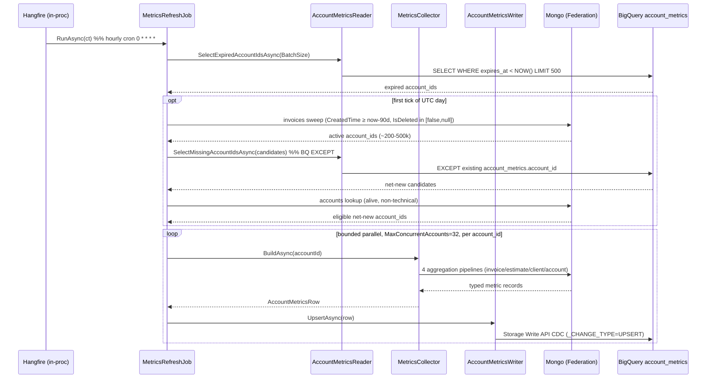

# WEB-1523 — Metrics collection (interaction)

Runtime sequence of one `MetricsRefreshJob` tick — what the static layout in [`metrics.md`](metrics.md) § Code layout can't show: ordering, the once-per-day discovery branch, and the bounded per-account fan-out. Steps map 1:1 to `RunAsync` ([`metrics.md`](metrics.md) § Tick orchestration) and the funnel in [`../analyses/metrics.md`](../analyses/metrics.md) § Refresh strategy.

The two stores touched per tick — Mongo and BigQuery — are independent connections ([`metrics.md`](metrics.md) § Connection wiring), no shared abstraction. The discovery branch (`opt`) writes nothing; it only enqueues `account_id`s into the same parallel loop the expired-row pass feeds. The FSM-using-account exclusion is **not** part of this tick — `account_metrics` is analysis-agnostic. Dropping FSM users is an FSM-fit audience filter applied by `AnalyzeFsmFitJob`; see [`analyze.md`](analyze.md) § Audience eligibility.

> Method name `SelectMissingAccountIdsAsync` (BQ `EXCEPT`) is illustrative — `metrics.md` describes the call but does not name the method. Reconcile with the real signature once the code lands.
