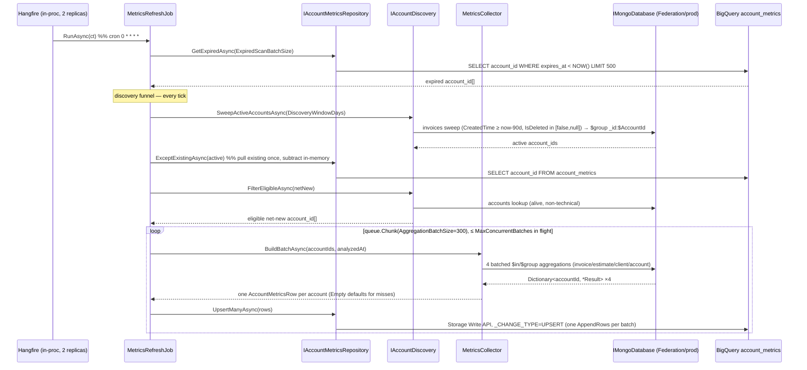

# WEB-1527 — Account metrics collection (Tofu.AI.Backend) — Overview

> Implement the `account_metrics` read path: an hourly Hangfire job in `Tofu.AI.Api` that reads the workspace's Mongo collections and CDC-upserts one typed metrics row per invoice-active account into BigQuery. Metrics stage only — no LLM / redaction / FSM-fit scoring.

**Status:** planning
**Ticket:** WEB-1527 (theory: WEB-1523-segmentation)
**Repo:** `Tofu.AI.Backend` · branch `feature/WEB-1527` (off `feature/WEB-1526`)
**Cross-product summary doc:** `Tofu.Docs/features/WEB-1527/README.md`

## Analysis

### Goal

Populate the shared `<project>.ai_analysis.account_metrics` BigQuery table — 11 numeric/boolean metric columns + `business_name` per account — by aggregating four Mongo collections (`invoices`, `estimates`, `clients`, `accounts`) from inside `Tofu.AI.Api`. This is the analysis-agnostic feature store that the downstream FSM-fit analyze stage (separate ticket) will consume. The metrics stage ships first and stands alone.

### Constraints

- **Builds on WEB-1526.** The migration framework (`IModuleMigration` / `BigQueryMigrationsRunner` / `migration_history`), Hangfire-on-Postgres (schema `analyses`), the CLI `migrate` short-circuit, the `BigQueryClient` singleton + `BigQuerySettings`, and a **stub** `MetricsRefreshJob` already exist. WEB-1527 fleshes out the stub and adds the read/write path around it.
- **Port-and-adapt from the reference branch.** A near-complete working implementation of exactly this feature exists on `feature/WEB-1523_metrics` (same base, `feature/WEB-1526`). WEB-1527 adopts its shape — batched collectors, Storage Write API CDC writer, options knobs, job loop — and layers this folder's two deliberate overrides on top (single `account_id` PK; spec-faithful `updated_at`/MONTH partitioning). The reference's spec divergences are reconciled in [`reference-comparison.md`](reference-comparison.md).
- **Batched collection.** Collectors use the **batched** `$in` → `$group by $AccountId` form (proven on the reference branch; cross-referenced with `analyses/metrics.md` § Per-metric query plan) — ~4 reads + 1 write per *batch* of ~300 accounts, not per account. Only the batched `BuildBatchAsync` is implemented (no per-account method — YAGNI; add one when a CLI / manual path needs it).
- **No new external API surface.** No REST endpoints, no gRPC contracts. The producer surface stays entirely inside `Tofu.AI.Backend`; the only "contract" is the BigQuery table schema. (`Why Mongo direct and not gRPC` — `analyses/metrics.md`.)
- **Single Mongo connection, env-invariant code.** All four collections share one logical database; one `IMongoDatabase` from `ConnectionStrings:Mongo` serves every collector. Only the connection-string *value* differs per env (prod = Data Federation endpoint; stage = plain connection to prod Mongo). No `MongoClientSettings` tuning in code; no per-env branches.
- **`IsDeleted` nullability rules.** `invoices` / `estimates`: `IsDeleted IN (false, null)` (never `= false` — older docs predate the field). `clients`: filter on `DeletedAt: null` / `{$exists:false}` (different field, different shape — do not import the invoice shape).
- **Cross-replica safety.** API runs 2 replicas; `MetricsRefreshJob` already carries `[DisableConcurrentExecution(600)]`, and Hangfire.PostgreSql's advisory lock serialises the recurring tick. No bespoke leader election.
- **TreatWarningsAsErrors, .NET 8 / C# 12, nullable enabled** across all projects.

### Contradictions & Concerns

- **Spec carries two collection models — batched vs per-account.** `analyses/metrics.md` § Per-metric query plan shows per-account pipelines (`MaxConcurrentAccounts=32`); the reference branch implements the **batched** `$in`/`$group` form (`AggregationBatchSize=300`, `MaxConcurrentBatches=4`). **Resolution:** implement the batched form only (adopt the reference); no per-account method.
- **Account-only table — no subject columns, no NULL-PK problem.** `storage.md` and the reference propose PK `(master_user_id, platform_user_id, account_id)` with two NULLs per v1 row, and flag that BigQuery CDC's NULL-PK matching is undocumented. **Resolution (this folder's override):** drop `master_user_id` and `platform_user_id` **entirely** — `account_metrics` is keyed solely on `account_id` (`PRIMARY KEY (account_id) NOT ENFORCED`, single non-null column, so CDC matching is unambiguous and no verification task is needed). Master- / platform-user-level metrics, if ever needed, go in a **separate table** later — not extra columns or NULL-bearing rows here. The code uses **`account_id` strings throughout** — the reference's `SubjectRef`/`SubjectKind` abstraction is dropped (a deliberate simplification beyond the reference); a future separate-table feature can introduce its own subject type when it actually needs one.
- **Discovery cadence.** **Resolution:** run the full discovery funnel (sweep → `EXCEPT` → eligibility) **every tick** — no daily guard. Discovery is idempotent (read-only sweep, `EXCEPT` dedupes net-new candidates, CDC upsert is repeat-safe), so the only cost of running it hourly is the sweep itself, which is cheap at current volume. An earlier `IMetricsRefreshState` / `InMemoryMetricsRefreshState` once-per-UTC-day guard was dropped — it didn't survive restarts and only debounced per-replica, so it bought little. If the sweep ever becomes expensive, re-throttle via a durable claim (Postgres `INSERT … ON CONFLICT`) or split discovery into its own daily Hangfire recurring job (Hangfire-on-PG already coordinates a recurring job across replicas).
- **No Mongo to point at in local dev.** There is no local Mongo today. **Resolution:** Mongo is a **required** dependency of the metrics job — the `IMongoDatabase` is registered **lazily**, so a Mongo-less boot or the `migrate` CLI never opens it. The tick is scheduled purely on `Analyses:Metrics:Enabled`, so local dev leaves `Enabled = false` (the committed default) unless a real `ConnectionStrings:Mongo` is supplied; deployed envs set Mongo and flip `Enabled = true`. A failed tick is a Hangfire retry, never a host crash.
- **`CreatedTime` vs `Date` for the discovery sweep** and **address over-counting** for `distinct_addresses` are open PM/data questions in the spec. They do not block the code shape; carry them as `## Open questions` (not resolved here) and default to the spec's stated choice (`CreatedTime` sweep; trim+lowercase normalisation in-pipeline).

---

### Components

- **`Analyses.Domain`** (new project) — pure contracts, no infra deps: `Models/AccountMetricsRow`, `MetricsOptions`, `Services/IMetricsCollector`, `Services/IAccountDiscovery`, `Repositories/IAccountMetricsRepository` (writes + expired scan + net-new `ExceptExistingAsync`).
- **`Analyses.Infrastructure`** (new project) — Mongo read side under `Metrics/`: the four `*MetricsCollector` + `MetricsCollector` façade in `Metrics/Collectors/`, plus `Metrics/MetricWindow` and `Metrics/AccountDiscovery`; shared `Mongo/MongoDatabaseFactory` + `Mongo/BsonReads`; and `AddAnalysesInfrastructure` DI. Depends only on `Analyses.Domain`.
- **`Analyses.Persistence`** (existing) — BigQuery write/read side: `account_metrics.proto`, `StorageWriteApiHelper`, `BigQueryMappings` (row→proto), `BigQueryAccountMetricsRepository` (CDC upsert + expired scan + net-new `ExceptExistingAsync`), and the `V001_CreateAccountMetrics` migration replacing the `V001_Bootstrap` placeholder.
- **`Analyses.Application`** (existing) — `MetricsRefreshJob.RunAsync` orchestration; **sole owner of `MetricsOptions` registration** (binds from config + exposes the concrete singleton the job and collectors inject).
- **`Tofu.AI.Api`** (existing) — composition root: `AddAnalysesInfrastructure()` wiring + `ConnectionStrings:Mongo` config. Recurring-job registration already in place.

### Data Flow



### Key Structures

- **`AccountMetricsRow`** — flat record: `AccountId` (string) + `BusinessName` + 8 numeric + 2 bool + `DistinctAddresses` + `ExpiresAt`. All metric fields **nullable** (`int?`/`double?`/`bool?`) — null = "no signal", preserved end-to-end. The seam between collectors and writer. The refresh queue, collector input, and expired-scan results are all plain `account_id` strings (no `SubjectRef`).
- **`*MetricsResult`** (`InvoiceMetricsResult`, `EstimateMetricsResult`, `ClientMetricsResult`) — per-family typed projection, each with a static `Empty` for the missing-account case.
- **`MetricWindow`** — 30d / 12mo / 90d window anchors derived from `analyzedAt`.
- **`MetricsOptions`** — extended from `{Enabled, Cadence}` to add `RefreshTtl`, `ExpiredScanBatchSize`, `AggregationBatchSize`, `MaxConcurrentBatches`, `DiscoveryWindowDays`. `Enabled`/`Cadence` are **kept** (WEB-1526's `RegisterAnalysesRecurringJobs` depends on them — see reference-comparison §5).

### Risk Points

- **Storage Write API in C#** — proto descriptor + default-stream `AppendRows` with `_CHANGE_TYPE`. Requires the `Google.Cloud.BigQuery.Storage.V1` package (not yet referenced) and a hand-written `.proto`. This is the single heaviest implementation step; isolate it. The reference branch's `StorageWriteApiHelper.cs` is the working template to adapt.
- **Mongo field-shape drift** — `ClientId` vs `Client.CatalogId` coalescing on `invoices`; `DeletedAt` vs `IsDeleted`; B2B regex + address normalisation done *inside* the pipeline. Mistakes here are silent wrong-number bugs, not crashes.
- **Cancellation propagation** — API-pod SIGTERM must abort in-flight batches cleanly (shared with HTTP graceful-shutdown since Hangfire is in-process). Explicit `ct` checks between batches.
- **Discovery sweep cost** — depends on a new `invoices.{CreatedTime:1}` partial index that lives in **`Tofu.Invoices.Backend`** (cross-repo prerequisite, separate PR). Without it the sweep is 10–30 min instead of 1–3 min — acceptable fallback, but track it.

> The CDC NULL-PK risk that the reference carried is **removed** here by the single-`account_id` PK decision (see Concerns). It is no longer a risk point.

> **Confirmed — `accounts._id` is a string, not an ObjectId.** Verified against `Invoices.Backend`: `Account : Entity<Account>` has `Id` as `required string` (`Entity.cs`) with no `[BsonRepresentation(ObjectId)]`, AutoMapped to `_id`, and `Account.GenerateId()` produces `"<rand>-<guidhex>-<hex>"` (not a 24-hex ObjectId). So both `AccountMetricsCollector` and `AccountDiscovery.FilterEligibleAsync` can filter `_id ∈ accountIds` against the plain account-id strings directly — no representation mismatch.

### Data contracts (no external API)

This feature exposes no REST/gRPC surface. The load-bearing contracts are the BigQuery table and the in-process row record.

**`account_metrics` table** (created by `V001_CreateAccountMetrics`; full column rationale in `storage.md` § Q1 § Schemas):

```sql
account_metrics (
  account_id STRING NOT NULL,                        -- sole subject key (master/platform-user columns dropped — see below)
  business_name STRING,
  invoice_count_30d INT64, avg_invoice_amount FLOAT64, invoice_amount_variance_cv FLOAT64,
  avg_line_items_per_invoice FLOAT64, repeat_customer_ratio FLOAT64, avg_days_between_repeats FLOAT64,
  estimate_to_invoice_rate FLOAT64, estimate_count INT64,
  b2b_clients_present BOOL, multi_address_work BOOL, distinct_addresses INT64,
  expires_at TIMESTAMP NOT NULL, updated_at TIMESTAMP NOT NULL,
  PRIMARY KEY (account_id) NOT ENFORCED              -- CDC upsert key; single non-null column (no NULL-match ambiguity)
)
PARTITION BY DATE_TRUNC(updated_at, MONTH)            -- spec-faithful (storage.md § Q1); NOT the reference's DATE(analyzed_at)
CLUSTER BY account_id
OPTIONS (max_staleness = INTERVAL 15 MINUTE, description = "Backend-aggregated metrics per account. Refreshed by MetricsRefreshJob via Storage Write API CDC.");
```

> **`master_user_id` / `platform_user_id` columns are dropped** (override of `storage.md` + the reference): `account_metrics` is account-only. User/master-level metrics, if needed, land in a **separate table** later. This diverges from `storage.md` § Q1, which carries all three subject columns — recorded as a deliberate decision.
>
> **`analyzed_at` is also dropped** — `updated_at` (the partition key + physical write time) is the single freshness timestamp; `expires_at` is computed from the in-memory tick anchor, not a stored `analyzed_at`. In the metrics path recompute == write, so `analyzed_at` would equal `updated_at` on every row. Also a deliberate divergence from `storage.md`.
>
> `DatasetId` defaults to `ai_analysis_v2` in current `BigQuerySettings` (the spec writes `ai_analysis`); the migration uses the configured dataset, so no spec conflict at runtime.

**`AccountMetricsRow`** (C# record — all metric fields nullable, field order matches the reference):

```csharp
public sealed record AccountMetricsRow(
    string AccountId,
    string? BusinessName,
    int? InvoiceCount30d,
    double? AvgInvoiceAmount,
    double? InvoiceAmountVarianceCv,
    double? AvgLineItemsPerInvoice,
    double? RepeatCustomerRatio,
    double? AvgDaysBetweenRepeats,
    double? EstimateToInvoiceRate,
    int? EstimateCount,
    bool? B2bClientsPresent,
    bool? MultiAddressWork,
    int? DistinctAddresses,
    DateTimeOffset ExpiresAt);
```

### Internal Breaking Changes

- **`V001_Bootstrap` is replaced by `V001_CreateAccountMetrics`.** On any environment where `V001_Bootstrap` already applied (created the `schema_bootstrap` stub table + a `migration_history` row), swapping the migration *name* means `V001_CreateAccountMetrics` is treated as unapplied and runs — fine — but the stale `schema_bootstrap` table and the old history row linger. **Migration path:** since no env has shipped this yet (WEB-1526 is unmerged groundwork), prefer renaming the file in place; if a dev DB already ran `V001_Bootstrap`, drop the `schema_bootstrap` table and its history row manually. Confirm no environment has applied it before relying on the clean path.
- **`MetricsOptions` gains fields.** Additive with defaults, so existing `appsettings` keep working; `Enabled`/`Cadence` retained for `RegisterAnalysesRecurringJobs`.
- **`MetricsRefreshJob` constructor + body change.** It currently takes `(IOptions<MetricsOptions>, ILogger)`; it will gain `IAccountMetricsRepository` (upsert + `GetExpiredAsync` + `ExceptExistingAsync`), `IAccountDiscovery`, `IMetricsCollector`, `MetricsOptions` (concrete singleton). Internal only (Hangfire-activated, Scoped).
- **Chat-context GCS wiring is now config-driven** (incidental, same branch). The inline `StorageClient.Create(GoogleCredential.FromFile("gcs-secrets/gcs-service-account-key.json"))` in `Program.cs` is replaced by `AddChatStorage()` (`Services/ChatStorageRegistration.cs` + `Settings/StorageSettings.cs`): credential defaults to **ADC / ambient service account**, and an explicit key file is used only when `Storage:ServiceAccountKeyPath` is set (empty by default). **Deployment impact:** envs that relied on the hardcoded key-file path must either run under Workload Identity / ADC (preferred) or set `Storage:ServiceAccountKeyPath`. `Program.cs` also exposes `public partial class Program {}` as the integration-test host seam.

### Decisions Made

- **Port-and-adapt from `feature/WEB-1523_metrics`** (user decision, revised) — earlier framing was "implement fresh from spec"; superseded once the reference branch was found to be a near-complete, batched, mostly spec-faithful implementation of this exact feature. Adopt its shape; diverge only where this folder records an explicit override below.
- **Account-only table, single `account_id` PK** (user decision) — drop `master_user_id` and `platform_user_id` **entirely** (not reserved); `account_metrics` is keyed solely on `account_id` (`PRIMARY KEY (account_id) NOT ENFORCED`). The single non-null PK column removes the undocumented NULL-PK CDC-matching risk that the reference / `storage.md` 3-column composite carried. Master- / platform-user metrics, if ever needed, go in a **separate table** later — a conscious deferral, not reserved columns here. This overrides `storage.md` § Q1 (three subject columns) deliberately.
- **Drop `SubjectRef`; use `account_id` strings** (user decision — simplification beyond the reference) — the reference carries a `SubjectRef`/`SubjectKind` abstraction for multi-subject v2-readiness, but with the account-only table it's dead weight. The row key, refresh queue, collector input, and expired-scan results are all plain `string accountId`. A future separate-table feature introduces its own subject type when it needs one.
- **Metrics stage only** (user decision) — `account_metrics` + `MetricsRefreshJob`. Explicitly **out of scope:** LLM client, Presidio redaction, FSM eligibility probe, `account_fsm_fit` table, `v_fsm_fit` view, `AnalyzeFsmFitJob`/`SmokeProbeJob`, and the read-only Postgres `jobs.Jobs` connection — all belong to the analyze stage (`analyze.md`), a separate ticket. *(Update 2026-06-02: the FSM eligibility probe and its read-only Postgres `jobs.Jobs` connection were since **removed** — job filtering is not used at this stage; see `analyze.md` § Audience eligibility.)*
- **Plan files live in `Tofu.AI.Backend/Docs/features/WEB-1527/`** (user decision) — `/be-plan`'s native location, next to WEB-1526. The `Tofu.Docs/features/WEB-1527/README.md` from `/feature` is the cross-product summary.
- **Batched collection** — `$in` match + `$group _id:$AccountId` + `ToListAsync` → `Dictionary<accountId, result>`; façade composes one `AccountMetricsRow` per requested account, defaulting misses to `*.Empty`. Only `BuildBatchAsync` (no per-account method).
- **Two new projects, Domain + Infrastructure** — matches the established Clean-Architecture layering and the reference branch's module split; keeps Mongo/BigQuery infra out of the domain contracts.
- **Storage Write API CDC** for writes (one `AppendRows` per batch, `_CHANGE_TYPE=UPSERT`); the net-new `EXCEPT` and the expired scan go through the `BigQueryClient`. No staging tables, no DML.
- **Adopted reference shapes (reference-comparison §2):** all-nullable `AccountMetricsRow`; expired scan on `IAccountMetricsRepository.GetExpiredAsync` (returns `account_id` strings — the reference's `SubjectRef[]` simplified away); reader surface reduced to `ExceptExistingAsync` (pull existing ids once, subtract in-memory — sidesteps the IN-list size limit); `IAccountDiscovery` split into `SweepActiveAccountsAsync` + `FilterEligibleAsync` with the funnel orchestrated in the job's `DiscoverAsync`; `account_id` strings as the refresh-queue element; Mongo as a required dependency (collectors + discovery always registered, the DB resolved lazily); `MetricsOptions` bound + re-exposed as a concrete singleton, owned solely by `AddAnalysesApplication` (collectors + job inject the concrete instance).
- **Run discovery every tick — no daily guard** (revised) — earlier this folder shipped an in-memory once-per-UTC-day guard (`IMetricsRefreshState` / `InMemoryMetricsRefreshState`); it was dropped because it didn't survive restarts and only debounced per-replica, so it bought little. The full funnel now runs hourly — idempotency makes repeat runs safe and the sweep is cheap at current volume. Re-throttle (durable Postgres claim, or a dedicated daily Hangfire recurring job) only if the sweep cost grows.
- **Spec-faithful overrides of the reference (reference-comparison §4):** `PARTITION BY DATE_TRUNC(updated_at, MONTH)` (not the reference's `DATE(analyzed_at)` — preserves storage.md's monthly-retention / time-travel rationale); keep a table `description`; `avg_days_between_repeats` as the mean of consecutive-day diffs (the reference's `(max−min)/(n−1)` approximation is an acceptable alternative but the spec form is authoritative). Proto explicit-presence (proto3 `optional`, or the reference's proto2 — both yield unset⇒NULL).
- **Keep `Enabled`/`Cadence` on `MetricsOptions`** (diverges from the reference, which dropped them) — WEB-1526's `RegisterAnalysesRecurringJobs` reads both to gate registration and supply the cron; removing them would break the existing wiring.
- **Job degrades safely without Mongo** — gated by `Analyses:Metrics:Enabled` + skipped registration when the connection string is absent; a failed tick is a Hangfire retry, never a host crash.

## Scope assessment

**Large** but within the `/be-plan` 10-step ceiling. Decomposes into 9 top-level steps (new projects + config → domain contracts → Mongo wiring → collectors → discovery + refresh-state → BigQuery write path → migration → job orchestration + DI → build verification). Phase 2 uses sub-steps within steps (e.g. the four collectors) rather than additional top-level steps. Porting from the reference branch should keep most steps well under budget.

## Cross-repo prerequisite (not a WEB-1527 commit)

- New partial index `invoices.{CreatedTime:1}` with `partialFilterExpression:{IsDeleted:{$in:[false,null]}}` in **`Tofu.Invoices.Backend`** `MongoDbContext.cs` — gates the discovery sweep performance. Separate PR in that repo; track in the cross-product README's Affected repos.

## Open questions (carried from spec — do not block implementation)

- [ ] `CreatedTime` vs `Date` for the discovery sweep (back-dated invoices missed by a `CreatedTime` sweep). Default: `CreatedTime`.
- [ ] `distinct_addresses` over-counting without address canonicalisation. Default: trim + lowercase + whitespace-collapse in-pipeline; no libpostal in v1.
- [ ] Repeat-signal window length (12mo) — reconcile with MAIN-1361 validation if revisited.
- [ ] `AggregationBatchSize` / `MaxConcurrentBatches` tuning — start 300 / 4, measure before raising.
- [ ] Discovery currently runs every tick (no guard). If the sweep becomes expensive, throttle via a durable Postgres claim or a dedicated daily Hangfire recurring job.
