# WEB-1555 — BigQuery metrics orchestration (implementation design)

Refactor the `Tofu.AI.Backend` Analyses metrics path from the **Mongo-collector + Storage-Write-API-CDC** model to a **BigQuery full-recreate orchestration**: `MetricsRefreshJob` resolves the latest Atlas snapshot in GCS, rebuilds the 4 typed source tables from the gz, then `CREATE OR REPLACE`s the all-in-one `account_metrics`. The analyze stage reads everything (metrics + item names + notes + maturity) from that one table — Mongo is fully removed from the module.

> **Scope guardrail.** No metric *definitions* here — the aggregations are locked in the validated SQL ([`bq-tables-build-plan.md`](bq-tables-build-plan.md) + `account_metrics_build.sql`) and the source-collectors they replace. This doc is the **C# orchestration shape** that runs that SQL; the SQL wins on any conflict.

**Source of plan:** [`bq-tables-build-plan.md`](bq-tables-build-plan.md) (+ [`bq-migration-spike.md`](bq-migration-spike.md)) and this conversation. No `overview.md`.

---

## Decision

- **`MetricsRefreshJob` becomes a 2-step BQ orchestrator** (`src/Analyses/Analyses.Application/Jobs/MetricsRefreshJob.cs`, rewritten): `ISnapshotLocator.ResolveLatestAsync()` → `IMetricsWarehouseBuilder.RebuildAsync(snapshot)`. No Mongo, no per-account loop, no CDC writer. One BQ job per source table + one for `account_metrics`.
- **Two new Domain ports**, both implemented in Persistence: `ISnapshotLocator` (find newest completed snapshot in GCS) and `IMetricsWarehouseBuilder` (run the rebuild SQL). The job depends only on these.
- **SQL lives as embedded `.sql` resources** under `Analyses.Persistence/Warehouse/Sql/` — verbatim the validated SQL, with `{dataset}` / `{uri}` placeholders the builder substitutes. Not `IBigQueryMigration` (these run daily, not once). Keeps the reviewed SQL out of C# string soup.
- **Windows self-anchor to `CURRENT_TIMESTAMP()`** in the SQL (snapshots are fresh daily, so now() ≈ snapshot instant; avoids threading a timestamp). Only the gz **URI** is templated per snapshot.
- **`account_metrics` gains 3 columns** built by the job: `created_time` (folds the maturity gate in — see below), `top_item_names`, `top_notes` (raw). This makes it the single FSM-analysis input and lets us drop the signals collector *and* the Mongo `IAccountsRepository`.
- **Mongo is fully retired from the Analyses module.** The 4 collectors, `AccountDiscovery`, `MetricsCollector` façade, `InvoiceSignalsCollector`, the whole `Infrastructure/Mongo/` layer, and `IAccountsRepository` are deleted. `Infrastructure` shrinks to Presidio + OpenAI. (No config-flag dual-path — the SQL path is validated; a Mongo rollback would mean reverting the branch, which is cheaper than maintaining two pipelines.)
- **`AnalyzeFsmFitJob` changes minimally**: drop the `IInvoiceSignalsCollector` dependency and build `InvoiceSignals` from the fetched `AccountMetricsRow`; apply the maturity gate as a row filter on `metrics.CreatedTime`. **`FsmFitPayloadBuilder` keeps its Presidio redaction** — raw `top_notes` from BQ are redacted before the LLM, so the "no unredacted notes to the model" invariant holds.
- **Skip the rebuild when the snapshot is unchanged.** A new `IWarehouseStateStore` persists the last-processed snapshot timestamp in a 1-row BQ table `warehouse_state`. `MetricsRefreshJob` resolves the latest snapshot, compares to the stored one, and **returns without touching BigQuery** if they match — so a daily tick against an un-refreshed export is a cheap no-op (one `SELECT`, no scan-billed rebuild). State is written only *after* a successful `account_metrics` rebuild.
- **No analyze tick during a rebuild.** A shared **Hangfire distributed lock** (`analyses:warehouse`) makes `MetricsRefreshJob` and `AnalyzeFsmFitJob` mutually exclusive (Hangfire's `[DisableConcurrentExecution]` only self-serializes — it can't gate across two job types). The rebuild **holds** the lock for its whole run; the analyze tick **try-acquires with a short wait and skips** (logs + returns, picks up next tick) if the rebuild holds it. `CREATE OR REPLACE` is already atomic per table, so this is belt-and-suspenders for read-consistency *plus* the explicit "don't analyze mid-migration" guarantee the requirement asks for. Wrapped behind `IWarehouseLock` so it's testable and the jobs don't reach into `JobStorage` directly.
- **`StorageWriteApiHelper` + `BigQueryWriteClient` stay** — `account_fsm_fit` is still CDC-written by `AnalyzeFsmFitJob`. Only `BigQueryAccountMetricsRepository` drops its writer dependency and its 3 CDC methods.
- **Dataset → `ai_analysis_us`** (US) via config (`BigQueryOptions.DatasetId`); the `account_fsm_fit`/view migrations (`V002`/`V003`) move with it. **`V001_CreateAccountMetrics` is retired** — `account_metrics` is now job-owned (first-run ordering is an Open Question).
- **`estimate_to_invoice_rate` = `InvoiceId IS NOT NULL` OR an invoice exists with `id == estimate.id`**; **clients alive = `COALESCE(JSON_QUERY($.DeletedAt),'null')='null'`**. Both baked into the `.sql` resources. The former diverges from the shipped `EstimateMetricsCollector` (InvoiceId-only) — that collector is being deleted, so the BQ definition becomes the only one.

*Everything below this section is supporting detail.*

---

## Code layout

```text
src/Analyses/
  Analyses.Domain/
    Models/
      SnapshotRef.cs                       # NEW   record: the resolved GCS snapshot (invoicesDb prefix + timestamp)
      AccountMetricsRow.cs                 # MOD   + CreatedTime, + TopItemNames, + TopNotes
    Services/
      ISnapshotLocator.cs                  # NEW   port: resolve the newest completed snapshot
      IMetricsWarehouseBuilder.cs          # NEW   port: rebuild source tables + account_metrics from a snapshot
      IWarehouseStateStore.cs              # NEW   port: read/write the last-processed snapshot timestamp
      IAccountDiscovery.cs                 # DEL   discovery folded into the full rebuild
      IMetricsCollector.cs                 # DEL
      IInvoiceSignalsCollector.cs          # DEL   signals now read from account_metrics
    Repositories/
      IAccountMetricsRepository.cs         # MOD   keep GetBatchAsync; drop UpsertMany/GetExpired/ExceptExisting
      IAccountsRepository.cs               # DEL   maturity gate folded into account_metrics.created_time

  Analyses.Application/
    Jobs/MetricsRefreshJob.cs              # MOD   rewritten: lock → locate snapshot → skip-if-unchanged → rebuild → record state
    Jobs/AnalyzeFsmFitJob.cs               # MOD   lock gate; signals from row; maturity from row; drop IInvoiceSignalsCollector
    Locking/IWarehouseLock.cs              # NEW   port: shared exclusive lock across metrics-refresh & fsm-fit ticks
    Locking/HangfireWarehouseLock.cs       # NEW   impl over Hangfire distributed lock (JobStorage)
    MetricsOptions.cs                      # MOD   drop discovery/CDC knobs; keep Enabled/Cadence; + LockWait (analyze try-acquire window)
    DependencyInjection.cs                 # MOD   + IWarehouseLock; MetricsRefreshJob/AnalyzeFsmFitJob deps change

  Analyses.Infrastructure/
    DependencyInjection.cs                 # MOD   remove Mongo + collectors + discovery + signals + IAccountsRepository; keep Presidio + OpenAI
    Metrics/                               # DEL   whole folder (AccountDiscovery, MetricWindow, Collectors/*)
    Mongo/                                 # DEL   whole folder (MongoDatabaseFactory, BsonReads, Collections, MongoConventions, MongoFilters, AccountsRepository)

  Analyses.Persistence/
    Gcs/
      GcsSnapshotLocator.cs                # NEW   ISnapshotLocator over Google.Cloud.Storage.V1: newest .complete marker
    Warehouse/
      BigQueryMetricsWarehouseBuilder.cs   # NEW   IMetricsWarehouseBuilder: load .sql, substitute, ExecuteQuery per table
      BigQueryWarehouseStateStore.cs       # NEW   IWarehouseStateStore over the warehouse_state 1-row table
      Sql/
        accounts.sql                       # NEW   external-table + CREATE OR REPLACE TABLE accounts
        invoices.sql                       # NEW   ... invoices (+ item_names)
        estimates.sql                      # NEW   ... estimates
        clients.sql                        # NEW   ... clients (alive-only, JSON_QUERY filter)
        account_metrics.sql                # NEW   CREATE OR REPLACE account_metrics (13 metrics + created_time + top_item_names + top_notes)
    BigQuery/
      BigQueryReads.cs                     # MOD   + ReadTextCountArray helper (ARRAY<STRUCT<text,count>> → IReadOnlyList)
      SnapshotOptions.cs                   # NEW   config: bucket + prefix root (Analyses:Snapshot)
    Repositories/
      BigQueryAccountMetricsRepository.cs  # MOD   GetBatchAsync reads new columns; drop writer dep + 3 CDC methods
    Migrations/Modules/BigQuery/
      V001_CreateAccountMetrics.cs         # DEL   account_metrics now job-owned (see Open Questions on first-run)
    DependencyInjection.cs                 # MOD   add StorageClient + ISnapshotLocator + IMetricsWarehouseBuilder + SnapshotOptions; drop V001; drop writer from metrics repo
    Analyses.Persistence.csproj            # MOD   + Google.Cloud.Storage.V1

  Tofu.AI.Api/Program.cs                   # MOD (maybe)  first-run: ensure a rebuild runs before first analyze tick (Open Q)
```

**Key seam:** `MetricsRefreshJob` (Application) talks only to `ISnapshotLocator` + `IMetricsWarehouseBuilder` (Domain ports). Both concretions live in Persistence and hold the GCS/BigQuery clients; the SQL is data (embedded resources), not code. The analyze side reads the widened `AccountMetricsRow` and never touches Mongo.

---

## Contracts

```csharp
// Domain/Models/SnapshotRef.cs
/// <summary> A resolved, completed Atlas snapshot in GCS — the gs:// prefix up to and including invoicesDB/. </summary>
public sealed record SnapshotRef(string InvoicesDbUri, string Timestamp);
// InvoicesDbUri e.g. "gs://atlas-snap-export-production/exported_snapshots/<org>/<proj>/InvoicesCluster/2026-06-02T1611/1780430470/invoicesDB/"
// collection gz glob = $"{InvoicesDbUri}{collection}/*.json.gz"

// Domain/Services/ISnapshotLocator.cs
/// <summary> Finds the newest snapshot under the configured prefix that has a `.complete` marker. Null if none. </summary>
public interface ISnapshotLocator
{
    Task<SnapshotRef?> ResolveLatestAsync(CancellationToken ct);
}

// Domain/Services/IMetricsWarehouseBuilder.cs
/// <summary> Rebuilds the 4 typed source tables from the snapshot gz, then CREATE OR REPLACEs account_metrics. </summary>
public interface IMetricsWarehouseBuilder
{
    Task RebuildAsync(SnapshotRef snapshot, CancellationToken ct);
}

// Domain/Services/IWarehouseStateStore.cs
/// <summary> The snapshot timestamp that produced the current account_metrics — for skip-if-unchanged. Null = never built. </summary>
public interface IWarehouseStateStore
{
    Task<string?> GetLastSnapshotAsync(CancellationToken ct);
    Task SetLastSnapshotAsync(string snapshotTimestamp, CancellationToken ct); // called only after a successful rebuild
}

// Application/Locking/IWarehouseLock.cs
/// <summary> Shared exclusive lock serialising the metrics-refresh and fsm-fit ticks. Null when not acquired within wait. </summary>
public interface IWarehouseLock
{
    Task<IAsyncDisposable?> TryAcquireAsync(TimeSpan wait, CancellationToken ct);
}

// Domain/Repositories/IAccountMetricsRepository.cs  (MODIFIED — CDC methods removed)
public interface IAccountMetricsRepository
{
    /// <summary> Full metrics rows for the given accounts — the analyze stage's LLM-payload input. </summary>
    Task<IReadOnlyList<AccountMetricsRow>> GetBatchAsync(IReadOnlyCollection<string> accountIds, CancellationToken ct);
}
```

```csharp
// Domain/Models/AccountMetricsRow.cs  (MODIFIED — 3 new fields)
public sealed record AccountMetricsRow(
    string AccountId,
    string? BusinessName,
    int? InvoiceCount30d,
    double? AvgInvoiceAmount,
    double? InvoiceAmountVarianceCv,
    double? AvgLineItemsPerInvoice,
    double? RepeatCustomerRatio,
    double? AvgDaysBetweenRepeats,
    double? EstimateToInvoiceRate,
    int? EstimateCount,
    bool? B2bClientsPresent,
    bool? MultiAddressWork,
    int? DistinctAddresses,
    DateTimeOffset? CreatedTime,                 // NEW — account age, for the maturity gate (null = legacy/unknown → eligible)
    IReadOnlyList<ItemName> TopItemNames,        // NEW — raw, from account_metrics
    IReadOnlyList<NoteText> TopNotes,            // NEW — raw, redacted at analyze time
    DateTimeOffset ExpiresAt);
```

```csharp
// Persistence/BigQuery/SnapshotOptions.cs
public sealed class SnapshotOptions
{
    public const string SectionName = "Analyses:Snapshot";
    public string Bucket { get; init; } = "atlas-snap-export-production";
    /// <summary> Prefix down to the cluster, e.g. exported_snapshots/&lt;org&gt;/&lt;proj&gt;/InvoicesCluster </summary>
    public string PrefixRoot { get; init; } = "";
    public string CompleteMarker { get; init; } = ".complete";
}
```

---

## Class skeletons

```csharp
// Persistence/Gcs/GcsSnapshotLocator.cs
internal sealed class GcsSnapshotLocator(
    StorageClient storage, IOptions<SnapshotOptions> options, ILogger<GcsSnapshotLocator> log) : ISnapshotLocator
{
    public Task<SnapshotRef?> ResolveLatestAsync(CancellationToken ct); // see pseudocode
}
```
Lists `.complete` markers under `PrefixRoot/`, picks the lexicographically-greatest (ISO timestamp folders sort chronologically), derives the `invoicesDB/` prefix from the marker's parent. Returns null when no completed snapshot exists.

```text
ResolveLatestAsync():
  markers ← storage.List(Bucket, prefix=PrefixRoot) WHERE name ENDS WITH CompleteMarker
  IF markers empty: log warn; RETURN null
  newest ← max(markers by name)                         # ".../<isoTs>/<epoch>/.complete"
  invoicesDbUri ← "gs://{Bucket}/" + parentOf(newest) + "invoicesDB/"
  RETURN SnapshotRef(invoicesDbUri, isoTs from path)
```

```csharp
// Persistence/Warehouse/BigQueryMetricsWarehouseBuilder.cs
internal sealed class BigQueryMetricsWarehouseBuilder(
    BigQueryClient bq, IOptions<BigQueryOptions> options, ILogger<BigQueryMetricsWarehouseBuilder> log)
    : IMetricsWarehouseBuilder
{
    public Task RebuildAsync(SnapshotRef snapshot, CancellationToken ct); // see pseudocode
}
```
Loads each embedded `.sql`, substitutes `{project}`/`{dataset}`/`{uri}`, and runs it as one BQ script via `bq.ExecuteQueryAsync`. Source tables first (any order — independent), then `account_metrics` last (depends on all four).

```text
RebuildAsync(snapshot):
  FOR coll IN [accounts, invoices, estimates, clients]:           # each ~ external-table + CTAS + drop
      sql ← load("Sql/{coll}.sql")
              .replace("{uri}",     snapshot.InvoicesDbUri + coll + "/*.json.gz")
              .replace("{dataset}", options.DatasetId)
              .replace("{project}", options.ProjectId)
      bq.ExecuteQuery(sql)
      log "rebuilt {coll}"
  amSql ← load("Sql/account_metrics.sql").replace("{dataset}"/"{project}")
  bq.ExecuteQuery(amSql)                                          # CREATE OR REPLACE, CURRENT_TIMESTAMP anchor
  log "rebuilt account_metrics"
```

```csharp
// Persistence/Warehouse/BigQueryWarehouseStateStore.cs
internal sealed class BigQueryWarehouseStateStore(
    BigQueryClient bq, IOptions<BigQueryOptions> options) : IWarehouseStateStore
{
    internal const string TableId = "warehouse_state";
    public Task<string?> GetLastSnapshotAsync(CancellationToken ct);          // SELECT snapshot_ts ...; table-missing → null
    public Task SetLastSnapshotAsync(string ts, CancellationToken ct);        // CREATE OR REPLACE TABLE warehouse_state AS SELECT @ts, CURRENT_TIMESTAMP()
}

// Application/Locking/HangfireWarehouseLock.cs
internal sealed class HangfireWarehouseLock(JobStorage storage) : IWarehouseLock
{
    private const string Resource = "analyses:warehouse";
    public Task<IAsyncDisposable?> TryAcquireAsync(TimeSpan wait, CancellationToken ct);
    // connection.AcquireDistributedLock(Resource, wait); DistributedLockTimeoutException → null; disposable releases lock + connection
}

// Application/Jobs/MetricsRefreshJob.cs  (REWRITTEN)
public sealed class MetricsRefreshJob(
    IWarehouseLock warehouseLock,
    ISnapshotLocator snapshotLocator,
    IWarehouseStateStore state,
    IMetricsWarehouseBuilder builder,
    IOptions<MetricsOptions> options,
    ILogger<MetricsRefreshJob> log)
{
    [AutomaticRetry(Attempts = 3)]
    [DisableConcurrentExecution(timeoutInSeconds: 1800)]
    public Task RunAsync(CancellationToken ct); // see pseudocode
}
```
```text
RunAsync():
  await using lock ← warehouseLock.TryAcquireAsync(RebuildLockWait)   # generous wait — block out the analyze tick
  IF lock is null: log warn "warehouse busy (analyze running) — will retry next tick"; RETURN
  snapshot ← snapshotLocator.ResolveLatestAsync()
  IF snapshot is null: log warn "no completed snapshot"; RETURN
  IF snapshot.Timestamp == state.GetLastSnapshotAsync(): log "snapshot {ts} unchanged — skip rebuild"; RETURN
  log "rebuilding from snapshot {ts}"
  builder.RebuildAsync(snapshot)                                      # 4 source tables + account_metrics
  state.SetLastSnapshotAsync(snapshot.Timestamp)                      # record ONLY after success
  log "warehouse rebuild complete"
```

```csharp
// Persistence/Repositories/BigQueryAccountMetricsRepository.cs  (MODIFIED)
internal sealed class BigQueryAccountMetricsRepository(
    BigQueryClient queryClient, IOptions<BigQueryOptions> options) : IAccountMetricsRepository
{
    internal const string TableId = "account_metrics";
    public Task<IReadOnlyList<AccountMetricsRow>> GetBatchAsync(IReadOnlyCollection<string> ids, CancellationToken ct);
    // Map(): + created_time, + top_item_names/top_notes via BigQueryReads.ReadTextCountArray(...)
    // REMOVED: StorageWriteApiHelper dep, UpsertManyAsync, GetExpiredAsync, ExceptExistingAsync
}
```

`AnalyzeFsmFitJob` (MODIFIED) — constructor drops `IInvoiceSignalsCollector invoiceSignals` and `IAccountsRepository accounts`, gains `IWarehouseLock warehouseLock`; the maturity gate and signals both come from the already-fetched rows:
```text
RunAsync():
  await using lock ← warehouseLock.TryAcquireAsync(MetricsOptions.LockWait)   # short wait
  IF lock is null: log "warehouse rebuild in progress — skipping analyze tick"; RETURN
  candidates ← fsmRepo.GetCandidates(BatchSize)
  metricsById ← metricsRepo.GetBatch(candidates)                 # rows now carry CreatedTime + signals
  ageCutoff ← now − MinAccountAgeDays
  toScore ← candidates WHERE metricsById[id].CreatedTime is null OR < ageCutoff   # maturity gate, on the row
  existing ← fsmRepo.GetExisting(toScore)
  FOR EACH id IN toScore (parallel ≤ MaxConcurrentBatches):
      m ← metricsById[id]
      signals ← InvoiceSignals(m.TopItemNames, m.TopNotes)       # was invoiceSignals.Collect(...) over Mongo
      (row, judged) ← BuildOrForward(id, m, signals, existing)   # payloadBuilder still Presidio-redacts notes
      ...
  fsmRepo.UpsertMany(rows)                                        # unchanged — account_fsm_fit still CDC
```

---

## Class diagram

```mermaid
classDiagram
    class ISnapshotLocator { <<interface>>\n +ResolveLatestAsync(ct) Task~SnapshotRef~ }
    class IMetricsWarehouseBuilder { <<interface>>\n +RebuildAsync(SnapshotRef, ct) Task }
    class IWarehouseStateStore { <<interface>>\n +GetLastSnapshotAsync(ct) Task\n +SetLastSnapshotAsync(ts, ct) Task }
    class IWarehouseLock { <<interface>>\n +TryAcquireAsync(wait, ct) Task }
    class IAccountMetricsRepository { <<interface>>\n +GetBatchAsync(ids, ct) Task }
    class MetricsRefreshJob { +RunAsync(ct) Task }
    class GcsSnapshotLocator { +ResolveLatestAsync(ct) Task~SnapshotRef~ }
    class BigQueryMetricsWarehouseBuilder { +RebuildAsync(SnapshotRef, ct) Task }
    class BigQueryWarehouseStateStore { +GetLastSnapshotAsync(ct) Task\n +SetLastSnapshotAsync(ts, ct) Task }
    class HangfireWarehouseLock { +TryAcquireAsync(wait, ct) Task }
    class BigQueryAccountMetricsRepository { +GetBatchAsync(ids, ct) Task }
    class AnalyzeFsmFitJob { +RunAsync(ct) Task }
    class SnapshotRef { +string InvoicesDbUri\n +string Timestamp }

    GcsSnapshotLocator ..|> ISnapshotLocator
    BigQueryMetricsWarehouseBuilder ..|> IMetricsWarehouseBuilder
    BigQueryWarehouseStateStore ..|> IWarehouseStateStore
    HangfireWarehouseLock ..|> IWarehouseLock
    BigQueryAccountMetricsRepository ..|> IAccountMetricsRepository
    MetricsRefreshJob --> IWarehouseLock : acquire (hold)
    MetricsRefreshJob --> ISnapshotLocator : resolve
    MetricsRefreshJob --> IWarehouseStateStore : skip-if-unchanged
    MetricsRefreshJob --> IMetricsWarehouseBuilder : rebuild
    ISnapshotLocator --> SnapshotRef : returns
    GcsSnapshotLocator --> StorageClient : lists
    BigQueryMetricsWarehouseBuilder --> BigQueryClient : ExecuteQuery
    AnalyzeFsmFitJob --> IWarehouseLock : try-acquire (skip if held)
    AnalyzeFsmFitJob --> IAccountMetricsRepository : GetBatch (rows carry signals + created_time)
    HangfireWarehouseLock --> JobStorage : distributed lock
    class StorageClient:::existing
    class BigQueryClient:::existing
    class JobStorage:::existing
    classDef existing fill:#eee,stroke:#999,stroke-dasharray:3 3
```



---

## Dependency injection

**`Analyses.Persistence/DependencyInjection.cs`:**
```csharp
services.Configure<SnapshotOptions>(configuration.GetSection(SnapshotOptions.SectionName));
services.AddSingleton(sp => /* StorageClient.Create with same BuildCredential(options) seam as BigQueryClient */);
services.AddSingleton<ISnapshotLocator, GcsSnapshotLocator>();
services.AddSingleton<IMetricsWarehouseBuilder, BigQueryMetricsWarehouseBuilder>();
services.AddSingleton<IWarehouseStateStore, BigQueryWarehouseStateStore>();
// BigQueryAccountMetricsRepository no longer needs StorageWriteApiHelper (writer stays for fsm-fit repo)
// REMOVE: services.AddTransient<IBigQueryMigration, V001_CreateAccountMetrics>();   // V002/V003 stay
```
**`Analyses.Application/DependencyInjection.cs`:** register the lock — `services.AddSingleton<IWarehouseLock, HangfireWarehouseLock>();` (resolves Hangfire's `JobStorage`, present in server mode; the `migrate` CLI never schedules these jobs so it's never resolved there). `MetricsRefreshJob` + `AnalyzeFsmFitJob` stay `AddScoped`; constructors resolve the new/fewer deps.
**`Analyses.Infrastructure/DependencyInjection.cs`:** remove the singleton `IMongoDatabase`, the four collectors, `IMetricsCollector`/`IAccountDiscovery`/`IInvoiceSignalsCollector`, and `IAccountsRepository`. Keep Presidio (`IRedactor`) + OpenAI (`IFsmFitLlmClient`). The `MongoDB.Driver` package ref can be dropped from the Infrastructure csproj.

---

## Open questions

- **First-run ordering.** `account_metrics` is now job-owned (V001 retired), so on a fresh deploy it doesn't exist until the first `MetricsRefreshJob` tick — `AnalyzeFsmFitJob`/`GetCandidatesAsync` would error meanwhile. Options: (a) enqueue an immediate one-off rebuild at server startup in `Program.cs`; (b) keep a thin `CREATE TABLE IF NOT EXISTS account_metrics` migration with the new schema; (c) make the analyze candidate query tolerate a missing table. **Lean (a).**
- **Window anchor: `CURRENT_TIMESTAMP()` vs snapshot instant.** Now()-anchoring is simpler but if a snapshot is >1 day stale the 30d/12mo windows drift past the data. Acceptable while the daily export is healthy; revisit if exports lag. (The validated SQL used a literal anchor because that snapshot was stale.)
- **`V003 v_fsm_fit` view** — confirm it doesn't `SELECT` columns from `account_metrics` that would break on the widened schema (it shouldn't — columns were only added). Verify in build.
- **Daily Atlas export policy** is not yet re-enabled (today's snapshot was a manual one-off). The job degrades safely (`ResolveLatestAsync` returns the newest available), but freshness depends on the export cadence — tracked in the spike doc, not this refactor.
- **`top_notes` are RAW in `account_metrics`.** Redaction stays at analyze time (`FsmFitPayloadBuilder`). Confirm no other reader sends `top_notes` to an external sink unredacted.
- **Lock-hold tuning.** An analyze tick can run for minutes (200 accounts × LLM), and it holds `analyses:warehouse` for its whole run, so the daily rebuild may wait (up to `RebuildLockWait`) or skip to the next schedule. With a daily rebuild and hourly analyze this converges fine; if analyze ticks ever approach the rebuild cadence, narrow the lock to just the `GetBatch` read (acquire → read rows → release → LLM). Default: hold for the whole tick (simpler, correct).
- **`warehouse_state` lifecycle.** Created on first `SetLastSnapshotAsync` (`CREATE OR REPLACE`); `GetLastSnapshotAsync` treats a missing table as `null` ⇒ "never built" ⇒ rebuild proceeds. No migration needed.
