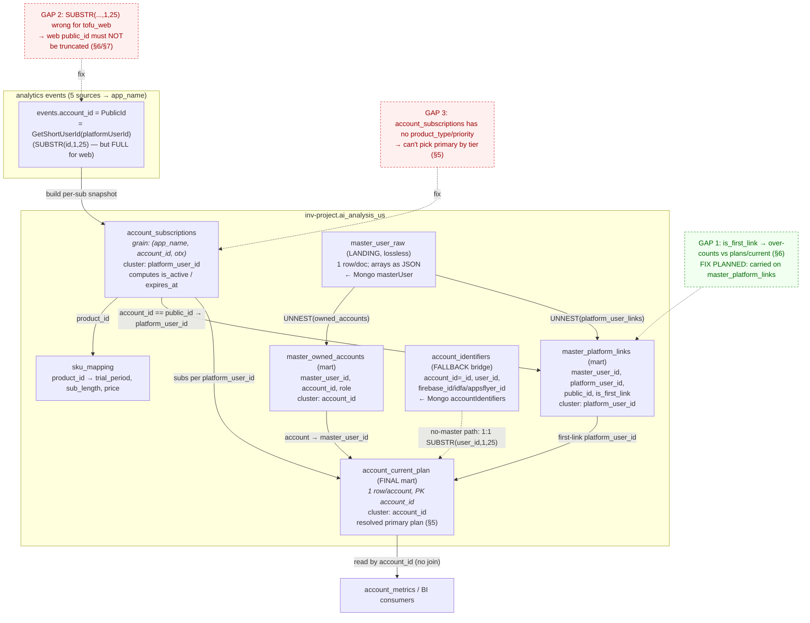
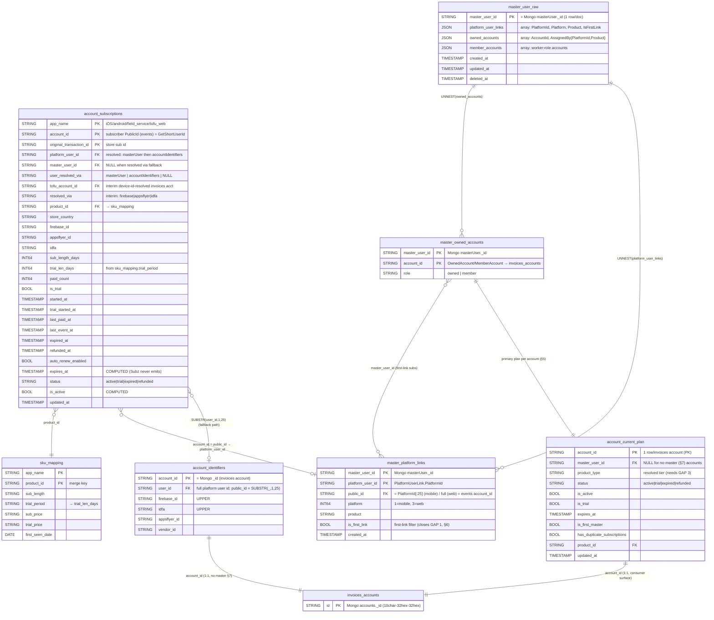

# ai_analysis_us — sku_mapping clone + account_subscriptions (WEB-1620)

**Status:** deployed 2026-06-18. Two daily Scheduled Queries live in `inv-project` (US), runner
`playfair-invoices@inv-project.iam.gserviceaccount.com`. Both write inside `inv-project` (no cross-project).

Companion to [`README.md`](README.md) (the playfair `dbt_external.sku_mapping` job). This doc covers the
two tables added in **`inv-project.ai_analysis_us`**.

## Table map & resolution (refined after backend investigation)

The four BQ subscription tables and how a subscription resolves to invoices accounts. Solid arrows = the
**deployed** join path; dashed red = **tuning gaps** the backend investigation (§5–§7) surfaced.



**Reading the resolution (mirrors backend `plans/current`):**
1. Subz analytics events carry `account_id` = the subscriber's **PublicId** (`GetShortUserId`, §6/§7).
2. `account_subscriptions` aggregates events to one row per `(app_name, account_id, otx)` and computes
   `is_active`/`expires_at` (backend instead trusts Subz — §5).
3. Resolve to invoices accounts via the master-level bridges: `account → master_owned_accounts →
   master_user_id → master_platform_links (is_first_link) → platform_user_id → account_subscriptions`
   (§6); **no-master** accounts take the `account_identifiers` 1:1 path (§7).
4. Join `sku_mapping` on `product_id` for trial length / price; materialize the per-account primary plan
   into **`account_current_plan`** (PK `account_id`) so consumers read it without joining.

See [`account_subscriptions_rebuild.sql`](account_subscriptions_rebuild.sql) for the live SQL and §5–§7 for
the backend logic each edge must match.

### ER diagram (BQ schema)

Columns and join keys of the four `inv-project.ai_analysis_us` subscription tables. `PK` marks the grain
key; `FK` marks the join key. `invoices_accounts` is the terminal target (Mongo/`accounts`, not in this
dataset) shown for context.



## 1. `ai_analysis_us.sku_mapping` — event-derived SKU catalog (clone)

Identical build logic to the playfair `dbt_external.sku_mapping` job; only the MERGE target changed to
`inv-project.ai_analysis_us.sku_mapping`. Because the job already runs/bills in `inv-project`, no
cross-project write is involved. Per-column logic: see [`sku-mapping-logic.md`](sku-mapping-logic.md) and
[`fields.md`](fields.md).

- **SQL:** [`sku_mapping_merge_ai_analysis_us.sql`](sku_mapping_merge_ai_analysis_us.sql) (insert-only MERGE).
- **Schema:** `app_name, product_id, sub_length, trial_period, sub_price, trial_price, first_seen_date`.
- **Rows:** 69 (the event-derived set). The playfair copy has 91 because it was seeded from the manual
  `tofu_sku_mapping` catalog first; this fresh table holds only what events produce.
- **Schedule:** `sku_mapping daily upsert (ai_analysis_us)` — `transferConfigs/6a62cdb1-0000-29a5-a256-3c286d38a092`, every 24h.
- **Cost:** ~5 GB/run ≈ $0.025/day.

## 2. `ai_analysis_us.account_subscriptions` — active subscription + expiration

Per-subscription snapshot, **rebuilt daily** (`CREATE OR REPLACE TABLE … AS SELECT`). **Clustered by `platform_user_id`.**

- **Grain:** one row per `(app_name, account_id, original_transaction_id)`. Trials included.
- **SQL:** [`account_subscriptions_rebuild.sql`](account_subscriptions_rebuild.sql).
- **Schedule:** `account_subscriptions daily rebuild (ai_analysis_us)` — `transferConfigs/6a54e8ab-0000-27f6-a17e-94eb2c0451f8`, every 24h.
- **Cost:** ~5.3 GB/run ≈ $0.026/day.

### account_id is the SUBSCRIBER, resolved to the PLATFORM USER (who owns N invoices accounts)
`analytics.events.account_id` is the account's **PublicId** — written by the Subz per-store analytics writers
(`Subz.IOS…/BigQuery/BigQueryEvent.cs:102`, `Subz.Android…/Tracking/BigQueryEvent.cs:84`: `account_id =
_account.PublicId`). PublicId = the **first 25 chars of the platform user id** (`Invoices.Core/Models/Account.cs:72`
`GetShortUserId`, used in `AccountController.cs:190`). It is a Subz/platform-user id, NOT the invoices account
id (`10char-32hex-32hex`), and is not stored on the invoices `accounts` collection.

**Correct bridge — via the platform user (the §3 masterUser-derived marts):**
`events.account_id (PublicId) == SUBSTR(masterUser…PlatformId, 1, 25)` → `master_user_id` → `OwnedAccounts[].AccountId`
(**one platform user owns N invoices accounts** — ~70K users own 2+). Resolution order used in
`account_subscriptions`:
1. **masterUser** first → `platform_user_id` + `master_user_id` (owned accounts via `master_owned_accounts`,
   links/`is_first_link` via `master_platform_links` — §3).
2. **accountIdentifiers** fallback (table 4) → recovers the full `platform_user_id` from its `UserId`
   (since PublicId = `SUBSTR(UserId,1,25)`) when the user has no masterUser doc (anonymous/unlinked).

Coverage: masterUser alone ~31% all / ~63% last-30d (authenticated users only); **masterUser + accountIdentifiers
fallback = 96.5% of subs** (masterUser 202K, fallback 684K, unresolved 3.5%). `user_resolved_via` records the source.
`account_subscriptions` is **one row per subscription** (per platform user); expand to accounts by joining
`master_user_id` → `master_owned_accounts` (the final per-account view is materialized as `account_current_plan`, §3).

## 3. masterUser-derived tables — three-layer design

**Status: built 2026-06-19** (one-off, via the `*.sql` files in this folder + `rebuild_master_marts.sh`).
First-build counts: `master_user_raw` 419,103 docs → `master_owned_accounts` 459,964 rows (459,898 distinct
accounts, 66 member) · `master_platform_links` 422,707 links (**415,168 first-link** = 98.2%; web 123,026 all
kept full-length, mobile 299,681 truncated to 25) · `account_current_plan` 1,062,770 accounts (active 39,204 ·
trial 1,089 · expired 957,873; 783,591 via the no-master path). ⚠️ **Not yet scheduled** — these are manual
rebuilds; the legacy `platform_user_accounts` + its `reload_master_user.sh` are left untouched (the deployed
`account_subscriptions` scheduled query still reads it). `account_current_plan` is **v0**: ordering by
`is_active`→expiry only, tier-priority pending GAP 3 (§5).

Decided after the backend investigation (§5–§7). Do **not** mirror the Mongo doc into one array-typed table,
and do **not** keep the deployed `link × account` cartesian. The `masterUser` model only covers
authenticated/linked users → not all subscribers are present (hence the accountIdentifiers fallback, §4).

**Why two bridge marts, not one (master, platform_user, account) grain:** a subscription is a **master-level**
attribute — `plans/current` aggregates subs across **all** of the master's first-link platform users and
surfaces the primary on **any** of the master's accounts, regardless of which link assigned a given account
(§6). So the account ↔ subscription relationship is `account → master_user_id → (first-link) platform_user_id
→ subs`. An `AssignedBy`-joined `(platform_user, account)` grain answers the *wrong* question (which link
created an account = provenance), so we split `owned_accounts` and `platform_user_links` into two independent
marts that both key on `master_user_id`. No cartesian, no `AssignedBy` matching needed for subscriptions.

### Layer 1 — `master_user_raw` (landing, lossless mirror)
One row per `masterUser` document; nested arrays kept as **`JSON` columns** (not native `REPEATED RECORD`).
- Schema: `master_user_id STRING, platform_user_links JSON, owned_accounts JSON, member_accounts JSON,
  created_at, updated_at, deleted_at`.
- Why `JSON` not native arrays: the Atlas snapshot is **MongoDB Extended JSON** (`$oid`/`$numberInt`) with
  nested-array docs — autodetect fails on `$`-prefixed names (§4). Staging each doc as one row + `JSON`
  columns makes the reload a trivial dumb load; native `REPEATED` would need a load-time transform.
- Lossless: preserves `IsFirstLink` per link and `AssignedBy` per owned account → nothing thrown away; the two
  marts below (and any future provenance need) are rebuildable from it.
- ⚠️ **No auto-refresh** → re-run **[`reload_master_user.sh`](reload_master_user.sh)** periodically.

### Layer 2 — two flat bridge marts (each a single `UNNEST` of `master_user_raw`)
Kept as standalone tables (not just CTEs) because they're reused beyond subscriptions (ownership graph,
member/worker analytics, link provenance).

| Mart | Grain | Built from | Cluster by |
|---|---|---|---|
| **`master_owned_accounts`** | `(master_user_id, account_id)` + `role` (owned/member) | `UNNEST(owned_accounts)` (+ `member_accounts`) | `account_id` |
| **`master_platform_links`** | `(master_user_id, platform_user_id)` + `public_id, platform, product, is_first_link, created_at` | `UNNEST(platform_user_links)` | `platform_user_id` |

- `master_platform_links.public_id` = `SUBSTR(platform_user_id,1,25)` for mobile, **full** `platform_user_id`
  for web (`platform=3`) — ⚠️ **do NOT blanket-truncate**, §6/§7. This is the column events `account_id` joins.
- `is_first_link` lives on `master_platform_links` → **closes GAP 1** (§6); apply the first-link filter here.
- Cluster choices match the dominant access: `master_owned_accounts` is entered by `account_id`
  (account-centric point lookups + the accounts/account_metrics join); `master_platform_links` joins
  `account_subscriptions` on `platform_user_id` (same cluster key on both sides) and is also the `public_id`
  resolver inside the rebuild. At <1M rows clustering is a minor win — grain/join-key correctness matters more.

### Layer 3 — `account_current_plan` (final per-account mart, the primary consumer surface)
The end-state for WEB-1620/1555 account metrics: **one row per invoices account** with the already-resolved
primary plan, so consumers (`account_metrics`, BI) never join. **Grain `account_id` (PK), `CLUSTER BY
account_id`.** Rebuilt daily from the consumer query below + the §5 `GetPrimarySubscription` logic.
- Columns (mirror `PlanDto`, §5): `account_id, master_user_id, product_type, status, is_active, is_trial,
  expires_at, started_at, auto_renew_enabled, product_id, adapter/app_name, has_duplicate_subscriptions,
  is_first_master, updated_at`.
- Accounts with **no master** (anonymous) resolve via the §7 `account_identifiers` path and are unioned in.

```sql
-- account_current_plan build (master path; UNION the no-master §7 path)
WITH first_links AS (                                   -- master → its first-link platform users
  SELECT DISTINCT master_user_id, platform_user_id
  FROM `…ai_analysis_us.master_platform_links` WHERE is_first_link
),
account_subs AS (                                       -- every (account, candidate sub)
  SELECT oa.account_id, oa.master_user_id, s.*
  FROM `…ai_analysis_us.master_owned_accounts` oa       -- account → master   (cluster: account_id)
  JOIN first_links fl ON fl.master_user_id = oa.master_user_id
  JOIN `…ai_analysis_us.account_subscriptions` s        -- platform user → subs (cluster: platform_user_id)
    ON s.platform_user_id = fl.platform_user_id
)
SELECT account_id, …                                    -- pick primary per account_id:
FROM account_subs
QUALIFY ROW_NUMBER() OVER (                              --   §5 order: active first, tier desc, expiry desc
  PARTITION BY account_id
  ORDER BY is_active DESC, product_type_priority DESC, COALESCE(expires_at, TIMESTAMP '9999-12-31') DESC
) = 1;
```
Note `product_type_priority` requires **GAP 3** (a `product_type`/priority column on `account_subscriptions`, §5).

### Legacy table (still live, pre-refactor)
The original `platform_user_accounts` (one row per `(PlatformUserLink × OwnedAccount)`, ~468K pairs, **no
`is_first_link`**) and its `reload_master_user.sh` remain in place because the deployed `account_subscriptions`
scheduled query (`mu_map`) still reads it. Migrating that query to `master_platform_links` (and dropping the
legacy table) is the remaining cutover step; until then both coexist.

## 4. `ai_analysis_us.account_identifiers` — fallback bridge (device ids + UserId)

Loaded from the Atlas `accountIdentifiers` collection by the **tofu-ai SA**. Columns:
`account_id (= _id, invoices account), user_id, firebase_id (UPPER), idfa (UPPER), appsflyer_id, vendor_id`.
8.19M rows. Used here only as the **fallback** to recover `platform_user_id` from `SUBSTR(user_id,1,25)`.
(The earlier interim `tofu_account_id` columns on `account_subscriptions` — a direct device-id→account guess —
are kept for reference but superseded by the platform-user path.)
- ⚠️ **No auto-refresh** → re-run **[`reload_account_identifiers.sh`](reload_account_identifiers.sh)** periodically.
- Both Atlas loads handle **MongoDB Extended JSON** (`$numberInt`/`$oid`) by staging each line as one raw STRING
  and parsing with `JSON_VALUE` (autodetect fails on `$`-prefixed field names).

### Expiration is computed (Subz never emits an expiry timestamp)
Confirmed in Subz code (`EnrichedSubscriptionExpiredEventHandler` carries only `Duration`). Mirrors the
Playfair DWH `subs_user_subscriptions_periods` pattern:
- `expires_at` = `last subscription_paid.event_time + sub_length_days` (trial-only:
  `trial_started.event_time + trial_period_days`, fallback **7 days** when trial length unknown — never the
  full sub length).
- Overridden by an explicit `subscription_expired` (natural expiry) or `subscription_cancelled` (= refund,
  per Subz this event maps from the **Refunded** handler with a negative price).

### Status / active semantics
- `status` ∈ {`active`, `trial`, `expired`, `refunded`}; `refunded` wins, then explicit `expired`, then
  `expires_at < now` ⇒ `expired`, else `trial` (paid_count=0 & has trial) / `active`.
- `is_active` BOOL = not refunded, not explicitly expired, computed `expires_at >= now`. (Grace periods are
  not separately modelled; Subz treats grace as active — events don't expose the grace window.)
- `auto_renew_enabled` = latest `renew_state_changed.renew_enabled` (NULL if never emitted).

### Columns
`app_name, account_id, platform_user_id, master_user_id, user_resolved_via, tofu_account_id, resolved_via,
original_transaction_id, product_id, store_country, firebase_id, appsflyer_id, idfa, sub_length_days,
trial_len_days, paid_count, is_trial, started_at, trial_started_at, last_paid_at, last_event_at, expired_at,
refunded_at, auto_renew_enabled, expires_at, status, is_active, updated_at`.

Join to invoices accounts via `master_user_id` → `master_owned_accounts.account_id` →
`accounts`/`invoices`/`account_metrics` (one subscription → potentially several accounts).
`platform_user_id` is the full id sent to Subz; `user_resolved_via` ∈ {masterUser, accountIdentifiers, NULL}.

### First-run shape (2026-06-18)
918,876 subs / 766,609 store accounts; status: expired · refunded 31,393 · active 24,138 · trial 1,403
(`is_active` = 25,540). Resolved to invoices account: **888,961 (96.7%)** — via appsflyer 447,987 ·
firebase 431,839 · idfa 9,135 · unresolved 29,915.

## 5. Backend reference — how Invoices.Backend picks the active / current subscription

This is the **authoritative selection logic** the BQ `account_subscriptions` table should align with.
It lives in `Invoices.Backend` (the BFF), surfaced via `GET /api/plans/current` (single primary plan) and
`GET /api/plans/active` (all active plans, one flagged `IsPrimary`).

### Selection algorithm (the "primary" subscription)
`Invoices.Implementation.Services/Subscription/AccountSubscriptionExtensions.cs:9` — `GetPrimarySubscription()`:

```csharp
subscriptions
    .Where(s => s.IsActive)                                      // 1. active only
    .OrderByDescending(s => s.ProductType.GetPriority())         // 2. highest tier wins
    .ThenByDescending(s => s.ExpirationTime ?? DateTime.MaxValue) // 3. then latest expiry (null = never-expires = wins)
    .FirstOrDefault()
?? subscriptions.MaxBy(t => t.StartTime);                        // 4. fallback: most recently STARTED (even if inactive)
```

So the order is **tier first, expiration second**: a higher-tier active sub beats a longer-running lower
tier. If nothing is active, the backend still returns the most recently started sub (with `IsActive=false`),
**not** null — see `PlansService.ResolvePlanAsync` (`Plans/PlansService.cs:109`), which only returns the
empty `ProductType.Unknown` plan when there are **zero** subscriptions at all.

### Tier priority (`ProductType.GetPriority`)
`Invoices.Core/Models/ProductTypePriority.cs:5` — higher number wins:

| ProductType | Priority |
|---|---|
| `FsmBusiness` | 6 |
| `FsmTeam` | 5 |
| `FsmSolo` | 4 |
| `Invoicing` | 3 |
| `Premium` | 2 |
| `Plus` | 1 |
| `Unknown` | 0 |

`ProductType` is **derived from `ProductId`** by the plan-info provider during mapping
(`Subscription/SubscriptionService.cs` → `MapToAccountSubscription`), not stored on the event.

### ⚠️ Key divergences from the BQ table (what to reconcile when tuning)
1. **`IsActive` / `ExpirationTime` are NOT computed by the backend** — they come straight from **Subz**
   (`SubscriptionService.MapToAccountSubscription` copies `s.IsActive`, `s.ExpirationTime`,
   `s.CurrentTime`, `s.IsAutoRenewEnabled`, `s.IsTrial` verbatim). The BQ table instead *computes*
   `expires_at` from `last_paid_at + sub_length_days` and derives `is_active`/`status` itself. **Subz is the
   source of truth for activity**; the BQ computation is an approximation of what Subz returns, so expect
   drift around grace periods, billing-retry windows, and store-side state the events don't carry.
2. **Grain differs.** BQ grain = `(app_name, account_id, original_transaction_id)` (one row per subscription).
   The backend's "current plan" is **one row per platform user** (it aggregates subs across all the master
   user's `ProductUser`s — multiple platform user ids — then picks a single primary). To reproduce
   `plans/current` from BQ: take all subs for a `master_user_id` (join via `master_owned_accounts` +
   `master_platform_links`, §3), filter `is_active`, then `ORDER BY tier_priority DESC, expires_at DESC` and
   take the first; if none active, fall back to `MAX(started_at)` — this is exactly the `account_current_plan`
   build (§3).
3. **Tie-break is tier-then-expiry, not expiry-only.** The BQ table currently has no tier/priority column;
   to mirror primary selection, BQ needs a `product_type` + priority derived from `product_id`.
4. **Duplicate active subs.** When >1 *renewing* sub exists (`IsRenewing = IsActive && IsAutoRenewEnabled != false`),
   backend flags `HasDuplicateSubscriptions` and schedules a notification (`PlansService.cs:138`). BQ can detect
   the same condition with `COUNTIF(is_active AND auto_renew_enabled) > 1` per platform user.
5. **`Stripe`/`Paddle` only** get a resolved `Price` and customer-portal link (`SupportedAdaptersForPlans`,
   `PlansService.cs:23`); app-store subs carry no price (matches the `sku_mapping` blank-price design).

### Field mapping (backend `AccountSubscription` → BQ `account_subscriptions`)
| Backend (`Invoices.Core/Models/Subscription/AccountSubscription.cs`) | BQ column | Note |
|---|---|---|
| `IsActive` (from Subz) | `is_active` | BQ computes; backend trusts Subz |
| `ExpirationTime` (from Subz) | `expires_at` | BQ computes from `last_paid + sub_length` |
| `ProductId` | `product_id` | |
| `ProductType` (derived) | — | **missing in BQ** — add to mirror tier priority |
| `StartTime` | `started_at` | fallback sort key |
| `IsTrial` | `is_trial` | backend from Subz; BQ derives `paid_count=0 & has trial` |
| `IsAutoRenewEnabled` | `auto_renew_enabled` | |
| `AdapterType` (Apple/Google/Stripe/Braintree/Paddle) | `app_name` (proxy) | not 1:1 — adapter ≠ store app |
| `UserId` (platform user id) | `platform_user_id` | grain anchor |

## 6. Backend reference — platform-user / master-user resolution (what feeds `plans/current`)

How `Invoices.Backend` goes from an invoices `AccountId` to the set of platform users whose subscriptions
count toward the current plan. **This is the model the BQ bridges (`master_owned_accounts` /
`master_platform_links` / `account_identifiers`, §3) approximate** — align them with the rules below.

### Domain shape
- **`MasterUser`** (`Invoices.Core/Models/MasterUser.cs:16`) — aggregate root, stored in Mongo. Holds
  `PlatformUserLinks[]` + `OwnedAccounts[]` (+ optional `MemberAccounts[]` = worker roles).
  `AllAccountIds` = owned ∪ member.
- **`PlatformUserLink`** (`MasterUser.cs:181`) — `{ PlatformId, Platform (IOS/Android/Web), Product,
  IsFirstLink, OriginalEmail, CreatedAt }`. One master can link at most one platform user per
  `(Platform, Product)` (`UpdatePlatformUserLink` throws `PlatformAlreadyTakenException` otherwise).
- **`ProductUser`** (`Invoices.Core/Models/ProductUser.cs:3`) — `(PlatformUserId, ProductKey)`; the minimal
  unit `PlansService` fetches subscriptions for.

### ⭐ The critical rule: only `IsFirstLink` platform users feed subscriptions
`MasterUser.GetFirstLinkProductUsers()` (`MasterUser.cs:176`) filters to **`IsFirstLink == true`** links only:
```csharp
PlatformUserLinks.Where(w => w.IsFirstLink).Select(w => new ProductUser(w.PlatformId, w.Product))
```
`PlansController.GetProductUsersAsync()` (`PlansController.cs:116`):
- **anonymous / no master** → single `ProductUser(account.UserId, ProductKey)`.
- **has master** → `masterUser.GetFirstLinkProductUsers()`.

So a master that re-linked an **already-claimed** store/platform user (`IsFirstLink=false`) does **NOT** see
that platform user's subscriptions in `plans/current`. This prevents one store subscription from being
counted by multiple masters — the **first** master to link a platform user "owns" its subscription.

**BQ impact (tuning gap):** the deployed `platform_user_accounts` has no `is_first_link` column, so a naive
`master_user_id → subs` join over-counts vs the backend. The §3 redesign carries `is_first_link` on
`master_platform_links`; the BQ join must filter to first-link platform users — OR resolve
the **first owner** per `platform_user_id` (the `FindFirstOwnerFor`-equivalent, `MasterUserRepository`,
ordered by `CreatedAt`).

### How `IsFirstLink` is decided (`AuthService.TryRegister`, `AuthService.cs`)
On register/link, `platId = explicit ?? master.FindPlatformUserLink(platform, product)?.PlatformId ?? masterUserId`.
Then:
```csharp
firstOwner = _masterUserRepository.FindFirstOwnerFor(platId)       // earliest master to ever link platId
isFirstEverLink = firstOwner == null                               // nobody owned it → this is first
   || (firstOwner.Id == thisMasterId && firstOwner has a link for (platId,platform,product) with IsFirstLink)
```
`IsFirstLink` is set once at link-creation (`UpdatePlatformUserLink`, `MasterUser.cs:81`) and is **never
flipped** on an existing link (`UpdateLink` only backfills email).

### `IsFirstMaster` (client-facing, on `PlanDto`)
`Mapping.ToPlanDto` (`Invoices.Api/Models/Mapping.cs`): `IsFirstMaster =
masterUser?.FindPlatformUserLink(platform, productKey)?.IsFirstLink ?? true`. I.e. the `IsFirstLink` of the
**current** product/platform link, defaulting to `true` for anonymous users. It tells the client whether
this master is the original owner of its platform-user link (affects trial/upgrade UX).

### `account_id` (events) = `GetShortUserId`, NOT `GetPublicId` — don't confuse them
Two distinct "public ids" exist in `Account.cs`:
- **`GetShortUserId(userId)`** (`Account.cs:72`) = `userId[..25]` — what's sent to **Subz** as `publicId`
  (`AccountController.PutIdentifiers` → `SubzAccount` `publicId = identifiers.PublicUserId ??
  GetShortUserId(userId)`, `AccountController.cs:190,208`). **This is the events `account_id`** the BQ table
  joins on. ⚠️ **For `Platform.Web` it is NOT truncated** (`GetShortUserId(id, platform)` returns the full id
  for Web, `Account.cs:74`) → the BQ `ai_map`/`mu_map` `SUBSTR(user_id,1,25)` derivation is correct for
  iOS/Android but **wrong for `tofu_web`** (web `account_id` = full platform user id / Stripe customer id).
  Tune the BQ `public_id` derivation to be platform-aware (no truncation for web).
- **`GetPublicId(accountId)`** (`Account.cs:63`) = account id with the last `-`-segment stripped — used only
  for logging/Intercom. **Unrelated** to the Subz/events `account_id`; do not use it for bridging.

### Resolution chain (request → subscriptions)
```
AccountAuthenticationMiddleware → AuthApiAuthenticationService.AuthenticateWithAuthApi
  → masterUserId = authUser.Id ; MasterUser = masterUsersRepository.Find(masterUserId)  (may be null)
  → AuthenticationInfo { MasterUserId, MasterUser?, AccountId }
PlansController.GetProductUsersAsync
  → master null  ⇒ [ ProductUser(account.UserId, ProductKey) ]
  → master set   ⇒ master.GetFirstLinkProductUsers()        // IsFirstLink only
PlansService.GetSubscriptionsAsync(productUsers)             // parallel Subz fetch per ProductUser
  → GetPrimarySubscription()  (see §5)
```

### Bridge-table alignment summary
| Backend concept | BQ bridge | Gap to tune |
|---|---|---|
| `MasterUser.Id` | `master_owned_accounts` / `master_platform_links.master_user_id` | ok |
| `PlatformUserLink.PlatformId` | `master_platform_links.platform_user_id` | ok |
| `PlatformUserLink.IsFirstLink` | `master_platform_links.is_first_link` (planned, §3) | required to match `plans/current` |
| `OwnedAccounts[].AccountId` | `master_owned_accounts.account_id` (`role=owned`) | `master_owned_accounts` also models `member`/worker accounts |
| `GetShortUserId(userId)` (publicId→Subz) | `events.account_id` / `public_id` | web must NOT be truncated to 25 |
| anonymous (no master) | `account_identifiers` fallback (`SUBSTR(user_id,1,25)`) | same web-truncation caveat |

## 7. Accounts WITHOUT a master user — the `account_identifiers` mirror

Not every account has a `masterUser` doc. The backend's no-master path is **exactly** what the BQ
`account_identifiers` fallback bridge (§4) models — so this is the path to validate that fallback against.

### Backend path (no master)
`PlansController.GetProductUsersAsync()` (`PlansController.cs:116`) — branch `AuthenticationInfo is
{ MasterUser: null } or null`:
```csharp
var userId = await _accountsRepository.GetUserIdAsync(AccountId);   // accountIdentifiers._id = AccountId → .UserId
return [ new ProductUser(userId, ProductKey) ];                     // single platform user, no aggregation
```
`GetUserIdAsync` (`AccountsRepository.cs:86`) reads the **`accountIdentifiers`** collection
(`_id = AccountId`, returns the **full, un-shortened `UserId`** = the platform user id). Then
`PlansService.GetCurrent(ProductUser, ct)` (`PlansService.cs:60`) fetches subscriptions for that one
platform user via Subz, with `accountId`/`masterUserId` = `null` (so **no duplicate-notification** path, §5).

### When does an account have no master?
- **Signature-authenticated / `[AllowAnonymous]`** requests → no `AuthenticationInfo` is built at all (the
  middleware only stores `AccountId`). This is the real no-master case in production (legacy iOS, pre-auth).
- Note: if a **Bearer** request authenticates but the `masterUser` doc is missing, the middleware
  *throws* `MasterUserNotFoundException` ("Should call auth first") — it does **not** silently fall through.
  So the `{ MasterUser: null }` arm is reached via signature/anonymous, not via authenticated-but-unlinked.

### Mapping to the BQ `account_identifiers` fallback (§4)
The `accountIdentifiers` Mongo collection IS the BQ `account_identifiers` source:
| Mongo `accountIdentifiers` | BQ `account_identifiers` | Note |
|---|---|---|
| `_id` (= invoices `AccountId`) | `account_id` | 1:1 with an account |
| `UserId` (full platform user id) | `user_id` | BQ derives `public_id = SUBSTR(user_id,1,25)` to match events `account_id` |
| `FirebaseId` / `Idfa` / `AppsflyerId` / `VendorId` | `firebase_id` / `idfa` / `appsflyer_id` / `vendor_id` | device ids |

So the no-master subscription resolution is **1:1 per account**: account → its own `UserId` →
`account_id (events) = GetShortUserId(UserId)` → Subz subs. The BQ fallback (`ai_map`:
`SUBSTR(user_id,1,25) → platform_user_id`) reproduces this correctly **for iOS/Android**.

### ⚠️ Caveats to tune
1. **Shared platform user.** `GetAccountsForUserId(userId)` (`AccountsRepository.cs:113`) is a real reverse
   lookup → **one `UserId` can back several accounts**. Each such account independently queries Subz with the
   same `platformUserId` and therefore sees the **same** subscription. In BQ this is the `user_id → account_id`
   fan-out (8.19M rows); `ai_map` collapses it with `ANY_VALUE`, which is fine for recovering `platform_user_id`
   but means a single sub legitimately maps to multiple accounts — match the grain you actually report on.
2. **Web not truncated (again).** No-master web accounts store the **full** `UserId`; events `account_id` for
   web is also full (`GetShortUserId(id, Web)` returns the id unchanged, `Account.cs:74`). The BQ
   `SUBSTR(user_id,1,25)` will **not** match for `tofu_web` — same fix as §6 (platform-aware, no web truncation).
3. **No-master subs are single-account only** — never aggregated across accounts (contrast the master path's
   `GetFirstLinkProductUsers()` fan-out). When reproducing `plans/current` from BQ, pick the resolution path by
   whether a `master_user_id` exists for the `platform_user_id`: master → §6 (first-link aggregation);
   otherwise → this §7 single-account path.

## Permissions note
The SA can CREATE tables, run DML, and CREATE scheduled queries in `inv-project` (the create call must omit
an explicit runner SA — naming itself triggers `iam.serviceAccounts.actAs`/org-policy denial). It CANNOT
list transfers (`transfers.get` on list denied) — fetch a config by full name instead. Auth/REST mechanics:
see [`README.md`](README.md) §"How to run things".
