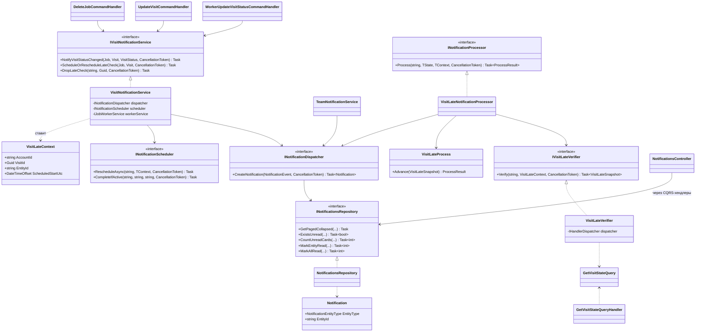

# backend-notifications — лента уведомлений о работе команды (implementation design)

Абстракции для четырёх типов уведомлений по визитам поверх существующего модуля `Invoices.Backend/Src/Notifications`: два поля у `Notification`, группировка на чтении, ручка колокольчика, `mark all read` и отложенный процесс «визит не начат вовремя». Ветка — `feature/notifications_001`.

Guardrail: продуктовые решения (место коллапса, механизм просрочки, проводка событий, общая прочитанность) уже зафиксированы в [`overview.md`](overview.md) — этот документ их не пересматривает, только раскладывает по типам и файлам.

**Source of plan:** [`overview.md`](overview.md).

## Decision

- **Единственный шов между модулями — `IVisitNotificationService`** в `Jobs.Application/Services/Notifications/`. Хендлеры визитов инжектят его, а не `INotificationDispatcher` и `INotificationScheduler` по отдельности: так связь Jobs → Notifications это один интерфейс с тремя методами, а не два внешних сервиса, размазанных по пяти хендлерам.
- **`Jobs.Application` получает ссылки на `Notifications.Contracts` и `Notifications.Domain`** — ровно так уже сделано в `Invoices.Payments/Invoices.Payments.csproj`, где `PaymentsService` создаёт уведомления. Новых слоёв композиции не вводим.
- **Payload собирается в `VisitNotificationService`**, где `Job` и `Visit` уже в памяти хендлера: `ScheduledStart = Visit.DateTime`, `ScheduledEnd = DateTime + DurationMinutes`, `ServiceName = Job.Title`, `Address = Job.ClientSnapshot?.Address`. Телефон воркера — через существующий `IJobWorkerService.GetTeamMember` (`Jobs.Application/Services/Workers/IJobWorkerService.cs:11`).
- **Процесс просрочки читает визит через CQRS-запрос, а не через ссылку на Jobs.Application.** `Notifications.Application` получает ссылку только на `Jobs.Contracts` и дёргает новый `GetVisitStateQuery` через `IHandlerDispatcher`. Обратная ссылка (`Jobs.Application` → `Notifications.Domain`) при этом циклом не становится: контракты Jobs ничего про Notifications не знают. Прямая ссылка на `Jobs.Application` дала бы цикл.
- **`GetVisitStateQuery` возвращает и состояние, и данные для карточки** (включая имя и телефон назначенного воркера, которые резолвит хендлер в Jobs.Application). Один запрос вместо «проверить статус, потом собрать payload» — процессору просрочки больше ничего не нужно.
- **Процессор просрочки пишет в ленту напрямую через `INotificationDispatcher`**, а не через `ProcessResult.Deliveries`. Иначе в `DeliveryRequest` пришлось бы добавлять третий вид доставки и ветку в `NotificationProcessHandler.ScheduleDeliveries` (`NotificationProcessHandler.cs:107-140`) — общий контракт движка ради одного процесса менять не стоит.
- **`WorkerJoinedTeam` дописывается в существующий `TeamNotificationService`** (`Invoices.Api/Services/TeamNotificationService.cs`), рядом с уже отправляемым пушем. Точка вызова `AuthorizationController.cs:79` не меняется.
- **Прочитанность карточки = прочитанность всех строк её сущности.** `MarkEntityRead` в репозитории; из этого следует, что `EXISTS` по непрочитанным строкам тождественен «есть непрочитанная карточка», и колокольчику не нужен пересчёт схлопнутого набора.
- **Группировка на чтении реализуется в репозитории, не в хендлере.** `GetPagedCollapsed` — новый метод `NotificationsRepository`; `GetNotificationsQueryHandler` меняет только вызываемый метод.

Всё ниже — поддерживающая детализация.

## Code layout

```
Invoices.Backend/Src/
├── Notifications/
│   ├── Notifications.Domain/
│   │   ├── NotificationType.cs                              # MODIFIED: +4 значения в конец enum
│   │   ├── NotificationSource.cs                            # MODIFIED: +Jobs, +Team
│   │   ├── NotificationEntityType.cs                        # NEW: None/Visit/Worker — тип сущности для группировки
│   │   ├── Models/Notification.cs                           # MODIFIED: +EntityType, +EntityId, Create(...) +2 параметра
│   │   ├── Models/NotificationEvent.cs                      # MODIFIED: +EntityType, +EntityId
│   │   ├── Interfaces/INotificationsRepository.cs           # MODIFIED: +4 метода (collapsed/exists/count/mark)
│   │   └── VisitLate/
│   │       ├── VisitLateState.cs                            # NEW: enum с единственным Pending — серии нет
│   │       ├── VisitLateProcess.cs                          # NEW: чистая машина состояний, решает «писать карточку или нет»
│   │       ├── IVisitLateVerifier.cs                        # NEW: порт, отдаёт свежее состояние визита
│   │       └── VisitLateSnapshot.cs                         # NEW: результат верификации (состояние + данные карточки)
│   ├── Notifications.Contracts/
│   │   └── Notifications/
│   │       ├── VisitLate/VisitLateContext.cs                # NEW: контекст Hangfire-процесса, EntityId = VisitId
│   │       └── Payloads/
│   │           ├── VisitNotificationPayload.cs              # NEW: jsonb-payload карточки визита
│   │           └── WorkerJoinedPayload.cs                   # NEW: jsonb-payload карточки приглашения
│   ├── Notifications.Application/
│   │   ├── Queries/GetNotificationsQueryHandler.cs          # MODIFIED: вызывает GetPagedCollapsed
│   │   ├── Queries/GetUnreadSummaryQueryHandler.cs          # NEW: exists + count карточек
│   │   ├── Commands/MarkNotificationReadCommandHandler.cs   # MODIFIED: помечает все строки сущности
│   │   ├── Commands/MarkAllNotificationsReadCommandHandler.cs # NEW: массовая отметка с отсечкой по времени
│   │   ├── VisitLate/VisitLateNotificationProcessor.cs      # NEW: INotificationProcessor, пишет карточку в ленту
│   │   ├── VisitLate/VisitLateVerifier.cs                   # NEW: читает визит через IHandlerDispatcher
│   │   ├── NotificationsMappings.cs                         # MODIFIED: маппинг новых типов/источников/EntityType
│   │   └── NotificationsModule.cs                           # MODIFIED: регистрация процессора и верификатора
│   └── Notifications.Infrastructure/
│       ├── Database/Configurations/NotificationConfiguration.cs # MODIFIED: 2 колонки, CHECK, 3 индекса
│       ├── Repositories/NotificationsRepository.cs          # MODIFIED: +GetPagedCollapsed/+ExistsUnread/+CountUnreadCards/+MarkEntityRead/+MarkAllRead
│       └── Migrations/<ts>_FS-XXXX_NotificationEntityRef.cs # NEW: миграция
├── Jobs/
│   ├── Jobs.Contracts/
│   │   ├── Jobs.Contracts.csproj                            # без изменений
│   │   └── Jobs/Queries/GetVisitStateQuery.cs               # NEW: состояние визита + данные карточки одним запросом
│   ├── Jobs.Application/
│   │   ├── Jobs.Application.csproj                          # MODIFIED: +Notifications.Contracts, +Notifications.Domain
│   │   ├── Services/Notifications/IVisitNotificationService.cs   # NEW: единственный шов Jobs → Notifications
│   │   ├── Services/Notifications/VisitNotificationService.cs    # NEW: собирает payload, пишет карточку, ставит/снимает процесс
│   │   ├── Queries/GetVisitStateQueryHandler.cs             # NEW: резолвит визит + имя и телефон воркера
│   │   ├── Worker/Commands/WorkerUpdateVisitStatusCommandHandler.cs # MODIFIED: эмиссия started/finished + снятие просрочки
│   │   ├── Commands/UpdateVisitCommandHandler.cs            # MODIFIED: перепланирование просрочки
│   │   ├── Commands/UpsertJobCommandHandler.cs              # MODIFIED: планирование просрочки для новых визитов
│   │   ├── Commands/AssignWorkerToVisitCommandHandler.cs    # MODIFIED: снятие просрочки при переасайне
│   │   ├── Commands/DeleteJobCommandHandler.cs              # MODIFIED: снятие просрочки
│   │   └── JobsModule.cs                                    # MODIFIED: регистрация IVisitNotificationService
└── Invoices.Api/
    ├── Controllers/NotificationsController.cs               # MODIFIED: +2 эндпоинта, [AuthorizeAction] на все
    ├── Dto/Notifications/NotificationResponseDto.cs         # MODIFIED: +EntityType/+EntityId, +новые значения enum
    ├── Dto/Notifications/UnreadSummaryResponseDto.cs        # NEW: hasUnread + count
    ├── Dto/Notifications/MarkAllReadRequestDto.cs           # NEW: readUpTo
    ├── Dto/Notifications/NotificationApiMappings.cs         # MODIFIED: маппинг новых значений
    └── Services/TeamNotificationService.cs                  # MODIFIED: +запись карточки WorkerJoinedTeam
```

Ключевой шов — `IVisitNotificationService`: всё, что Jobs знает про уведомления, проходит через него. В обратную сторону граница ещё жёстче: `Notifications.Application` видит Jobs только как `GetVisitStateQuery` из `Jobs.Contracts`, разрешаемый через `IHandlerDispatcher`.

## Contracts

```csharp
// Jobs.Application/Services/Notifications/IVisitNotificationService.cs
public interface IVisitNotificationService
{
    /// <summary> Карточка «начал»/«закончил» визит. Вызывается только из воркерского хендлера — этим
    /// обеспечивается фильтр «только действия воркера» без проверки актора в рантайме. </summary>
    Task NotifyVisitStatusChanged(Job job, Visit visit, VisitStatus previousStatus, CancellationToken ct);

    /// <summary> Поставить или переставить процесс просрочки под текущее расписание визита;
    /// снимает его, если визит уже начат, удалён или расписание в прошлом. </summary>
    Task ScheduleOrRescheduleLateCheck(Job job, Visit visit, CancellationToken ct);

    /// <summary> Снять процесс просрочки (старт визита, переасайн, удаление джоба). </summary>
    Task DropLateCheck(string accountId, Guid visitId, CancellationToken ct);
}
```

```csharp
// Notifications.Domain/NotificationEntityType.cs
public enum NotificationEntityType
{
    None = 0,   // карточка не схлопывается — текущие платёжные типы
    Visit = 1,
    Worker = 2
}

// Notifications.Domain/NotificationType.cs — добавляется в конец существующего enum
// VisitStarted, VisitFinished, VisitNotStartedOnTime, WorkerJoinedTeam

// Notifications.Domain/NotificationSource.cs — добавляется в конец
// Jobs, Team
```

```csharp
// Notifications.Contracts/Notifications/Payloads/VisitNotificationPayload.cs
public sealed record VisitNotificationPayload
{
    public required string VisitId { get; init; }
    public required string JobId { get; init; }
    public required string WorkerName { get; init; }
    public string? WorkerPhone { get; init; }        // отсутствует → клиент рисует "Open visit" вместо "Call"
    public required DateTimeOffset ScheduledStart { get; init; }
    public DateTimeOffset? ScheduledEnd { get; init; }
    public string? ServiceName { get; init; }
    public string? Address { get; init; }
}

// Notifications.Contracts/Notifications/Payloads/WorkerJoinedPayload.cs
public sealed record WorkerJoinedPayload
{
    public required string WorkerName { get; init; }
    public string? WorkerId { get; init; }
}
```

```csharp
// Notifications.Contracts/Notifications/VisitLate/VisitLateContext.cs
public record VisitLateContext : INotificationContext, IWithCorrelationId, IWithEntityId
{
    public static string ProcessType => "visit_late";

    public Guid CorrelationId { get; init; } = Guid.NewGuid();
    public required string AccountId { get; init; }
    public required Guid VisitId { get; init; }

    /// <summary> Один активный процесс на визит. </summary>
    public string EntityId => VisitId.ToString();

    /// <summary> Расписание, зафиксированное при постановке: токен валидности — сдвиг расписания
    /// пересоздаёт job, поэтому устаревший процесс самоотменяется на пробуждении. </summary>
    public required DateTimeOffset ScheduledStartUtc { get; init; }

    /// <summary> Момент пробуждения: ScheduledStart + порог. </summary>
    public required DateTime FirstWakeUtc { get; init; }
}
```

```csharp
// Notifications.Domain/VisitLate/IVisitLateVerifier.cs
public interface IVisitLateVerifier
{
    Task<VisitLateSnapshot> Verify(string accountId, VisitLateContext context, CancellationToken ct);
}

// Notifications.Domain/VisitLate/VisitLateSnapshot.cs
public sealed record VisitLateSnapshot
{
    public required bool IsStillPending { get; init; }   // визит существует, не удалён и всё ещё не начат
    public DateTimeOffset? ScheduledStart { get; init; } // расхождение с контекстом = расписание сдвинули
    public string? WorkerName { get; init; }
    public string? WorkerPhone { get; init; }
    public Guid JobId { get; init; }
    public string? ServiceName { get; init; }
    public string? Address { get; init; }
    public DateTimeOffset? ScheduledEnd { get; init; }

    public static VisitLateSnapshot NotPending() => new() { IsStillPending = false };
}

// Notifications.Domain/VisitLate/VisitLateState.cs
public enum VisitLateState { Pending }
```

```csharp
// Jobs.Contracts/Jobs/Queries/GetVisitStateQuery.cs
public sealed record GetVisitStateQuery(string AccountId, Guid VisitId) : IQuery<GetVisitStateResult>;

public sealed record GetVisitStateResult(VisitStateDto? Visit);

public sealed record VisitStateDto(
    Guid VisitId,
    Guid JobId,
    VisitStatusDto Status,
    bool IsDeleted,
    DateTimeOffset ScheduledStart,
    int? DurationMinutes,
    string? AssignedWorkerId,
    string? AssignedWorkerName,   // резолвится хендлером через IJobWorkerService
    string? AssignedWorkerPhone,
    string? ServiceName,          // Job.Title
    string? Address);             // Job.ClientSnapshot?.Address
```

```csharp
// Notifications.Domain/Interfaces/INotificationsRepository.cs — добавляемые члены
Task<(List<Notification> Items, NotificationsPaginationToken? NextToken)> GetPagedCollapsed(
    string targetAccountId, string? targetMasterUserId, bool? unread,
    NotificationType? type, int limit, NotificationsPaginationToken? token, CancellationToken ct);

Task<bool> ExistsUnread(string targetAccountId, string? targetMasterUserId, CancellationToken ct);

Task<int> CountUnreadCards(string targetAccountId, string? targetMasterUserId, CancellationToken ct);

/// <summary> Помечает прочитанными все строки сущности — иначе в схлопнутой ленте остаются
/// невидимые непрочитанные строки, которые продолжают светить точкой. </summary>
Task<int> MarkEntityRead(string targetAccountId, NotificationEntityType entityType, string entityId, CancellationToken ct);

Task<int> MarkAllRead(string targetAccountId, string? targetMasterUserId, DateTimeOffset readUpTo, CancellationToken ct);
```

```csharp
// Notifications.Contracts — CQRS-контракты новых эндпоинтов
public sealed record GetUnreadSummaryQuery(string TargetAccountId, string? TargetMasterUserId)
    : IQuery<GetUnreadSummaryResult>;
public sealed record GetUnreadSummaryResult(bool HasUnread, int Count);

public sealed record MarkAllNotificationsReadCommand(
    string TargetAccountId, string? TargetMasterUserId, DateTimeOffset ReadUpTo)
    : ICommand<MarkAllNotificationsReadResult>;
public sealed record MarkAllNotificationsReadResult(int Updated);
```

## Class skeletons

```csharp
// Jobs.Application/Services/Notifications/VisitNotificationService.cs
public sealed class VisitNotificationService : IVisitNotificationService
{
    public VisitNotificationService(
        INotificationDispatcher dispatcher,
        INotificationScheduler scheduler,
        IJobWorkerService workerService,
        IOptions<VisitLateOptions> options,
        ILogger<VisitNotificationService> logger) { /* … */ }

    public Task NotifyVisitStatusChanged(Job job, Visit visit, VisitStatus previousStatus, CancellationToken ct);
    public Task ScheduleOrRescheduleLateCheck(Job job, Visit visit, CancellationToken ct);
    public Task DropLateCheck(string accountId, Guid visitId, CancellationToken ct);
}
```

Маппинг перехода в тип: `Scheduled → InProgress` даёт `VisitStarted`, любой переход в `Completed` — `VisitFinished`, остальные переходы карточку не создают. Планирование просрочки пропускается, если визит уже начат/завершён, удалён или `ScheduledStart + порог` в прошлом. Все три метода — best-effort: исключение логируется и не пробрасывается, чтобы отказ уведомлений не отменял изменение визита (тот же приём, что в `TeamNotificationService.cs:46-49`).

```csharp
// Notifications.Domain/VisitLate/VisitLateProcess.cs
public sealed class VisitLateProcess
{
    public VisitLateProcess(VisitLateContext context) { /* … */ }

    /// <summary> Терминален всегда: карточка либо создаётся один раз, либо не создаётся вовсе. </summary>
    public ProcessResult<VisitLateState, VisitLateContext> Advance(VisitLateSnapshot snapshot);
}
```

Возвращает терминальный результат с флагом «карточку писать» через `Deliveries`-независимый путь: `Deliveries` остаётся пустым, а решение читает процессор (см. ниже). Отменяет себя, если визит начат, удалён или `snapshot.ScheduledStart != context.ScheduledStartUtc`.

```csharp
// Notifications.Application/VisitLate/VisitLateNotificationProcessor.cs
public sealed class VisitLateNotificationProcessor
    : INotificationProcessor<VisitLateState, VisitLateContext>
{
    public VisitLateNotificationProcessor(
        IVisitLateVerifier verifier,
        INotificationDispatcher dispatcher,
        ILogger<VisitLateNotificationProcessor> logger) { /* … */ }

    public Task<ProcessResult<VisitLateState, VisitLateContext>> Process(
        string accountId, VisitLateState state, VisitLateContext context, CancellationToken ct);
}
```

Мирроринг `PaymentReminderNotificationProcessor.cs:21-35`: верифицировать → прокрутить машину → при положительном решении создать карточку `VisitNotStartedOnTime` через диспетчер и вернуть терминальный результат.

```csharp
// Notifications.Application/VisitLate/VisitLateVerifier.cs
public sealed class VisitLateVerifier : IVisitLateVerifier
{
    public VisitLateVerifier(IHandlerDispatcher dispatcher, IClock clock) { /* … */ }

    public Task<VisitLateSnapshot> Verify(string accountId, VisitLateContext context, CancellationToken ct);
}
```

Диспетчеризует `GetVisitStateQuery`; отсутствующий, удалённый или уже начатый визит → `VisitLateSnapshot.NotPending()`.

```csharp
// Jobs.Application/Queries/GetVisitStateQueryHandler.cs
public sealed class GetVisitStateQueryHandler : IQueryHandler<GetVisitStateQuery, GetVisitStateResult>
{
    public GetVisitStateQueryHandler(IJobsRepository jobsRepository, IJobWorkerService workerService) { /* … */ }

    public Task<GetVisitStateResult> Handle(GetVisitStateQuery query, CancellationToken ct);
}
```

Ищет джоб по `JobSpecifications.ByVisitId(query.VisitId)` — та же спецификация, что в `WorkerUpdateVisitStatusCommandHandler.cs:36-38`, — и достаёт контакты воркера через `IJobWorkerService.GetTeamMember`.

```csharp
// Notifications.Application/Queries/GetUnreadSummaryQueryHandler.cs
public sealed class GetUnreadSummaryQueryHandler : IQueryHandler<GetUnreadSummaryQuery, GetUnreadSummaryResult>
{
    public GetUnreadSummaryQueryHandler(INotificationsRepository repository) { /* … */ }
    public Task<GetUnreadSummaryResult> Handle(GetUnreadSummaryQuery query, CancellationToken ct);
}

// Notifications.Application/Commands/MarkAllNotificationsReadCommandHandler.cs
public sealed class MarkAllNotificationsReadCommandHandler
    : ICommandHandler<MarkAllNotificationsReadCommand, MarkAllNotificationsReadResult>
{
    public MarkAllNotificationsReadCommandHandler(
        INotificationsRepository repository,
        ILogger<MarkAllNotificationsReadCommandHandler> logger) { /* … */ }
    public Task<MarkAllNotificationsReadResult> Handle(MarkAllNotificationsReadCommand command, CancellationToken ct);
}
```

```csharp
// Jobs.Application/Services/Notifications/VisitLateOptions.cs
public sealed class VisitLateOptions
{
    public const string SectionName = "Notifications:VisitLate";

    /// <summary> Насколько после запланированного старта визит считается просроченным. </summary>
    public TimeSpan Threshold { get; set; } = TimeSpan.FromMinutes(15);
}
```

## Class diagram



## Dependency injection

`Jobs.Application/JobsModule.cs` — рядом с существующими регистрациями сервисов:

```csharp
services.AddScoped<IVisitNotificationService, VisitNotificationService>();
services.Configure<VisitLateOptions>(configuration.GetSection(VisitLateOptions.SectionName));
```

`Notifications.Application/NotificationsModule.cs:49-54` — по образцу двух существующих процессоров:

```csharp
services.AddKeyedScoped<INotificationProcessor<VisitLateState, VisitLateContext>>(
    VisitLateContext.ProcessType,
    (sp, _) => sp.GetRequiredService<VisitLateNotificationProcessor>());
services.AddScoped<VisitLateNotificationProcessor>();
services.AddScoped<IVisitLateVerifier, VisitLateVerifier>();
```

CQRS-хендлеры (`GetUnreadSummaryQueryHandler`, `MarkAllNotificationsReadCommandHandler`, `GetVisitStateQueryHandler`) подхватываются существующей сборочной регистрацией хендлеров — `AddNotificationsHandlers()` и её аналогом в Jobs; отдельных строк не требуют. Ключ конфигурации `Notifications:VisitLate:Threshold` добавляется в `Invoices.Api/appsettings.json` и `Invoices.Worker/appsettings.json`.

Проектные ссылки: `Jobs.Application.csproj` += `Notifications.Contracts`, `Notifications.Domain`; `Notifications.Application.csproj` += `Jobs.Contracts`.

## Open questions

- `PermissionKeys.Worker.View` как гейт для всех четырёх эндпоинтов — нужно подтвердить, что у роли Worker этого ключа нет в текущем сиде permissions (`TBD — verify`, перенесено из `overview.md`).
- Порог просрочки 15 минут — дефолт из плана; на макете чип показывает `24 min late`, то есть значение продуктом не зафиксировано.
- `Notifications.Application` → `Jobs.Contracts`: ссылку надо проверить на отсутствие транзитивного цикла при сборке (`Jobs.Contracts` тянет `Invoices.Common`, который Notifications уже использует — цикла не ожидается, но подтвердить сборкой).
