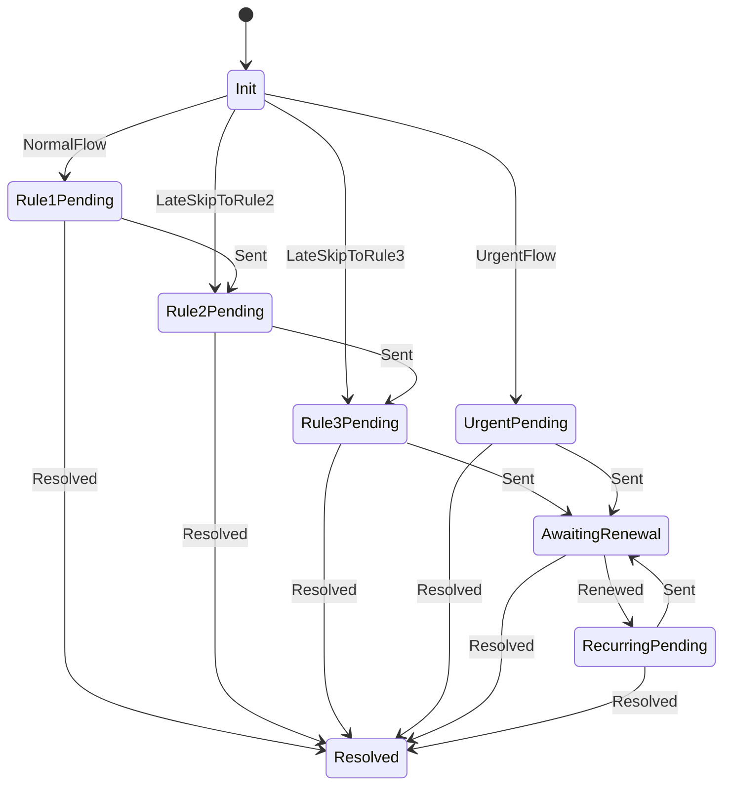

# 3. Duplicate Subscription Notification Flow

State machine for double-charge notifications using `stateless` library in a rich domain model. Built on Phase 2 ([2.1](2_1_hangfire_infrastructure.md), [2.2](2_2_notification_scheduler.md), [2.3](2_3_notification_process_handler.md)).

## Architecture

```
PlansService.GetCurrent()
  ↓ detects duplicates (Phase 1)
  ↓ _notificationScheduler.ScheduleAsync("duplicate_subscription", context)
  ↓
NotificationProcessHandler (generic, Phase 2)
  ↓ loads state from job params, job_id retry guard
  ↓ builds NotificationProcess → model.Advance()
  ↓ enqueues deliveries + schedules next job (atomic)
  ↓
NotificationProcess (this phase — rich domain model)
  ↓ stateless state machine: Init → Rules → Renewal → Recurring
  ↓ re-verifies from Subz at each step
  ↓ returns ProcessResult
  ↓
EmailDeliveryJob / PushDeliveryJob (generic, Phase 2)
```

## Detection (in PlansService)

When `hasDuplicates` detected, schedule via `INotificationScheduler`:

```csharp
await _notificationScheduler.ScheduleAsync(
    accountId,
    processType: "duplicate_subscription",
    context: new DuplicateSubContext { /* billing switch, expiration, adapter types */ },
    ct);
```

## Context

```csharp
public record DuplicateSubContext
{
    public string? MasterUserId { get; init; }
    public DateTime BillingSwitchAt { get; init; }
    public DateTime DuplicateExpirationTime { get; init; }  // updated on renewal
    public AccountSubscriptionAdapterType DuplicateAdapterType { get; init; }
    public string DuplicateProductKey { get; init; }
    public AccountSubscriptionAdapterType PrimaryAdapterType { get; init; }
    public string PrimaryProductKey { get; init; }
}
```

Travels in Hangfire job params. Updated via `ProcessResult.UpdatedContext` when `DuplicateExpirationTime` changes on renewal.

## Subscription Verification

```csharp
public interface ISubscriptionVerifier
{
    Task<SubscriptionVerificationResult> VerifyAsync(
        string accountId, DuplicateSubContext context, CancellationToken ct);
}
// Returns: IsStillDuplicate, NewExpirationTime (if renewed)
```

Called by handler before `model.Advance()`. Model has no async dependencies.

## State Machine



Every non-Init state re-verifies from Subz. If subscription resolved → `Resolved`.

### Transitions

| State | Wake Time | Send | Next State |
|-------|-----------|------|------------|
| `Init` | immediate | — | first applicable (see late detection) |
| `Rule1Pending` | switchAt + 24h | email | `Rule2Pending` |
| `Rule2Pending` | switchAt + 3d | email + push | `Rule3Pending` |
| `Rule3Pending` | chargeTime - 48h | email + push | `AwaitingRenewal` |
| `UrgentPending` | switchAt + 1h | email + push | `AwaitingRenewal` |
| `AwaitingRenewal` | chargeTime | — | `RecurringPending` or `Resolved` |
| `RecurringPending` | newCharge - 48h | email + push | `AwaitingRenewal` |

**Late detection**: `Init` checks current time vs rule times, skips to latest overdue state. Earlier rules are not sent.

### Stateless Configuration

```csharp
// Each state permits: Trigger.Sent → next state, Trigger.Resolved → Resolved
// Init permits: NormalFlow → Rule1Pending, UrgentFlow → UrgentPending
// AwaitingRenewal permits: Renewed → RecurringPending, Resolved → Resolved
// Invalid transitions throw InvalidOperationException
```

## NotificationProcess (Rich Domain Model)

Encapsulates state machine logic. Pure — no async, no DB. Receives `SubscriptionVerificationResult`, returns `ProcessResult<DuplicateSubscriptionState>`. All states are enum values — no string conversions.

```
Advance(now, context, verification) → ProcessResult:
  if not Init and !verification.IsStillDuplicate → fire Resolved, return terminal

  match CurrentState (enum):
    Init        → determine first state based on timing (normal/urgent/late)
    Rule*       → build deliveries, fire Sent, return { NewState = enum, wake time }
    Urgent      → same as Rule3 but with preCharge type
    AwaitingRenewal → if renewed: update context with new expiration,
                      fire Renewed, return { NewState = RecurringPending }
    Recurring   → build deliveries (type=recurring), fire Sent,
                  return { NewState = AwaitingRenewal, wake = chargeTime }
```

`ProcessResult.NewState` is `DuplicateSubscriptionState` enum — passed directly to the next Hangfire `Schedule()` call. Hangfire serializes enums natively.

Delivery building: uses `DuplicateSubContext` to populate `EmailDeliveryParams` (SendGrid template + params) and `PushDeliveryParams` (OnePush template). Rule1 is email-only, all others are email + push.

## Email Templates ([WEB-1248](https://app.clickup.com/t/869cjuybk))

SendGrid: `d-e71e8740b455461394c60d524ad7846d` | Brevo: `#32`

| Type | Subject |
|------|---------|
| `24hNotice` | Action needed: Avoid double charges |
| `3dReminder` | Reminder: Cancel your Apple subscription |
| `preCharge` | Urgent: Avoid double charges |
| `recurring` | Notice: Active Apple subscription detected |

Params: `{ type, subject, subscription_name, date }` | [Figma](https://www.figma.com/design/9B37t6gnYeC52eZ9vaSErf/Multi-platform-subs?node-id=1439-6552&m=dev)

## Testing

| Scenario | Expected |
|----------|----------|
| No duplicates | No scheduling |
| Duplicates → repeated calls | First inserts, subsequent skip (idempotent) |
| Normal flow, charge in 30 days | Init → Rule1 → Rule2 → Rule3 → AwaitingRenewal |
| Urgent, charge in 20 hours | Init → Urgent → AwaitingRenewal |
| Late detection, 4 days after switch | Init → Rule2 (immediately) → Rule3 → ... |
| Sub cancelled mid-flow | Next wake-up → Resolved, no delivery |
| Sub renewed | AwaitingRenewal → RecurringPending → AwaitingRenewal (loop) |
| Invalid transition | `InvalidOperationException` from stateless |
| Retry after commit | job_id mismatch → skip (no duplicate) |
