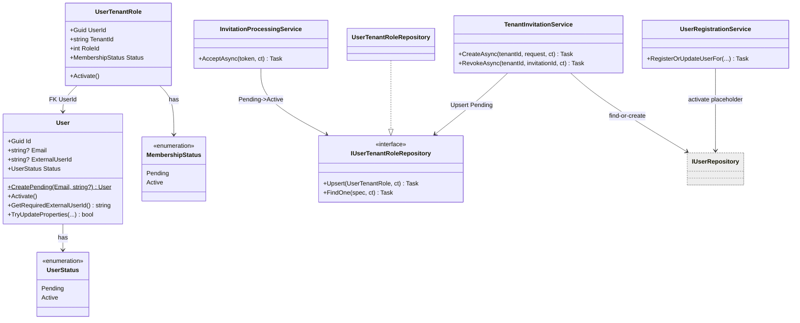

# draft-assign-worker-before-accept — Phase 1 Tofu.Auth.Backend (implementation design)

Pre-провижн стабильного `workerId == User.Id` в момент создания инвайта: при инвайте заводится
placeholder `User(Pending)` (без `ExternalUserId`) и `UserTenantRole(Pending)`; реальный
аутентифицированный пользователь связывается с placeholder по email на первом входе / accept,
переводя обе сущности в `Active`. Всё аддитивно. **Scope guardrail:** это design только для
**Phase 1 (Tofu.Auth.Backend, producer)**. Phase 2 (Invoices.Backend / BFF gating, `/api/team/members`)
— отдельный заход после деплоя Phase 1, здесь не проектируется; источник истины по скоупу —
[`README.md`](README.md).

**Source of plan:** [`README.md`](README.md) (Option A — pending-membership с пре-провижном `User`).

## Decision

- **Два доменных состояния, оба enum `int`, дефолт `Pending = 0`, бэкофилл существующих строк в `Active`:**
  - `User.Status : UserStatus { Pending = 0, Active = 1 }` — `src/Tofu.Auth.Domain/Models/UserStatus.cs` (новый).
  - `UserTenantRole.Status : MembershipStatus { Pending = 0, Active = 1 }` — `src/Tofu.Auth.Domain/Models/MembershipStatus.cs` (новый).
- **`User.ExternalUserId` становится `string?`** (сейчас `string`, non-null). Placeholder создаётся
  без него. Уникальный индекс по `ExternalUserId` меняется на **частичный** `WHERE "ExternalUserId" IS NOT NULL`
  — ровно как уже сделано для `Email`. Это честная модель «у placeholder ещё нет внешнего логина»
  вместо синтетической заглушки. **Blast radius nullable — 4 чтения** (`UserInfoService`, `TokenService`,
  `HandoffTokenService`), все на уже активном аутентифицированном юзере; закрываются методом
  `User.GetRequiredExternalUserId()` (бросает, если null) — без `!`-подавлений, чтобы не ловить
  `TreatWarningsAsErrors`.
  - _Отвергнута_ синтетическая `ExternalUserId = "pending:{guid}"` (нулевой ripple, но протекает
    фиктивное значение в логи/токены и ломает семантику «нет внешнего логина»).
- **`User` получает фабрику `CreatePending(Email, string? name)` и `Activate()`** (идемпотентный
  `Pending → Active`, запрет обратного перехода — по аналогии с `IsAnonymous`). Сам `ExternalUserId`
  на активации проставляется существующим `TryUpdateProperties` (он уже умеет), поэтому `Activate()`
  **без аргументов** — только флипает статус. Это разводит ответственность и не плодит конкурирующую
  запись `ExternalUserId`.
  - _EF-нюанс:_ `Status` **не** добавляется в конструктор (приватный ctor остаётся 5-параметровым,
    иначе EF не различит два 6-параметровых ctor'а). `Status` — свойство с приватным сеттером:
    публичный ctor ставит `Active`, `CreatePending` — `Pending`, EF проставляет из колонки при
    материализации.
- **`UserTenantRole` получает `Activate()` + параметр статуса в конструкторе со значением `Active`
  по умолчанию.** Дефолт `Active` сохраняет поведение существующих вызовов (`ProvisionDefaultRoleIfMissing`,
  legacy-accept); invite-путь передаёт `Pending` явно.
- **Invite (`TenantInvitationService.CreateAsync`)**: find-or-create `User` по email — через
  доменный `IUserProvisioningService.FindOrCreatePlaceholderUserAsync`, вызываемый **до** открытия
  транзакции (failed unique-insert абортит Postgres-транзакцию, поэтому retry-on-`UniqueConstraintViolationException`
  идёт на собственном `SaveChanges`); затем в существующей транзакции `Upsert` `UserTenantRole(Pending)`
  + invitation. User-provisioning живёт в Domain (а не в сервисе инвайтов): отдельная ответственность,
  зависит только от `IUserRepository`. Глобальный `User` не трогаем; `AdditionalInfo` при инвайте
  не пишем — `CreateTenantInvitationRequest` не несёт имя/телефон воркера. Возвращаем `User.Id`.
- **`EnsureUserDoesNotAlreadyHaveRoleAsync` остаётся как guard**: если по email уже есть **Active**
  членство с той же ролью — `InvitationAlreadyAcceptedException` (без изменений). Новое — ветка
  создания placeholder, когда юзера нет, и upsert pending-роли.
- **Gate доступа воркера (`PermissionService.GetEffectivePermissions`)** — асимметрия pending:
  **owner видит pending-воркеров и назначает их до accept** (owner-facing `GetTenantUsers` отдаёт pending
  со статусом), **а сам pending-воркер не получает доступ к тенанту/команде до accept**. Реализация:
  если членство **вызывающего** в тенанте `Pending` → пустой набор прав (`GET v1/me/permissions` —
  единственный источник прав для BFF). Воркер логинится (User→Active), но без accept членство остаётся
  `Pending` ⇒ прав ноль ⇒ BFF отклоняет worker-facing действия. Owner членство всегда `Active`
  (auto-provision), его это не задевает. BFF `WorkerController` (Phase 2) — defense-in-depth поверх
  этого центрального гейта. существующий путь find-by-email → `UpdateUserPropertiesAsync`
  уже находит placeholder и проставляет `ExternalUserId` через `TryUpdateProperties`. Добавляем: если
  `user.Status == Pending` — `user.Activate()`. Лукап по email срабатывает раньше создания (`TryFindUser`)
  — дубля не будет даже при гонке «логин раньше accept».
- **Accept (`InvitationProcessingService.AssignUserTenantRoleAsync`)** меняет семантику: существующую
  `Pending` роль — `Activate()` (а не бросать `UserAlreadyInTenantException`); `Active` — по-прежнему
  бросать; отсутствует — создать `Active` (бэк-компат с инвайтами до фичи / magic-login).
- **Revoke (`TenantInvitationService.RevokeAsync`)**: удалить соответствующую `Pending`
  `UserTenantRole`. Placeholder `User` оставляем, если есть другие членства (чистка — open question).
- **«Мои тенанты» — только Active.** `ListUserTenantsAsync` (`GET v1/users/tenants`) фильтрует
  членства по `MembershipStatus.Active` (новый спек `ByStatus`): pending-воркер не видит непринятый
  тенант в «моих» (pending-инвайты отдаются отдельно через invitations-эндпоинты). `UserTenantMembershipResponse`
  получает `+ MembershipStatus` (для `WorkerSummary`, где pending-членства видны со статусом).
- **Контракт tenant-users — REST, не gRPC** (план говорил gRPC; протоколов в сервисе нет). Аддитивно
  `+ MembershipStatus` на `TenantUserResponseDto` (Contracts), `TenantUserResponse` (Application) и
  маппинг `FromDetails`; republish `Tofu.Auth.Api.Client` (клиент переиспользует Contracts-DTO).
- **Create-invitation response — аддитивно `+ WorkerUserId`** на `CreateTenantInvitationResponse`
  (Contracts) и tuple `CreateAsync`.
- **Одна EF-миграция** (`User.Status`, `User.ExternalUserId` → nullable + частичный уникальный индекс,
  `UserTenantRole.Status`, бэкофилл `Active`). **DI без изменений** — только новые члены на уже
  зарегистрированных типах + два enum.

Всё ниже — детализация.

## Code layout

```text
src/Tofu.Auth.Domain/
  Models/
    UserStatus.cs                      # NEW  enum UserStatus { Pending=0, Active=1 }
    MembershipStatus.cs                # NEW  enum MembershipStatus { Pending=0, Active=1 }
    User.cs                            # MOD  ExternalUserId -> string?; + Status; CreatePending(); Activate(); GetRequiredExternalUserId()
    UserTenantRole.cs                  # MOD  + Status; ctor param status=Active; Activate()
  Repositories/
    IUserTenantRoleRepository.cs       # MOD  + Upsert(UserTenantRole, ct)
    UserTenantRoleSpecifications.cs    # MOD  + ByStatus(MembershipStatus)
  Services/
    UserRegistrationService.cs         # MOD  UpdateUserPropertiesAsync: Pending User -> Activate() на входе
    PermissionService.cs               # MOD  GATE: Pending членство вызывающего -> пустой набор прав
    IUserProvisioningService.cs        # NEW  порт: FindOrCreatePlaceholderUserAsync(email)
    UserProvisioningService.cs         # NEW  find-or-create placeholder User + retry-on-conflict (вынесено из TenantInvitationService)
  DependencyInjection.cs               # MOD  TryAddTransient<IUserProvisioningService, UserProvisioningService>

src/Tofu.Auth.Persistence/
  Repositories/
    UserTenantRoleRepository.cs        # MOD  Upsert() поверх PK (UserId, TenantId)
  Database/EntityConfigurations/
    UserConfiguration.cs               # MOD  Status; ExternalUserId nullable + частичный uniq индекс
    UserTenantRoleConfiguration.cs     # MOD  Status (int)
  Migrations/
    *_PendingMembership.cs             # NEW  ef migration (генерится)

src/Tofu.Auth.Application/
  Services/
    TenantInvitationService.cs         # MOD  CreateAsync: find-or-create User + Upsert Pending UTR + вернуть userId; RevokeAsync: удалить Pending UTR; ListUserTenantsAsync: фильтр Active
    InvitationProcessingService.cs     # MOD  AssignUserTenantRoleAsync: Pending->Activate, missing->create Active
  Dto/Responses/
    TenantUserResponse.cs              # MOD  + MembershipStatus; FromDetails маппинг

src/Tofu.Auth.Contracts/
  Dto/Reponses/TenantUserResponseDto.cs        # MOD  + MembershipStatus
  Invitations/CreateTenantInvitationResponse.cs # MOD  + WorkerUserId (Guid)
  Invitations/UserTenantMembershipResponse.cs   # MOD  + MembershipStatus
  Invitations/MembershipStatusDto.cs            # NEW  enum для контракта

src/Tofu.Auth.Api/
  Controllers/InvitationsController.cs # MOD  пробросить WorkerUserId в CreateTenantInvitationResponse
  Mappings/InvitationApiMappings.cs    # MOD  при необходимости — маппинг нового поля
```

Ключевой шов: `TenantInvitationService.CreateAsync` — единственная точка, где placeholder `User`
и `Pending`-членство рождаются; `UserRegistrationService` (вход) и `InvitationProcessingService`
(accept) — две точки активации. `UserTenantRoleRepository.Upsert` — новый идемпотентный примитив,
на котором держится повторный инвайт без дубля/падения.

## Contracts

```csharp
// src/Tofu.Auth.Domain/Models/UserStatus.cs
public enum UserStatus { Pending = 0, Active = 1 }

// src/Tofu.Auth.Domain/Models/MembershipStatus.cs
public enum MembershipStatus { Pending = 0, Active = 1 }

// IUserTenantRoleRepository.cs  (+ метод)
public interface IUserTenantRoleRepository
{
    Task Add(UserTenantRole userTenantRole, CancellationToken ct = default);
    Task Update(UserTenantRole userTenantRole, CancellationToken ct = default);
    Task Delete(UserTenantRole userTenantRole, CancellationToken ct = default);
    Task<UserTenantRole?> FindOne(Specification<UserTenantRole> filter, CancellationToken ct = default);
    Task<IReadOnlyCollection<UserTenantRole>> Find(Specification<UserTenantRole> filter, CancellationToken ct = default);
    Task Upsert(UserTenantRole userTenantRole, CancellationToken ct = default); // NEW: вставка или обновление по PK (UserId, TenantId)
}

// Tofu.Auth.Contracts/Invitations/MembershipStatusDto.cs (NEW)
public enum MembershipStatusDto { Pending = 0, Active = 1 }

// Tofu.Auth.Contracts/Invitations/CreateTenantInvitationResponse.cs (MOD — additive)
public record CreateTenantInvitationResponse(TenantInvitationResponse Invitation, string Link, Guid WorkerUserId);

// Tofu.Auth.Contracts/Dto/Reponses/TenantUserResponseDto.cs (MOD — additive)
public record TenantUserResponseDto
{
    public required Guid UserId { get; init; }
    public string? Email { get; init; }
    public string? UserName { get; init; }
    public string? ContactName { get; init; }
    public string? ContactPhoneNumber { get; init; }
    public required Role Role { get; init; }
    public required DateTimeOffset AssignedAt { get; init; }
    public MembershipStatusDto MembershipStatus { get; init; } = MembershipStatusDto.Active; // дефолт для старых ответов
}
```

## Class skeletons

```csharp
// User.cs (MOD)
public class User : IEntity<Guid>
{
    public const int ExternalUserIdMaximalLength = 300;

    // существующий публичный ctor — без изменений (активный юзер из identity)
    public User(string? email, string? name, string? pictureUrl, bool isAnonymous,
        string externalUserId, AuthMethodType authMethod);

    public Guid Id { get; }
    public string? Email { get; private set; }
    public string? ExternalUserId { get; private set; } // было string; теперь nullable
    public string? Name { get; private set; }
    public string? PictureUrl { get; private set; }
    public bool IsAnonymous { get; private set; }
    public AuthMethodType AuthMethod { get; private set; }
    public UserStatus Status { get; private set; }       // NEW
    public DateTimeOffset CreatedAt { get; }
    public DateTimeOffset? UpdatedAt { get; private set; }

    // NEW: placeholder приглашённого — Pending, без внешнего логина, не анонимный
    public static User CreatePending(Email email, string? name); // => throw new NotImplementedException();

    // NEW: идемпотентный Pending -> Active; обратный переход запрещён
    public void Activate(); // => throw new NotImplementedException();

    // NEW: безопасный доступ для путей, требующих внешний логин (active-only)
    public string GetRequiredExternalUserId(); // => throw new NotImplementedException();

    public bool TryUpdateProperties(string externalUserId, Email? email, bool isAnonymous,
        string? name, string? pictureUrl, AuthMethodType authMethod); // без изменений сигнатуры
}

// UserTenantRole.cs (MOD)
public class UserTenantRole
{
    [SetsRequiredMembers]
    public UserTenantRole(Guid userId, string tenantId, int roleId,
        DateTimeOffset? assignedAt = null, UserTenantAdditionalInfo? additionalInfo = null,
        MembershipStatus status = MembershipStatus.Active); // NEW параметр, дефолт Active

    public Guid UserId { get; private set; }
    public required string TenantId { get; init; }
    public int RoleId { get; private set; }
    public required DateTimeOffset AssignedAt { get; init; }
    public UserTenantAdditionalInfo? AdditionalInfo { get; private set; }
    public MembershipStatus Status { get; private set; } // NEW
    public DateTimeOffset? UpdatedAt { get; private set; }
    public User User { get; private set; }
    public Role Role { get; private set; }

    public void Activate(); // NEW: Pending -> Active (идемпотентно)
    public void UpdateAdditionalInfo(UserTenantAdditionalInfo additionalInfo);
}

// UserTenantRoleRepository.cs (MOD) — новый метод
internal class UserTenantRoleRepository : IUserTenantRoleRepository
{
    public async Task Upsert(UserTenantRole userTenantRole, CancellationToken ct = default);
    // FindOne по PK (UserId, TenantId): есть -> Update, нет -> Add. SaveChanges.
}

// TenantInvitationService.CreateAsync (MOD) — форма потока (псевдокод)
}
```

```text
CreateAsync(tenantId, request):
  rate-limit guard                                    # без изменений
  role ← roleRepository.GetById(request.Level)
  email ← Email(request.Email)
  EnsureUserDoesNotAlreadyHaveRole(...)               # guard: active same-role member -> throw

  BEGIN TX                                            # существующая транзакция
    user ← userRepository.FindByEmail(email)
    IF user == null:
        user ← User.CreatePending(email, request.Name)
        TRY userRepository.Insert(user)
        CATCH UniqueConstraintViolation:              # гонка: логин/инвайт параллельно создал
            user ← userRepository.FindByEmail(email)  # переиспользовать победителя
    userTenantRoleRepository.Upsert(
        UserTenantRole(user.Id, tenantId, role.Id, status=Pending,
                       additionalInfo=request.Name/phone))
    resend-revoke прежних pending-инвайтов            # без изменений
    invitation ← InvitationToken.Create(...) + magic
    invitationRepository.Insert(invitation)
  COMMIT

  send email
  RETURN (invitation, link, user.Id)                  # + workerId
```

`CreateAsync` меняет возвращаемый тип на `(InvitationToken Invitation, string Link, Guid WorkerUserId)`;
`ITenantInvitationService` и `InvitationsController` подхватывают `WorkerUserId` в
`CreateTenantInvitationResponse`.

```text
# InvitationProcessingService.AssignUserTenantRoleAsync (MOD)
existing ← FindOne(ByUserId(userId) && ByTenantId(tenantId))
IF existing == null:   Add(UserTenantRole(userId, tenantId, roleId, status=Active))   # бэк-компат
ELSE IF existing.Status == Pending:   existing.Activate(); Update(existing)
ELSE:                  throw UserAlreadyInTenantException(userId, tenantId)

# UserRegistrationService.UpdateUserPropertiesAsync (MOD)
TryUpdateProperties(...)            # уже проставляет ExternalUserId/authMethod на placeholder
IF user.Status == Pending: user.Activate()
IF изменилось: userRepository.Update(user)
```

## Class diagram



## Dependency injection

Новых регистраций нет. Все изменения — члены уже зарегистрированных типов
(`IUserTenantRoleRepository`/`UserTenantRoleRepository` — `AddRepositories()` в Persistence;
`TenantInvitationService`/`InvitationProcessingService`/`UserRegistrationService` — уже в DI;
`TenantService.GetTenantUsers` уже возвращает `UserTenantRole`). Enum'ы и поля DTO не регистрируются.

## BFF worker-access gating (Phase 2 input)

Анализ Invoices.Backend: **доступ pending-воркера к аккаунту закрыт не LogOnly-middleware, а
`AuthApiAuthenticationService.AuthenticateWithAuthApi`** — он ставит `AuthenticationInfo.AccountId`
только если запрошенный account ∈ `MasterUser.AllAccountIds` (`OwnedAccounts ∪ MemberAccounts`), иначе
бросает `AccountAccessDeniedException` (мимо `EnforcementMode`). Приглашающий account попадает в
`MemberAccounts` только на accept (`MasterUserRepository.AddOrUpdateInvitedAccount`), owner'ом воркер
не становится (`AccountHasAnotherOwnerException`). Поэтому до accept account-scoping не пускает —
это и есть жёсткая, enforcement-независимая защита (worker-хендлеры, напр. `GetWorkerVisitsPagedQueryHandler`,
членство сами **не** проверяют — полагаются на этот гейт).

**Что Phase 2 не должен сломать:** показывать pending-воркеров owner'у только через Tofu.Auth
`GetTenantUsers` (+`MembershipStatus`), **не** добавляя приглашающий account в `MemberAccounts`/`AllAccountIds`
самого воркера до accept — иначе account-scoping начнёт его пускать.

**Остаточный риск (закрыть в Phase 2):** ветка `MasterUser == null` в `AuthenticateWithAuthApi`
возвращает `AccountId` из заголовка **без** проверки `AllAccountIds`. `MasterUser` создаётся в
`AuthService.TryRegister` (отдельный auth-эндпоинт), а не в middleware — значит логин-без-регистрации
оставляет `MasterUser == null`, и worker-read эндпоинты (требуют лишь `GetWorkerId() == masterUserId`)
прочитали бы пред-назначенные визиты (`AssignedWorkerId == workerId == masterUserId`). На практике
клиенты регистрируются на логине (тогда `AllAccountIds` пуст ⇒ `0 → AccountAccessDeniedException`,
gated), но серверно путь латентен. Фикс: валидировать account и в null-ветке (или гарантировать
пустой `MasterUser`), плюс навесить `[AuthorizeAction]` на незащищённые worker-mutation эндпоинты.

## Open questions

- [x] ~~Где в воркерской сессии доступен `MembershipStatus` для gating~~ — **решено**: гейт
  централизован в `PermissionService.GetEffectivePermissions` (Phase 1). Pending-членство вызывающего →
  пустой набор прав; статус читается из строки членства в Tofu.Auth, токен/сессию менять не нужно.
  BFF `WorkerController` (Phase 2) — дополнительный слой.
- [ ] **Судьба placeholder `User` при revoke последнего членства** — оставлять (текущее решение) vs
  чистить. Сейчас удаляем только `Pending` `UserTenantRole`, `User` остаётся.
- [ ] **TTL/реминдер по pending-членству**, чтобы placeholder-ы не копились — отдельной задачей.
- [ ] **Инвайт email активного юзера, уже member тенанта (другая роль)** — в рамках одного тенанта
  `Upsert` перезапишет роль; подтвердить, что это желаемое поведение (смена роли) vs no-op.
