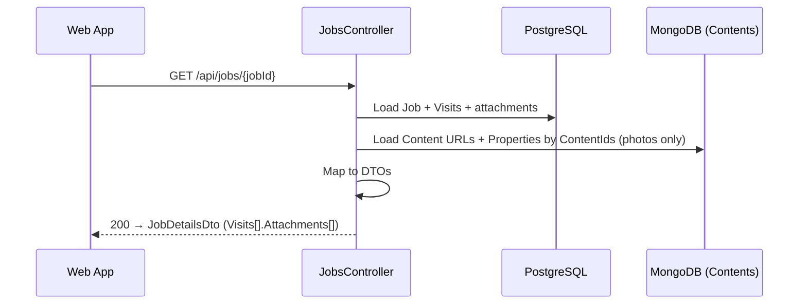
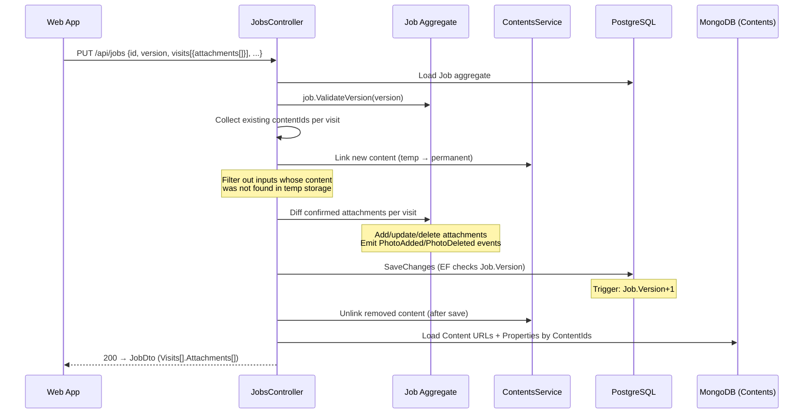
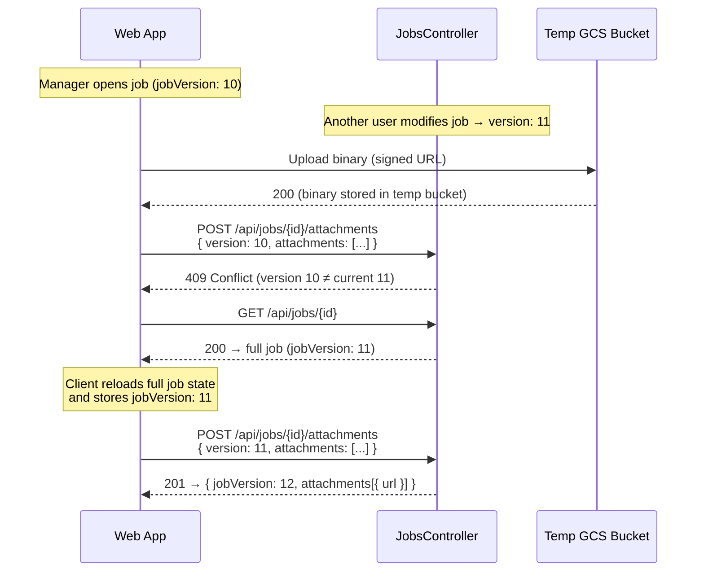

Endpoint Flows — Manager (Attachments)
=======================================

Manager read and write flows for visit-level attachments. All
mutations go through the Job aggregate. See `attachments_worker.md`
for the shared concurrency model and worker flows. Design docs are in
[implementation/10_photos/](../implementation/10_photos/).

Web-only endpoints (add/delete attachments, update visit attachment
tags) are in [`attachments_manager_web.md`](attachments_manager_web.md).

Read Flows
----------

### GET /api/jobs/{id} — attachments loaded



### Attachments by endpoint

| Endpoint | Visit-level |
|----------|:-----------:|
| `GET /api/jobs/{id}` | Full |
| `PUT /api/jobs` response | Full |
| `POST /api/jobs/{id}/attachments` response | — (returns added attachments) |
| `DELETE /api/jobs/{id}/attachments/{id}` response | — |
| `PATCH .../visits/{id}/attachments/{id}` response | Single |
| `GET /api/jobs/paged` | No |
| `GET /api/jobs/sync` | `null` |

---

Write Flow — Job Upsert
------------------------

Manager uses the existing `PUT /api/jobs` with visit-level
attachments in the `Visits[].Attachments[]` array. Server diffs
against current state (full-state diff — same as visits).



Version validation uses the same pattern as all other manager
write paths — see `attachments_worker.md` Concurrency Model for details.

---

Version Mismatch — 409 Recovery
--------------------------------

When the manager's cached version is stale, the server returns 409.
The client must reload the full job to get fresh state + version,
then retry. The binary is already in GCS — no re-upload needed.



Key points:
- **GCS upload succeeds regardless** — temp bucket doesn't check version
- **No re-upload on retry** — `UploadContentFromSignedUrl` skips the
  copy if content already exists in the permanent bucket
- **Client must reload full job** on 409 — not just the version, but
  the full state (other fields may have changed too)
- Same recovery pattern applies to DELETE (409 → reload → retry)

### Content linking

All attachments use `ContentEntities.JobAttachment` with `AttachmentId`
as EntityId. Content operations are handled by `JobContentService` —
linking via `ContentsService.UploadContentFromSignedUrl()` before save,
unlinking via `ContentsService.UnlinkContent()` after save.

---

Schema Notes
------------

### VisitId — currently NOT NULL

All attachments currently belong to a visit (`VisitId` is required).
When job-level attachments are introduced later, `VisitId` will become
nullable (`Guid?`). This is a single metadata-only migration in
PostgreSQL:

```sql
ALTER TABLE "Attachments" ALTER COLUMN "VisitId" DROP NOT NULL;
```

No table rewrite, no data migration. A filtered index for
job-level queries will be added at that point.

---

DTOs
----

### Shared response type

```
AttachmentResponseDto {
  id:          Guid
  type:        "photo"                            ← AttachmentTypeDto enum
  content: {
    id:          string                            ← ContentId
    url:         string?                           ← CDN URL, resolved from MongoDB Content
    properties:  { orientation?: "landscape" | "portrait" | "unknown" }?
  }
  order:       int
  tags:        string[]                             ← e.g. ["Before"] or ["After"]
  capturedAt:  DateTimeOffset?
  createdBy:   { id: string, name?: string, isCurrentUser: bool }
  createdAt:   DateTimeOffset
}
```

**Field resolution notes:**
- `content.url` and `content.properties` — resolved from the `Content`
  entity in MongoDB (set by the client during upload).
- `createdBy.name` — resolved at read time from team info (not stored
  on the attachment entity). The attachment only stores `CreatedBy` as
  a MasterUserId; the display name is looked up when building the
  response.
- `createdBy.isCurrentUser` — true when the attachment creator matches
  the authenticated user.

### Visit-Level Attachments (via PUT upsert)

```
PUT /api/jobs

Request (visit attachments fragment) {
  version:  int
  visits:   [{
    id?:          Guid?
    attachments:  [{                    ← null = don't touch, [] = delete all
      id:         Guid                  ← required, client-pregenerated
      content:    { id: string, properties?: { orientation? } }
      order:      int
      tags:       string[]              ← e.g. ["Before"], default []
      capturedAt?: DateTimeOffset
    }] | null
  }]
}

Response (200): JobDto {
  jobVersion:   int
  visits:       [{
    attachments:  AttachmentResponseDto[]?
  }]
}
```

`attachments: null` → don't touch (**required for backward compatibility** —
existing clients don't send this field; treating absence as "delete all"
would wipe attachments on every legacy PUT call).
`attachments: []` → delete all. `attachments: [...]` → full-state diff.

Tags are a client-owned collection — the server stores exactly what
the client sends per attachment. The client is responsible for adding,
removing, or switching tags (Before↔After). The server does not merge
or diff the tags array.

### Read Endpoints

```
GET /api/jobs/{jobId}

Response (200): JobDetailsDto {
  visits:       [{ attachments: AttachmentResponseDto[]? }]
}
```

### Version bump summary

| Operation | Job.V | Timeline |
|-----------|:-----:|----------|
| Add attachment (POST) | +1 | PhotoAdded per photo |
| Delete attachment (DELETE) | +1 | PhotoDeleted |
| Add visit attachment (worker POST) | +1 | PhotoAdded per photo |
| Delete visit attachment (worker DELETE) | +1 | PhotoDeleted |
| Photo add/delete (manager PUT) | +1 | PhotoAdded/PhotoDeleted per photo per visit |
| Update tags (manager PATCH) | +1 | — |
| Update tags (worker PATCH) | +1 | — |
