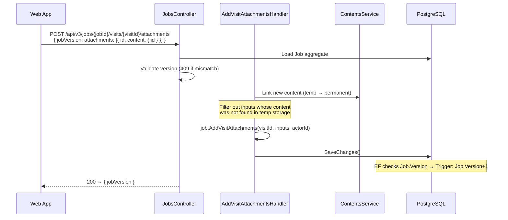
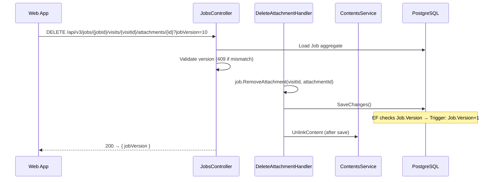
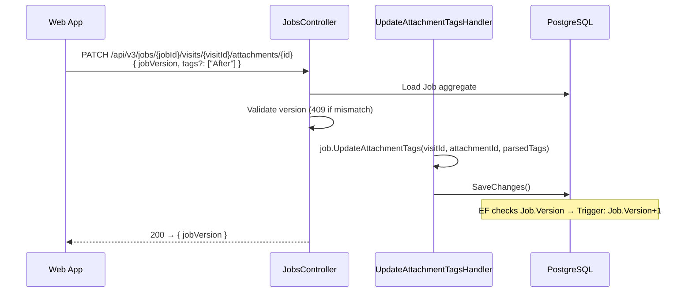

Endpoint Flows — Manager Web (Attachments)
==========================================

Web-only endpoints for attachment add/delete and visit-level tags
updates. These are **not used by mobile** — mobile manages
attachments via `PUT /api/jobs`.

For shared flows (read, PUT upsert, 409 recovery, DTOs) see
[`attachments_manager.md`](attachments_manager.md).

---

Add/Delete Attachments
----------------------

Separate endpoints for adding and deleting attachments.

**Why separate endpoints, not PUT /api/jobs:**
- One way to add/delete attachments — no confusion with two paths
- Binary upload is async (signed URL → GCS → POST) — doesn't fit
  synchronous PUT full-state diff
- Consistent with Stripe/GitHub pattern: sub-resources with
  independent lifecycle get their own endpoints
### Endpoints

```
PUT    /api/v3/jobs/{jobId}/visits/{visitId}                      → update visit (+ optional attachments diff)
POST   /api/v3/jobs/{jobId}/visits/{visitId}/attachments          → add attachments
DELETE /api/v3/jobs/{jobId}/visits/{visitId}/attachments/{id}      → delete one
PATCH  /api/v3/jobs/{jobId}/visits/{visitId}/attachments/{id}      → update tags
```

All endpoints require `jobVersion` and validate against
`Job.Version` (409 on mismatch). All return `{ jobVersion }`
(CQRS: no query data in command response).

### Upload flow

```
1. POST /api/contents/generate-upload-link → signed GCS URL
2. PUT signed URL → upload binary to temp GCS bucket
3. POST /api/v3/jobs/{jobId}/visits/{visitId}/attachments
   { jobVersion, attachments: [{ id: "guid-1", content: { id: "abc" } }] }
```

### POST — add attachments



### DELETE — remove attachment



Note: DELETE passes `jobVersion` as a query parameter (not in body).

### DTOs

**POST** — add attachments

```
POST /api/v3/jobs/{jobId}/visits/{visitId}/attachments

Request {
  jobVersion:   int
  attachments:  [{
    id:         Guid                  ← required, client-pregenerated
    content:    { id: string, properties?: { orientation? } }
    tags:       string[]              ← e.g. ["Before"], default []
    capturedAt?: DateTimeOffset
  }]
}

Response (200) {
  jobVersion:   int
}
```

Order is **server-assigned** — new attachments are appended after
existing ones, in array order.

**DELETE** — remove attachment

```
DELETE /api/v3/jobs/{jobId}/visits/{visitId}/attachments/{id}?jobVersion=N

Response (200) {
  jobVersion:   int
}
```

`jobVersion` passed as query parameter (no request body).

---

PATCH — Update Tags
--------------------

```
PATCH  /api/v3/jobs/{jobId}/visits/{visitId}/attachments/{id}  → update tags
```

Lightweight update for retagging a single visit attachment without
re-sending the entire job via PUT.



No timeline event for tag changes (low-impact). Same concurrency
model as other write paths. No domain event service call.

### DTO

```
PATCH /api/v3/jobs/{jobId}/visits/{visitId}/attachments/{id}

Request {
  jobVersion:  int
  tags?:       string[]              ← e.g. ["Before"] or ["After"], [] to clear, null = no change
}

Response (200) {
  jobVersion:   int
}
```

Tags are a client-owned collection — the server replaces the stored
array with what the client sends:
- `["Before"]` — tag as before photo
- `["After"]` — tag as after photo (Before and After are mutually exclusive by convention)
- `[]` — clear all tags (untagged)
- `null` — leave tags unchanged

The client is responsible for adding, removing, or switching tags.
