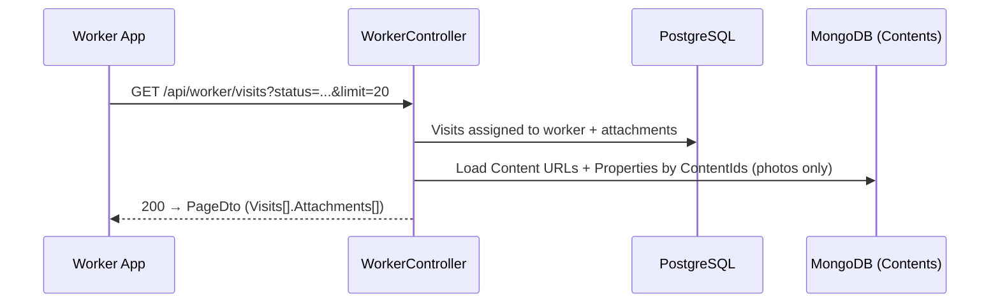
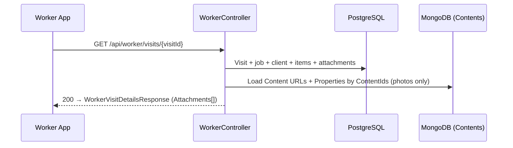
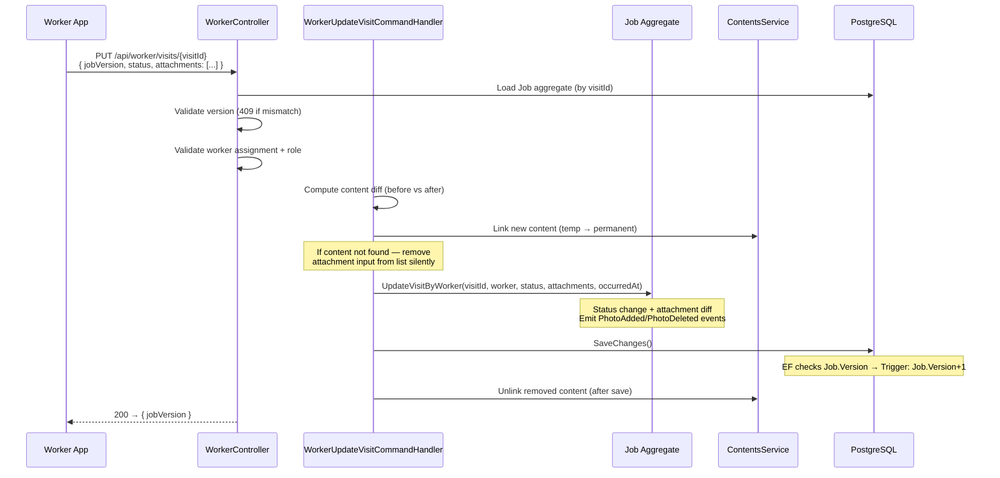

Endpoint Flows — Worker (Attachments)
=====================================

Worker read and write flows for visit attachments. All mutations go
through the Job aggregate. See
[overview.md](../implementation/10_photos/overview.md) for DTOs and
business rules, `attachments_manager.md` for manager flows.

Concurrency Model
-----------------

### Job-level versioning only

| Column | Table | Trigger | Checked by |
|--------|-------|---------|------------|
| `Job.Version` | `jobs.Jobs` | `BEFORE UPDATE → +1` | EF concurrency token (all write paths) |
| `Job.SequenceId` | `jobs.Jobs` | `BEFORE INSERT/UPDATE → nextval` | Sync ordering |

No Visit.Version column. All concurrency is handled at the Job
level — same pattern as all existing write paths.

The worker visit update endpoint requires `jobVersion` in the
request and validates it against `Job.Version` (same as other
write paths). The response includes the updated `jobVersion` so
the client always has the current aggregate version for subsequent
calls.

### How it works

All endpoints use the same save pattern:

```
1. Load Job aggregate (fresh from DB — EF tracks Job.Version)
2. App-level version check (409 if request.version != Job.Version)
3. Domain mutations
4. _jobsRepository.Update(job)  — marks entire graph Modified
5. SaveChanges() — EF checks Job.Version concurrency token
```

### Endpoint validation matrix

| Endpoint | App validates | EF checks | Why |
|----------|:------------:|:---------:|-----|
| `PATCH /worker/.../status` | Job.Version | Job.Version | Status affects job |
| `PUT /worker/visits/{visitId}` | Job.Version | Job.Version | Version mismatch → 409 |

### Concurrency scenarios

**Two workers, different visits** — Worker A saves Visit 1,
bumps Job.Version. Worker B saves Visit 2, EF's Job.Version
check fails (race). B retries: re-loads job, re-saves. Rare
and cheap.

**Two workers, same visit** — First worker saves, bumps
Job.Version. Second worker's SaveChanges fails on Job.Version
(EF token). Re-fetches and retries.

**Worker + manager** — Worker bumps Job.Version. Manager's
upsert with stale version gets 409. Re-fetches and retries.

---

Read Flows
-------------------

### GET /api/worker/visits — attachments loaded



Attachments are included in the paged response to support offline
mode — mobile clients cache the full visit list with attachments
on sync, enabling offline access without a per-visit detail fetch.

> **Open question:** Should attachments be behind a query flag
> (e.g. `?include=attachments`) rather than always included? This
> endpoint is mainly an alternative to a dedicated sync endpoint —
> not all callers need the full attachment payload. A flag would
> keep the default response lightweight and let clients opt in
> when they need offline caching.

### GET /api/worker/visits/{id} — attachments loaded



### Other endpoints

| Endpoint | Attachments? |
|----------|:-------:|
| `GET /api/worker/visits` | Yes |
| `PATCH /worker/.../status` response | Yes |
| `GET /api/worker/visits/stats` | No |

No dedicated worker sync — existing paged endpoint with
pull-to-refresh is sufficient.

---

Write Flow — PUT update visit (status + attachments)
-----------------------------------------------------

Single endpoint for worker visit updates. Worker sends full desired
state of attachments — server diffs against current state (same
full-state diff approach as manager's `PUT /api/jobs`).



### Version flow

The worker endpoint validates `Job.Version` in the request (409 on
mismatch) and returns the updated `jobVersion` in the response.

```
Client loads visit (jobVersion: 5)
  → PUT visit { jobVersion: 5, status: "inProgress", attachments: [...] }
    → 200 { jobVersion: 6 }
  → PUT visit { jobVersion: 6, status: "completed", attachments: [...] }
    → 200 { jobVersion: 7 }
```

If another client modifies the job between calls, the version
check catches it with 409. Client re-fetches and retries.

---

DTOs — Request / Response
--------------------------

### PUT — update visit (status + attachments)

```
PUT /api/worker/visits/{visitId}

Request:
{ jobVersion: int,
  status: VisitStatusDto,
  attachments: [{ id: Guid,
                  content: { id: string, properties?: { orientation? } },
                  order: int, tags: string[],
                  capturedAt?: DateTimeOffset }] }

Response (200):
{ jobVersion: int }
```

`attachments` is required (non-nullable). Worker always sends the
full desired state. The server diffs against current to determine
adds, updates, and deletes.

---

Version Bump Summary
--------------------

| Operation | Job.V | Timeline |
|-----------|:-----:|----------|
| PUT update visit (status + attachments) | +1 | VisitStatusChanged + PhotoAdded/Deleted (per diff) |
| PATCH visit status (existing) | +1 | VisitStatusChanged |
