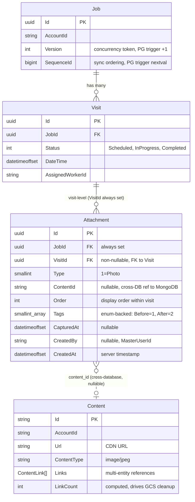
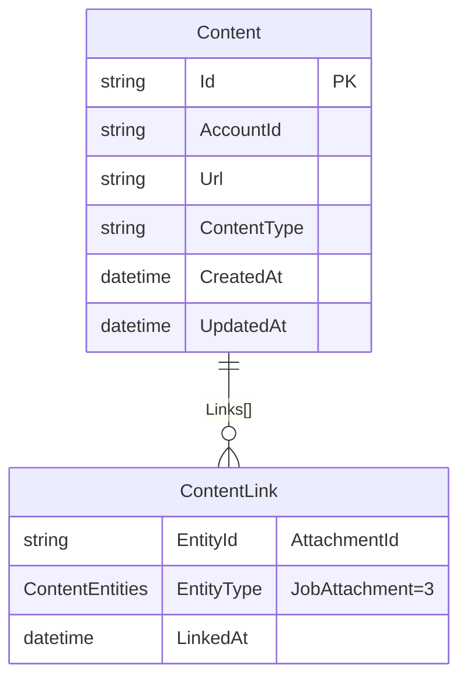
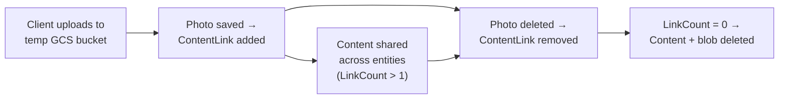
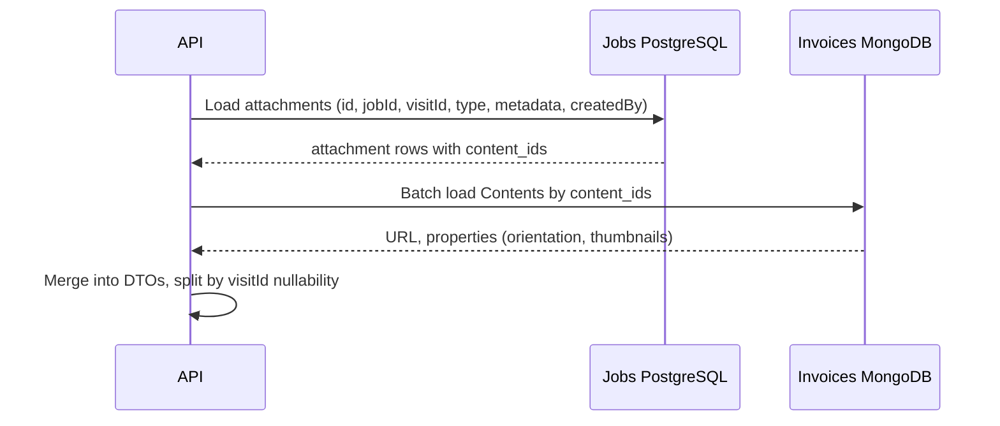

Database Structure — Attachments
=================================

Full DDL for attachment feature (photos).
Attachment domain data in **Jobs PostgreSQL**, binary asset metadata
in **Invoices MongoDB** (shared `contents` collection).

The `Attachments` table stores visit-level photo attachments.
`VisitId` is non-nullable — all attachments are currently
visit-scoped.



Jobs PostgreSQL Database
------------------------

Existing tables shown with changes marked.

Existing Table: jobs.Jobs (changes)
-----------------------------------

No schema change. Existing Version + SequenceId triggers handle
photo operations automatically (job row is updated via
`_jobsRepository.Update(job)` on every write path).

```
jobs."Jobs"
├── "Id"              UUID          PK
├── "AccountId"       TEXT          NOT NULL
├── "Version"         INTEGER       DEFAULT 0, concurrency token, auto-increment trigger
├── "SequenceId"      BIGINT        auto-increment trigger (sync ordering)
├── "Number"          VARCHAR(50)
├── "Title"           VARCHAR(500)
├── "ManualStatus"    INTEGER
├── "CurrencyCode"    VARCHAR(10)   DEFAULT 'USD'
├── "IsDeleted"       BOOLEAN       DEFAULT false
├── "CreatedAt"       TIMESTAMPTZ
├── "UpdatedAt"       TIMESTAMPTZ
├── "CompletionTime"  TIMESTAMPTZ
├── "Items"           JSONB         DEFAULT '[]'
├── "ClientSnapshot"  JSONB
└── "Relations"       JSONB         (owned: ClientId, Invoices[], Estimates[])
```

Existing Table: jobs.Visits
----------------------------

No schema change. All concurrency handled at Job level.

```
jobs."Visits"
├── "Id"                UUID          PK
├── "JobId"             UUID          FK → Jobs(Id)
├── "DateTime"          TIMESTAMPTZ
├── "AssignedWorkerId"  TEXT
├── "Status"            INTEGER       DEFAULT 1 (Scheduled=1, InProgress=2, Completed=3)
├── "StatusChangedAt"   TIMESTAMPTZ
└── "UpdatedAt"         TIMESTAMPTZ

Indexes:
├── PK on (Id)
└── IX on (JobId, DateTime)
```

New Table: jobs."Attachments"
-----------------------------

Visit-level photo attachments. `JobId` is always set (denormalized).
`VisitId` is non-nullable — all attachments are visit-scoped.
`Type` discriminator currently only has Photo=1. `Tags` stored as
`smallint[]` — each element maps to `AttachmentTag` enum (Before=1,
After=2). GIN index enables fast containment queries (`@>` operator).

See [Tags and Postgres Arrays](https://www.crunchydata.com/blog/tags-aand-postgres-arrays-a-purrfect-combination)
for background on the array-based tagging pattern.

```sql
CREATE TABLE jobs."Attachments" (
    "Id"            UUID            PRIMARY KEY,
    "JobId"         UUID            NOT NULL,
    "VisitId"       UUID            NOT NULL,
    "Type"          SMALLINT        NOT NULL,
    "ContentId"     TEXT,
    "Order"         INTEGER         NOT NULL DEFAULT 0,
    "Tags"          SMALLINT[]      NOT NULL DEFAULT '{}',
    "CapturedAt"    TIMESTAMPTZ,
    "CreatedBy"     TEXT,
    "CreatedAt"     TIMESTAMPTZ     NOT NULL DEFAULT now(),

    CONSTRAINT "FK_Attachments_Visits_VisitId"
        FOREIGN KEY ("VisitId") REFERENCES jobs."Visits" ("Id")
        ON DELETE CASCADE
);
```

Schema:

```
jobs."Attachments"
├── "Id"          UUID          PK, ValueGeneratedNever (client-pregenerated)
├── "JobId"       UUID          NOT NULL, denormalized (no FK constraint)
├── "VisitId"     UUID          NOT NULL, FK → Visits(Id) ON DELETE CASCADE
├── "Type"        SMALLINT      NOT NULL (1=Photo)
├── "ContentId"   TEXT          nullable — links to Content entity (GCS)
├── "Order"       INTEGER       NOT NULL, DEFAULT 0 — display order within visit
├── "Tags"        SMALLINT[]    NOT NULL, DEFAULT '{}' — enum-backed tags (Before=1, After=2)
├── "CapturedAt"  TIMESTAMPTZ   nullable — when taken/recorded
├── "CreatedBy"   TEXT          nullable — MasterUserId
└── "CreatedAt"   TIMESTAMPTZ   NOT NULL, DEFAULT now() — server timestamp
```

**Tags**:
- Photo: `{1}` (Before), `{2}` (After), `{}` (untagged)

### Indexes

```sql
-- All attachments for a job (for job-level queries)
CREATE INDEX ix_attachments_job
    ON jobs."Attachments" ("JobId");

-- All attachments for a visit (primary query pattern — load, diff, display)
CREATE INDEX ix_attachments_visit
    ON jobs."Attachments" ("VisitId");

-- Tag containment queries (find attachments by tag)
CREATE INDEX ix_attachments_tags
    ON jobs."Attachments" USING GIN ("Tags");
```

### Column design decisions

| Column | Decision | Reason |
|--------|----------|--------|
| `JobId` always set | Denormalized from Visit (no FK constraint) | Simplifies job-level queries without joining through Visits |
| `VisitId` non-nullable | All attachments are visit-scoped | FK to Visits with CASCADE delete |
| `Type` as SMALLINT | Discriminator: Photo=1 | Extensible for future types (note, voice, document) |
| `ContentId` nullable | Nullable for future note type | Photos always have it |
| `Tags` as SMALLINT[] | Enum-backed array with GIN index | Multiple tags per attachment, fast containment queries, type-safe via `AttachmentTag` enum |
| No `DeletedAt` | Hard delete | Audit trail in Activity Feed, keeps count accurate |
| No `UploadState` | Client-side concern | Row written only after GCS upload succeeds |
| `ON DELETE CASCADE` on VisitId FK | Visit deletion removes its attachments | Only FK — no direct Job FK constraint |

### EF Core entity

```csharp
public class Attachment
{
    public required Guid Id { get; init; }
    public required Guid JobId { get; init; }
    public required Guid VisitId { get; init; }
    public Visit? Visit { get; init; }
    public required AttachmentType Type { get; init; }
    public string? ContentId { get; init; }
    public int Order { get; set; }
    public List<AttachmentTag> Tags { get; set; } = [];
    public DateTimeOffset? CapturedAt { get; init; }
    public string? CreatedBy { get; init; }
    public DateTimeOffset CreatedAt { get; init; }

    public ContentEntry? GetContentEntry() =>
        ContentId is { } cid ? new ContentEntry(Id, cid) : null;
}

public enum AttachmentType
{
    Unknown = 0,
    Photo = 1
}

public enum AttachmentTag
{
    Unknown = 0,
    Before = 1,
    After = 2
}
```

### EF Core configuration

```csharp
internal class AttachmentConfiguration : IEntityTypeConfiguration<Attachment>
{
    public void Configure(EntityTypeBuilder<Attachment> builder)
    {
        builder.ToTable("Attachments");
        builder.HasKey(a => a.Id);

        builder.Property(a => a.Id)
            .HasColumnType("uuid")
            .IsRequired()
            .ValueGeneratedNever();

        builder.Property(a => a.JobId)
            .HasColumnType("uuid")
            .IsRequired();

        builder.Property(a => a.VisitId)
            .HasColumnType("uuid")
            .IsRequired();

        builder.Property(a => a.Type)
            .HasColumnType("smallint")
            .IsRequired();

        builder.Property(a => a.ContentId)
            .HasColumnType("text");

        builder.Property(a => a.Order)
            .HasColumnType("integer")
            .IsRequired()
            .HasDefaultValue(0);

        builder.Property(a => a.Tags)
            .HasColumnType("smallint[]")
            .IsRequired()
            .HasDefaultValueSql("'{}'");

        builder.Property(a => a.CapturedAt)
            .HasColumnType("timestamptz");

        builder.Property(a => a.CreatedBy)
            .HasColumnType("text");

        builder.Property(a => a.CreatedAt)
            .HasColumnType("timestamptz")
            .IsRequired()
            .HasDefaultValueSql("now()");

        builder.HasOne(a => a.Visit)
            .WithMany(v => v.Attachments)
            .HasForeignKey(a => a.VisitId)
            .OnDelete(DeleteBehavior.Cascade);

        builder.HasIndex(a => a.JobId)
            .HasDatabaseName("ix_attachments_job");

        builder.HasIndex(a => a.VisitId)
            .HasDatabaseName("ix_attachments_visit");

        builder.HasIndex(a => a.Tags)
            .HasMethod("gin")
            .HasDatabaseName("ix_attachments_tags");
    }
}
```

### Entity navigation properties

```csharp
// Visit.cs — navigation property
public required ICollection<Attachment> Attachments { get; init; }
```

Note: `Job` does not have a direct `Attachments` navigation.
Attachments are accessed through `Visits[].Attachments`.

### DbContext registration

```csharp
// JobsDbContext.cs
public DbSet<Attachment> Attachments => Set<Attachment>();
```

Enum Change: ContentEntities
-----------------------------

```csharp
public enum ContentEntities
{
    Unknown = 0,
    Invoice = 1,
    Estimate = 2,
    JobAttachment = 3   // ← used for all attachment content linking
}
```

Content linking uses `ContentEntities.JobAttachment` with
`AttachmentId` as EntityId for all attachments.

Migration Summary
-----------------

Migration: `20260324103651_AddAttachments`

```sql
CREATE TABLE jobs."Attachments" (
    "Id"            UUID            PRIMARY KEY,
    "JobId"         UUID            NOT NULL,
    "VisitId"       UUID            NOT NULL,
    "Type"          SMALLINT        NOT NULL,
    "ContentId"     TEXT,
    "Order"         INTEGER         NOT NULL DEFAULT 0,
    "Tags"          SMALLINT[]      NOT NULL DEFAULT '{}',
    "CapturedAt"    TIMESTAMPTZ,
    "CreatedBy"     TEXT,
    "CreatedAt"     TIMESTAMPTZ     NOT NULL DEFAULT now(),

    CONSTRAINT "FK_Attachments_Visits_VisitId"
        FOREIGN KEY ("VisitId") REFERENCES jobs."Visits" ("Id")
        ON DELETE CASCADE
);

CREATE INDEX ix_attachments_job
    ON jobs."Attachments" ("JobId");

CREATE INDEX ix_attachments_visit
    ON jobs."Attachments" ("VisitId");

CREATE INDEX ix_attachments_tags
    ON jobs."Attachments" USING GIN ("Tags");
```

Query Patterns
--------------

### Visit-level: all attachments for a visit

```sql
SELECT * FROM jobs."Attachments"
WHERE "VisitId" = @visitId
ORDER BY "CreatedAt";
```

### Visit-level: photos only for a visit

```sql
SELECT * FROM jobs."Attachments"
WHERE "VisitId" = @visitId AND "Type" = 1
ORDER BY "CreatedAt";
```

### Job-level: all attachments for a job (no visit)

```sql
SELECT * FROM jobs."Attachments"
WHERE "JobId" = @jobId AND "VisitId" IS NULL
ORDER BY "CreatedAt";
```

### All attachments for a job (both levels)

```sql
SELECT * FROM jobs."Attachments"
WHERE "JobId" = @jobId
ORDER BY "VisitId" NULLS FIRST, "CreatedAt";
```

### Photo count per visit (worker list)

```sql
SELECT v."Id", COUNT(a."Id") AS photo_count
FROM jobs."Visits" v
LEFT JOIN jobs."Attachments" a
    ON a."VisitId" = v."Id" AND a."Type" = 1
WHERE v."JobId" = @jobId
GROUP BY v."Id";
```

### EF Core eager loading

```csharp
// GetJobForUpdate — load visit-level attachments
var job = await _context.Jobs
    .Where(j => j.AccountId == accountId)
    .Where(specification)
    .Include(j => j.Visits)
        .ThenInclude(v => v.Attachments)    // ← visit-level
    .Include(j => j.Summary)
    .FirstOrDefaultAsync(ct);
```

Invoices MongoDB Database
-------------------------

The `contents` collection is shared across all entities (invoices,
estimates, jobs). It lives in the Invoices MongoDB database, not
in the Jobs database — photos are the first cross-database consumer.



### Indexes

| Index | Fields | Purpose |
|-------|--------|---------|
| `ix_contents.accountid` | `AccountId` | Scoped queries |
| `ix_contents.accountid.links.entityid` | `AccountId, Links.EntityId` | Find content by entity |

### Content lifecycle



Cross-database reads
--------------------

Photo reads require both databases.



`content_id` is the join key between databases. Jobs PostgreSQL
owns the domain data (type, metadata, attribution, ordering).
Invoices MongoDB owns the binary asset metadata (URL, properties)
and reference counting for GCS cleanup.

Content linking:
- All attachments → `ContentEntities.JobAttachment`, EntityId = AttachmentId

### Content URL resolution — performance

The existing `ContentsRepository` has no batch lookup by content IDs.
Current methods:

| Method | Query | Use case |
|--------|-------|----------|
| `FindByEntityId(accountId, entityId)` | `ElemMatch` on Links + legacy EntityId | Visit detail (1 query per visit) |
| `FindByContentId(accountId, contentId)` | By `_id` + AccountId | Single content lookup |

**Problem**: The paged worker visits endpoint (offline sync) loads
attachments across multiple visits. Without a batch method, this
requires N `FindByEntityId` calls (one per visit with photos) or
N `FindByContentId` calls (one per photo). Both scale poorly.

**Required**: Add a batch lookup method to `IContentsRepository`:

```csharp
// IContentsRepository.cs — add:
Task<IReadOnlyList<Content>> FindByContentIds(
    string accountId, IEnumerable<string> contentIds, CancellationToken ct);

// ContentsRepository.cs — implement:
public async Task<IReadOnlyList<Content>> FindByContentIds(
    string accountId, IEnumerable<string> contentIds, CancellationToken ct)
{
    var filter = Builders<Content>.Filter.And(
        BuildAccountFilter(accountId),
        Builders<Content>.Filter.In(x => x.Id, contentIds));

    return await _collection.Find(filter).ToListAsync(ct);
}
```

This uses `$in` on the `_id` field (always indexed). For a typical
paged response (20 visits x 5 photos = 100 contentIds), this is a
single efficient MongoDB query.

**Alternatives considered**:

| Approach | Saves | Tradeoff |
|----------|-------|----------|
| Batch `FindByContentIds` (recommended) | N queries → 1 | Still hits MongoDB, but efficiently |
| Cache `Url` on PG attachment row | Eliminates MongoDB on reads | Stale on CDN rotation; extra write on link |
| `IsContentReady` flag on attachment | Skip unlinked attachments | Still need MongoDB for the URL |

Caching the URL on the attachment row is not worth the cache
invalidation complexity unless MongoDB latency becomes a measured
bottleneck. The batch method is the right first step.
