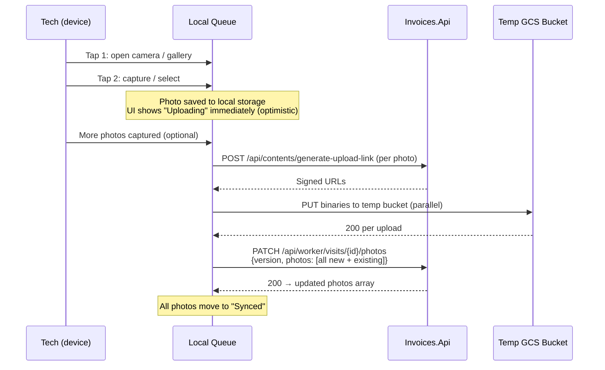

Batch Upload — Visit Photos
============================

Photos use a **capture-local, sync-batch** pattern. The client
queues photos on-device and sends a single PATCH with all changes.
One version bump, one round of content linking, no concurrency
races between rapid uploads.

Why batch
---------

| Approach | Version bumps | API calls | Concurrency risk |
|----------|:------------:|:---------:|:----------------:|
| Individual PATCH per photo | N | N | High — sequential Job.Version conflicts |
| **Batch PATCH (chosen)** | **1** | **1** | **None** |

Individual uploads force serialization: each PATCH bumps
`Job.Version`, so the next one needs the new version or gets
409. Batching avoids this entirely — matches the full-state diff
pattern the API already uses.

Client-side flow
----------------



### Key principles

1. **Capture is instant** — photo goes to local storage, UI updates
   optimistically. No network needed at capture time.
2. **Binary uploads are parallel** — signed URLs fetched and
   binaries uploaded concurrently, independent of the PATCH.
3. **PATCH is the single sync point** — sends the full desired
   photos array. Server diffs against current state.
4. **Version check happens once** — one `version` validation,
   one `Job.Version` bump.

Local queue states
------------------

Each photo in the queue has a state:

```
Captured → Uploading → Uploaded → Synced
                ↓
              Failed → (retry) → Uploading
```

| State | Meaning | Persisted? |
|-------|---------|:----------:|
| Captured | Saved to device, not yet uploaded | Yes (local DB) |
| Uploading | Binary upload to temp bucket in progress | Yes |
| Uploaded | Binary in temp bucket, awaiting PATCH | Yes |
| Failed | Upload failed, retry available | Yes |
| Synced | PATCH succeeded, server confirmed | Can be cleared |

The queue table must persist across app restarts and crashes.
Use platform-native persistent storage (Room/SQLite on Android,
Core Data on iOS), not in-memory state.

Sync triggers
-------------

The PATCH fires when:
- All queued photos reach `Uploaded` state, OR
- Tech navigates away from the visit, OR
- App enters background, OR
- Manual "sync now" action

The client should debounce — wait briefly after last capture
(e.g. 2-3 seconds) before triggering sync, so rapid multi-photo
capture batches naturally.

Optimistic UI
-------------

The tech sees photos in the visit immediately after capture,
before any network activity. This is critical for the "2 taps to
upload" design principle.

```
UI state:
  Photo taken → shown in grid with "uploading" indicator
  Binary uploaded → indicator changes to progress
  PATCH succeeds → indicator removed ("synced")
  PATCH fails → indicator changes to retry icon
```

If the PATCH fails (409 conflict, network error), the client:
1. Re-fetches current visit state (GET visit detail)
2. Merges local queue with server state
3. Retries PATCH with fresh `version`

Failed photos remain in the local queue until successfully synced
or explicitly discarded by the user.

Error handling
--------------

| Error | Cause | Client action |
|-------|-------|---------------|
| Signed URL 4xx | Invalid contentId or auth | Retry with new contentId |
| Binary upload timeout | Poor connectivity | Retry upload (resumable if large) |
| PATCH 409 | Stale version | Re-fetch visit, merge, retry |
| PATCH 400 | Validation (paid job, etc.) | Show error, stop retrying |
| Content validation fail | Wrong format/size on server | Show "photo rejected", remove from queue |

Retry strategy: exponential backoff starting at 2s, max 3
retries for transient errors. Permanent failures (400, 403)
surface to the user immediately.

Offline behavior
----------------

When offline:
- Capture works normally (local storage)
- Signed URL requests and uploads queue
- `capturedAt` timestamp preserves original capture time
- When connectivity returns, queue processes automatically

The client should not require user intervention to sync.
Background sync (iOS `URLSession` background tasks, Android
`WorkManager`) ensures uploads complete even if the app is
backgrounded or closed.

Batch size considerations
-------------------------

No hard batch limit at the product level (product decision: no
photo cap visible to users). Engineering soft limit of 20 active
photos per visit applies. The PATCH payload size is bounded by
the photo metadata (not binaries — those go to GCS directly), so
even 20 photos produce a small JSON payload.

If a visit already has photos on the server, the PATCH includes
the full desired state (existing + new). The server diffs to
determine adds/deletes. This is the same pattern as
`Job.UpdateVisits()` for visits.
