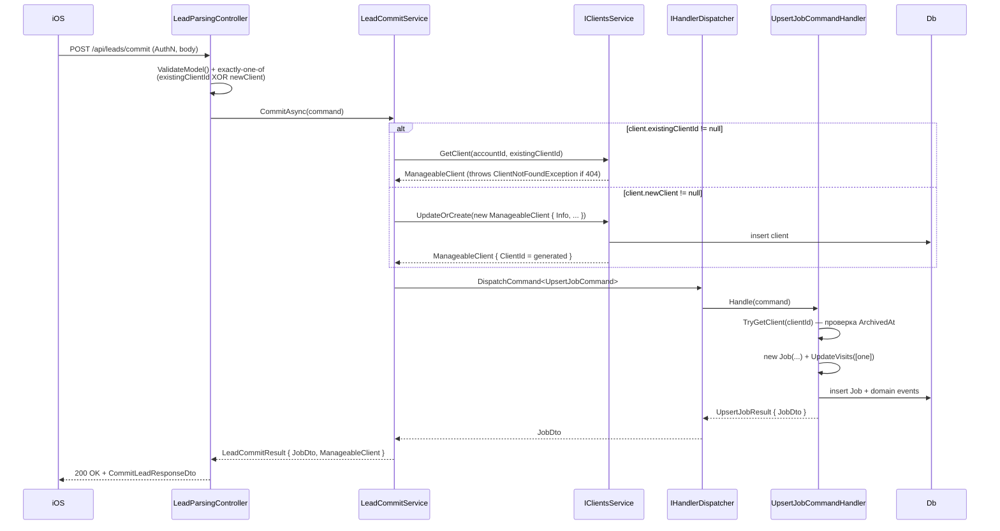

# Create Job from Lead — Implementation Plan

> Следующий шаг lead_draft_parsing pipeline: клиент получает parsed lead от
> `/api/leads/parse-text` или `/parse-voice`, **редактирует/дополняет поля
> локально**, затем одним запросом коммитит результат — backend атомарно
> создаёт `Client` (если нужно) + `Job` + начальный `Visit`.
>
> Parent feature context: [`../plan.md`](../plan.md),
> [`../implementation.md`](../implementation.md).

## Analysis

### Goal

Предоставить мобильному клиенту единственный endpoint `POST /api/leads/commit`,
который принимает **верифицированную пользователем** lead-структуру и атомарно
создаёт Job с первым Visit. Поведение endpoint-а задаётся финальным состоянием
полей от iOS — а не сырым output-ом LLM; backend не делает fuzzy merge, не
читает `ParsedLeadFields`-envelope с `Status`-метаданными и не знает о том, был
ли source текстовым или voice.

### Constraints

**Технические:**
- .NET 8, Clean Architecture (Core → Services → Implementation → Api)
- Endpoint **authenticated** (нужен `AccountId` из `BaseController`) — в отличие
  от `/parse-text` и `/parse-voice`, которые `[AllowAnonymous]`
- API v3.0 (consistent с `JobsController`, `ClientsController`)
- Переиспользование существующих путей:
  - `IClientsService.UpdateOrCreate(ManageableClient)` — для создания нового клиента
  - `UpsertJobCommand` / `UpsertJobCommandHandler` — для создания job+visit
    (не дублируем job-domain логику)
- Атомарность в пределах одного request-а: если job creation валит — новый
  client **не откатывается** (см. Risk Points). Отдельной цельной транзакции
  через `IUnitOfWork` делать не будем — это cross-service concern (clients vs
  jobs), см. Decisions.
- PII (name / address / audio / transcript) не логируется — consistent с parse-
  step

**Бизнес:**
- Источник данных — уже проверенный пользователем lead. Backend не делает
  substring-match / hallucination-guard повторно.
- Клиент может (a) привязать lead к существующему `clientId` (UI autocomplete),
  либо (b) передать inline `newClient` — создаётся новый клиент.
- `AdditionalInfo` (LLM summary) и `workEndTime` — **дропаются** на backend:
  в текущей доменной модели для них нет места (Job без поля notes, Visit — single
  `DateTime`, без EndTime). Клиент отвечает за их судьбу (показать в UI,
  положить в Title на своей стороне, забыть).

### Contradictions & Concerns

- **ParsedLeadFields envelope vs clean create-job payload.** Лид от LLM приходит
  в envelope-формате (`ExtractedField<T>` с `Status` / `RawText` / `Reason`).
  Но endpoint не должен принимать envelope — user уже проревьювил и зафиксировал
  значения. Принимаем **plain values**, ровно как mobile бы отправил в `PUT /api/jobs`.
- **Client domain — single-string address, Lead parser — structured address.** Lead
  выдаёт `{Street, City, State, Zip}`, `Client.Info.Address` — один `string?`.
  Backend **не** flattens — iOS делает composition на своей стороне и передаёт
  `address: string`. Причина: iOS уже знает форматирование для своей локали
  («123 Main St, Brooklyn, NY 10001» vs «Brooklyn, NY»), backend-formatter будет
  дублировать эту логику и рисковать расхождением. Если потом появится structured
  `ClientAddress` на domain — endpoint поменяется симметрично.
- **Visit model — single moment, не window.** Lead parser выдаёт `workStartTime +
  workEndTime`. MVP: iOS композирует `workStartTime` + `visitDate` + TZ в
  `DateTimeOffset`, шлёт в `visit.at`; `workEndTime` отбрасывается. Если придёт
  продуктовое требование «хранить окно времени» — добавляем `EndTime?` на `Visit`
  (domain change, breaking для MongoDB mapping + worker app + web). Не в MVP.
- **Idempotency при retry.** Если iOS ретрайнит один и тот же commit (network
  flap), для `newClient`-пути создастся дубль клиента. **В v1 accepted risk** —
  iOS отвечает за уникальность retry (в duplicate будет всё равно новый `jobId`
  на клиенте). Server-side идемпотентный ключ (header `Idempotency-Key` или
  field `requestKey`) — follow-up если начнутся жалобы.
- **Partial-failure between client-create и job-create.** `IClientsService.UpdateOrCreate`
  и `UpsertJobCommand` — два разных боунди, два save-а. Если первый прошёл, а
  второй упал — получаем «orphan client» без job-а. MVP: **ок, ручной cleanup или
  retry** (job creation идемпотентен по `JobId`, iOS может повторить с тем же
  `newClient` name — UpdateOrCreate схлопнется в update существующего). Полный
  distributed-transaction / outbox — follow-up.
- **Archived client.** `UpsertJobCommandHandler` бросает `ClientArchivedException`
  когда `client.ArchivedAt != null`. Мы транслируем наружу в 409 / 422.
- **Title fallback.** `Job` требует `Title`. Lead parser выдаёт `title` (LLM
  summary) и/или `clientName`. `UpsertJobCommandHandler` уже делает fallback:
  `command.Title ?? client?.Name`. Используем тот же путь — endpoint принимает
  `title: string?`, передаёт as-is.
- **Activity event.** Существующий `JobDomainEvent.Created` фаерится автоматически
  из `new Job(...)` — отдельного `jobCreatedFromLead` не заводим. Это consistent
  с паттерном из `features/jobs/implementation/6_job_from_estimate/` (единый
  `jobCreated` для всех source).

---

### Components

- **`LeadParsingController`** (`Invoices.Api/Controllers/LeadParsingController.cs`)
  — добавить action `Commit`:
  - `[HttpPost("commit")]` + `[Authorize]` (override
    controller-level `[AllowAnonymous]` — см. Decisions)
  - Тонкий: mapping DTO → command + dispatch через `ILeadCommitService`
- **`ILeadCommitService`** (`Invoices.Api.Services.LeadCommit`) — новый
  интерфейс, отдельный от `ILeadParsingService` (разные concerns):
  ```csharp
  Task<LeadCommitResult> CommitAsync(LeadCommitCommand command, CancellationToken ct);
  ```
  **Note on layering:** сервис живёт в Api-слое (а не в Common как parent-фича
  `ILeadParsingService`), потому что `LeadCommitResult.Job = JobDto` требует доступа
  к `Jobs.Contracts`, который `Invoices.Common` не может ссылаться (circular ref —
  `Jobs.Contracts` уже ссылается на Common). Api-layer orchestrator — симметрично
  `IJobDetailsService` / `InvoicesService` / `EstimatesService`.
- **`LeadCommitService`** (`Invoices.Api/Services/LeadCommit/`) —
  реализация, делает три шага:
  1. **Resolve client.** Если `command.Client.ExistingClientId != null` — проверяем
     существование через `IClientsService.GetClient` (бросает
     `ClientNotFoundException` → 404); если `command.Client.NewClient != null` —
     строим `ManageableClient` (см. mapping ниже) и зовём
     `IClientsService.UpdateOrCreate(...)` → получаем `clientId`.
  2. **Build UpsertJobCommand** с resolved `clientId`, `title`, `visits = [one
     VisitInputDto из payload]`, `items = []`, `occurredAt = clientNow ??
     DateTimeOffset.UtcNow`.
  3. **Dispatch** через injected `IHandlerDispatcher` — получаем `UpsertJobResult`.
  4. **Return** `LeadCommitResult { JobDto, ManageableClient }` — оба объекта
     нужны iOS: `Job` для навигации к созданному job-у, `Client` для обновления
     клиентского кэша если был создан новый.
- **Existing services (reused, NOT modified):**
  - `IClientsService.UpdateOrCreate` / `GetClient` — создание/проверка клиента
  - `IHandlerDispatcher` + `UpsertJobCommand` / `UpsertJobCommandHandler` — весь
    job+visit creation путь (валидация, EF save, domain events, version checking)
  - `ILeadParsingService` — не трогаем, это соседний concern (parse vs commit)
- **DTOs** (`Invoices.Api/Dto/LeadParsing/`):
  - `CommitLeadRequestDto` (new)
  - `CommitLeadClientDto` (new) — discriminator { `existingClientId?`, `newClient?` }
  - `CommitLeadNewClientDto` (new) — inline новый клиент
  - `CommitLeadVisitDto` (new) — `{ at: DateTimeOffset, assignedWorkerId? }`
  - `CommitLeadResponseDto` (new) — `{ job: JobDto, client: ManageableClientDto }`
- **Mapper** (`Invoices.Api/Dto/LeadParsing/CommitLeadMapping.cs`): `ToCommand`,
  `ToResponseDto`.
- **No feature flag.** В v1 отдельный kill-switch не заводим — commit не делает
  дорогих внешних вызовов (в отличие от OpenAI у `/parse-*`). Если понадобится
  отключать commit отдельно (production incident, migration window) — добавим
  `LeadParsing.CommitEnabled` + `LeadCommitUnavailableException` в follow-up.

### Data Flow



### Key Structures

In-memory (нет новых persistence-сущностей):

- **`LeadCommitCommand`** (domain, `Invoices.Common.Services.LeadParsing`):
  - `AccountId: string`
  - `MasterUserId: string?`
  - `Client: LeadClientRef` — discriminator record
  - `Title: string?`
  - `Visit: LeadVisitInput { At: DateTimeOffset, AssignedWorkerId: string? }`
  - `OccurredAt: DateTimeOffset?` — client event time (из middleware header)
- **`LeadClientRef`** (sealed record): либо `ExistingClientId: string` либо
  `NewClient: NewLeadClient`. Exactly-one-of enforced конструктором.
- **`NewLeadClient`**: `Name: string` (required), `Phone: string?`, `Email:
  string?`, `Address: string?` (уже собран iOS-ом из structured parser output).
- **`LeadCommitResult`**: `JobDto Job`, `ManageableClient Client`.
- **Mapping new client → `ManageableClient`** (в `LeadCommitService`):
  ```csharp
  new ManageableClient {
      ClientId = Guid.NewGuid().ToString("N"),
      AccountId = command.AccountId,
      Id = ManageableClient.FormatId(command.AccountId, clientId),
      Info = [new ManageableClientInfo {
          Name = command.Client.NewClient.Name,
          Phone = command.Client.NewClient.Phone,
          Email = command.Client.NewClient.Email,
          Address = command.Client.NewClient.Address,
          Type = ClientInfoType.Main
      }],
      Version = 0,
      CreatedAt = DateTime.UtcNow
  }
  ```
  — ровно тот же паттерн, что в `InvoiceGeneratorImportService.cs` (проверенный
  reference).

### Risk Points

- **Orphan client на partial failure.** Новый клиент создан, `UpsertJobCommand`
  упал (VersionMismatch, ClientArchived раса, infrastructure error). Клиент
  остаётся в БД; iOS ретрай с теми же данными — `UpdateOrCreate` схлопнется в
  update existing (если матчится по какому-то ключу) или создаст второй дубль (если
  генерируется новый `ClientId` каждый раз). **Mitigation:** для `newClient`-пути
  генерируем `ClientId` один раз per request, iOS при retry **должен** переслать
  тот же request; идемпотентность по `ClientId` — accepted risk.
- **Race: existingClient архивируется между GetClient и UpsertJobCommand.**
  Узкое окно; `UpsertJobCommandHandler` всё равно перепроверяет `ArchivedAt`
  внутри — exception наружу → 409/422.
- **Version mismatch на existing client.** Не актуально — мы не update-им
  существующего клиента, просто читаем.
- **Visit.DateTime в прошлом.** Допустимо (contractor может записать визит задним
  числом). `UpsertJobCommandHandler` не валидирует временной интервал — не
  добавляем.
- **Title пустой + клиент без name.** Валидатор `UpsertJobCommandHandler`:
  `title ?? client.Name ?? throw ArgumentException("Title is required when the
  client has not been synced yet.")`. Для нашего пути клиент всегда синхронизирован
  (мы только что его создали или загрузили), так что fallback работает. Остаётся
  только кейс «existingClient без `Info.Name`» — крайне edge, отдаём 400.
- **AssignedWorkerId, которого нет в team.** `Job.UpdateVisits` тихо очищает
  (комментарий в коде: «stale mobile upserts»). Для нашего endpoint это ок —
  iOS покажет визит без воркера.
- **AccountId resolver.** `BaseController.AccountId` полагается на
  `AccountAuthenticationMiddleware`. Controller `LeadParsingController` сейчас
  `[AllowAnonymous]` — middleware может не выставить `AccountId`. Нужен `[Authorize]`
  на action-уровне (см. Decisions).
- **No runtime kill-switch.** В v1 отключить commit можно только редеплоем без
  action-метода. Accepted risk: commit не делает дорогих внешних вызовов, failure
  domain — только client service + job pipeline (если что-то из них ляжет, парсинг
  тоже ляжет одновременно).

### API Contracts

#### New Endpoints

| Method | Path | Description |
|--------|------|-------------|
| POST | `/api/leads/commit` | Verified lead → create Client (optional) + Job + initial Visit |

API version: **3.0** (consistent с `JobsController`, `ClientsController`).

#### `POST /api/leads/commit`

**Authentication:** required (account context). Controller-level `[AllowAnonymous]`
overridden via `[Authorize]` на action.

**Request** (`application/json`):

```csharp
public sealed class CommitLeadRequestDto
{
    /// <summary>Job title. If null, backend falls back to client name.</summary>
    public string? Title { get; init; }

    /// <summary>Discriminator: existing client id OR new client payload. Exactly one required.</summary>
    public required CommitLeadClientDto Client { get; init; }

    /// <summary>Initial visit. iOS composes visitDate + workStartTime + TZ → DateTimeOffset.</summary>
    public required CommitLeadVisitDto Visit { get; init; }
}

public sealed class CommitLeadClientDto
{
    /// <summary>Existing client id (CatalogId). Mutually exclusive with NewClient.</summary>
    public string? ExistingClientId { get; init; }

    /// <summary>Inline new client payload. Mutually exclusive with ExistingClientId.</summary>
    public CommitLeadNewClientDto? NewClient { get; init; }
}

public sealed class CommitLeadNewClientDto
{
    [Required, StringLength(200, MinimumLength = 1)]
    public required string Name { get; init; }

    public string? Phone { get; init; }
    public string? Email { get; init; }

    /// <summary>Single-line formatted address. iOS composes from Lead's structured {Street, City, State, Zip}.</summary>
    public string? Address { get; init; }
}

public sealed class CommitLeadVisitDto
{
    [JsonConverter(typeof(DateTimeOffsetAsUtcConverter))]
    public required DateTimeOffset At { get; init; }

    public string? AssignedWorkerId { get; init; }
}
```

Validation: `CommitLeadClientDto` exactly-one-of: если оба или ни одного поля
заполнены — 400 `ArgumentException("Exactly one of existingClientId or newClient
must be provided.")`.

**Response** (`application/json`, HTTP 200):

```csharp
public sealed class CommitLeadResponseDto
{
    /// <summary>Created job (same shape as PUT /api/jobs response).</summary>
    public required JobDto Job { get; init; }

    /// <summary>Client resolved for the job — new (if NewClient path) or existing (looked up).
    /// iOS uses this to refresh its client cache after commit.</summary>
    public required ManageableClientDto Client { get; init; }
}
```

Пример:

```json
{
  "job": {
    "id": "1d...",
    "number": "J-0042",
    "title": "Roof leak repair",
    "clientId": "c1a9...",
    "currencyCode": "USD",
    "visits": [
      { "id": "v1...", "dateTime": "2026-04-23T13:00:00Z", "status": "scheduled" }
    ],
    "effectiveStatus": "Scheduled",
    "version": 0
  },
  "client": {
    "id": "c1a9...",
    "info": { "name": "Mike Johnson", "address": "Brooklyn, NY", "phone": null, "email": null },
    "version": 0,
    "createdAt": "2026-04-22T14:35:00Z",
    "updatedAt": null,
    "archivedAt": null
  }
}
```

#### Error Codes

Maping в `ApiExceptionHandlingMiddleware`:

| Condition | Exception | HTTP | Error code |
|---|---|---|---|
| Exactly-one-of validation failed | `ArgumentException` | 400 | (generic) |
| `existingClientId` not found | `ClientNotFoundException` (existing) | 404 | `notFound` (existing) |
| Existing client is archived | `ClientArchivedException` (existing) | 400 | `clientArchived` (existing) |
| Title + client.Name both empty | `ArgumentException` (из `UpsertJobCommandHandler`) | 400 | (generic) |

**Никаких новых error codes.** Все exceptions уже замаплены в
`ApiExceptionHandlingMiddleware`.

### Internal Breaking Changes

Нет. Всё — новый endpoint + новый service; existing services / контракты не
меняются.

### Decisions Made

- **Dedicated endpoint `POST /api/leads/commit` в `LeadParsingController`.**
  Атомарное client+job+visit creation за один request. Симметрия с
  `/parse-text` и `/parse-voice` (тот же controller, тот же namespace). Избегает
  трёх отдельных round-trips от iOS (upsert client → upsert job → visit).
  *Альтернативы rejected:* (a) reuse `PUT /api/jobs` — неатомарно, iOS дублирует
  composition логику. (b) `POST /api/jobs/from-lead` в `JobsController` —
  разрывает цельный lead-flow (parse-* vs commit) по контроллерам; lead domain
  владеет этим UX-flow целиком.
- **Discriminator `existingClientId` XOR `newClient`.** Даёт iOS
  autocomplete-match UX: сначала fuzzy-search по `Clients.Info.Name`, если
  user выбрал существующего — `existingClientId`, иначе inline `newClient`.
  Exactly-one-of валидация на backend.
  *Альтернативы rejected:* (a) всегда создавать нового — накапливает дубли в
  каталоге клиентов. (b) требовать pre-existing clientId — ломает атомарность,
  iOS вынужден делать 2 запроса.
- **`workStartTime` → `Visit.At`; `workEndTime` и `additionalInfo` дропаются
  на backend.** Visit domain = single moment, Job domain = no notes. Соответствует
  текущей модели, избегает domain-change-scope. iOS отвечает за судьбу лишних
  полей (показать юзеру / положить в title / забыть).
  *Альтернативы rejected:* (a) добавить `EndTime?` на Visit — large scope,
  migration всех Visit consumers (worker app, web). (b) добавить `Job.Notes` —
  domain change для фичи, которая ещё не доказала ценность. Обе — future-proof,
  но избыточно для MVP. Triggers для пересмотра: продуктовое требование «хранить
  окно визита» / «хранить заметки по job».
- **Endpoint authenticated, не public.** Controller `LeadParsingController`
  сейчас `[AllowAnonymous]`. Commit требует `AccountId` → override через
  `[Authorize]` на action `Commit`. Parse-* остаются public (MVP, см. parent
  plan «Known Gaps»).
- **`ILeadCommitService` живёт в Api-слое (`Invoices.Api/Services/LeadCommit/`),
  не в Common.** `LeadCommitResult` возвращает `JobDto` (из `Jobs.Contracts`);
  `Invoices.Common` не может ссылаться на `Jobs.Contracts` — `Jobs.Contracts` уже
  ссылается на `Invoices.Common`, прямой reference даст circular dependency.
  Api-layer — естественная позиция для orchestrator-а, компонующего несколько
  bounded contexts. DI регистрация — в `CommonServicesConfiguration.cs` рядом с
  `IJobDetailsService` / `IInvoicesService` / `IEstimatesService`.
  *Альтернативы rejected:* (a) положить `LeadCommitResult` в `Jobs.Contracts` и
  оставить interface в Common — всё равно circular (interface должен видеть
  result). (b) Impl.Services — можно, но interface нужно прятать куда-то, что
  обе стороны видят; выбор Api-layer = консистентность с существующими
  orchestrator-ами.
- **Reuse `UpsertJobCommand`, не дублируем job-creation логику.**
  `LeadCommitService` dispatches command через `IHandlerDispatcher` (тот же
  путь, что `JobsController.Upsert`). Получаем бесплатно: domain events
  (`jobCreated`, `visitCreated`), worker assignment tolerance, version-check,
  item handling, activity pipeline, job-number autogeneration.
  *Альтернативы rejected:* (a) прямо звать `IJobsRepository.Insert` —
  re-implement всё, что делает handler; регресс-риск. (b) наследоваться от
  `UpsertJobCommand` — over-engineering для одного кейса.
- **Client address — plain string, iOS flattens.** Не flattens на backend
  из structured lead-адреса: `{Street, City, State, Zip}` → `"..."`. Причина:
  iOS уже знает локаль/форматирование; backend-formatter дублирует логику.
  Accepted trade-off: теряем возможность query-ить адрес по полям (но и сейчас
  она отсутствует — `Client.Info.Address` = string).
- **Response возвращает и Job, и Client.** iOS кэширует `ManageableClient` — при
  NewClient пути ему нужна полная структура с `Id`, `CreatedAt`, etc. Возврат
  двух объектов дешевле, чем заставлять iOS делать GET /clients/{id} после
  commit.
- **No runtime feature flag в v1.** В отличие от `/parse-*` (OpenAI — внешняя
  зависимость, имеет смысл отдельно гасить), commit зависит только от in-process
  client service + job pipeline. Если они лежат — и parse, и все остальные
  authenticated endpoints лежат тоже; runtime kill-switch именно для commit
  ценности не добавляет. Добавим позже, если появится реальный use case.
- **No idempotency key в v1.** iOS отвечает за retry-корректность. Accepted
  risk (orphan clients на partial failure). Triggers для пересмотра: реальные
  duplicates в production / жалобы на orphan clients в backlog Support-а.
- **No new `jobCreatedFromLead` activity event.** Используем existing
  `JobDomainEvent.Created`. Consistent с `6_job_from_estimate` паттерном
  (единый `jobCreated` для всех источников). При необходимости отдельного
  source-tracking (аналитика «какой % jobs создан из lead vs manual vs estimate»)
  — добавим в follow-up через payload-поле `source` на `jobCreated` event.
- **No LeadSource audit collection.** Отклонено как premature. Если понадобится
  provenance (raw transcript, model version, warnings, original source text) —
  отдельный follow-up.
- **Partial-failure strategy = best-effort + iOS retry.** UnitOfWork-транзакция
  через два bounded contexts (Clients, Jobs) — слишком дорого для MVP. Accepted
  risk: orphan client; mitigation: iOS re-send c тем же ClientId →
  `UpdateOrCreate` идемпотентен по id.
