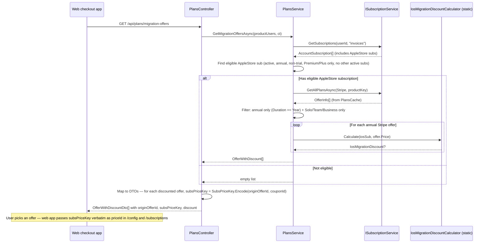
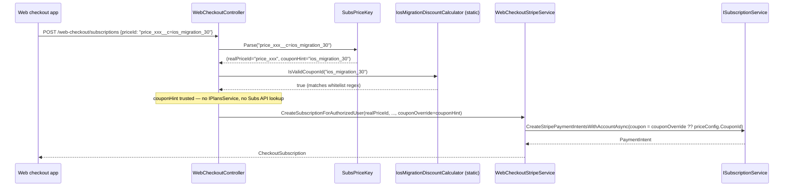
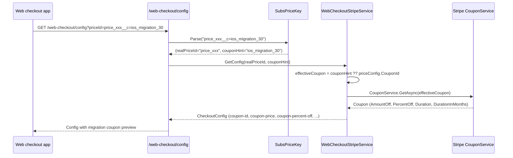

# FS-890: iOS-to-Stripe Migration Discount — Implementation Plan

> When an iOS subscriber requests a Stripe offer, return a discounted price based on unused iOS subscription time, using pre-created Stripe coupons (10%–90%).

## Analysis

### Goal

Allow iOS (App Store) annual subscribers of the **Invoices** product to migrate to Stripe billing with a one-time discount proportional to their unused subscription time. The discount is calculated as a percentage (rounded up to the nearest 10%) of the remaining value relative to the new Stripe plan price.

### Discount Formula

```
1. iOS price (annual) — from Subs API `nextPayment.totalPrice` (USD only, checked via `nextPayment.currency`)
2. Months used = ceil((now - StartTime).TotalDays / 30)  // ceiling
3. Amount spent = (iOS annual price / 12) * months_used
4. Remaining value = iOS annual price - amount_spent
5. Discount % = ceil(remaining_value / stripe_price * 100 / 10) * 10  // round up to nearest 10
6. Clamp to [10..90]
7. Coupon ID = "ios_migration_{discount%}"
```

**Example:**
- iOS price: $180/year (~$15/month)
- Used: 3 months → $45 spent → $135 remaining
- Stripe FSM plan: $500/year
- Discount: ceil(135/500 × 100 / 10) × 10 = ceil(2.7) × 10 = **30%**
- Checkout: $500 − $150 = **$350**

### Constraints

- Only **Premium** or **Plus** subscription tiers are eligible (`ProductType == Premium || ProductType == Plus`)
- Only **iOS (AppleStore)** subscriptions qualify (`AdapterType == AppleStore`)
- Only **annual** iOS subscriptions are eligible (weekly/monthly excluded — renewal cycle too short)
- Target Stripe offer must also be **annual** (`Duration == Year`) — migration is strictly year-to-year
- Target Stripe offer must be **FsmSolo**, **FsmTeam**, or **FsmBusiness** tier (`ProductType == FsmSolo || FsmTeam || FsmBusiness`) — other tiers not available as migration targets
- Only **non-trial** subscriptions count (`IsTrial != true`)
- Only **USD** subscriptions qualify (`nextPayment.currency == "usd"`) — non-USD excluded due to currency mismatch with Stripe plans
- Subscription must have `nextPayment` present — if absent, not eligible
- User must have an **active** Apple Store subscription — expired iOS subs excluded
- **No other active subscriptions** — if the user has ANY other active subscription (Stripe, GooglePlay, Paddle, etc.), no discount is provided. The iOS sub must be the user's only active subscription across all adapters.
- Maximum 9 coupons: `ios_migration_10` through `ios_migration_90` (pre-created in Stripe dashboard, `percent_off`, `duration=once`)
- Discount applies to the **first billing period only** on Stripe
- Coupon must be **validated server-side** at checkout to prevent abuse (user cannot pass arbitrary coupon IDs)

### Contradictions & Concerns

- **Price source for iOS subscriptions**: iOS annual price is read from `nextPayment.totalPrice` in Subs API response (`GET {subs}/api/accounts/:accountId/subscriptions/:subscriptionId`). The `nextPayment` field is available for both Stripe and AppleStore adapters:
    ```json
    "nextPayment": {
        "currency": "usd",
        "time": "2025-11-22T13:47:38Z",
        "totalDiscountAmount": 0,
        "totalPrice": 1499,
        "totalTaxAmount": 0,
        "taxes": [{ "displayName": "VAT", "amount": 0 }]
    }
    ```
    **Currency gate**: only subscriptions with `nextPayment.currency == "usd"` qualify. Non-USD iOS subscriptions are excluded (regional pricing mismatch with Stripe USD plans). If `nextPayment` is absent — subscription is not eligible for discount.
    **Note**: `totalPrice` is in cents (1499 = $14.99). `SubscriptionPrice` and `PlansConstants` are NOT used for price lookup.
- **"Remaining value" vs "remaining time"**: The formula mixes two approaches — it calculates dollar remaining from iOS but then divides by the *new* Stripe price (which can be very different). This means a cheap iOS plan → expensive Stripe plan yields a small discount %, while expensive iOS → cheap Stripe yields a large discount %. This is by design per the requirements — the discount reflects the *relative* value, not just time.
- **Multiple iOS products**: A user could have subscriptions across different iOS product IDs (pro, premium). Only Premium and Plus tiers qualify — Invoicing, FsmSolo, FsmTeam, FsmBusiness are excluded.
- **Expired iOS subscriptions**: The requirements say "active" only. If expired — no discount. This is clear.
- **Cross-product userId mismatch**: iOS subscriptions live under `ProductConst.InvoicesIos` ("invoices"), but Stripe checkout targets `ProductConst.Tofu` ("tofu"). Each product has its own `platformUserId` in `MasterUser.PlatformUserLinks`. The coupon resolution layer must use the correct userId per product when querying subscriptions.

### Resolved Questions

1. **Discount on each OfferInfo** — discount is attached per-offer so the client sees discounted prices for every available Stripe plan. Cached `OfferInfo` objects are NOT mutated; instead, a new `OfferWithDiscount` wrapper is returned from a dedicated method.
2. **Generic calculator, invoices-only invocation** — `IosMigrationDiscountCalculator` accepts any `AccountSubscription` + target price, but `PlansService` only invokes it for `invoices` product key. Easy to extend later.
3. **`SubsPriceKey` composite format** — to consolidate the coupon hint with the priceId in a single parameter (no separate `couponId` query needed on `/config`), the `priceId` accepted by `/api/web-checkout/config` and `/api/web-checkout/subscriptions` may carry an embedded coupon hint via the suffix `__c=<couponId>` (e.g., `price_1AbcDef__c=ios_migration_30`). Plain Stripe priceIds parse to themselves with no coupon. The composite key is generated server-side in `/api/plans/migration-offers`; the web checkout app passes it verbatim as the `priceId` to `/config` and `/subscriptions` — no special handling on the client beyond calling the new endpoint.
4. **Whitelist-based coupon trust at checkout** — `WebCheckoutController.CreateSubscriptionAuthorized` parses the incoming `priceId` via `SubsPriceKey.Parse` and **trusts** the `couponHint` directly, after a cheap whitelist check (`^ios_migration_(10|20|30|40|50|60|70|80|90)$`). No Subs API call, no `IPlansService` lookup, no per-user iOS eligibility recomputation. The whitelist prevents users from substituting arbitrary Stripe coupons (e.g., unrelated promo codes) into the URL — only the 9 pre-created `ios_migration_*` coupons are accepted. Worst case for a hand-crafted composite: one billing period at the maximum 90% off (Stripe enforces `duration=once` on the coupon). Acceptable trade-off vs. the Subs API call latency on every authorized checkout.
5. **Client-driven coupon preview via `SubsPriceKey`** — `GET /api/web-checkout/config?priceId=…` parses the incoming `priceId`. If a `couponHint` is present it's used directly to fetch coupon metadata from Stripe (read-only preview, anonymous endpoint). Forging a hint is harmless here — Stripe rejects unknown coupons; the same whitelist check is applied at checkout (see #4). If the coupon doesn't exist in Stripe — API returns error from `CouponService.GetAsync`.
6. **Parsing site is the controller** — `WebCheckoutController` calls `SubsPriceKey.Parse` and forwards the parts (`realPriceId`, `couponHint`) to `IWebCheckoutService`. The service contract still needs the optional `couponOverride`/`couponId` parameters, but the rationale shifts: they receive a value the controller already extracted, not something the client supplies directly. Service stays domain-pure and unaware of the composite format.

---

### Components

- **`SubsPriceKey`** (new, static helper / value type) — parser/encoder for the composite `priceId` token. `Parse(string raw) → (string PriceId, string? CouponHint)`; `Encode(string priceId, string couponId) → string`. Plain priceIds round-trip to themselves with `CouponHint == null`. Convention: suffix `__c=<couponId>`.
- **`IosMigrationDiscountCalculator`** (new, static class) — pure stateless calculator: `AccountSubscription` + target Stripe price → `IosMigrationDiscount?`. No DI needed — just math.
- **`IosMigrationDiscount`** (new record) — result model: CouponId, DiscountPercent, OriginalPrice, DiscountedPrice
- **`OfferWithDiscount`** (new record) — wraps `OfferInfo` + nullable `IosMigrationDiscount`. The DTO mapper additionally derives `SubsPriceKey` from `(Offer.OriginOfferId, Discount.CouponId)` when emitting `OfferWithDiscountDto`.
- **`IPlansService`** — one new method: `GetMigrationOffersAsync` (for the offers endpoint). Checkout no longer calls back into PlansService.
- **`PlansService`** — implements `GetMigrationOffersAsync` using the static calculator. Already has `ISubscriptionService` and `GetSubscriptionsAsync`/`GetAllAsync` infrastructure.
- **`PlansController`** — new endpoint `GET /api/plans/migration-offers` (consumed by the web checkout app)
- **`IWebCheckoutService`** — two changes:
  - `CreateSubscriptionForAuthorizedUser` — add optional `string? couponOverride` parameter
  - `GetConfig` — add optional `string? couponId` parameter
- **`WebCheckoutStripeService`** — use `couponOverride` when provided in `CreateSubscriptionForAuthorizedUser`; use `couponId` when provided in `GetConfig` (falls back to `priceConfig.CouponId` when absent)
- **`WebCheckoutController`** — for both `/config` and `/subscriptions`: call `SubsPriceKey.Parse` on the incoming priceId. For `/subscriptions`: pass `couponHint` through if it matches `IosMigrationDiscountCalculator.IsValidCouponId` (whitelist regex); otherwise drop it. No `IPlansService` injection.
- **`OfferWithDiscountDto`** / **`IosMigrationDiscountDto`** (new DTOs) — API response models. `OfferWithDiscountDto` carries `SubsPriceKey` that the web app passes verbatim as the `priceId` to `/config` and `/subscriptions`.

### Data Flow

#### Offer retrieval (web app discovers offers; subsPriceKey flows back into existing endpoints)



#### Checkout (parse composite, whitelist hint, no Subs API call)



#### Config preview (composite priceId, no separate query param)



### Key Structures

- **`SubsPriceKey`** (new static helper in `Invoices.Core/Models/WebCheckout/`) — `Parse(string raw) → (string PriceId, string? CouponHint)`, `Encode(string priceId, string? couponId) → string`. Convention: append `__c=<couponId>` only when a coupon is bundled. Round-trip safe; plain priceIds unchanged.
- **`IosMigrationDiscount`** (new record in `Invoices.Core/Models/Plans/`) — `CouponId` (string), `DiscountPercent` (int), `OriginalPrice` (decimal), `DiscountedPrice` (decimal)
- **`OfferWithDiscount`** (new record in `Invoices.Core/Models/Plans/`) — `Offer` (OfferInfo), `Discount` (IosMigrationDiscount?)
- **`IosMigrationDiscountCalculator`** (new static class in `Invoices.Implementation.Services/Plans/`) — `Calculate(AccountSubscription, decimal iosAnnualPrice, decimal stripePrice)` → `IosMigrationDiscount?`. Caller extracts iOS price from `nextPayment.totalPrice` (cents → decimal) before calling. Also exposes `IsValidCouponId(string couponId) → bool` (regex match against the 9 allowed `ios_migration_*` IDs) — used by `WebCheckoutController` to whitelist incoming `couponHint`.
- **`NextPayment`** (new model in `Invoices.Core/Models/Subscription/`) — `Currency` (string), `TotalPrice` (long), `Time` (DateTime?). Mapped from Subs API response. Added to `AccountSubscription` as optional property.
- **`OfferWithDiscountDto`** (new DTO in `Invoices.Api/Models/Plans/`) — offer with per-offer discount info, plus `SubsPriceKey` field that the web app passes verbatim as the `priceId` to `/config` and `/subscriptions`
- **`IosMigrationDiscountDto`** (new DTO in `Invoices.Api/Models/Plans/`) — discount details for serialization

### Risk Points

- **Coupon abuse via composite key**: A user could hand-craft `priceId__c=ios_migration_90` and submit it. Defenses are **layered but bounded**: (1) `WebCheckoutController` whitelist regex blocks anything outside `ios_migration_(10..90)` — non-migration Stripe coupons cannot be substituted; (2) Stripe enforces `duration=once` on every `ios_migration_*` coupon — abuse is capped at one billing period; (3) the user must be authenticated on `/subscriptions`, so abuse is auditable. Worst case: one billing period at 90% off per abusing user. **Accepted trade-off** in exchange for removing the per-checkout Subs API call and `IPlansService` coupling.
- **Backwards compatibility with plain priceIds**: `SubsPriceKey.Parse("price_xxx")` must return `(PriceId="price_xxx", CouponHint=null)` — every existing checkout URL keeps working unchanged. Parser must be permissive: missing `__c=` suffix is the normal case, not an error.
- **Cross-product userId**: iOS subs use `invoicesUserId`, checkout uses `tofuUserId`. Both come from `MasterUser.GetFirstLinkProductUsers()`. `PlansService.GetMigrationOffersAsync` must pick the right userId for invoices when querying subscriptions. (Checkout no longer queries — see Coupon abuse above.)
- **Race condition at checkout (accepted)**: AppleStore sub could expire between the web app fetching `/migration-offers` and the user submitting checkout. Since checkout no longer re-validates eligibility, the discount still applies even if the sub is gone. **Accepted trade-off** — same trade as Coupon abuse: latency wins over a narrow temporal edge case.
- **Missing `nextPayment`**: Some iOS subscriptions may not have `nextPayment` populated (edge cases, legacy data). If absent — subscription is not eligible for discount (graceful skip, no error).
- **Currency mismatch**: `nextPayment.currency` must be `"usd"`. Non-USD iOS subscriptions are excluded — Stripe plans are in USD, comparing different currencies produces incorrect discounts.
- **Price in cents**: `nextPayment.totalPrice` is in cents (1499 = $14.99). Must convert to decimal before discount calculation.
- **Cached offers**: `PlansCache` caches offers by (AdapterType, ProductKey). Discount is computed on top, not cached — fresh calculation every time.
- **Offer-to-priceId matching at issuance**: `GetMigrationOffersAsync` issues `subsPriceKey` per offer it actually returned, so the composite is always self-consistent. Checkout doesn't re-match.
- **Invalid `couponHint` in config**: if a client crafts a composite with a non-existent coupon, Stripe `CouponService.GetAsync` throws and is wrapped into `WebCheckoutCreateSubscriptionException`. Abuse via preview is harmless — actual discount is server-validated at checkout regardless of what hint the composite carried.
- **`__c=` collision in priceIds**: Stripe priceIds are alphanumeric + underscores (no `=` and no double-underscore by convention), so the suffix is unambiguous. Parser splits on the **last** occurrence of `__c=` to be safe.
- **gRPC boundary**: Reuses existing `GetSubscriptions` and `GetAllPlansAsync` calls — no new gRPC endpoints needed.

### API Contracts

#### New Endpoints
| Method | Path | Description |
|--------|------|-------------|
| GET | `/api/plans/migration-offers` | Returns Stripe offers with per-offer migration discount for eligible users. Each offer carries a `subsPriceKey` field that the web app passes verbatim as the `priceId` to `/web-checkout/config` and `/web-checkout/subscriptions`. |

#### Modified Endpoints
None — `/api/web-checkout/config` and `/api/web-checkout/subscriptions` keep their existing request shapes. Internally, `priceId` is now parsed via `SubsPriceKey.Parse` to extract an optional coupon hint embedded as `__c=<couponId>` suffix. Plain Stripe priceIds are unaffected. **No web checkout app changes required.**

#### New DTOs

```csharp
public sealed class OfferWithDiscountDto
{
    public required string OriginOfferId { get; init; }
    public required string SubsPriceKey { get; init; }   // == OriginOfferId when no discount, == "OriginOfferId__c=<CouponId>" when discounted
    public required DurationDto Duration { get; init; }
    public required int AdapterType { get; init; }
    public required string OriginProductId { get; init; }
    public required ProductTypeDto ProductType { get; init; }
    public required decimal? Price { get; init; }
    [JsonProperty(DefaultValueHandling = DefaultValueHandling.Ignore)]
    public IosMigrationDiscountDto? Discount { get; init; }
}

public sealed class IosMigrationDiscountDto
{
    public required string CouponId { get; init; }
    public required int DiscountPercent { get; init; }
    public required decimal OriginalPrice { get; init; }
    public required decimal DiscountedPrice { get; init; }
}
```

#### Modified DTOs
None.

#### Error Codes
- No new error codes. Empty array returned when user is not eligible.

### Internal Breaking Changes

- **`IWebCheckoutService.CreateSubscriptionForAuthorizedUser`** — adds optional `string? couponOverride` parameter. Existing callers pass `null` (no behavior change). `WebCheckoutStripeService` uses `couponOverride` when non-null, otherwise falls back to `priceConfig.CouponId`. Populated by `WebCheckoutController` from the parsed `couponHint` after a whitelist check via `IosMigrationDiscountCalculator.IsValidCouponId`.
- **`IWebCheckoutService.GetConfig`** — adds optional `string? couponId` parameter. Existing callers pass `null` (no behavior change). `WebCheckoutStripeService` uses `couponId` when non-null when fetching coupon details from Stripe, otherwise falls back to `priceConfig.CouponId`. Populated by `WebCheckoutController` from the `couponHint` returned by `SubsPriceKey.Parse`.

External HTTP contracts of `/api/web-checkout/config` and `/api/web-checkout/subscriptions` are unchanged.

### Decisions Made

- **`SubsPriceKey` composite, no signing** — coupon hint is embedded into `priceId` as `__c=<couponId>` suffix (e.g., `price_xxx__c=ios_migration_30`). No HMAC/signature; the trust boundary is a cheap whitelist check (see next decision). Alternatives considered: signed token (overkill — adds secret management), server-stored opaque IDs (overkill — adds a MongoDB collection for a one-time link).
- **Web checkout app is the only consumer** — the web checkout app calls `/api/plans/migration-offers`, picks an offer, then uses `subsPriceKey` verbatim as the `priceId` in its existing `/config` and `/subscriptions` calls. No changes to the existing endpoints' external contracts (`priceId` parameter is only parsed more permissively server-side). No other client (iOS app, etc.) is involved in this flow.
- **Parsing site is the controller** — `WebCheckoutController` calls `SubsPriceKey.Parse` and passes the parts to `IWebCheckoutService`. Service stays domain-pure; doesn't need to know the composite format. Alternative (parse inside service) would either couple the service to the format or force injecting `IPlansService` into the service (cross-domain).
- **Static calculator (no DI interface)** — `IosMigrationDiscountCalculator` is pure math with no external dependencies. No interface needed — directly testable with unit tests. Simpler than interface+impl with Scrutor registration.
- **Whitelist-based trust at checkout (no per-user re-validation)** — `WebCheckoutController` trusts the parsed `couponHint` after matching it against the regex `^ios_migration_(10|20|...|90)$` exposed via `IosMigrationDiscountCalculator.IsValidCouponId`. **No** Subs API lookup, **no** `IPlansService` injection, **no** per-checkout iOS eligibility recomputation. Trade-off: a user who hand-crafts the URL can apply up to 90% off for one billing period (Stripe `duration=once` caps it). In exchange we eliminate one Subs API round-trip on every authorized checkout and remove cross-domain coupling. Alternatives rejected: full re-validation via `ResolveMigrationCouponAsync` (latency + coupling); fully trust-the-composite without whitelist (allows substituting unrelated promo coupons).
- **`IPlansService` exposes only `GetMigrationOffersAsync`** — no `ResolveMigrationCouponAsync`. The eligibility logic is invoked once at offer-issuance time; checkout reuses the result indirectly (the composite encodes the issued coupon).
- **Optional coupon parameter on `IWebCheckoutService`** — minimal interface change (two methods, one optional parameter each). `WebCheckoutStripeService` already passes `priceConfig.CouponId` to `InternalCreateSubscriptionInSubs` — coupon override simply replaces it when present. The optional params are populated by the controller (from `couponHint` after whitelist for `/subscriptions`; from `couponHint` directly for `/config`).
- **Discount per OfferInfo** — each Stripe offer gets its own discount (different prices → different discount %). Cached `OfferInfo` not mutated; new `OfferWithDiscount` wrapper used.
- **Server-side coupon auto-application** at checkout — `/subscriptions` accepts the parsed `couponHint` only if it matches the `ios_migration_*` whitelist. Stripe's `duration=once` caps the impact of any abuse to one billing period.
- **Generic calculator, invoices-only invocation** — calculator accepts any `AccountSubscription`, but only called for `invoices` product key.
- **iOS price from `nextPayment`** — read `nextPayment.totalPrice` (cents) from Subs API. Currency gate: `nextPayment.currency == "usd"` only. No `nextPayment` → not eligible. Neither `SubscriptionPrice` nor `PlansConstants` used for price lookup. Requires adding `NextPayment` model to `AccountSubscription`.
- **Premium/Plus only** — only `ProductType.Premium` and `ProductType.Plus` iOS subscriptions qualify. Other tiers (Invoicing, FsmSolo, etc.) are excluded.
- **Exclusive iOS subscription** — if the user has any other active subscription besides the iOS one (Stripe, GooglePlay, Paddle, etc.), no discount is provided. Ensures discount is only for users truly migrating from iOS-only.
- **Annual-to-annual only** — both source iOS sub and target Stripe offer must be annual. Monthly/weekly excluded on both sides.
- **Target tiers: Solo/Team/Business only** — `GetMigrationOffersAsync` filters offers by `Duration == Year` AND `ProductType in (FsmSolo, FsmTeam, FsmBusiness)`. Checkout doesn't re-filter — the composite key only carries coupons issued for offers that already passed this filter.
- **Ceiling rounding** for both months used and discount percentage — always in user's favor.
- **New endpoint `GET /api/plans/migration-offers`** — dedicated endpoint for iOS migration flow, doesn't pollute existing `/plans/current` or `/plans/upgrade-links`.

---

> **Phase 2 (implementation steps + execution checklist):** see [`implementation.md`](./implementation.md).
